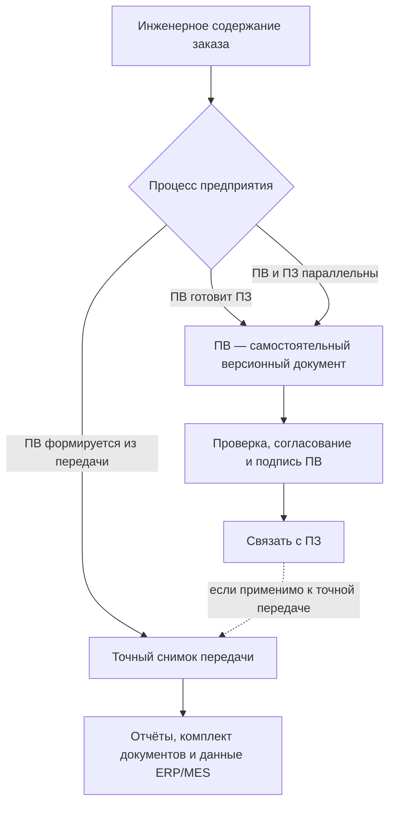
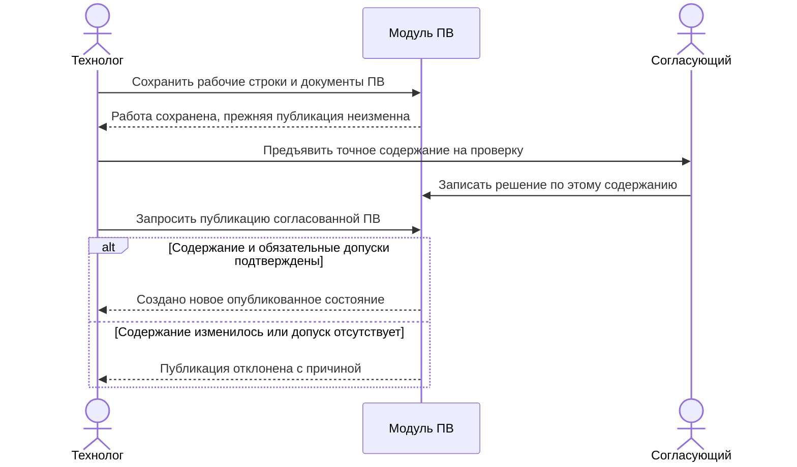

# Производственные ведомости, документы и отчёты

> Целевая модель по состоянию на 6 сентября 2026 года. ПВ — самостоятельное производственное содержание; её сохранение, публикация, подпись, доставка и исполнение не объединяются одним статусом.

## Производственная ведомость — самостоятельный документ

Производственная ведомость, далее ПВ, не является другим названием заказа и не сводится к распечатке состава. В исследованных материалах IPS это самостоятельный версионируемый производственный документ со своей карточкой, номером, составом, прототипом, рабочими и опубликованными версиями, проверкой, согласованием и подписью.

ПВ закрепляет удобное для производства представление задания. Она имеет собственный жизненный цикл и может включать структуру изделий, документы, дополнительные позиции и производственные пояснения. Связь ПВ с ПЗ и снимком различается между предприятиями: ПВ может готовить ПЗ, развиваться параллельно с ним или формироваться из уже принятой передачи.

## Различие результатов

| Результат | Для чего нужен | Может ли иметь собственные версии |
|---|---|---|
| Инженерный заказ и его опубликованные состояния | Описывает потребность и заказные решения | Да; новое состояние не обязано получать новую инженерную версию |
| Точный снимок | Доказывает полный состав конкретной передачи | Нет, исправление создаёт новый снимок |
| Производственная ведомость | Управляет производственным документом, его согласованием и представлением | Да |
| Комплект документов | Передаёт точные версии чертежей, моделей и инструкций | Формируется заново по правилам передачи |
| Отчёт | Показывает материалы, труд или данные внешней системы в заданной форме | Обычно воспроизводим по исходному снимку и версии шаблона |

## Содержание ПВ

Точная форма зависит от предприятия, но продуктовая модель должна поддерживать:

- номер, наименование, назначение и ответственных;
- связь с ПЗ и, когда это предусмотрено процессом, со снимком конкретной передачи;
- состав производственных позиций и количества;
- точные версии требуемых документов;
- рабочую и опубликованную версии;
- прототип или шаблон заполнения;
- проверку комплектности;
- согласование и электронную подпись;
- печатное или электронное представление;
- связь с заменяющей либо исправляющей ПВ.

Практика IPS описывает ПВ как «копию всего: структуры и документов». В Interlink это следует понимать как отдельный производственный документ или доказательный комплект, а не как содержание самого снимка. Если ПВ относится к точной передаче, с её снимком связывается конкретная версия ПВ; в процессах, где ПВ готовит ПЗ или развивается параллельно, такая связь появляется позже либо не требуется. Снимок Interlink хранит позиции и точные версии, но не копирует все файлы, документы и атрибуты.

Для точной выдачи «конкретная версия ПВ» означает конкретное опубликованное состояние её содержания. Жёсткое закрепление только инженерной версии не заменяет эту точность. Необходимые файлы, редакции маршрутов, норм и правила расчёта удерживаются в связанном комплекте оснований, чтобы прежнюю ведомость не приходилось восстанавливать по сегодняшним данным.

## От прототипа до самостоятельной ведомости

Технолог выбирает прототип, проверяет, какие свойства и позиции переносить, и создаёт самостоятельную ПВ. Новая ведомость сохраняет происхождение: из какого точного состояния прототипа взяты строки, какие объекты переиспользованы, какие созданы заново. Совпадающий состав не переносит действующие подписи, согласования, номер, доставку и факты исполнения старой ПВ. Новая ведомость проходит собственный процесс; правила нумерации и прав задаёт предприятие.

Во время подготовки обычное сохранение оставляет рабочие данные рабочими. Согласующий рассматривает явно предъявленное содержание, а остальные пользователи продолжают видеть прежнее опубликованное состояние, если им не открыт совместный рабочий просмотр. Проведение публикует новое состояние выбранной инженерной версии; создание новой инженерной версии — отдельное решение.

Для производственных строк различаются **исключение**, **скрытие исключённых строк на экране** и **удаление ранее исключённых из текущей структуры**. Скрытие — только представление. Исключение сообщает, что потребность не входит в данный результат, и сохраняет основание. Удаление из новой рабочей структуры не стирает старую опубликованную ПВ. Ни одно из этих действий не требует отрицательного количества детали.

## Как рабочая ПВ становится официальной

Ниже показан пример предприятия, где согласующий сначала рассматривает подготовленное содержание ПВ, а уполномоченный участник затем публикует его. Иной порядок подписи допустим по регламенту; неизменно то, что решение относится к определённому содержанию, а сохранение работы само по себе не является выпуском.

Если после согласования заменён чертёж в самом предъявленном комплекте или изменено количество в этой ПВ, прежнее решение не переносится на новое содержание автоматически. Само появление иной редакции чертежа вне комплекта не меняет уже согласованного точного содержания; требование проверить свежесть задаётся отдельно. Успешная публикация не подтверждает отправку в цех, приём задания или его выполнение; эти события регистрируются отдельно. Подписанное представление хранится как определённый результат и не заменяется повторной генерацией отчёта.

## Комплект конструкторских и технологических документов

Для каждой включённой позиции нужно определить, какие документы обязательны: чертёж, трёхмерная модель, технические требования, программа станка, карта операции, инструкция контроля. В точном комплекте закрепляются опубликованное состояние документа и необходимое содержимое файлов. Состояние документа может входить в граф снимка, а файл и его подпись — удерживаться отдельным основанием связанного комплекта.

Проверка готовности должна отличать:

- документ отсутствует;
- документ существует, но не достиг разрешённого состояния;
- обязательное представление не сформировано;
- документ неприменим к выбранному исполнению;
- найдено несколько неоднозначных документов.

## Отчёты не являются источником истины

Ведомость материалов, расчёт трудоёмкости или выгрузка для 1С — это представления точного результата. Их следует связывать с:

- исходным снимком;
- точным состоянием ПВ, версией формы или шаблона;
- временем построения;
- параметрами и фильтрами, правилами округления, единицами, использованными нормами и средством формирования;
- автором или службой формирования.

При сохранённых основаниях и совместимом средстве формирования отчёт можно построить повторно. Это не обещание восстановить утраченный подписанный файл только по названию шаблона: подписанное представление удерживается отдельно, а его новая генерация создаёт новый результат. Если изменилась форма, новый отчёт не меняет исторический снимок и не заменяет незаметно прежний подписанный документ.

Фильтр «показать только покупные» допустим для отчёта и сохраняется как параметр. Он не разрешает вырезать собственные детали из полного исходного снимка и продолжить называть его полным составом. Производная ведомость или отчёт могут связываться с точным исходным состоянием без изменения этого состояния; появление нового результата не является скрытой правкой старой ПВ.

## Пример 1. ПВ на десять редукторов

Заказ содержит десять редукторов одного исполнения и два комплекта ЗИП. В этом примере процесс предприятия создаёт ПВ после точного формирования; это один из допустимых порядков, а не универсальное правило. В ПВ входят сборочный состав редуктора, детали собственного изготовления, покупные позиции, маршруты, чертежи и отдельная строка ЗИП.

Проверка обнаруживает, что обязательная карта контроля выходного вала ещё рабочая. Работу над ПВ можно сохранить и продолжить, но официальная выдача блокируется до появления допустимого опубликованного содержания либо предусмотренного профилем разрешённого решения. Общая кнопка «согласовать» не обходит неотменяемые требования. После проверки публикуется новое состояние ПВ и оформляется подпись на определённое точное содержание; конкретный порядок этих шагов задаёт предприятие.

## Пример 2. Данные для 1С по шкафу управления

В изученной практике IPS отчёт для 1С строится по составу заказа с учётом количества в ветви и количества всего заказа. Для пяти одинаковых шкафов система рассчитывает общую потребность в аппаратах, проводе и трудовых нормах.

Отчёт хранит связь с точным снимком и правилами расчёта. Если позже провод заменён новым допустимым типом, прежний отчёт остаётся объяснимым, а для следующего опубликованного состояния заказа строится новый.

Масса или длина провода может определяться по индексируемому справочнику. Паспорт отчёта сохраняет использованную редакцию строки, единицы и округление. Наличие в файле готового итога не заменяет происхождение расчёта. Подробнее — [справочные таблицы](../tabular-data/01-reference-tables.md).

## Пример 3. Комплект документации обрабатывающего центра

Для сборки центра нужны сборочные чертежи, схемы электрики, таблица подключений, программы настройки приводов и инструкции испытаний. Часть документов относится к базовому изделию, часть — только к заказной роботизированной загрузке.

Система включает документы по применимости выбранной комплектации. Стандартная инструкция ручной загрузки исключается с объяснением, а инструкция безопасной работы робота становится обязательной.

## Пример 4. Исправление ведомости насосной станции

После выпуска ПВ обнаружена ошибка в технологической инструкции окраски. Исходное опубликованное состояние ПВ не редактируется. Подготавливается исправленное содержание документа, затем новое состояние ПВ либо самостоятельная исправляющая ПВ по правилам предприятия. Новые инженерные версии нужны только при соответствующем предметном решении. Связь показывает причину, область действия и то, какая производственная партия получила исправление. Отправка исправленной ПВ ещё не доказывает, что цех её принял и выполнил.

## Что остаётся в принимающей системе

Interlink предоставляет точный состав, версии, происхождение и проверки. Карточки ПВ, номера, шаблоны, маршруты согласования, электронная подпись и печатные формы реализуются предметным модулем PLM либо подключаемой службой. Это позволяет разным предприятиям сохранить свои регламенты без встраивания одного процесса в общее ядро.

## Открытые вопросы

- В каких случаях на один заказ создаётся несколько ПВ?
- Является ли ПВ полной копией или ссылочным набором с архивными представлениями?
- Какие документы обязательны для разных видов изделий и операций?
- Как связаны подпись ПВ и разрешение точного снимка?
- Можно ли исправить только часть ПВ после запуска производства?
- Какие отчёты IPS необходимо воспроизвести без изменения их привычной формы?
- Кто владеет нумерацией, шаблонами и сроком хранения?

## Критерии приёмки

1. ПВ существует отдельно от заказа и снимка.
2. ПВ имеет собственные версии, карточку и процесс публикации.
3. Все документы в опубликованном комплекте имеют точные версии.
4. Отсутствующий или незрелый обязательный документ выявляется до передачи.
5. Отчёт материалов объясняет количество по ветви и по заказу.
6. Повторное построение отчёта не меняет исходный снимок.
7. Исправление ПВ сохраняет связь с заменённым документом и затронутым производством.
8. Порядок ПВ и ПЗ задаётся процессом предприятия; связь версии ПВ со снимком обязательна только для применимой точной передачи.
9. Копирование прототипа не переносит его подписи, доставку и факты исполнения на новую ведомость.
10. Исключение строки, её скрытие и удаление из нового содержания различаются; отчётный фильтр не ослабляет полноту исходной выдачи.
11. Повторная генерация не подменяет прежний подписанный файл, а таблицы норм и другие обязательные основания имеют точные удерживаемые редакции.

## Состояние реализации

Производственные ведомости и отчёты подтверждены материалами IPS как обязательная целевая возможность. Приняты подробные контракты самостоятельной ПВ, копирования прототипа, точных оснований отчёта и публикации. Это ещё не готовое рабочее место: согласование, подпись, формы и полный производственный процесс требуют предметной реализации. Конкретный порядок ПВ и ПЗ, нумерация и обязательный комплект уточняются при обследовании предприятия.

## Связанные документы

- [Точный состав передачи](05-exact-publication.md)
- [Маршруты и нормы](07-routes-norms-and-sourcing.md)
- [MRP, ERP/MES и длительные операции](11-integration-and-mrp.md)

## Основания

Текущий целевой договор и планы Interlink: [IL-ORDERS], [IL-KERNEL], [IL-TD], [IL-SC], [IL-PLAN-V2]. Требования и практика IPS: [IPS-A13], [IPS-A23], [IPS-M03], [IPS-PV-ANALYSIS]. Историческое [IL-ADR ADR-052] объясняет происхождение решений; при уточнении поведения приоритет имеют нынешние договоры Interlink.

Расшифровка и границы достоверности — в [реестре источников](../knowledge/15-source-register.md).

Практическая сверка самостоятельности ПВ, её прототипов и отчётов сохранена по аналитическому материалу «Анализ производственных ведомостей IPS» ([IPS-PV-ANALYSIS]). Его выводы не заменяют проверку процесса конкретной установки и актуальный заказный договор Interlink.
