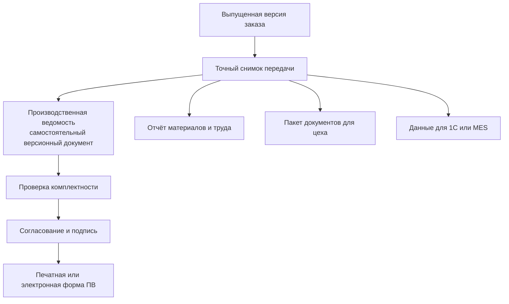

# Производственные ведомости, документы и отчёты

## Производственная ведомость — самостоятельный документ

Производственная ведомость, далее ПВ, не является другим названием заказа и не сводится к распечатке состава. В исследованных материалах IPS это самостоятельный версионируемый производственный документ со своей карточкой, номером, составом, прототипом, рабочими и опубликованными версиями, проверкой, согласованием и подписью.

ПВ закрепляет удобное для производства представление задания. Она опирается на точный состав заказа, но имеет собственный жизненный цикл и может включать структуру изделий, документы, дополнительные позиции и производственные пояснения.

## Различие результатов

| Результат | Для чего нужен | Может ли иметь собственные версии |
|---|---|---|
| Версия заказа | Описывает потребность и заказные решения | Да |
| Точный снимок | Доказывает полный состав конкретной передачи | Нет, исправление создаёт новый снимок |
| Производственная ведомость | Управляет производственным документом, его согласованием и представлением | Да |
| Комплект документов | Передаёт точные версии чертежей, моделей и инструкций | Формируется заново по правилам передачи |
| Отчёт | Показывает материалы, труд или данные внешней системы в заданной форме | Обычно воспроизводим по исходному снимку и версии шаблона |

## Содержание ПВ

Точная форма зависит от предприятия, но продуктовая модель должна поддерживать:

- номер, наименование, назначение и ответственных;
- связь с заказом и снимком, на основании которого она создана;
- состав производственных позиций и количества;
- точные версии требуемых документов;
- рабочую и опубликованную версии;
- прототип или шаблон заполнения;
- проверку комплектности;
- согласование и электронную подпись;
- печатное или электронное представление;
- связь с заменяющей либо исправляющей ПВ.

Практика IPS описывает ПВ как «копию всего: структуры и документов». В Interlink это следует понимать как точное закрепление производственного набора, а не как бесконтрольное физическое дублирование всех данных.

## Комплект конструкторских и технологических документов

Для каждой включённой позиции нужно определить, какие документы обязательны: чертёж, трёхмерная модель, технические требования, программа станка, карта операции, инструкция контроля. В снимке закрепляется точная версия документа и, при необходимости, конкретное представление файла.

Проверка готовности должна отличать:

- документ отсутствует;
- документ существует, но не достиг разрешённого состояния;
- обязательное представление не сформировано;
- документ неприменим к выбранному исполнению;
- найдено несколько неоднозначных документов.

## Отчёты не являются источником истины

Ведомость материалов, расчёт трудоёмкости или выгрузка для 1С — это представления точного результата. Их следует связывать с:

- исходным снимком;
- версией формы или шаблона;
- временем построения;
- правилами округления и единицами;
- автором или службой формирования.

Если отчёт потерян, его можно воспроизвести по тем же основаниям. Если изменилась форма, новый отчёт не меняет исторический снимок.

## Пример 1. ПВ на десять редукторов

Заказ содержит десять редукторов одного исполнения и два комплекта ЗИП. После точного формирования специалист создаёт ПВ. В неё входят сборочный состав редуктора, детали собственного изготовления, покупные позиции, маршруты, чертежи и отдельная строка ЗИП.

Проверка обнаруживает, что карта контроля выходного вала ещё рабочая. Публикация ПВ блокируется до её выпуска либо до разрешённого решения ответственного. После согласования ПВ подписывается и получает опубликованную версию.

## Пример 2. Данные для 1С по шкафу управления

В изученной практике IPS отчёт для 1С строится по составу заказа с учётом количества в ветви и количества всего заказа. Для пяти одинаковых шкафов система рассчитывает общую потребность в аппаратах, проводе и трудовых нормах.

Отчёт хранит связь с точным снимком и правилами расчёта. Если позже провод заменён новым допустимым типом, прежний отчёт остаётся объяснимым, а для новой версии заказа строится новый.

## Пример 3. Комплект документации обрабатывающего центра

Для сборки центра нужны сборочные чертежи, схемы электрики, таблица подключений, программы настройки приводов и инструкции испытаний. Часть документов относится к базовому изделию, часть — только к заказной роботизированной загрузке.

Система включает документы по применимости выбранной комплектации. Стандартная инструкция ручной загрузки исключается с объяснением, а инструкция безопасной работы робота становится обязательной.

## Пример 4. Исправление ведомости насосной станции

После выпуска ПВ обнаружена ошибка в технологической инструкции окраски. Исходная ПВ не редактируется. Выпускается новая версия документа, затем новая версия ПВ или исправляющая ПВ по правилам предприятия. Связь показывает причину, область действия и то, какая производственная партия получила исправление.

## Что остаётся в принимающей системе

Interlink предоставляет точный состав, версии, происхождение и проверки. Карточки ПВ, номера, шаблоны, маршруты согласования, электронная подпись и печатные формы реализуются предметным модулем PLM либо подключаемой службой. Это позволяет разным предприятиям сохранить свои регламенты без встраивания одного процесса в общее ядро.

## Открытые вопросы

- В каких случаях на один заказ создаётся несколько ПВ?
- Является ли ПВ полной копией или ссылочным набором с архивными представлениями?
- Какие документы обязательны для разных видов изделий и операций?
- Как связаны подпись ПВ и разрешение точного снимка?
- Можно ли исправить только часть ПВ после запуска производства?
- Какие отчёты IPS необходимо воспроизвести без изменения их привычной формы?
- Кто владеет нумерацией, шаблонами и сроком хранения?

## Критерии приёмки

1. ПВ существует отдельно от заказа и снимка.
2. ПВ имеет собственные версии, карточку и процесс публикации.
3. Все документы в опубликованном комплекте имеют точные версии.
4. Отсутствующий или незрелый обязательный документ выявляется до передачи.
5. Отчёт материалов объясняет количество по ветви и по заказу.
6. Повторное построение отчёта не меняет исходный снимок.
7. Исправление ПВ сохраняет связь с заменённым документом и затронутым производством.

## Состояние реализации

ПВ и отчёты документированы по источникам IPS как обязательная целевая возможность. В текущем Interlink их предметная модель, согласование, подпись и генерация представлений не реализованы. Решение ADR-052 закрепляет, что ПВ остаётся отдельным документом поверх точного заказного снимка.

## Связанные документы

- [Точный состав передачи](05-exact-publication.md)
- [Маршруты и нормы](07-routes-norms-and-sourcing.md)
- [MRP, ERP/MES и длительные операции](11-integration-and-mrp.md)

Основания: [IPS-A13], [IPS-A23], [IPS-M03], [IL-ADR ADR-052]. Дополнительная практическая сверка — [анализ производственных ведомостей IPS](../../../../PLM%20Systems/IPS/Manuals/markdown/IPS-Production-sheets-analysis.md). Расшифровка обозначений — в [реестре источников](../knowledge/15-source-register.md).
