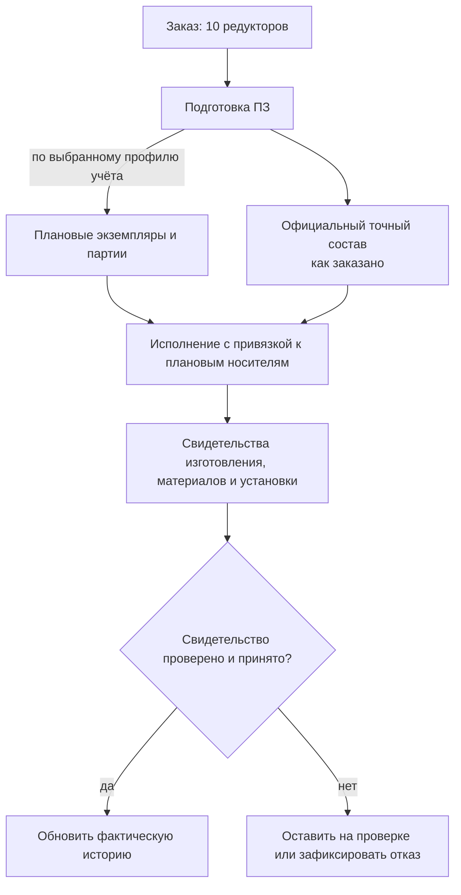
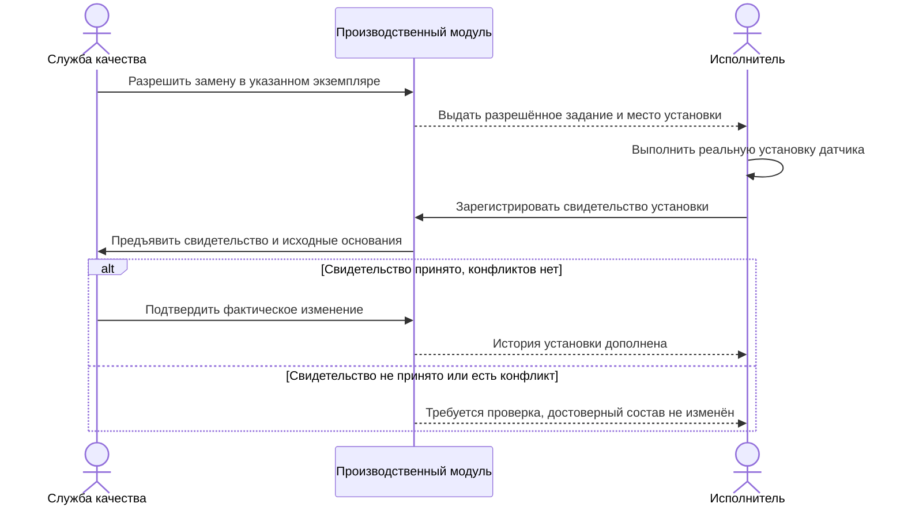

# Экземпляры, партии и фактический состав

> Целевой процесс по состоянию на 6 сентября 2026 года. Плановый носитель, разрешение производства, принятое свидетельство установки и фактически изготовленное изделие различаются.

## Четыре уровня, которые нельзя смешивать

Путь от заказа до реального изделия проходит несколько уровней учёта:

1. **Количественная потребность** — например, заказано десять редукторов.
2. **Производственная позиция** — конкретное место изделия в точном составе и плане изготовления.
3. **Учётный экземпляр или партия** — устойчивое обозначение конкретной единицы либо совместно учитываемой группы; оно может быть создано заранее, ещё как плановое.
4. **Фактический состав** — какие реальные детали и партии материалов вошли в результат по принятым свидетельствам изготовления и установки.

Количество «10 шт.» не означает автоматического появления десяти изготовленных объектов. Публикация снимка тоже не является командой создать экземпляры. Однако это не запрет заранее создать плановые носители: в подтверждённом сценарии IPS формирование ПЗ создаёт состав экземпляров и партий по настройкам учёта исходных изделий. Interlink должен воспроизвести этот путь отдельным предметным действием. Такой экземпляр уже можно адресовать в плане и заданиях, но нельзя считать изготовленным, испытанным или принятым.

Схема показывает один путь с заранее созданными носителями. Предприятие может выбрать более поздний момент их появления. В любом случае план не превращается в факт по нажатию «создать ПЗ», а непринятое свидетельство не записывается в достоверный фактический состав.

## Экземпляр

Экземпляр нужен, если физическую единицу сопровождают индивидуально. Обычно у неё есть серийный или заводской номер, результаты испытаний, паспорт, история ремонтов и точный фактический состав.

Примеры индивидуального учёта: станок, насосная станция, двигатель, редуктор ответственного применения, шкаф управления с паспортом.

## Партия

Партия объединяет изделия или материалы, которые достаточно отслеживать совместно. Это может быть партия ста крепёжных деталей, плавка металла, поставка подшипников или группа однотипных изделий, изготовленная по общему запуску.

Партия не обязана совпадать с заказом. Одна партия материала может быть распределена между несколькими заказами, а один заказ — изготовлен несколькими партиями. Общая модель предусматривает такую прослеживаемость; конкретные ограничения разделения, объединения и учёта задаёт предприятие. Плановую партию нельзя смешивать с уже полученной партией поставщика только потому, что у них совпало наименование материала.

## «Как заказано» и «как изготовлено»

**Как заказано** — точный состав, разрешённый для определённой производственной выдачи. Он является нормативным основанием. Сам факт его публикации ещё не подтверждает доставку получателю или приём задания.

**Как изготовлено** — фактический состав конкретного экземпляра или партии, построенный по принятым сведениям о реальных действиях. В нём могут быть выполненные замены, реальные номера покупных узлов, партии материалов, результаты доработки и отклонения. Разрешение замены, выбор альтернативы в заказе и её реальная установка — три разных факта.

Фактический состав не должен переписывать заказной снимок. Между ними хранится сравнимая связь: что совпало, что заменено, по какому разрешению и где применено.

После эксплуатации может появиться ещё одно состояние — **как обслуживается сейчас**. Оно отражает ремонтные замены и модернизации и также не должно стирать историю изготовления.

## Когда создаются экземпляры

Единое правило для всех предприятий невозможно. Возможны точки появления:

- выпуск серийного номера до запуска;
- создание производственного задания;
- начало сборки;
- успешное испытание;
- приёмка отделом качества;
- отгрузка заказчику.

Interlink должен поддержать выбранную политику, включая создание плановых экземпляров при формировании ПЗ. Сам снимок не является командой «создать десять серийных объектов». Плановый экземпляр может сначала иметь внутреннее устойчивое обозначение, а заводской номер получить позднее. Связь с заказной позицией и количеством сохраняется без поиска «похожей строки» по наименованию.

Если факт возник до окончательного номера, он должен ссылаться на устойчивое основание: плановый носитель, партию, точную публикацию или другой объявленный предмет учёта. Позднее присвоение номера дополняет связь, но не переписывает происхождение факта.

## От разрешения замены к принятому факту

Для установки другого двигателя сначала проверяются разрешение, область его действия и совместимость выбранного двигателя с остальными участниками: фланцем, приводом, питанием, прошивкой управления. Сохраняется точная редакция допуска. Если разрешение относится к исходной инженерной версии двигателя, нельзя взять более широкое разрешение соседней версии.

После выбора и выпуска задания исполнитель отдельно сообщает, какой реальный двигатель установлен, в какое место, когда и на основании какого задания. Приём свидетельства по правилам качества подтверждает изменение фактической истории. Повтор одного сообщения не создаёт вторую установку. Если другой исполнитель уже заменил двигатель, система обнаруживает конфликт исходного состояния, а не безусловно перезаписывает состав.

Установочный адрес содержит точный комплект-основание, его корень и полный путь места применения либо объявленный адрес места физического экземпляра. Это позволяет различить одинаковые насосы в основной и резервной ветвях одной станции. Права на регистрацию, проверку и чтение истории проверяются отдельно; старое разрешение не даёт любому участнику неограниченный доступ.

## Когда разрешённая замена меняет фактический состав

Для станка с индивидуальным номером разрешение нового датчика открывает возможность выполнения работ, но ещё ничего не говорит о том, какой датчик физически установлен. Между разрешением и достоверным фактическим составом необходимы исполнение и приём его свидетельства.

Показан процесс с отдельной проверкой качества; предприятие определяет роли и порядок приёма. Во всех вариантах сам допуск, доставка задания и фактическая установка остаются разными событиями. Если свидетельство пришло повторно, в истории не появляется второй датчик. Если прежний датчик уже заменён другой работой, требуется разбор конфликта, а не безусловная перезапись состава.

## Родословная изделия

Родословная показывает происхождение фактического изделия:

- из какого заказа и снимка оно возникло;
- по какой производственной ведомости изготовлено, если она предусмотрена процессом;
- какие экземпляры узлов установлены;
- какие партии материалов использованы;
- какие отклонения и замены разрешены;
- какие испытания выполнены;
- какие последующие ремонты изменили состав.

Эта связь особенно важна для рекламаций и отзыва дефектной партии.

## Пример 1. Три насосные станции

Заказ содержит три одинаково сконфигурированные станции. В этом примере предприятие решило создавать экземпляры позднее: до начала индивидуального учёта это одна позиция с количеством три. Затем появляются экземпляры НС-24001, НС-24002 и НС-24003. Другое предприятие может создать их плановые карточки уже при формировании ПЗ, не объявляя станции изготовленными.

Во вторую станцию устанавливают двигатель из другой разрешённой партии поставщика. Исполнитель регистрирует реальную установку, а уполномоченный процесс принимает свидетельство. Заказной снимок одинаков для всех трёх, а фактическая родословная № 24002 содержит конкретный номер двигателя, место установки и основание применения этой партии. Одного резервирования двигателя на складе для такой записи недостаточно.

## Пример 2. Сто болтов одной партии

Для сборки линии требуется сто специальных болтов. Индивидуальные серийные номера не нужны. Болты изготовлены одной партией, прошли общий контроль твёрдости и распределены по пяти узлам.

Система хранит связь узлов с партией болтов и протоколом контроля, не создавая сто тяжёлых карточек экземпляров. При обнаружении дефекта партии можно найти все затронутые изделия.

## Пример 3. Поставка подшипников для двух заказов

Партия из пятидесяти подшипников поступила от поставщика. Тридцать использованы в заказе на редукторы, двадцать — в заказе на насосы.

Учётная система сообщает фактическое распределение. Interlink связывает производственные экземпляры с партией поставщика, но не меняет точные заказные составы: в них по-прежнему указана разрешённая версия подшипника.

## Пример 4. Разрешённое отклонение при сборке станка

Для конкретного станка отсутствует датчик исходного производителя. Служба качества разрешает эквивалентный датчик только для экземпляра № 017.

Разрешение связывается только с экземпляром № 017. Пока датчик не установлен и свидетельство не принято, фактический состав остаётся прежним. После установки в нём указываются реальный датчик, документ разрешения и результаты проверки. Другие экземпляры не получают эту замену автоматически. В состоянии «как заказано» остаётся исходный датчик.

## Пример 5. Замена узла при ремонте

Через два года у насосной станции заменён электродвигатель. История «как изготовлено» остаётся неизменной, а состояние «как обслуживается» получает новое событие. Пользователь может восстановить состав на дату выпуска, на дату ремонта и текущий состав.

План ремонта отдельно описывает снятие прежнего двигателя, установку нового и доработку переходной плиты. Снятие — не деталь с отрицательным количеством в обычном составе. Если свидетельство внесено спустя неделю, сохраняются и дата реального действия, и дата его регистрации. Исправление ошибочного свидетельства связывается с прежним, а не стирает его.

## Табличные данные и последующее развитие

Для партии материала могут храниться результаты испытаний по температуре, нагрузке и толщине образца. Если программа требует все заявленные точки, используется [полная многомерная таблица](../tabular-data/02-multidimensional-tables.md); если получены отдельные измерения, их нельзя выдать за полную сетку. Неизвестный результат отличается от измеренного нуля.

[Матрица совместимости](../substitution-and-compatibility/02-compatibility-matrices.md) может подтвердить пригодность партии материала для среды и режима, но это ещё не доказывает её расход на конкретный экземпляр. Фактическое использование связывается отдельным принятым свидетельством. Такой подход готовит основание для цифровых двойников: проектные данные, утверждённая конфигурация, измерения и реальные изменения соединяются, не теряя своего различного смысла. Полноценная система двойников остаётся направлением развития, а не готовым модулем.

## Границы ответственности

Interlink должен предоставить общие идентичности, версии, позиции и связи происхождения. Управление цеховыми операциями, сканирование маркировки, складские проводки и сервисное обслуживание обычно реализуются MES, ERP или специализированными модулями. Их факты возвращаются как прослеживаемые события, а не как редактирование исходной версии заказа.

## Открытые вопросы

- В какой момент и какая система присваивает серийный номер?
- Какие изделия ведутся поштучно, а какие партиями?
- Может ли партия охватывать несколько заказов и площадок?
- Как учитывается разукомплектование и повторное объединение партий?
- Кто разрешает фактическую замену и какова область её действия?
- Требуется ли хранить состояние «как обслуживается» в Interlink или во внешней системе?
- Как связать физическую маркировку с устойчивой цифровой идентичностью?

## Критерии приёмки

1. Само количество заказа не создаёт экземпляры автоматически; отдельная команда может создать плановые носители по установленному профилю.
2. Один заказ может породить несколько экземпляров и партий.
3. Одна партия материала может быть прослежена до всех затронутых изделий.
4. «Как заказано» и «как изготовлено» доступны независимо.
5. Замена одного экземпляра не распространяется на остальные без правила.
6. Родословная ведёт от физического изделия к заказу, снимку, применимым ПВ и партиям компонентов.
7. Ремонтное изменение не стирает состав на момент изготовления.
8. IPS-сценарий формирования плановых экземпляров и партий доступен до изготовления, но не создаёт ложные факты исполнения.
9. Фактический состав меняет принятое свидетельство реального действия, а не разрешение замены, публикация задания или подтверждение его доставки.
10. Повтор и конфликт установки обрабатываются без двойного действия; измерение, допуск материала и его фактический расход различаются.

## Состояние реализации

Разделение проекта, точного заказа, планового экземпляра, партии и принятого факта закреплено целевым контрактом. Плановые носители при формировании ПЗ входят в обязательное воспроизведение подтверждённых сценариев IPS. Полная реализация родословной, фактического состава, измерений и сервисной истории требует производственного модуля и интеграции; наличие описания данных ещё не означает готовый пользовательский процесс.

## Связанные документы

- [Позиции и количества](02-order-lines-and-quantities.md)
- [Точный состав передачи](05-exact-publication.md)
- [Перепланирование и отклонения](10-replanning-and-deviations.md)
- [Допустимые замены](../substitution-and-compatibility/01-allowed-replacements.md)
- [Матрицы совместимости](../substitution-and-compatibility/02-compatibility-matrices.md)

## Основания

Текущий целевой договор и планы Interlink: [IL-ORDERS], [IL-KERNEL], [IL-TD], [IL-SC], [IL-DATA-MODEL], [IL-PLAN-V2]. Требования и практика IPS: [IPS-A13], [IPS-M03]. Историческое [IL-ADR ADR-052] объясняет происхождение решений; при уточнении поведения приоритет имеют нынешние договоры Interlink.

Расшифровка и границы достоверности — в [реестре источников](../knowledge/15-source-register.md).
