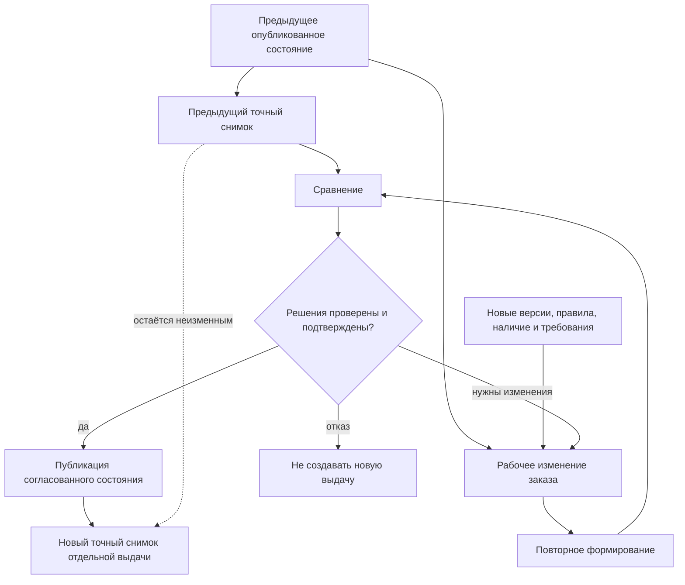
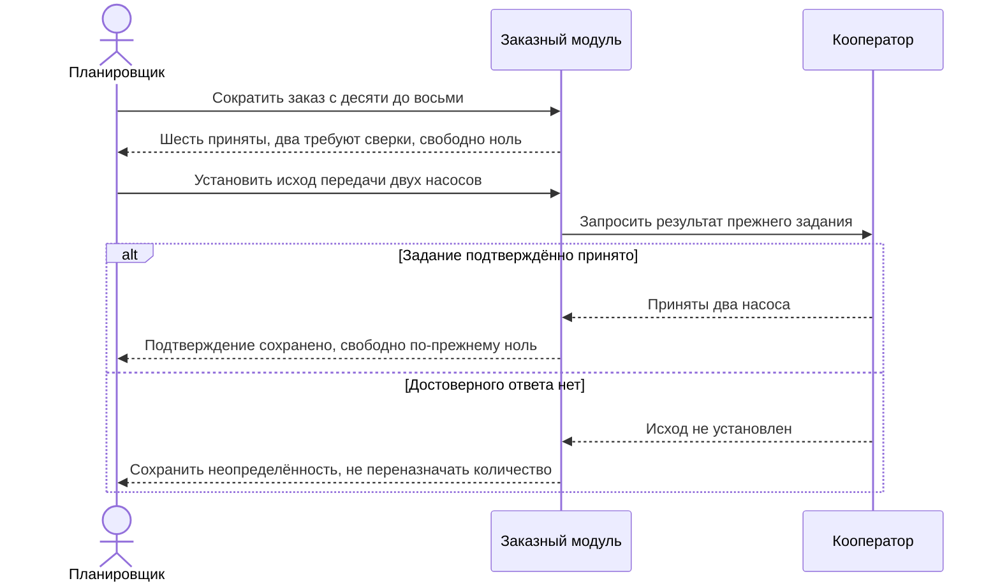

# Перепланирование, замены и история изменений

> Целевой процесс по состоянию на 6 сентября 2026 года. Перепланирование изменяет будущие обязательства, но не переписывает прежние публикации, ответы внешних систем и факты изготовления.

## Почему перепланирование должно быть явным

После первой передачи заказ редко остаётся неизменным. Заказчик увеличивает количество, поставщик снимает компонент с производства, конструктор выпускает улучшенную версию, технолог меняет маршрут, а цех сообщает о фактическом отклонении.

Опасны две крайности: навсегда заморозить живой заказ или молча пересчитать уже переданный результат. В Interlink новое требование сначала оформляется рабочим изменением. Система показывает разницу, пользователь принимает решения, затем публикуется новое неизменяемое состояние и при необходимости отдельная деловая передача. Новая инженерная версия заказа создаётся только по предметному правилу предприятия, а не после каждого сохранения.

## Какие изменения встречаются

- добавление или удаление позиции заказа;
- изменение количества;
- смена комплектации или отдельной опции;
- новая версия того же изделия или документа;
- выбор аналога либо замены другой номенклатурой;
- смена маршрута, площадки или способа обеспечения;
- изменение нормы материала или труда;
- разделение поставки на этапы;
- разрешённое фактическое отклонение экземпляра.

Система должна различать эти причины. Сообщение «состав изменился» слишком мало помогает специалисту.

## Пересчёт и сравнение

Повторное формирование не должно сразу создавать новую передачу. Сначала пользователь получает сравнение:

- какие позиции добавлены и удалены;
- где изменилась точная версия;
- где изменился предметный вариант или маршрут;
- как изменились количества, материалы и трудоёмкость;
- какие ранее принятые решения больше недопустимы;
- какие ручные позиции потеряли однозначную связь с новым составом.

Рабочее сохранение оставляет прежние опубликованные данные видимыми остальным пользователям; совместный просмотр будущего состава открывается явно. Только после предусмотренных проверок публикуется новое состояние. Создание снимка выдачи — отдельное разрешённое действие, которое может проводиться вместе с публикацией, но не возникает как скрытый эффект сохранения.

## Устойчивое сопоставление позиций

Нельзя сопоставлять старый и новый состав только по порядковому номеру строки или обозначению детали. Одна деталь может повторяться в нескольких местах. Для объяснения различий Interlink использует устойчивую нить позиции и полный путь применения.

Пользователь видит предметный адрес, например: «Комплект второй очереди → станок № 3 → магазин инструмента → привод → муфта». Он включает точный комплект, корень и полный путь: одно название муфты или одинаковая цепочка в другом заказе не означают то же место. Система сохраняет связь прежнего и нового адреса, если она доказана структурой изменения.

Если конструкторская перестройка уничтожила прежний путь, система не должна молча прикрепить ручное решение к похожей детали. Оно помечается как потерявшее основание и требует подтверждения.

## Изменение только для заказа

Иногда заказ требует разового отклонения: особую табличку, дополнительное испытание, временную замену материала. Такое решение может относиться только к конкретному заказу или экземпляру и не должно автоматически менять нормативное изделие.

Если отклонение нужно повторять, предприятие решает, оформить ли комплектацию, новую версию исходного изделия или самостоятельное точное изделие.

Библиотечное разрешение замены не переключает все заказы. Один заказ может сохранить штатный подшипник, другой — выбрать комплект «подшипник другого типа и стопорное кольцо». Каждый выбор указывает собственную область количества, точную редакцию разрешения и места применения. Перед применением проверяются весь комплект и обязательные ограничения, в том числе свойства уже выбранного содержания участников. При отрицательном результате система не откатывается скрыто к другой инженерной версии.

## Пример 1. Количество редукторов увеличено с 10 до 12

Первая передача содержит десять редукторов. Заказчик добавляет ещё два. Рабочее изменение заказа показывает разницу количества и пересчитывает материальную потребность. После проверки публикуется новое состояние, не стирающее прежнее обязательство.

Принимающий продукт выбирает способ передачи. Для полного нового результата он создаёт корень передачи на 12 штук. Для добавочного задания он создаёт отдельный корень или явное распределение на 2 штуки и проверяет, что оно не пересекается с прежней передачей десяти. Только затем Interlink фиксирует этот корень снимком. Снимок сам не делит строку заказа и не вычисляет остаток. Прежний снимок сохраняется.

Полный новый план не суммируется с прежним как потребность ещё в двенадцати редукторах. Получатель должен понимать, какая прежняя область заменяется и что уже принято или исполнено. Если такой способ изменения он не поддерживает, выбирается предусмотренная договором последовательность отдельных действий.

## Пример 2. Подшипник снят с производства

Пять из десяти редукторов уже собраны. Для оставшихся основной подшипник недоступен, но разрешён аналог с другим стопорным кольцом.

Система показывает замену номенклатуры, затронутую дочернюю деталь и изменение комплекта документов. Технолог подтверждает новый маршрут сборки. Принимающий продукт создаёт отдельную передачу или распределение для оставшихся пяти и доказывает отсутствие пересечения с первой пятёркой. Новый снимок фиксирует уже оформленный корень этой передачи; сам он количество не отсекает. Фактические экземпляры первых пяти сохраняют исходную родословную.

Фраза «ещё не собрано» не доказывает, что количество свободно: оставшиеся пять могли уже быть приняты производством по прежнему заданию. Тогда перед новой выдачей требуется согласованно изменить это обязательство. Подробный случай с заранее выделенной первой очередью приведён в [описании точной публикации](05-exact-publication.md).

## Пример 3. Маршрут перенесён на другую площадку

Корпуса насосов планировалось обрабатывать на заводе А, но оборудование остановлено. Завод Б использует другой маршрут и иные приспособления.

Конструкторская версия корпуса не меняется. Повторное формирование показывает изменения операций, документов, трудоёмкости и срока подготовки оснастки. После согласования создаётся новая производственная передача, связанная с исходной причиной.

## Пример 4. Перестроена конструкция шкафа

Конструктор объединил две монтажные панели в одну. В старой версии заказа для одной панели было ручное указание «изготавливать у кооператора».

Новый состав не имеет прежней позиции. Interlink отмечает решение как утратившее однозначное место и просит планировщика определить способ обеспечения новой объединённой панели. Автоматически переносить решение по совпадению материала нельзя.

## Пример 5. Разовое отверстие для монтажа у заказчика

Для одного станка заказчик просит дополнительное монтажное отверстие. Если это разовое разрешённое отклонение, оно сохраняется в позиции заказа и производственных документах конкретного экземпляра. Базовая станина не меняется.

Если требование становится типовым, конструктор оформляет новую версию или комплектацию. История показывает переход от разового заказного решения к нормативному.

## Пример 6. Неизвестная передача не становится свободным остатком

Из десяти насосов шесть уже приняты собственным заводом, ещё два переданы кооператору, но ответ потерян. Заказ сокращается до восьми. Эти восемь уже заняты: шесть подтверждены, два требуют сверки. Перепланирование не создаёт заново восемь свободных насосов и не отдаёт неизвестные два второму кооператору.

Если два планировщика одновременно меняют распределение, система проверяет общий итог по всем связанным состояниям и передачам. Успех одного изменения заставляет второе повторно проверить основания. Уменьшение до семи требует разрешённой отмены или иного урегулирования; отрицательный остаток не считается корректным решением.

Неизвестный исход прежней выдачи разрешается до свободного переназначения её количества:

Сверка меняет знание о прежней передаче, но не создаёт новую потребность. Доказанный отказ или предусмотренная отмена потребовали бы отдельного решения об освобождении соответствующей области; ни один таймаут такого решения не заменяет.

## Пример 7. Изменились таблица норм и разрешение покрытия

Для рам северного исполнения использована утверждённая редакция норм расхода покрытия и проверка совместимости «материал рамы × среда × система покрытия». Позже справочник нормы исправлен. Старый производственный комплект остаётся объяснимым по своей редакции. Для новой выдачи пользователь видит изменение расхода и проверяет перенесённую ручную поправку технолога: её нельзя безусловно прикрепить к новой строке только по одинаковому названию.

Если же служба качества отозвала допуск покрытия для этой среды, это не просто новая справочная редакция. Новое применение требует проверки действующего запрета. Система находит затронутые заказы и экземпляры, но не меняет старый снимок и не объявляет физическое покрытие уже заменённым. По фактически изготовленным рамам принимается отдельное решение.

## Доработка — действия, а не отрицательные детали

Программа модернизации может потребовать снять старый привод, установить новый привод вместе с плитой и доработать отверстия рамы. Эти действия имеют разные роли и проверяемые исходные условия. Запись «минус один привод» недостаточна: она не объясняет, какой установленный экземпляр снять, куда установить новый и что изменить в оставшейся раме.

Публикация программы ещё не означает её выполнение. Исполнитель регистрирует реальные действия, качество принимает факты по правилам предприятия, и только после этого меняется фактическая конфигурация. Повтор регистрации не снимает один привод дважды; конфликт с уже изменённым экземпляром требует разбора.

## Управление отклонениями

Для каждого отклонения важно хранить:

- инициатора и причину;
- область действия: заказ, часть количества, партия или экземпляр;
- затронутые позиции;
- разрешающий документ и согласующих;
- срок действия;
- влияние на документы, маршруты и нормы;
- связь с последующим фактическим составом.

## Открытые вопросы

- Когда изменение требует новой версии заказа, а когда достаточно новой производственной ведомости?
- Как предприятие оформляет добавочную передачу?
- Можно ли изменить только оставшееся количество одной позиции?
- Как долго сохраняется ручное решение при появлении новых версий?
- Какие отклонения разрешены после начала изготовления?
- Кто подтверждает потерявшие связь ручные позиции?
- Нужно ли автоматически оценивать влияние на уже созданные задания ERP/MES?

## Критерии приёмки

1. Повторный расчёт не меняет предыдущий снимок.
2. Сравнение различает количество, версию, номенклатуру, маршрут и нормы.
3. Пользователь видит причину и предметный путь каждого изменения.
4. Решение для исчезнувшей позиции не переносится наугад.
5. Заказное отклонение не изменяет нормативное изделие автоматически.
6. Замена части количества оформлена отдельным корнем передачи или явным распределением без пересечения; снимок лишь фиксирует эту область.
7. Фактическое отклонение связано с разрешением и конкретными экземплярами или партиями.
8. Новое состояние продолжает учёт прежних обязательств, включая неизвестный приём; конкурентные назначения не удваивают количество.
9. Перенос нормы, ручной поправки и замены проверяет их исходные основания; отзыв допуска не вызывает автоматическую перепись истории или демонтаж.

## Состояние реализации

Версионирование заказа и неизменяемость прошлой передачи приняты как целевой контракт. Подробное сравнение, перенос решений, область действия замены и управление отклонениями ещё требуют предметной реализации и приёмочных сценариев.

## Связанные документы

- [Жизненный цикл заказа](04-live-order-lifecycle.md)
- [Экземпляры и фактический состав](09-units-lots-and-as-built.md)
- [Сквозные сценарии](13-end-to-end-scenarios.md)
- [Допустимые замены](../substitution-and-compatibility/01-allowed-replacements.md)
- [Матрицы совместимости](../substitution-and-compatibility/02-compatibility-matrices.md)
- [Справочные таблицы](../tabular-data/01-reference-tables.md)

## Основания и актуальность

Материалы IPS: [IPS-A05], [IPS-A13], [IPS-M03]. Действующая целевая модель перепланирования и замен: [IL-ORDERS], [IL-KERNEL], [IL-SC], [IL-TD], [IL-DATA-MODEL], [IL-PLAN-V2]. История решений: [IL-PLM §5], [IL-ADR ADR-052]; прежняя формулировка «новая версия после правки» уточнена различием рабочего сохранения, нового состояния и новой инженерной версии. Расшифровка и границы достоверности — в [реестре источников](../knowledge/15-source-register.md). Продуктовая редакция сверена с нормативной документацией Interlink на 6 сентября 2026 года; наличие принятых контрактов не означает готовность всего пользовательского процесса.
