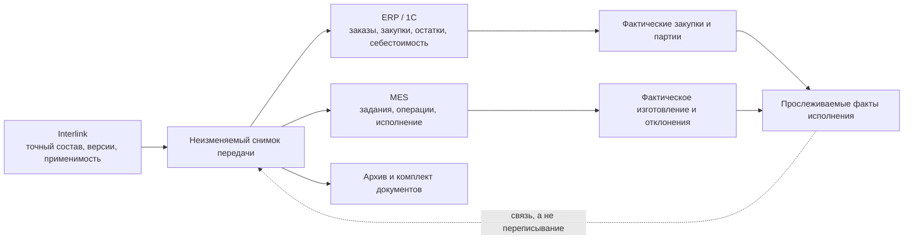

# MRP, ERP/MES и длительные операции

## Где заканчивается заказный контур Interlink

Interlink определяет точный, версионный и объяснимый состав заказа. Он не должен становиться второй ERP или MES.

- **MRP** — расчёт потребности в материалах и компонентах с учётом сроков, запасов и правил обеспечения.
- **ERP** — система планирования и учёта ресурсов предприятия, например 1С.
- **MES** — система управления исполнением производства в цехе.

Эти сокращения используются потому, что привычны специалистам отрасли. В продуктовой модели важно не название системы, а ответственность за данные.

## Валовая и обеспеченная потребность

Из точного состава Interlink может получить **валовую потребность**: сколько деталей и материалов требуется без учёта склада и уже размещённых закупок. Например, десять редукторов требуют двадцать подшипников определённого исполнения.

**Обеспеченная потребность** отвечает на следующий вопрос: сколько нужно заказать или изготовить после учёта остатков, резервов, незавершённого производства, сроков и других заказов. Обычно это ответственность ERP/MRP.

Документы не должны обещать, что Interlink самостоятельно выполнит полный складской взаимозачёт или календарное планирование. Он передаёт точную исходную потребность и принимает обратно связанные факты.

## Расчёт количества

Для внешней передачи количество должно объясняться по пути состава:

- количество на непосредственной позиции;
- накопленное количество внутри ветви;
- количество верхнего изделия в заказе;
- итоговая потребность всего заказа;
- единица измерения и правила округления.

Если один подшипниковый узел содержит два подшипника, редуктор содержит два узла, а заказ требует десять редукторов, валовая потребность равна 2 × 2 × 10 = 40 подшипников. Отчёт должен позволить восстановить этот расчёт.

## Передача наружу

Существенная интеграция начинается с точного снимка, а не с чтения «текущего заказа» во время каждого повторения. Передаваемое сообщение содержит:

- назначение и получателя;
- исходный снимок;
- позиции, количества и точные версии;
- требуемые маршруты, нормы и документы;
- устойчивый номер передачи для защиты от дублей;
- версию формата данных;
- время и автора запуска.

Если сеть оборвалась и отправка повторена, получатель сможет распознать ту же передачу и не создать второй производственный заказ только при явно согласованном договоре: устойчивый номер операции, правила повторного приёма и способ сверки результата поддерживают обе стороны. Без такого договора принимающее приложение не обещает автоматическую защиту от дубля и при неизвестном исходе требует сверки.

## Ответ внешней системы

ERP/MES может вернуть:

- номер внешнего заказа или задания;
- состояние приёма;
- отклонённые записи и понятные причины;
- назначенные производственные партии;
- фактические количества и даты;
- серийные номера;
- применённые партии материалов;
- разрешённые отклонения и результаты операций.

Ответ связывается с исходной передачей. Он дополняет историю исполнения, но не редактирует снимок «как заказано».

## Длительные операции

Большой заказ может содержать сотни тысяч позиций и документов. Раскрытие состава, формирование комплекта файлов и передача во внешнюю систему не должны выглядеть как зависшее окно.

Пользователю нужны:

- видимый этап: анализ состава, проверка документов, построение отчёта, передача;
- обработанный объём и, если он заранее известен, общий объём;
- промежуточные предупреждения;
- возможность безопасно отменить незавершённую работу;
- итоговый протокол;
- повтор той же внешней доставки без дублирования — только если это гарантирует согласованный договор с получателем.

Отмена до завершения не должна оставлять наполовину опубликованный снимок. Если внешняя система уже приняла сообщение, отмена локального ожидания не означает отмену внешнего заказа: требуется отдельная согласованная операция.

## Пример 1. Отчёт для 1С на шкафы управления

Заказ содержит пять шкафов. Interlink раскрывает точный состав и рассчитывает валовую потребность: аппараты, клеммы, кабель и трудовые нормы. На основании снимка формируется сообщение для 1С.

1С учитывает складские остатки и размещённые закупки, создаёт внутренние заказы и возвращает их номера. Если согласованный интерфейс 1С поддерживает повторный приём по устойчивому номеру, повтор того же сообщения не создаёт новые заказы. Если такой гарантии нет или исход первого обращения неизвестен, оператор сначала сверяет внешний результат и не повторяет сообщение вслепую.

## Пример 2. MES и фактическое изготовление редукторов

MES получает точный состав десяти редукторов, маршруты и версии документов. Во время сборки она назначает заводские номера и сообщает фактические партии подшипников.

Для одного экземпляра зарегистрирована разрешённая замена датчика. Этот факт возвращается в родословную экземпляра. Исходный снимок заказа остаётся прежним.

## Пример 3. Крупная сборочная линия

Пакет линии включает несколько станций, ограждения, роботов, кабельные трассы и тысячи документов. Подготовка занимает десятки минут.

Если исполнитель умеет определить общий объём, пользователь видит, что состав раскрыт на 70 %, а проверка документов — на 35 %. Иначе интерфейс показывает текущий этап и уже обработанный объём без вымышленного процента. Обнаруженная ошибка в обязательной схеме останавливает публикацию целиком. После исправления новый запуск создаёт снимок только по полностью согласованному результату; возможность переиспользовать неизменившиеся промежуточные результаты является отдельной оптимизацией, а не гарантией предметного контракта.

## Пример 4. Частичный отказ внешней системы

ERP принимает изделие и материалы, но отклоняет одну позицию из-за неизвестной единицы измерения. Принимающее приложение не помечает передачу полностью успешной: состояние становится «частично принято». В протоколе видны принятые и отклонённые части, причина и требуемое действие; сам исходный снимок при этом не переписывается.

После исправления справочника повторяется та же логическая передача либо создаётся исправляющая — это зависит от договора интеграции. Если договор не определяет безопасный повтор и внешний исход отдельных частей нельзя доказать, сначала выполняется сверка. Исключение дублей является обязанностью согласованного интерфейса обеих сторон, а не безусловным свойством Interlink.

Карточка передачи должна различать как минимум состояния «подготовлена», «опубликована», «ожидает отправки», «отправляется», «принята», «частично принята», «отклонена» и «исход неизвестен». Для частичного приёма она показывает, какие части уже признаны внешней системой и допускает только действие, предусмотренное договором: дослать ту же операцию, отправить исправляющую передачу, отменить внешнее задание или передать случай оператору на сверку.

## Владение данными

| Данные | Обычный владелец |
|---|---|
| Версии изделий, состав, применимость, точный снимок | Interlink и принимающая PLM-система |
| Коммерческий заказ, цена, платёж, отгрузка | ERP или сбытовая система |
| Остатки, резервы, закупки, календарная потребность | ERP/MRP |
| Цеховые задания, выполнение операций, простои | MES |
| Серийные номера и фактическая родословная | Совместный производственный контур; владелец согласуется |
| Подписи и маршруты согласования | Принимающая PLM-система или корпоративная служба |

## Открытые вопросы

- Какая система является владельцем номера производственного заказа?
- Передаёт ли Interlink валовую потребность или уже агрегированный производственный состав?
- Где выполняются складской взаимозачёт и календарный расчёт?
- Какая система создаёт экземпляры и партии?
- Как обрабатывается частичный приём сообщения?
- Как отменяется уже принятый внешний заказ?
- Какие форматы 1С, ERP и MES обязательны для первой интеграции?

## Критерии приёмки

1. Внешняя передача всегда связана с точным снимком.
2. При наличии согласованного договора повтор одной и той же доставки распознаётся получателем; без такой гарантии неизвестный исход переводится в сверку, а не в слепой повтор.
3. Валовая потребность объясняется по пути и количеству заказа.
4. Остатки и календарное планирование не приписываются ядру без отдельного модуля.
5. Частичный отказ виден и не считается полным успехом.
6. Длительная операция показывает ход работы и завершается атомарно.
7. Факты ERP/MES дополняют историю, не переписывая «как заказано».

## Состояние реализации

Архитектура Interlink предусматривает размещение длительных операций и интеграционных процессов в принимающей системе. Полный расчёт потребностей, обмен с 1С, ERP и MES, надёжная доставка и возврат фактов не реализованы в текущем опытном образце и требуют отдельных договоров интеграции.

## Связанные документы

- [Точный состав передачи](05-exact-publication.md)
- [Производственные ведомости и отчёты](08-production-sheets-and-reports.md)
- [Экземпляры и фактический состав](09-units-lots-and-as-built.md)

Основания: [IPS-A13], [IPS-A23], [IPS-M03], [IL-HOST §8], [IL-ADR ADR-052]. Расшифровка — в [реестре источников](../knowledge/15-source-register.md).
