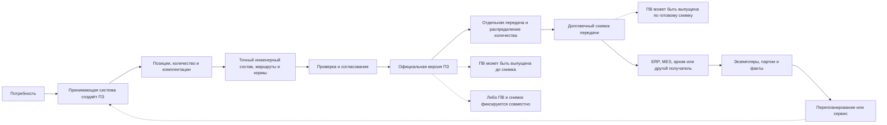

# Сквозные машиностроительные сценарии

## Назначение

Ниже собраны три цельных истории. Они показывают не отдельную функцию, а весь путь: от потребности до точной передачи, перепланирования и фактического исполнения. Эти сценарии можно использовать на продуктовой встрече и затем превратить в приёмочные испытания.

В историях производственный заказ обозначается как ПЗ, а производственная ведомость — как ПВ. ПЗ является версионируемым предметным объектом принимающей PLM-системы. Именно принимающая система решает, в какой момент его создать, показывает его пользователю, ведёт состояния, задания, права и согласование. Interlink даёт ПЗ версии, состав, объяснимый подбор и точное основание передачи, но не является владельцем корпоративного производственного процесса.

Схема намеренно не закрепляет ПВ строго перед снимком или после него. В одном процессе подписанная ПВ разрешает создание производственной передачи. В другом ПВ формируется по уже зафиксированному точному составу. В третьем принимающая система официально фиксирует оба результата совместно. Нужный порядок должен быть подтверждён для конкретной установки IPS и согласован как профиль внедрения.

## Общие правила всех трёх сценариев

### Сначала определяется область передачи, затем создаётся снимок

Снимок фиксирует точный состав своего корневого объекта, но сам не делит количество строки ПЗ. Если строка содержит десять насосных станций, нельзя просто попросить снимок «на пять» и считать остальные пять автоматически оставшимися. Сначала принимающая система создаёт объект первой передачи, распределяет на него пять единиц и проверяет, что это распределение не пересекается с другой передачей. Затем Interlink фиксирует полный точный состав именно этого объекта. Допустима и другая политика: выпустить новую версию ПЗ, в которой первая очередь и остаток уже разделены как самостоятельные управляемые части. Недопустимо только передать в снимок произвольное уменьшенное количество без предметного основания и истории распределения.

Одна официальная версия ПЗ может иметь несколько снимков, если между передачами не менялось его содержание. Новая версия нужна при изменении количества, комплектации, состава, маршрута или другого официального решения, но не из-за одного лишь нового получателя или второй очереди.

### Долговечный снимок и удобное представление — разные вещи

Базовый снимок утверждённого состава и снимок заказа являются неизменяемыми долговечными основаниями. Техническая проекция для ускорения чтения, временное представление для экрана, выгрузка определённого формата или ограниченный пакет кооператору могут быть перестроены, заменены либо удалены по правилам хранения. Их нельзя автоматически считать равнозначным юридическим доказательством.

Снимок заказа фиксирует точные позиции, версии, количества и основания выбора в объявленной области. Он не обязан копировать все свойства, тела файлов, подписи и сопроводительные документы. Если предприятию нужен автономный юридически значимый комплект, принимающая система собирает обязательные документы, проверяет права и полноту, организует подпись и долговременное хранение.

### Передача во внешние системы остаётся управляемой операцией принимающей системы

Принимающая система формирует рабочие места и задания, проверяет права, собирает согласования, а после официальной фиксации ведёт журнал гарантированной отправки. Она повторяет не доставленное сообщение с тем же устойчивым номером и защищает ERP или MES от повторного создания задания. ERP отвечает за согласованные границы коммерческого и ресурсного планирования, MES — за оперативное исполнение, партии, экземпляры и обратную связь. Interlink не должен по одному факту отправки объявлять ПЗ запущенным или закрытым.

## Сценарий 1. Поставка экскаваторов и запасных комплектов

### Потребность

Горнодобывающее предприятие заказывает:

- три экскаватора в северном исполнении;
- два экскаватора в обычном исполнении;
- три ковша для скального грунта как отдельную поставку;
- пять комплектов запасных частей.

Все экскаваторы основаны на одном конфигурируемом семействе, но северная и обычная позиции имеют разные условия эксплуатации.

### Подготовка заказа

В этом профиле предприятия коммерческая потребность сначала регистрируется в ERP. После подтверждения состава поставки принимающая PLM-система создаёт ПЗ «Поставка экскаваторов для северного карьера», назначает планировщика и переводит объект в состояние подготовки. Точный момент создания выбран самим предприятием; другая организация могла бы открыть ПЗ раньше, ещё во время технической проработки предложения.

Автор создаёт четыре позиции, а не искусственную сборку «заказ целиком». На северной позиции выбираются предпусковой подогрев, арктические рукава, масло низкой температуры и закрытый аккумуляторный отсек. На обычной — стандартный комплект. Ковши и ЗИП остаются самостоятельными поставочными позициями и не считаются установленными во все машины.

Специалист видит локальное количество каждой строки и итоговые количества вложенных деталей. Три северных машины не создают три экземпляра на этом этапе: это одна количественная потребность.

### Формирование производственного состава

Условия комплектации исключают стандартные рукава из северной ветви и включают арктические. Для предпускового подогревателя найдены две допустимые версии, но одна ещё не выпущена. При обычной публикации выбирается выпущенная версия; будущую можно оценить только в рабочей области совместного изменения.

Для скального ковша выбирается отдельный маршрут наплавки. ЗИП раскрывается как поставочный комплект со своими количествами, но не входит в фактический состав каждой машины.

### Документы и согласование

Проверка требует сборочные чертежи, схемы гидравлики, перечень запасных частей и инструкции северного запуска. Инструкция стандартного запуска остаётся для обычных машин, а северная инструкция применяется только к первой позиции.

Конструктор подтверждает версии, технолог — маршруты и нормы, специалист по комплектации — отсутствие противоречий. Задания, права и последовательность подписей ведёт принимающая система. После согласования выпускается официальная версия ПЗ.

Для этого предприятия принята схема «ПВ до снимка»: сначала выпускается и подписывается ПВ на первую производственную очередь, затем её точная версия включается в основание передачи. Это выбор данного сценария, а не обязательный порядок Interlink для всех внедрений.

### Передача и исполнение

Предприятие решает сначала изготовить один северный и оба обычных экскаватора. Планировщик создаёт объект передачи «Первая очередь экскаваторов», распределяет на него одну единицу из северной позиции и две единицы из обычной. Только после этой операции создаётся полный долговечный снимок первой очереди. Снимок не изменяет исходные количества ПЗ и не угадывает, что две северные машины должны остаться на потом.

Ковши и ЗИП передаются отдельными объектами поставки либо явно включаются в выбранную очередь с собственным распределением количества. При запуске первой очереди MES создаёт три серийных экземпляра экскаваторов. В дальнейшем общее число экземпляров достигнет пяти. Ковши могут получить отдельные номера, а ЗИП — номера комплектов или партий по правилам предприятия.

Принимающая система отправляет в ERP и MES один и тот же устойчивый номер передачи. Если связь прервётся, повтор того же сообщения не должен породить второй производственный заказ. Полученный ответ меняет состояние ПЗ только по правилам процесса принимающей системы.

Через месяц поставщик меняет арктический рукав. Поскольку меняется официальный состав оставшейся части, специалист создаёт следующую версию ПЗ и согласует зависимые изменения. Затем принимающая система создаёт объект второй передачи и распределяет на него две оставшиеся северные машины. Новый снимок относится именно к этой передаче. Первый снимок и фактический состав уже изготовленной северной машины сохраняют прежний рукав.

Если бы состав не изменился, вторую передачу можно было бы создать из той же версии ПЗ: сам факт второй очереди не требует искусственной новой версии.

### Почему требование IPS закрыто

Сохраняются несколько верхних изделий, количества, опции по каждой позиции, точные версии, трассировка причин и контролируемая замена после формирования. Дополнительно Interlink явно отделяет ЗИП, живой заказ, точную передачу и серийные экземпляры.

### Проверяемый результат

- четыре строки заказа формируют независимые ветви;
- северное решение не переносится на обычные машины;
- ковши и ЗИП не становятся установленным составом без основания;
- частичная очередь появляется только после явного распределения количества на отдельную передачу;
- первая передача не меняется после замены рукава;
- фактические серийные машины связаны с правильной передачей.

## Сценарий 2. Заказной обрабатывающий центр с роботизированной загрузкой

### Потребность

Машиностроительный завод заказывает один обрабатывающий центр для крупногабаритных деталей. Требуются:

- поворотный стол;
- магазин на 120 инструментов;
- измерительный щуп;
- подготовка под робота заказчика;
- отдельный комплект кулачков и оснастки;
- комплект документов для последующей сертификации.

В этом профиле предприятия принимающая система создаёт ПЗ после технического согласования требований, но до завершения проектирования. ПЗ получает собственного ответственного и состояние «инженерная подготовка». Коммерческий срок и стоимость остаются в ERP; Interlink не дублирует их как обязательные свойства ядра.

### Комплектация

Поворотный стол требует усиленной станины. Увеличенный магазин меняет ограждение и кабельные трассы. Подготовка под робота исключает стандартную дверь ручной загрузки и включает интерфейс безопасности.

Interlink объясняет зависимые решения. Если суммарная мощность приводов превышает предел стандартного шкафа, включается увеличенный шкаф. Пользователь видит причину, а не только изменившуюся строку состава.

Комплект кулачков оформляется отдельной позицией поставки. Он связан со станком по назначению, но не считается постоянно установленным узлом.

### Точные версии и замена покупного узла

Для поворотного стола основной поставщик не может выдержать срок. Предприятие выбирает разрешённый аналог. Аналог требует другого переходного фланца и новой схемы подключения.

Сначала фиксируется выбор другого изделия, затем подбирается его допустимая версия. Система пересчитывает затронутые ветви и помечает прежний фланец и схему как исключённые. Замена не маскируется обычным выбором «более новой версии».

### Технология и обеспечение

Рама изготавливается внутри предприятия, покрытие передаётся кооператору, поворотный стол закупается. Для переходного фланца рассматриваются два маршрута; технолог выбирает обработку на своей площадке.

Нормы показывают материал и труд на один фланец, наладку на партию и итог заказа. ERP позже учтёт остатки материала, но валовая потребность уже объяснима из точного состава.

### ПВ, снимок и документы

ПВ включает точный состав, сборочные чертежи, электрические схемы, программу настройки приводов, инструкцию сопряжения с роботом и план испытаний. Проверка блокирует выпуск, пока схема безопасности находится в рабочем состоянии.

Планировщик создаёт объект производственной передачи одного обрабатывающего центра. Он становится однозначным корнем будущего снимка; ограниченная передача кооператору оформляется отдельно и не меняет этот корень.

Для этого предприятия выбран профиль совместной фиксации. Сначала Interlink готовит точный снимок-кандидат, но ещё не объявляет его опубликованным. Принимающая система проверяет, что согласования относятся к точным версиям ПЗ и ПВ, и завершает общую фиксацию. Только при успехе одновременно появляются официальная ПВ и опубликованный долговечный снимок. Если операция прервана, официально не остаётся ни новой ПВ, ни нового снимка. В другом внедрении допустимо сначала создать снимок, а затем выпустить ПВ по нему; универсальный порядок ещё должен быть подтверждён.

Кооператор получает только чертежи рамы и требования к покрытию. Такой ограниченный пакет является разрешённым производным представлением, а не полным внутренним снимком и не самостоятельным доказательством всего производственного решения. Он может быть заменён при исправлении формата передачи, тогда как исходный снимок остаётся неизменным.

Сам снимок хранит точный состав и связи с требуемыми версиями документов, но не обязан содержать тела всех файлов и подписи. Автономный комплект для сертификации собирает, проверяет, подписывает и архивирует принимающая система по правилам предприятия.

После фиксации принимающая система отправляет MES точное производственное основание с устойчивым номером. MES создаёт задание и позднее возвращает номер изготовленного станка и фактические отклонения. Повтор передачи с тем же номером не создаёт второй станок.

### Создание точного изделия

После успешного проекта предприятие решает включить это исполнение в каталог как повторяемое предложение. Уполномоченный специалист явно создаёт точное изделие с собственным обозначением и историей. Это отдельное решение, а не автоматический результат заказа.

### Почему требование IPS закрыто

Сценарий сохраняет комплектацию, варианты, аналоги, применимость документов, технологический маршрут, ПВ, согласование и отчётность. Interlink добавляет объяснимую последовательность выбора и различает разовое исполнение заказа от нового самостоятельного изделия.

### Проверяемый результат

- все зависимые изменения комплектации объяснены;
- аналог поворотного стола не смешан с новой версией исходного стола;
- кооператорский пакет не выдаётся за полный снимок;
- незрелая схема блокирует ПВ;
- согласования относятся к точным версиям ПЗ, ПВ и состава;
- автономный сертификационный комплект формируется принимающей системой, а не предполагается содержимым снимка;
- точное изделие появляется только после явного решения.

## Сценарий 3. Партия насосных станций с перепланированием

### Потребность

Нефтехимическое предприятие заказывает десять насосных станций одной комплектации. Поставка разделена на две очереди по пять штук. Заказчик требует прослеживаемость двигателей, торцевых уплотнений и партий материалов корпуса.

ERP хранит договорную потребность и даты двух поставок. Принимающая PLM-система после подтверждения комплектации создаёт ПЗ с одной строкой «Насосная станция НС-80» и количеством десять. Она же ведёт состояния ПЗ, задания планировщику, права технолога и согласования службы качества.

### Первая очередь

Формируется точный состав официальной версии 01 ПЗ. Затем планировщик создаёт отдельный объект «Передача первой очереди» и распределяет на него пять единиц из десяти. В истории ПЗ остаётся явно видно: пять единиц выделены первой передаче, ещё пять не распределены. Попытка сразу создать снимок «на пять» из строки количеством десять без такого объекта и распределения должна быть отклонена.

После проверки создаётся долговечный снимок первой передачи. В данном профиле предприятия ПВ формируется по уже зафиксированному составу: она получает собственную версию, согласование и ссылку на первый снимок. Это пример схемы «ПВ после снимка», а не обязательное правило для всех предприятий.

Принимающая система записывает намерение отправки, передаёт данные ERP и MES с устойчивым номером и ожидает подтверждение. При запуске появляются пять серийных экземпляров. MES возвращает номера двигателей и партии отливок корпусов. Фактический состав связывается с первым снимком. Повтор сообщения после сбоя не создаёт вторую очередь производства.

Если бы до второй очереди ничего не изменилось, тот же официальный вариант ПЗ 01 мог бы стать основанием второго объекта передачи и второго снимка на оставшиеся пять единиц. Новая передача сама по себе не требует новой версии ПЗ.

### Изменение поставщика

Перед второй очередью поставщик снимает уплотнение с производства. Разрешённый аналог требует другой втулки и небольшой корректировки операции сборки. Живой заказ обнаруживает изменение, но не затрагивает первые пять станций.

Здесь новая версия всё же нужна, потому что меняется производственное решение, а не потому, что наступила вторая очередь. Специалист создаёт версию 02 ПЗ, сохраняющую общий заказанный объём и явно относящую изменения к пяти ещё не распределённым станциям. Выбор аналога приводит к замене втулки, новой версии инструкции и изменению трудовой нормы. Сравнение показывает все последствия.

### Новый маршрут корпуса

Одновременно завод А временно недоступен. Обработку корпусов переносят на завод Б. Конструкторская версия корпуса сохраняется, но меняются маршрут, приспособление и контрольная карта.

Технолог и служба качества согласуют изменения в рабочих местах принимающей системы. Затем планировщик создаёт объект «Передача второй очереди», распределяет на него оставшиеся пять единиц и публикует второй долговечный снимок. Новая версия ПВ относится ко второй очереди и ссылается на этот снимок. В истории видно, что первая и вторая половины заказа изготовлены по разным производственным решениям.

### Передача в ERP и MES

ERP получает изменение потребности только для второй передачи и учитывает остатки старых уплотнений отдельно. MES получает точные новые документы. Принимающая система ведёт журнал гарантированной отправки, сверяет неизвестный результат и повторяет сообщение с прежним устойчивым номером. Защита от повторной обработки не допускает второго производственного задания по одной передаче.

### Фактическое отклонение

Во время сборки станции № 009 повреждён датчик. Служба качества разрешает другой эквивалентный датчик только для этого экземпляра. Разрешение и установленный номер попадают в фактическую родословную № 009, но не меняют нормативный состав остальных станций.

### Почему требование IPS закрыто

Сценарий поддерживает контролируемую замену изделия, версии и маршрута после формирования заказа, а также трассировку и производственные документы. Дополнительное разделение «как заказано» и «как изготовлено» позволяет точно объяснить судьбу каждой очереди и каждого экземпляра.

### Проверяемый результат

- две очереди имеют отдельные снимки и ПВ;
- первая очередь не может быть опубликована без отдельного объекта передачи и распределения пяти единиц;
- при неизменном содержании одна версия ПЗ могла бы иметь два снимка;
- изменение уплотнения не переписывает первую очередь;
- сравнение показывает зависимую втулку, документ и норму;
- маршрут завода Б применяется только ко второй очереди;
- отклонение датчика ограничено экземпляром № 009;
- ERP/MES связывают ответы с правильной передачей.

## Общие вопросы для продуктовой встречи

На каждом реальном примере необходимо уточнить:

1. Какое событие создаёт ПЗ: принятие коммерческой потребности, подтверждение комплектации, выпуск ПВ или решение о запуске?
2. Какая принимающая система владеет номером ПЗ, его состояниями, заданиями, правами и согласованиями?
3. Когда предприятие создаёт полную, а когда добавочную передачу, и каким объектом распределяет количество между очередями?
4. Может ли одна версия ПЗ иметь несколько передач, а если нет — какое предметное изменение требует новой версии?
5. Кто принимает неоднозначный вариант, аналог и маршрут?
6. ПВ выпускается до снимка, после него или фиксируется вместе с ним?
7. Какие документы блокируют производство и кто собирает автономный подписанный комплект?
8. Какие снимки являются долговечным доказательством, а какие представления можно перестраивать или удалять?
9. Где появляются экземпляры и партии?
10. Какая система владеет сроками, запасами, внешним номером заказа и состоянием фактического исполнения?
11. Какие изменения требуют повторной подписи?
12. Как ограничивается область замены: весь заказ, очередь, партия или экземпляр?
13. Как принимающая система повторяет недоставленную передачу и исключает повторное создание задания в ERP или MES?

## Состояние реализации

Сценарии являются целевыми приёмочными историями. Они опираются на принятые архитектурные решения и подтверждённые потребности IPS, но полный сквозной заказно-производственный контур ещё не реализован. В частности, рабочие места, процессные состояния и задания, права, согласование, ПВ и ПЗ, распределение количества, публикация долговечных снимков, журнал гарантированной отправки и интеграция с ERP/MES относятся к принимающему продукту и последующим этапам. Детальная проверка должна выполняться поэтапно по матрице следующего документа.

## Связанные документы

- [Покрытие, вопросы и состояние](14-coverage-open-questions-and-status.md)
- [Формирование производственного заказа](06-production-order-resolution.md)
- [Перепланирование и отклонения](10-replanning-and-deviations.md)

Основания: [IPS-A05], [IPS-A13], [IPS-A23], [IPS-M03], [IL-ADR ADR-052]. Расшифровка — в [реестре источников](../knowledge/15-source-register.md).
