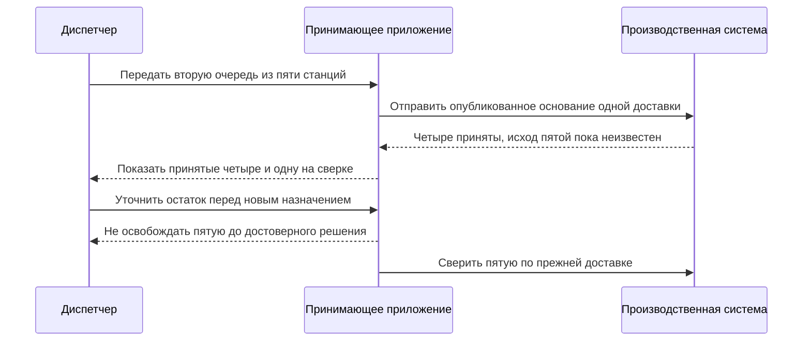

# Сквозные машиностроительные сценарии

## Назначение

Ниже собраны три цельных истории. Они показывают не отдельную функцию, а весь путь: от потребности до точной передачи, перепланирования и фактического исполнения. Эти сценарии можно использовать на продуктовой встрече и затем превратить в приёмочные испытания.

Во всех историях «опубликовать заказ» означает зафиксировать проверенное содержание выбранной инженерной версии. Рабочие правки можно сохранять до публикации, а новая инженерная версия создаётся только по предметному решению. Рабочий ПЗ разрешено сформировать с ещё не выбранными вариантами; однозначность нужна в конкретной области официальной выдачи.

```mermaid
flowchart LR
    A["Потребность"] --> B["Позиции и комплектации"]
    B --> C["Точный инженерный состав"]
    C --> D["Маршруты, нормы и документы"]
    D --> E["Согласование"]
    E --> V["ПВ и ПЗ — отдельные артефакты;<br/>их порядок задаёт предприятие"]
    V --> F["Опубликовано проверенное содержание ПЗ"]
    F --> G["Опубликован снимок передачи"]
    G --> H["Доставка принимающим продуктом"]
    H --> J["Приём: полностью, частично,<br/>отказ или неизвестный исход"]
    J --> K["Экземпляры, партии и факты"]
    K --> I["Перепланирование или сервис"]
    I -.-> B
```

Схема отделяет подготовку от официального основания, внешнего приёма и фактического исполнения. Повторная подготовка не переписывает прежний снимок. В историях ниже у каждой передачи явно определяется количество и область, а ПВ сохраняет собственный порядок выпуска.

## Общие правила всех трёх сценариев

Предприятие назначает владельца ПЗ, событие его создания, номер, роли и согласование. Состояния подготовки не объявляют задание принятым. Количество сначала распределяется на явно определённую область передачи; снимок не вычисляет остаток и не обрезает дерево по числу, введённому в диалоге публикации.

В примерах ниже показаны три разных профиля фиксации ПВ: до снимка, совместно с ним и после него. Они не устанавливают один обязательный процесс всех внедрений. Даже при общей пользовательской команде ведомость, инженерное содержание и снимок сохраняют самостоятельные истории.

Официальный снимок не является копией каждого файла предприятия. Необходимые основания передачи удерживаются точно, а юридически значимый автономный комплект формируется по принятому регламенту. Отдельный пакет кооператора не выдаётся за полный внутренний состав.

Задание отправки, обязательный аудит и подтверждение локальной операции сохраняются вместе с её результатом. Получатель подтверждает приём отдельно. Потеря ответа не доказывает отказ; безопасно повторяется та же доставка только по договору, который исключает повторный эффект. Иначе сначала выполняется сверка, а назначенное количество остаётся занятым.

## Сценарий 1. Поставка экскаваторов и запасных комплектов

### Потребность

Горнодобывающее предприятие заказывает:

- три экскаватора в северном исполнении;
- два экскаватора в обычном исполнении;
- три ковша для скального грунта как отдельную поставку;
- пять комплектов запасных частей.

Все экскаваторы основаны на одном конфигурируемом семействе, но северная и обычная позиции имеют разные условия эксплуатации.

### Подготовка заказа

В этом профиле потребность сначала подтверждается в ERP. Затем принимающее приложение создаёт рабочий ПЗ поставки, назначает планировщика и сохраняет связь с исходной потребностью. Номер и процесс ПЗ принадлежат предприятию, а не выводятся из имени файла. Другое предприятие могло бы открыть ПЗ раньше для проработки предложения.

Автор создаёт четыре позиции, а не искусственную сборку «заказ целиком». На северной позиции выбираются предпусковой подогрев, арктические рукава, масло низкой температуры и закрытый аккумуляторный отсек. На обычной — стандартный комплект. Ковши и ЗИП остаются самостоятельными поставочными позициями и не считаются установленными во все машины.

Специалист видит локальное количество каждой строки и итоговые количества вложенных деталей. Три северных машины не создают три экземпляра на этом этапе: это одна количественная потребность.

### Формирование производственного состава

Условия комплектации исключают стандартные рукава из северной ветви и включают арктические. Для предпускового подогревателя найдены две допустимые версии, но одна ещё не выпущена. При обычной публикации выбирается выпущенная версия; будущую можно оценить только в рабочей области совместного изменения.

Для скального ковша выбирается отдельный маршрут наплавки. ЗИП раскрывается как поставочный комплект со своими количествами, но не входит в фактический состав каждой машины.

Технолог ищет материал наплавки и норму по виду основного металла, толщине и режиму работы ковша. [Справочник](../tabular-data/01-reference-tables.md) сохраняет используемую редакцию и результаты расчёта, включая поправку на объём партии. Если для сочетания условий не хватает данных испытаний, это отдельный незакрытый вопрос; пустая ячейка не означает нулевой расход и не доказывает разрешение материала.

### Документы и согласование

Проверка требует сборочные чертежи, схемы гидравлики, перечень запасных частей и инструкции северного запуска. Инструкция стандартного запуска остаётся для обычных машин, а северная инструкция применяется только к первой позиции.

Конструктор подтверждает версии, технолог — маршруты и нормы, специалист по комплектации — отсутствие противоречий. После согласования выпускается версия заказа.

### Передача и исполнение

Предприятие сначала изготавливает один северный и два обычных экскаватора. Планировщик выделяет первую очередь: одну единицу северной позиции и две обычной, сохраняя две северные машины для последующей выдачи. Ковши и ЗИП получают собственное количественное распределение в этой либо отдельной поставке. Нельзя считать, что они автоматически входят в каждую машину.

Для первой очереди принят профиль «ПВ до снимка»: сначала выпускается и подписывается нужное содержание ведомости, затем оно включается в точное основание передачи. После отдельной публикации снимок доставляется ERP/MES, а ответ о приёме сохраняется отдельно. При запуске этой очереди создаются три серийных экземпляра; в другом процессе их могли бы завести заранее как плановые носители.

Через месяц поставщик меняет арктический рукав. До частичной передачи принимающий продукт создаёт отдельную область для двух ещё не собранных северных машин и явное распределение количества, не пересекающееся с уже изготовленной машиной. Публикуется новое содержание затронутой области, затем отдельным решением — её новый снимок; сам снимок не вычисляет остаток. Первый снимок и фактический состав изготовленной машины сохраняют прежний рукав.

### Почему требование IPS закрыто

Сохраняются несколько верхних изделий, количества, опции по каждой позиции, точные версии, трассировка причин и контролируемая замена после формирования. Дополнительно Interlink явно отделяет ЗИП, живой заказ, точную передачу и серийные экземпляры.

### Проверяемый результат

- четыре строки заказа формируют независимые ветви;
- северное решение не переносится на обычные машины;
- ковши и ЗИП не становятся установленным составом без основания;
- первая передача не меняется после замены рукава;
- фактические серийные машины связаны с правильной передачей.

## Сценарий 2. Заказной обрабатывающий центр с роботизированной загрузкой

### Потребность

Машиностроительный завод заказывает один обрабатывающий центр для крупногабаритных деталей. Требуются:

- поворотный стол;
- магазин на 120 инструментов;
- измерительный щуп;
- подготовка под робота заказчика;
- отдельный комплект кулачков и оснастки;
- комплект документов для последующей сертификации.

### Комплектация

Поворотный стол требует усиленной станины. Увеличенный магазин меняет ограждение и кабельные трассы. Подготовка под робота исключает стандартную дверь ручной загрузки и включает интерфейс безопасности.

Interlink объясняет зависимые решения. Если суммарная мощность приводов превышает предел стандартного шкафа, включается увеличенный шкаф. Пользователь видит причину, а не только изменившуюся строку состава.

Комплект кулачков оформляется отдельной позицией поставки. Он связан со станком по назначению, но не считается постоянно установленным узлом.

### Точные версии и замена покупного узла

Для поворотного стола основной поставщик не может выдержать срок. Предприятие выбирает разрешённый аналог. Аналог требует другого переходного фланца и новой схемы подключения.

Если разрешение аналога относится к определённой исходной версии стола, сначала устанавливается эта версия и читается её точный допуск. Затем выбирается другой стол и подбирается его допустимая версия с конкретным содержанием. Полный вариант замены включает фланец и схему; система проверяет все новые и сохраняемые участники и лишь после этого принимает изменение целиком. Замена не маскируется обычным выбором «более новой версии».

Другой заказ может использовать исходный стол, ссылаясь на ту же библиотеку альтернатив: его выбор не меняется. Если новый стол и существующий контроллер по отдельности соответствуют напряжению, но конкретная прошивка контроллера не понимает интерфейс стола, [итоговая проверка совместимости](../substitution-and-compatibility/02-compatibility-matrices.md) отклоняет комплект. Система не подставляет другую прошивку незаметно. Специалисты видят точную причину и согласуют отдельный полный план исправления.

### Технология и обеспечение

Рама изготавливается внутри предприятия, покрытие передаётся кооператору, поворотный стол закупается. Для переходного фланца рассматриваются два маршрута; технолог выбирает обработку на своей площадке.

Нормы показывают материал и труд на один фланец, наладку на партию и итог заказа. ERP позже учтёт остатки материала, но валовая потребность уже объяснима из точного состава.

Для покрытия рамы используется [карта подбора по материалу и условиям эксплуатации](../tabular-data/03-coordinate-maps.md). Найденный набор покрытий ещё не означает выбор любого из них: технолог проверяет разрешённый процесс, возможности кооператора и требования клиента. Заказ сохраняет принятое покрытие и точные основания; новое предложение поставщика не изменяет отправленный комплект.

### ПВ и документы

В данном примере предприятие готовит ПВ и снимок к совместной официальной фиксации. ПВ включает ссылочное представление точного состава, сборочные чертежи, электрические схемы, программу настройки приводов, инструкцию сопряжения с роботом и план испытаний. Проверка блокирует выпуск ПВ, пока схема безопасности находится в рабочем состоянии.

Планировщик заранее выделяет производственную передачу одного центра. Принимающее приложение проверяет согласования точного содержания ПЗ, ПВ и будущего снимка. Подготовленный снимок ещё не опубликован. Выбранные обязательные результаты и задание отправки становятся официальными вместе; подтверждённый отказ не оставляет одну половину комплекта. Если потеряно подтверждение фиксации, исход устанавливается по прежней операции, а не повторением под новым номером.

Кооператор получает только чертежи рамы и требования к покрытию. Полный внутренний снимок сохраняется отдельно. Предприятие также собирает автономный комплект для сертификации: точные файлы, необходимые подписи и сопроводительные документы. Он связан с инженерным основанием, но не считается автоматически содержимым одного снимка.

### Создание точного изделия

После успешного проекта предприятие решает включить это исполнение в каталог как повторяемое предложение. Уполномоченный специалист явно создаёт точное изделие с собственным обозначением и историей. Это отдельное решение, а не автоматический результат заказа.

### Почему требование IPS закрыто

Сценарий сохраняет комплектацию, варианты, аналоги, применимость документов, технологический маршрут, ПВ, согласование и отчётность. Interlink добавляет объяснимую последовательность выбора и различает разовое исполнение заказа от нового самостоятельного изделия.

### Проверяемый результат

- все зависимые изменения комплектации объяснены;
- аналог поворотного стола не смешан с новой версией исходного стола;
- кооператорский пакет не выдаётся за полный снимок;
- незрелая схема блокирует ПВ;
- точное изделие появляется только после явного решения.

## Сценарий 3. Партия насосных станций с перепланированием

### Потребность

Нефтехимическое предприятие заказывает десять насосных станций одной комплектации. Поставка разделена на две очереди по пять штук. Заказчик требует прослеживаемость двигателей, торцевых уплотнений и партий материалов корпуса.

### Первая очередь

ERP хранит договорную потребность и сроки двух поставок. Принимающее приложение создаёт рабочий ПЗ с одной строкой насосной станции и количеством десять, назначает ответственных и согласование. Планировщик выделяет первую очередь из пяти единиц; история показывает пять распределённых и пять оставшихся. Только после этого публикуется полный точный снимок первой области.

Здесь принят профиль «ПВ после снимка»: самостоятельная ведомость формируется по зафиксированному составу, проходит своё согласование и получает точную связь с ним. Если бы ко второй очереди содержание не изменилось, вторую область можно было бы передать по тому же опубликованному инженерному состоянию без искусственной новой версии.

При запуске появляются пять серийных экземпляров. MES возвращает номера двигателей и партии отливок корпусов. Фактический состав связывается с первым снимком.

### Изменение поставщика

Перед второй очередью поставщик снимает уплотнение с производства. Разрешённый аналог требует другой втулки и небольшой корректировки операции сборки. Живой заказ обнаруживает изменение, но не затрагивает первые пять станций.

Специалист готовит рабочую правку для явно выделенного оставшегося количества. Выбор аналога приводит к замене втулки, новому содержанию инструкции и изменению трудовой нормы. Сравнение показывает все четыре последствия. После согласования публикуется новое состояние заказа; нужна ли новая инженерная версия, определяется правилами предприятия, а не самим фактом редактирования.

### Новый маршрут корпуса

Одновременно завод А временно недоступен. Обработку корпусов переносят на завод Б. Конструкторская версия корпуса сохраняется, но меняются маршрут, приспособление и контрольная карта.

Технолог и служба качества согласуют изменения. Новая ПВ и новый снимок относятся к отдельно оформленной второй очереди. В истории видно, что первая и вторая половины заказа изготовлены по разным производственным решениям.

### Передача в ERP и MES

ERP получает новую потребность только для оставшихся пяти станций и учитывает остатки старых уплотнений отдельно. MES получает точные новые документы. После сетевого сбоя принимающий продукт сначала сверяет исход по устойчивому номеру; повтор без риска второго производственного заказа допустим только при явной поддержке сверки и повторяемой обработки со стороны ERP/MES. Без такого договора слепой повтор запрещён.

### Фактическое отклонение

Во время сборки станции № 009 повреждён датчик. Служба качества разрешает другой эквивалентный датчик только для этого экземпляра. Сначала сохраняется разрешение. Затем исполнитель подтверждает снятие повреждённого и установку конкретного нового датчика; только после принятия этих фактов меняется фактическая родословная № 009. Нормативный состав остальных станций остаётся прежним.

Разрешение содержит точное место: вторая очередь, станция № 009, её насосный блок и позиция датчика. Названия «датчик станции» недостаточно для двух одинаковых блоков. Если одновременно предложена замена контроллера, проверяется, не лишит ли она установленный датчик требуемого интерфейса; непересекающиеся строки состава ещё не гарантируют совместимости действий.

### Почему требование IPS закрыто

Сценарий поддерживает контролируемую замену изделия, версии и маршрута после формирования заказа, а также трассировку и производственные документы. Дополнительное разделение «как заказано» и «как изготовлено» позволяет точно объяснить судьбу каждой очереди и каждого экземпляра.

### Проверяемый результат

- две очереди имеют отдельные снимки и ПВ;
- изменение уплотнения не переписывает первую очередь;
- сравнение показывает зависимую втулку, документ и норму;
- маршрут завода Б применяется только ко второй очереди;
- отклонение датчика ограничено экземпляром № 009;
- ERP/MES связывают ответы с правильной передачей.

## Почему различие трёх профилей важно

В первом примере подписанная ведомость является входом официальной выдачи; во втором оба обязательных результата фиксируются совместно; в третьем ведомость описывает уже опубликованный состав. Во всех случаях проверяются точность основания, отдельность приёма и отсутствие частичного локального результата. Отличается регламент предприятия, но не смысл версий, снимков и фактов.

## Общие вопросы для продуктовой встречи

На каждом реальном примере необходимо уточнить:

1. Когда предприятие создаёт полную, а когда добавочную передачу?
2. Кто принимает неоднозначный вариант, аналог и маршрут?
3. Какие документы блокируют производство?
4. Где появляются экземпляры и партии?
5. Какая система владеет сроками, запасами и внешним номером заказа?
6. Какие изменения требуют повторной подписи?
7. Как ограничивается область замены: весь заказ, очередь, партия или экземпляр?

## Дополнительная проверка: частичный ответ по второй очереди

Этот пример проверяет границу, незаметную на общем пути «заказ — производство». Принятая часть сохраняется, неизвестная не превращается в отказ, а весь снимок не переписывается. Новый план не может снова назначить пятую станцию как свободную. Если договор получателя допускает безопасный повтор той же доставки, он сохраняет прежний смысл и не создаёт вторую потребность.

## Состояние реализации

Сценарии являются целевыми приёмочными историями. Они опираются на принятые архитектурные решения и подтверждённые потребности IPS, но полный сквозной заказно-производственный контур ещё не реализован. Детальная проверка должна выполняться поэтапно по матрице следующего документа.

## Связанные документы

- [Покрытие, вопросы и состояние](14-coverage-open-questions-and-status.md)
- [Формирование производственного заказа](06-production-order-resolution.md)
- [Перепланирование и отклонения](10-replanning-and-deviations.md)

## Основания и проверка источников

Основания: [IPS-A05], [IPS-A13], [IPS-A23], [IPS-M03], [IL-ORDERS], [IL-KERNEL], [IL-SC], [IL-TD], [IL-PLAN-V2]. Расшифровка и статус материалов — в [реестре источников](../knowledge/15-source-register.md).

Описание IPS относится к подтверждённым материалам и явно указанным профилям установки. Целевое поведение Interlink сверено с принятыми договорами на 6 сентября 2026 года; наличие этого описания не означает приёмки реализации.
