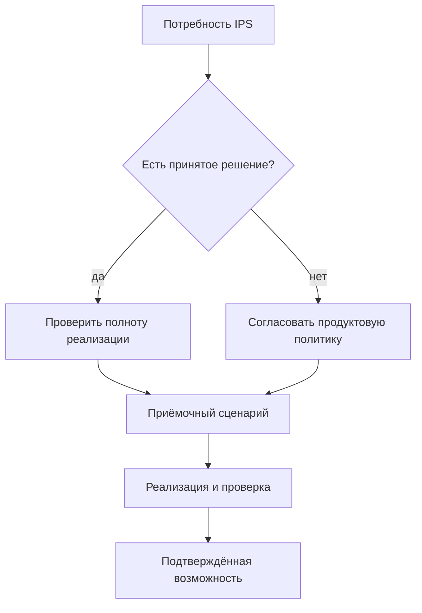

# Покрытие, открытые вопросы и состояние реализации

## Как пользоваться документом

Этот раздел отделяет подтверждённые потребности, принятые решения и ещё не закрытые вопросы. Он защищает продуктовую дискуссию от двух ошибок: считать целевую идею уже готовой функцией или, наоборот, повторно обсуждать уже принятое архитектурное решение.

Обозначения состояния:

- **принято** — продуктовый и архитектурный смысл зафиксирован;
- **частичная основа** — есть базовые понятия или контракты, но нет полного пользовательского сценария;
- **целевая возможность** — требуется последующая реализация;
- **нужно согласовать** — решение зависит от предприятия или ещё не принято.

## Матрица покрытия

| Область | Что требуется | Решение Interlink | Состояние решений на 06.09.2026 |
|---|---|---|---|
| Несколько изделий в заказе | Верхние изделия, ЗИП и отдельные комплекты | Версия заказа с несколькими позициями | Принято; предметный модуль впереди |
| Количество | На строке и по всему раскрытому пути | Локальное и накопленное количество без обязательного раннего создания экземпляров; плановые носители создаются отдельным действием | Целевая возможность |
| Комплектация | Опции отдельно для каждой позиции | Явные параметры и условия присутствия | Частичная основа |
| Точное изделие | Выделить повторяемое заказное исполнение | Только явная операция с новой самостоятельной идентичностью | Принято; реализация впереди |
| Живой заказ | Сохранять работу и учитывать развитие инженерных данных | Рабочие правки, отдельная публикация состояния; новая инженерная версия по предметному решению | Принято; пользовательский процесс впереди |
| Рабочий ПЗ | Сохранить ещё не снятую вариантность и предупреждения | Разрешённая подготовка отделена от строгого допуска выбранной области передачи | Обязательный путь IPS; реализация и приёмка впереди |
| Точная передача | Не менять ранее отданный состав | Отдельный полный неизменяемый снимок на каждую передачу | Принято; запись и публикация впереди |
| Версии | Жёсткая и мягкая конкретизация, контекст, готовность и применяемость | Общий объяснимый механизм; инженерная версия отличается от точного содержания | Принятый целевой договор; полное исполнение впереди |
| Аналоги и замены | Контролируемый выбор другой номенклатуры или полного комплекта | Версионный допуск источника, выбор альтернативы, подбор её содержания и итоговая совместимость | Принятый целевой договор; исполнение впереди |
| Независимые заказные варианты | Два заказа используют разные комплекты одной библиотеки | Переиспользуемое описание отделено от выбора и привязки к местам заказа | Принятое расширение; проверка поэтапно |
| Многомерная НСИ | Сортамент, нормы, клей, покрытия и результаты испытаний | Индексируемые справочники, полные сетки и карты подбора с точной редакцией | Принятый целевой договор; исполнение впереди |
| Совместимость комплекта | Проверить не только пары, но весь выбранный набор | Совместная оценка всех обязательных ограничений после выбора содержания | Принято; возможности каждого исполнителя проверяются отдельно |
| Маршруты | Зависимость от версии, позиции и предприятия | Производственное наложение на точный состав | Целевая возможность |
| Нормы | Материалы и труд с объяснимым расчётом | Версионные основания, расчёт на единицу, ветвь и заказ | Целевая возможность |
| Способ обеспечения | Изготовить, купить, кооперировать | Отдельное производственное решение | Нужно согласовать и реализовать |
| ПВ | Самостоятельный документ с версиями и подписью | Отдельный предметный модуль; порядок с ПЗ задаёт предприятие, связь со снимком — только при применимости | Принято как граница; реализация впереди |
| Отчёты и 1С | Материалы, труд и обмен | Воспроизводимое представление точного снимка | Целевая интеграция |
| Экземпляры и партии | Прослеживаемость физического результата | Отдельные сущности будущего производственного слоя | Принято как различие; реализация впереди |
| Как заказано / как изготовлено | Не смешивать нормативный и фактический состав | Снимок передачи плюс связанная фактическая родословная | Целевая возможность |
| Согласование и подпись | Утверждать точное содержание | Процесс принимающей PLM-системы | Нужно согласовать по установке |
| ERP/MES | Склад, задания, факты исполнения | Интеграция через точные передачи и связанные ответы | Целевая интеграция |

## Уже принятые продуктовые решения

1. Заказ — обычный версионируемый предметный объект, а не особый скрытый контейнер.
2. Состав заказа выражается позициями; отдельная строка становится самостоятельным объектом только при собственном жизненном цикле.
3. В ядре нет обязательных цен, сроков, оплаты, отгрузки и портфеля заказов.
4. Заказ остаётся живым, а точность каждой передачи обеспечивается отдельным снимком.
5. Снимок полон до конечных позиций объявленной области, неизменяем и не урезается правами пользователя; необходимый комплект файлов и нормативных оснований удерживается отдельно по назначению.
6. Публикация отклоняется целиком при отсутствии допустимого результата в обязательной ветви.
7. ПВ является самостоятельным версионным документом.
8. Точное изделие создаётся явно, а не автоматически при каждом заказе.
9. Количественная потребность, производственная позиция, экземпляр, партия и фактический состав различаются.
10. Полные MRP, ERP/MES, согласование и подпись не встраиваются в общее ядро.
11. Рабочая область, постоянный контекст подбора и пакет совместной публикации не являются одним контейнером.
12. Сохранение рабочей правки не публикует состояние; жёсткий выбор инженерной версии не равен фиксации её точного содержания.
13. Обязательное подтверждение операции, аудит и задание внешней отправки сохраняются согласованно с локальным результатом независимо от того, кто управляет фиксацией.
14. Неизвестный исход не освобождает количество и не разрешает создать повторный заказ наугад.
15. Разрешение замены не является её выполнением; фактический состав изменяется по принятым фактам установки, снятия или доработки.

## Главные открытые вопросы

### Смысл заказа на конкретном предприятии

- Совпадает ли изученная модель IPS с другими установками?
- Где хранятся заказчик, договор, цена, срок, этап поставки и состояние?
- Требуется ли отдельный портфель заказов и приоритетов?
- Как связаны коммерческий заказ, производственный заказ и ПВ?

### Версии и применимость

- Когда живой заказ следует за новой допустимой версией, а когда сохраняет прежний выбор?
- Связана ли дата поставки с датой применимости?
- Какие состояния зрелости допустимы для расчёта и для публикации?
- Какие ручные фиксации переживают выпуск новой версии?

### Комплектация

- Какие параметры распространяются по составу и где заканчивается их область действия?
- Как обрабатываются значения по умолчанию и явный отказ от опции?
- Кто создаёт переиспользуемую комплектацию?
- Как обнаруживать уже существующее точное изделие с теми же признаками?

### Производственное обеспечение

- Как именно IPS различает изготовление, закупку, кооперацию и исключение из планирования?
- Можно ли разделить количество одной позиции между маршрутами?
- Кто выбирает площадку и поставщика?
- Как рассчитываются наладка, отход, партия и округление нормы?

### Передачи и исправления

- Когда создаётся отдельный снимок: производство, 1С, архив, кооператор?
- Полная или добавочная передача используется при изменении количества?
- Как отменить уже принятую внешнюю передачу?
- Что требует новой версии заказа, а что только новой ПВ?

### Экземпляры и партии

- Где и когда присваивается серийный номер?
- Какие объекты учитываются поштучно?
- Может ли одна партия обслуживать несколько заказов?
- Кто владеет фактической родословной и сервисным состоянием?

### Права и регламент

- Какие роли и маршруты согласования используются в IPS?
- Какие изменения требуют повторной подписи?
- Как формируются ограниченные пакеты для кооператоров?
- Каковы требования к архиву и сроку хранения?

## Последовательность реализации и ранних проверок

1. До окончательной фиксации устройства фундамента проверить малые, но показательные истории: рабочий вариантный ПЗ, мягкую конкретизацию, замену полного комплекта, разные выборы двух заказов, табличное основание и точное содержание.
2. Довести общие средства записи, независимых контекстов, подбора и многоуровневого раскрытия. Проверить повторы после сбоев, конфликт параллельных правок и защиту количества.
3. Построить заказные типы, позиции, рабочее редактирование и область выдачи на этих общих средствах. Не создавать второй независимый механизм хранения или подбора специально для заказов.
4. Реализовать полную проверку конфигурации и замен, точную публикацию, удержание оснований и сравнение передач.
5. Довести обязательные прикладные сценарии IPS: НСИ, выбор материалов и покрытий, маршруты, нормы, ПВ, отчёты и плановые носители учёта. Они не ждут будущего универсального решателя сложных ограничений.
6. Подключить конкретные ERP/MES: договоры количества, повторов, частичного приёма, отмены и фактических ответов.
7. Развивать фактическую родословную, ремонт и расширения других отраслей. Крупные числовые массивы и оптимизация сложных вариантов получают отдельные проверки нагрузки и доказуемости.

Каждый этап должен завершаться сквозным примером, а не только проверкой отдельных технических операций.

## Минимальный набор приёмочных историй

### История А. Несколько комплектаций

Один заказ содержит северные и южные насосные станции, отдельный ЗИП и разные количества. Проверяются независимые опции, точные версии, документы и полный снимок.

### История Б. Замена после частичного запуска

Половина партии редукторов изготовлена, для остатка меняются подшипник и маршрут. Проверяются рабочая правка, новое опубликованное состояние заказа, явное распределение остатка, сравнение, второй снимок и неизменность первого. Новая инженерная версия создаётся только по предметному правилу.

### История В. Заказной станок и кооперация

Станок имеет сложную комплектацию, покупной аналог, собственные и кооперационные маршруты, ПВ, пакет поставщика и явное создание точного изделия.

### История Г. Фактическое отклонение экземпляра

В одном серийном изделии разрешена замена датчика. Проверяются область действия, разрешение, фактическая родословная и неизменность нормативного состава остальных единиц.

### История Д. Общая библиотека и разные заказы

Для двух заказов станков выбраны разные полные комплекты привода. Оба используют одну библиотеку, но свои конкретные места состава. Один комплект сохраняет контроллер, который второй предложенный шаг собирается снять. Проверяется независимость заказов и отказ несовместимому набору действий; половина комплекта не появляется даже после сбоя.

### История Е. Нормативный расчёт, который можно повторить

Для партии валов найдены материал и нормы по размеру, операции и площадке. После передачи справочник обновлён. Старый отчёт должен воспроизвести прежнюю норму и наладку, новый расчёт — показать отличие. Пропущенная точка таблицы испытаний не заменяется нулём, а отсутствие строки в неполной карте не выдаётся за запрет или разрешение.

## Условия признания заказного контура готовым

Контур можно считать продуктово готовым только когда:

- все обязательные истории выполняются через пользовательский процесс;
- результат каждой передачи воспроизводим;
- ошибки и решения объясняются предметным языком;
- старые снимки сохраняются после изменения данных;
- роли и права не создают неполных публикаций;
- при наличии явного договора сверки и защиты от повторов внешняя система не создаёт второй заказ из той же передачи;
- фактические данные связаны с нормативным основанием;
- продуктовые специалисты IPS подтвердили эквивалентность критичных сценариев.

## Текущее ограничение

На 6 сентября 2026 года документы описывают целевой контур и основание для реализации. Принятые понятия и планы стали подробнее, но многоуровневый заказ, конфигуратор, ПВ, производственный слой, внешние передачи и пользовательская приёмка всего заказного пути ещё не являются готовыми функциями. Принятый договор не равен испытанной реализации; название сущности в модели не доказывает готовность рабочего места.

## Связанные документы

- [Матрица функционального покрытия](../knowledge/02-current-state-and-roadmap.md)
- [Открытые вопросы и риски](../open-questions/README.md)
- [Сквозные сценарии](13-end-to-end-scenarios.md)

## Основания и проверка источников

Основания: [IPS-A05], [IPS-A13], [IPS-A23], [IPS-M03], [IL-ORDERS], [IL-KERNEL], [IL-SC], [IL-TD], [IL-PLAN-V2]. Расшифровка и статус материалов — в [реестре источников](../knowledge/15-source-register.md).

Описание IPS относится к подтверждённым материалам и явно указанным профилям установки. Целевое поведение Interlink сверено с принятыми договорами на 6 сентября 2026 года; наличие этого описания не означает приёмки реализации.
