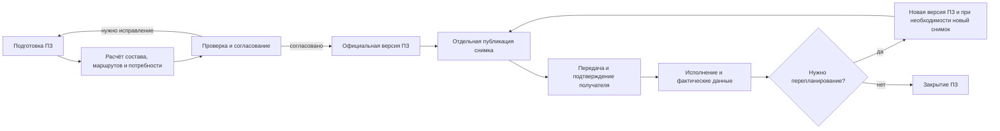
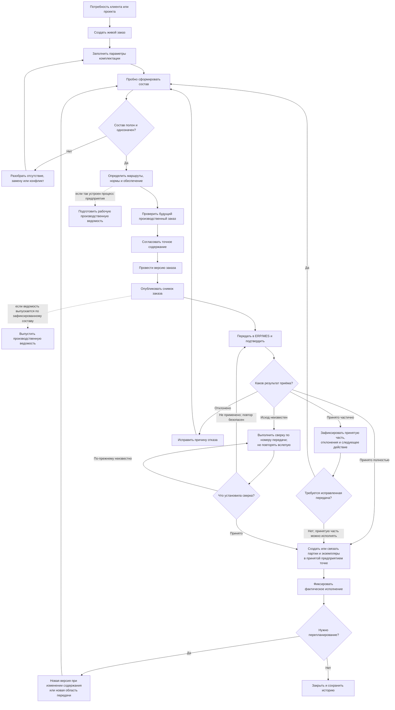
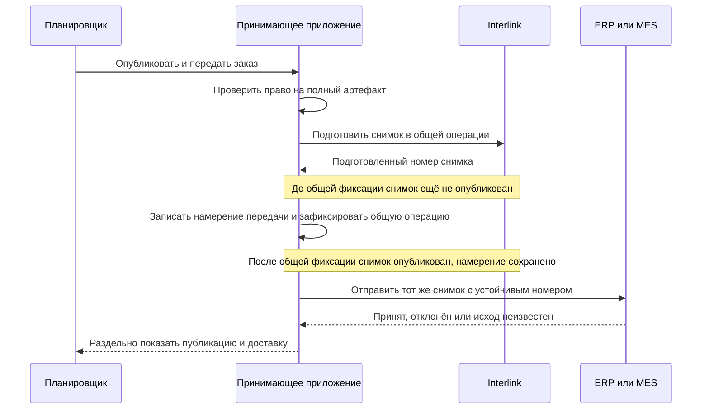

# Как пользователи ведут заказ от потребности до производства

## Зачем нужен единый сквозной путь

В заказном контуре легко смешать несколько близких понятий: заказ клиента, комплектацию изделия, производственную ведомость, производственный заказ, точный состав передачи, партию и фактически изготовленный экземпляр. Тогда непонятно, что можно перепланировать, что уже нельзя менять и какой документ читает производство.

Interlink разделяет эти артефакты и связывает их происхождением. Пользователь работает в принимающем приложении предприятия. Именно это приложение владеет карточкой заказа, рабочими местами, заданиями, правами, согласованием, деловыми статусами и обменом с системой планирования ресурсов предприятия (ERP) и системой управления производством (MES). Interlink даёт ему надёжный предметный фундамент: версии, позиции состава, проверяемые решения и снимки точного результата.

Это разделение важно для понимания будущей работы. Пользователь не будет переходить в отдельную «техническую программу Interlink», чтобы согласовать заказ или отправить его в цех. Он останется в привычном рабочем месте, а принимающее приложение будет явно вызывать операции Interlink и показывать их результат предметными словами.

## Ключевые артефакты

### Коммерческая или проектная потребность

Содержит требования заказчика, сроки, количество и ограничения. Она может находиться в системе работы с клиентами (CRM), системе планирования ресурсов предприятия (ERP) или проектном контуре и не обязана полностью храниться в Interlink.

### Живой заказ

Версионируемый предметный объект, в котором развивается инженерно-производственное решение: позиции, количества, параметры комплектации, выбранные способы обеспечения и состояние подготовки.

Живой заказ можно изменить только через новый пакет и новую официальную версию.

### Производственная ведомость

Самостоятельный версионируемый документ подготовки производства. Она имеет карточку, состав, рабочую и основную версии, согласование и формируемые представления. Ведомость не является синонимом заказа.

По имеющимся материалам IPS нельзя пока закрепить для всех предприятий одно обязательное место производственной ведомости относительно снимка передачи. На одной установке рабочая ведомость может помогать проверить потребность до официальной передачи; на другой утверждённая ведомость может формироваться по уже зафиксированному составу; возможен и смешанный путь с рабочей ведомостью до фиксации и официальной редакцией после неё. Interlink должен поддержать подтверждённый предприятием процесс, не скрывая самостоятельную идентичность и версии ведомости.

### Производственный заказ

Производственный заказ, далее ПЗ, — задание на изготовление определённого количества изделий. Он создаётся принимающим приложением тогда, когда коммерческая или проектная потребность должна превратиться в управляемое задание производству. ПЗ связан с комплектацией, маршрутами и передачами, версионируется по мере перепланирования и остаётся живым объектом до закрытия.

В основном сценарии этого документа именно ПЗ является «живым заказом». Если предприятие отдельно ведёт заказ клиента, договор или портфель спроса, они находятся выше по процессу и могут породить один или несколько ПЗ; Interlink не требует искусственно объединять их в один объект.

Владелец жизненного цикла ПЗ — принимающее приложение предприятия, а не ядро Interlink. Оно определяет номера, ответственных, сроки, маршрут согласования и названия состояний. Interlink хранит версионируемое предметное содержание и обеспечивает точную фиксацию состава для передачи.

### Снимок заказа

Неизменяемый полный граф точных версий для конкретной официальной передачи. Производство получает его без повторного живого подбора.

Одна официальная версия ПЗ может иметь несколько снимков: например, отдельный снимок для MES и отдельный для архива либо новую самостоятельную передачу тому же получателю по новому деловому основанию. Новый снимок не всегда требует новой версии ПЗ. Новая версия нужна тогда, когда меняется само предметное содержание заказа: количество, комплектация, маршрут, допустимая замена или другая существенная часть решения. Технический повтор одной и той же не подтверждённой отправки, напротив, использует прежний снимок и прежний устойчивый номер.

Снимок также не означает копию всех файлов, документов и реквизитов в одном хранилище. Он однозначно фиксирует выбранные версии и происхождение результата. Если предприятию нужен автономный юридически значимый комплект с файлами, подписями, печатными формами и сроком хранения, его формирует и хранит принимающее приложение или корпоративный архив.

### Партия и экземпляр

Партия группирует фактическое исполнение. Экземпляр имеет собственную идентичность, серийный номер, фактически установленные компоненты и историю. Это уже контур «как изготовлено», а не только плановый состав заказа.

## Кто участвует

| Роль | Основное решение |
|---|---|
| Менеджер заказа или проекта | Требования, количество, срок и согласованная комплектация |
| Специалист по конфигурации | Допустимые опции и конкретное изделие |
| Планировщик производства | Потребность, обеспеченность, очереди передачи и производственный план |
| Система расчёта потребности в материалах (MRP) | Расчёт валовой и чистой потребности по точным исходным данным |
| Технолог | Маршрут, нормы, материалы, оснастка и допустимость изготовления |
| Специалист по снабжению | Поставщики, сроки, аналоги и способ обеспечения |
| Производственный диспетчер | Партии, экземпляры, запуск и фактическое исполнение |
| Контроль качества | Контрольные операции, отклонения и допуск результата |
| Производство | Исполнение точного переданного задания |
| ERP/MES | Финансово-ресурсный и оперативный контур, подтверждение передачи |
| Принимающее приложение | Карточки и рабочие места, права, задания, согласование, деловые статусы, очередь надёжной отправки и защита от повторной передачи |
| Interlink | Версии предметных данных, полный точный состав, проверки и снимки результата |

Названия ролей различаются между предприятиями. Важно не поглощать диспетчера планировщиком, не смешивать плановый заказ с фактическим экземпляром и не приписывать Interlink функции ERP/MES или корпоративного процесса согласования.

## Жизненный цикл производственного заказа

Ниже показан целевой предметный путь ПЗ. Это не перечень внутренних состояний Interlink: конкретные названия, переходы и полномочия задаёт принимающее приложение предприятия.

До официального выпуска планировщик и технолог могут повторять расчёт. После выпуска содержание этой версии ПЗ не редактируется задним числом. Если меняется предметное решение, создаётся следующая версия. Если требуется лишь ещё раз передать тот же официальный результат другому получателю, достаточно нового снимка и новой записи передачи без искусственного изменения ПЗ.

## Полный пользовательский путь

Сплошные стрелки показывают основной жизненный цикл ПЗ. Пунктирные ветви показывают два возможных места ПВ, а не две обязательные ведомости. На конкретном предприятии должен быть выбран и описан один подтверждённый порядок либо осознанно закреплена рабочая и официальная редакции ПВ.

## Шаг 1. Создание живого заказа

Пользователь начинает из подтверждённой потребности. Прикладное рабочее место переносит номер, клиента, проект, количество, сроки и ссылки на требования. Для каждой позиции заказа указывается предмет: изделие, комплект, услуга или другая разрешённая категория.

Если инженерная часть заказа хранится в Interlink, принимающее приложение создаёт её версионируемый объект через пакет изменения. Пока первая версия не проведена, объект остаётся предварительным и не выглядит официальным обязательством производства. Сам ПЗ и его обязательство перед производством создаёт и ведёт принимающее приложение по правилам предприятия.

## Шаг 2. Комплектация

Менеджер выбирает понятные параметры: климат, напряжение, исполнение, производительность, дополнительные модули, нормативную базу, площадку и ограничения заказчика.

Система:

- подставляет разрешённые значения по умолчанию;
- показывает обязательные параметры;
- обнаруживает несовместимые сочетания;
- сохраняет происхождение требований;
- не разрешает скрытые персональные настройки состава.

### Пример

Для насосной станции выбираются расход 120 м³/ч, напор 60 м, северное исполнение, 400 В и резервный насос. Конфигуратор включает подогрев шкафа и утепление, а обычный шкаф исключает.

## Шаг 3. Пробное формирование состава

Живой расчёт проходит позиции, варианты, аналоги, применяемость и версии. Он показывает:

- включённые и исключённые позиции;
- выбранные объекты и замены;
- точные версии;
- причины выбора;
- отсутствие допустимой версии;
- предупреждения о резервном результате;
- изменения относительно предыдущего расчёта.

Это ещё не официальная передача. Пользователь может исправлять параметры и повторять расчёт.

## Шаг 4. Разбор проблем

### Нет допустимой версии

Владелец позиции получает задачу: выпустить нужную версию, изменить срок или серию, предложить аналог либо оформить осознанное исключение.

### Несовместимые опции

Менеджер видит конкретные параметры и правило. Он меняет комплектацию или передаёт запрос владельцу продукта.

### Резервный выбор

Система показывает, почему штатное правило не дало результата, какая версия предложена и какие риски существуют. Для производственной публикации исключение согласует уполномоченная роль.

### Неоднозначный аналог

Снабжение и инженер выбирают из квалифицированных вариантов для конкретного заказа. Решение не обязано становиться глобальным правилом предприятия.

## Шаг 5. Маршрут, нормы и обеспечение

Технолог определяет, как изготовить каждую производимую позицию: маршрут, операции, материалы, оборудование, оснастку, контроль и нормы. Планировщик и снабжение решают, что производить, покупать или получать по кооперации.

В заказе сохраняются точные ссылки на используемые версии процессов и нормативов либо правила их выбора. Изменение технологии после первой передачи не должно бесшумно переписать прежний снимок.

## Шаг 6. Производственная ведомость как отдельный документ

На основании рассчитанной потребности формируется производственная ведомость. Она имеет собственный номер, версии и согласование. Пользователь может сравнить рабочую ведомость с основной, сформировать отчёт и связать её с заказом.

Ведомость отвечает на вопросы подготовки и потребности; производственный заказ — на вопрос исполнения конкретного задания. Поэтому ПВ не следует считать обязательным промежуточным состоянием самого ПЗ.

Возможны три подтверждаемые практикой схемы:

1. рабочая ПВ готовится до выпуска ПЗ и помогает проверить материалы, трудоёмкость и документы;
2. официальная ПВ формируется после публикации снимка и ссылается на уже зафиксированный точный состав;
3. рабочая редакция появляется до передачи, а после фиксации выпускается официальная редакция того же самостоятельного документа.

Какая схема соответствует IPS и нужна пользователям, предприятие должно подтвердить отдельно. До такого подтверждения Interlink не закрепляет искусственный универсальный порядок «сначала ПВ, потом снимок» или «сначала снимок, потом ПВ».

## Шаг 7. Предпросмотр производственного заказа

Перед согласованием рабочее место собирает будущее состояние:

- позиции и количества;
- точный многоуровневый состав;
- версии документов и процессов;
- маршруты и нормы;
- решения по обеспечению;
- влияние на сроки и ресурсы;
- предупреждения и исключения;
- разницу с прежней передачей, если это перепланирование.

Проверка проходит до листьев. Нельзя опубликовать «почти полный» заказ с потерянной глубокой позицией.

## Шаг 8. Согласование точного содержания

Принимающий продукт показывает один и тот же будущий результат инженерам, планированию, снабжению, производству и качеству. Решения относятся к точному отпечатку.

Если после согласования меняется количество крепежа или версия маршрута, прежнее разрешение больше не подходит. Политика определяет, какие роли должны принять решение повторно.

Задания согласующим, электронные подписи, сроки, замещения и право принять исключение создаёт и проверяет принимающее приложение. Interlink не подменяет маршрут предприятия: он позволяет связать решение с тем точным будущим содержанием, которое видел согласующий.

## Шаг 9. Проведение живого заказа

После завершения принятого маршрута принимающее приложение запрашивает проведение предметного пакета. Interlink повторно проверяет содержание и атомарно фиксирует новую официальную версию заказа целиком. Рабочие данные не становятся видимыми по частям: либо появляется вся согласованная версия, либо официальное состояние остаётся прежним.

Проведение заказа ещё не означает передачу в производство. Оно создаёт официальную версию, из которой можно опубликовать снимок.

## Шаг 10. Публикация снимка заказа

Сначала принимающее приложение проверяет, что пользователь или доверенная служба имеют право сформировать **весь** требуемый артефакт. Только после этого Interlink проходит полный состав, выбирает точные версии и сохраняет граф с причинами. Interlink никогда не вырезает недоступные ветви по правам пользователя. Если права на полный результат отсутствуют, вся операция отклоняется; «снимок только из того, что разрешено увидеть» не создаётся.

При последующем чтении действует та же предметная честность: принимающее приложение либо разрешает получить весь снимок официальной передачи, либо отказывает. Ограниченная выгрузка для внешнего получателя может существовать как отдельный производный комплект, но она не должна называться полным снимком заказа.

Обязательный пропуск, цикл или неоднозначность также останавливают публикацию целиком. Снимок получает устойчивый номер передачи, корневую официальную версию ПЗ, явные условия, автора и происхождение. При исправлении создаётся следующий снимок; старый не редактируется.

### Как снимок обращается с количеством

Снимок фиксирует количество своего корня передачи, но сам не делит строку заказа. Нельзя взять строку ПЗ «10 насосных станций» и без дополнительного предметного решения опубликовать «снимок на 5». Для частичной поставки принимающее приложение должно создать отдельный корень передачи, явно распределить количество по очередям либо выпустить новую версию ПЗ с изменённым распределением. Только после этого Interlink фиксирует полный состав выбранной очереди.

### Когда нужен новый снимок, а когда новая версия ПЗ

- Если изменилось содержание ПЗ — количество, комплектация, маршрут, замена или область исполнения, — нужна новая официальная версия ПЗ и затем новый снимок.
- Если содержание ПЗ не изменилось, но тот же результат передают другому получателю, повторяют отправку по новому основанию или формируют отдельное архивное свидетельство, одна версия ПЗ может иметь несколько снимков.

### Не каждый снимок является юридическим доказательством

Базовый снимок или снимок официальной передачи должен быть долговечным и неизменяемым. Но техническое представление для поиска, ускорения просмотра или временной выгрузки может быть заменяемым и удаляемым. Принимающее приложение обязано явно показать класс артефакта и не выдавать временное представление за нормативное свидетельство.

Даже долговечный снимок фиксирует ссылки на точные версии и существенное происхождение, а не обязательно копирует все файлы, реквизиты и подписи. Автономный юридически значимый комплект формируется по правилам принимающего приложения или архива.

## Шаг 11. Передача в ERP и MES

Если Interlink участвует в общей операции принимающего приложения, возвращённый до её окончательной фиксации номер означает только «снимок подготовлен». Статус «опубликован» появляется после успешной общей фиксации. При откате не должно остаться ни опубликованного снимка, ни ложного намерения отправки.

После публикации принимающее приложение надёжно хранит намерение передачи, повторяет отправку при временном сбое и не допускает дубля по устойчивому номеру. Если общей операции нет, допустима двухшаговая схема: сначала атомарно публикуется снимок, затем принимающее приложение записывает доставку в свою надёжную очередь и умеет восстановить её по опубликованным, но ещё не отправленным снимкам.

Если связь оборвалась, принимающее приложение не создаёт новый ПЗ и не повторяет внешнюю операцию вслепую. Оно сверяет результат по устойчивому номеру. Пользователь видит одно из состояний: ожидает отправки, отправляется, принят, отклонён, исход неизвестен, требуется сверка.

Interlink не владеет внешним номером ПЗ, правилами MRP, запасами, заданиями MES или подтверждением цеха. Формат обмена, очередь отправки, защита от дублей, сверка неизвестного исхода и отмена уже принятого внешнего задания принадлежат принимающему приложению и договору с ERP/MES.

## Шаг 12. Партии и экземпляры

Производственный диспетчер создаёт партии и номерные экземпляры из официальной передачи. Плановый снимок остаётся основанием, а фактический контур фиксирует:

- что действительно установлено;
- какие серийные номера компонентов использованы;
- какие допустимые отклонения оформлены;
- какие операции выполнены;
- результаты контроля;
- происхождение материалов и партий.

Фактический состав не должен переписывать плановый снимок. Разница становится отдельным прослеживаемым фактом.

## Шаг 13. Перепланирование

Поводом может быть срыв поставки, изменение требования, производственный дефект или новая допустимая замена.

Если меняется предметное содержание, пользователь создаёт пакет изменения живого заказа от последней официальной версии. Будущий расчёт сравнивается с действующей передачей. После согласования появляется новая версия ПЗ, а для её передачи — новый снимок.

Если содержание не меняется и требуется лишь новая передача той же официальной версии, пакет изменения ПЗ не создаётся. Принимающее приложение формирует новый корень передачи и публикует ещё один снимок этой же версии.

Производство получает явное указание перейти на новую передачу. Уже выполненные операции и фактические экземпляры учитываются отдельно; система не предполагает, что весь заказ можно заменить без остатка.

## Состояния, которые видит пользователь

### Живой заказ

Черновой, готовится, рассчитывается, проверяется, согласован процессом, официально проведён, исполняется, перепланируется, закрыт или отменён — конкретные процессные названия и переходы задаёт принимающее приложение.

### Предметный пакет Interlink

Открыт, проводится, проведён или отменён. Эти состояния не смешиваются с заданиями согласования.

### Снимок заказа

Подготавливается, подготовлен внутри общей операции или опубликован. Если проверка либо фиксация отклонена, снимок вообще не появляется: состояние «отклонена» относится к попытке публикации, а не к существующему артефакту. Подготовленный номер ещё нельзя показывать как официальную публикацию. Опубликованный долговечный снимок неизменяем; заменяемое техническое представление должно иметь другое, явно показанное назначение.

### Внешняя передача

Ожидает, отправляется, принята полностью, принята частично, отклонена, исход неизвестен или сверена. Это состояние интеграции, а не заказа Interlink. При частичном приёме пользователь видит уже принятые и отклонённые части, причину и только предусмотренное договором следующее действие: дослать ту же операцию, сформировать исправляющую передачу, отменить внешнее задание либо передать случай на сверку.

### Исполнение

Планируется, запущено, приостановлено, завершено либо закрыто с отклонением — принадлежит производственному контуру.

Один общий статус «готово» не способен честно описать все пять слоёв.

## Что относится к принимающему приложению, а что — к Interlink

| Функция | Владелец |
|---|---|
| Карточки ПЗ и ПВ, пользовательские рабочие места | Принимающее приложение |
| Деловые состояния, задания, сроки и маршруты согласования | Принимающее приложение |
| Права на запуск операции и чтение результата | Принимающее приложение совместно с корпоративной системой доступа |
| Атомарная фиксация версий и полного предметного состава | Interlink |
| Проверка однозначности и происхождение выбора | Interlink |
| Публикация долговечного снимка точного результата | Interlink по явной команде принимающего приложения |
| Полнота юридического комплекта, подписи и долговременное хранение файлов | Принимающее приложение или корпоративный архив |
| Очередь внешней отправки, повтор, защита от дублей и сверка | Принимающее приложение |
| Запасы, MRP, производственные задания и фактическое исполнение | ERP/MES и другие производственные системы |

Такое распределение не уменьшает ценность Interlink. Оно позволяет одному предметному ядру обслуживать разные процессы предприятий, не навязывая всем одинаковое рабочее место или маршрут.

## Целевые рабочие места

Все перечисленные ниже рабочие места создаёт принимающее приложение поверх предметных возможностей Interlink.

### Карточка заказа

Требования, позиции, количество, текущая официальная версия, ответственные, связанные ведомости, передачи и фактическое исполнение.

### Комплектация

Параметры, ограничения, выборы по умолчанию, несовместимости и сравнение вариантов.

### Состав и проблемы

Многоуровневое дерево, причины выбора версий, отсутствие результата, аналоги, резерв и действия владельцев.

### Подготовка производства

Маршруты, нормы, обеспечение, ведомости и влияние на сроки.

### Публикации

Список снимков с различиями, решениями, статусом доставки и используемой внешней системой.

### Исполнение

Партии, экземпляры, фактический состав, отклонения и контроль.

## Пример 1. Серийный заказ на редукторы

ПЗ содержит 50 редукторов РЦ-250 серии 145–194. Применяемость выбирает усиленный подшипниковый узел. Предприятие решает запускать изделия двумя очередями: сначала 10, затем 40.

Снимок не может самовольно превратить количество 50 в 10. Поэтому принимающее приложение создаёт отдельный корень первой передачи и явно относит к нему 10 изделий, оставляя 40 в нераспределённом остатке. Снимок первой передачи фиксирует именно этот корень и полный состав десяти редукторов. Производственная ведомость может быть подготовлена до него для проверки потребности либо выпущена по нему — порядок задаёт предприятие.

Через неделю меняется поставщик крепежа для оставшихся сорока изделий. Поскольку меняется предметное содержание остатка, планировщик оформляет новую версию ПЗ или отдельного задания второй очереди и новый снимок. Первый снимок и фактический состав уже изготовленных десяти редукторов сохраняют прежний крепёж.

## Пример 2. Заказной обрабатывающий центр

Заказ содержит механическую, электрическую и программную комплектации. Пробный расчёт выявляет конфликт напряжения привода и выбранной площадки. После исправления совместный пакет дисциплин выпускает совместимые версии. Снимок заказа фиксирует не только верхний станок, но весь точный граф до закупаемых компонентов.

Принимающее приложение формирует для заказчика автономный договорный комплект: утверждённые файлы, подписи и сопроводительную ведомость. Этот комплект ссылается на снимок, но не подменяется им. MES принимает отдельную производственную передачу, создаёт партию и серийный экземпляр. Позднее замена датчика оформляется как отклонение экземпляра и, если решение должно стать типовым, отдельное инженерное изменение модели изделия.

## Пример 3. Сервисный заказ

Для ремонта пресса сначала открывается исторический снимок изготовленного изделия. Затем живой ремонтный расчёт предлагает современный гидрораспределитель и комплект перехода. После согласования публикуется отдельный снимок ремонтного заказа. Он не переписывает исходный состав пресса; фактическая установка обновляет историю конкретного экземпляра.

## Типовые ошибки

| Ошибка | Что видит пользователь | Действие |
|---|---|---|
| Неполная комплектация | Конкретные обязательные параметры | Заполнить или получить решение владельца продукта |
| Нет версии в глубине состава | Путь позиции и проверенные правила | Выпустить версию, изменить контекст или согласовать резерв |
| Снимок не опубликован | Причина и отсутствие частичного артефакта | Исправить заказ и повторить |
| Подготовленный номер показан как публикация | Общая операция ещё не зафиксирована | Дождаться фиксации; при откате не отправлять номер вовне |
| Из строки на 10 изделий пытаются передать 5 без распределения | Нет самостоятельного корня и основания количества | Создать очередь поставки, распределение количества или новую версию ПЗ |
| ERP/MES не ответила | Публикация отделена от неизвестного исхода доставки | Выполнить сверку по устойчивому номеру |
| Производство уже начало работу | Разница между передачами и фактически выполненные операции | Согласовать переход или оформить отклонение |
| Живой расчёт устарел | Какие входы изменились после последней проверки | Пересчитать и повторить нужные решения |

## Что меняется относительно IPS

Interlink сохраняет функциональную потребность IPS в комплектациях, производственных ведомостях, заказах, точном составе, партиях и экземплярах. При этом:

- живой заказ явно отделён от неизменяемого снимка передачи;
- производственная ведомость и заказ не объединяются;
- место ПВ до или после снимка задаётся подтверждённым процессом предприятия, а не универсальной схемой Interlink;
- подбор состава объясним и использует единый порядок;
- изменение содержания создаёт новую официальную версию, а новая передача — новый снимок; одна версия ПЗ может иметь несколько снимков;
- плановое и фактическое состояния не переписывают друг друга;
- предметная публикация и внешняя доставка имеют разные состояния;
- интерфейс, задания, права, маршрут согласования и интеграция принадлежат принимающему приложению, но используют общие предметные данные Interlink.

Точные границы ПВ, ПЗ, партий и экземпляров ещё необходимо подтвердить на нескольких установках IPS.

## Состояние реализации

Заказный контур является целевой продуктовой моделью. Базовая предметная модель Interlink развивается сейчас; полный подбор, применяемость, живой заказ, долговечные базовые снимки и снимки заказа, фактические экземпляры, интеграция с системами расчёта потребности и управления производством, а также пользовательские рабочие места находятся на последующих этапах. Документ нужен для согласования требований и будущей приёмки, а не описывает готовую систему.

Связанные документы: [границы заказного контура](01-order-domain-and-boundaries.md), [жизненный цикл заказа](04-live-order-lifecycle.md), [точная публикация](05-exact-publication.md), [формирование заказа](06-production-order-resolution.md), [экземпляры и партии](09-units-lots-and-as-built.md), [интеграция](11-integration-and-mrp.md).

Основания: [IL-VERS-SPEC §5–§6], [IL-PLM], [IL-HOST], [IPS-A13], [IPS-K09], [IPS-K11]. Расшифровка — в [реестре источников](../knowledge/15-source-register.md).
