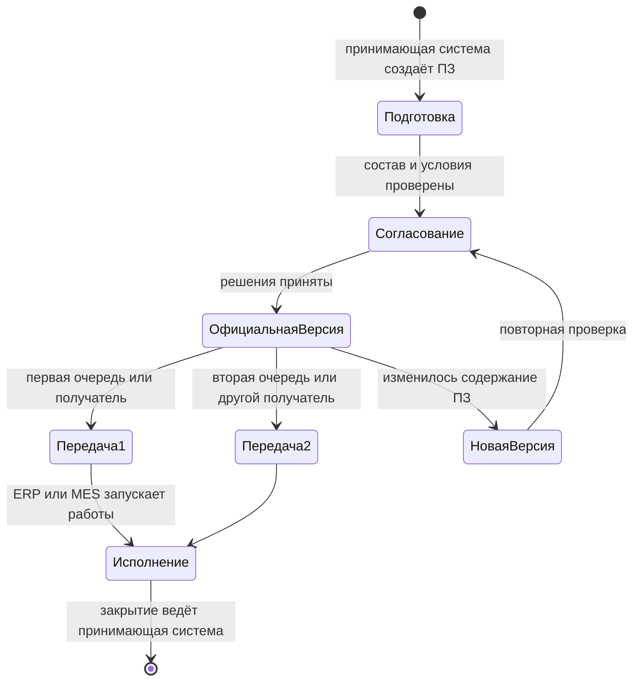
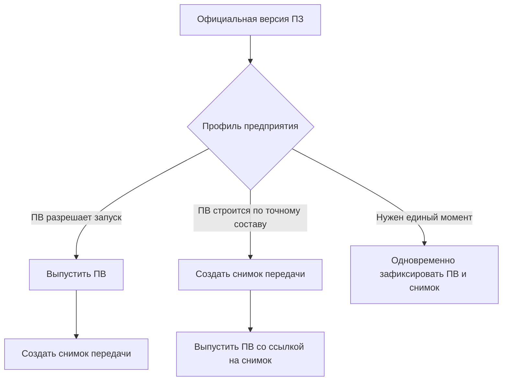

# Заказы в IPS и Interlink

## Назначение пакета

Этот комплект предназначен для продуктовых специалистов IPS, специалистов по конфигурации изделий, планировщиков производства, технологов и руководителей внедрения PLM. Он объясняет весь заказной контур — от потребности заказчика до точной передачи состава в производство и последующей связи с партиями, экземплярами, ERP-системой учёта и планирования ресурсов и MES-системой управления производственным исполнением.

Главный вопрос пакета:

> Как сохранить сильные возможности заказов IPS, но разделить живое планирование, точный переданный состав, производственные документы и фактическое исполнение так, чтобы каждое состояние было воспроизводимо и объяснимо?

Документы не утверждают, что весь описанный контур уже реализован в Interlink. Большая его часть относится к целевым возможностям после основного опытного подтверждения архитектуры. Поэтому в каждом документе отдельно указаны принятые решения, открытые вопросы и состояние реализации.

## Короткий ответ

В целевой модели Interlink **заказ остаётся живым версионируемым предметным объектом предприятия**. Он содержит позиции: что требуется изготовить или поставить, в каком количестве и в какой комплектации. Пока заказ планируется, он может читать актуальную конструкторскую и технологическую документацию, получать новые версии и контролируемые замены.

При этом необходимо различать потребность клиента и производственный заказ. Потребность клиента может появиться и оставаться в CRM или ERP. Производственный заказ (далее — ПЗ) создаёт принимающая PLM-система тогда, когда предприятие решило начать подготовку или исполнение конкретного объёма работ. Она же назначает номер и ответственных, ведёт состояния, задания, права и согласование ПЗ. Interlink предоставляет для такого объекта версии, состав, подбор точных версий и неизменяемые основания передачи, но не навязывает предприятию единый производственный процесс.

Когда конкретный результат передаётся в производство, 1С, архив или другую систему, создаётся отдельный **неизменяемый снимок точного состава передачи**. Одна версия ПЗ может стать основанием нескольких снимков: например, для двух очередей выпуска или для производства и архива. Новая версия ПЗ нужна не из-за самого факта повторной передачи, а тогда, когда изменилось официальное содержание заказа: количество, комплектация, состав, маршрут или другое управляемое решение.

Такой подход сохраняет важное поведение IPS: заказ можно развивать, но ранее переданный производственный результат остаётся неподвижным и доступным для разбора истории. Важная деталь схемы — снимок сам не «отрезает» часть количества из строки заказа. Если из десяти насосных станций передаются первые пять, принимающая система сначала создаёт отдельный предметный объект передачи первой очереди и явно распределяет на него пять единиц. Другая допустимая модель — выпустить новую версию ПЗ, в которой первая очередь и оставшийся объём уже разделены как самостоятельные управляемые части. Только явно определённый корень на пять единиц становится основанием снимка. Простая подмена количества с десяти на пять во время публикации не позволяет доказать, что было передано и что осталось.

## Какие понятия нельзя смешивать

| Понятие | Что это | Чем не является |
|---|---|---|
| Комплектация | Переиспользуемый набор частично заданных параметров изделия | Не точный заказ и не физический экземпляр |
| Заказ | Живой предметный объект с позициями, количествами и выбранными условиями | Не неизменяемый снимок и не полный процесс ERP |
| Производственный заказ (ПЗ) | Версионируемое задание принимающей системы на подготовку и изготовление определённого количества | Не строка коммерческого заказа и не снимок одной передачи |
| Точный состав передачи | Однозначный состав, переданный в определённый момент | Не текущий живой вид заказа |
| Точное изделие | Самостоятельное изделие, созданное из конфигурируемого прототипа и получившее собственную историю | Не обязательный побочный результат каждого заказа |
| Производственная ведомость | Самостоятельный версионный производственный документ с карточкой, составом, проверкой и подписью | Не синоним заказа и не просто печатная форма |
| Экземпляр | Конкретная индивидуально учитываемая физическая единица | Не версия проекта и не количество строки заказа |
| Партия | Совместно учитываемая группа изделий или материалов | Не одна версия объекта и не снимок состава |
| Как заказано | Точный результат, который был передан производству | Не доказательство того, что именно было изготовлено |
| Как изготовлено | Фактический состав экземпляра или партии | Не переписанный проектный или заказной состав |

## Как появляется и живёт производственный заказ

Единственный обязательный для всех предприятий момент создания ПЗ пока не подтверждён. В одной организации ПЗ появляется сразу после принятия коммерческого заказа, чтобы начать конструкторскую проработку. В другой — только после утверждения комплектации. В третьей — после подготовки производственной ведомости. Interlink не должен тайно выбирать один из этих вариантов. При внедрении принимающая система закрепляет событие создания ПЗ и связь с внешней потребностью.

После создания ПЗ принимающая система показывает его в рабочем месте планировщика, назначает ответственных и ведёт предметные состояния, например «подготовка», «на согласовании», «разрешён к запуску», «в производстве», «закрыт» или «отменён». Конкретные названия, переходы и задания остаются политикой предприятия. При значимом изменении создаётся следующая версия ПЗ; прежняя версия и связанные с ней передачи не переписываются.

Одна официальная версия ПЗ может иметь несколько снимков. Например, версия 03 заказа на двадцать редукторов может без изменения состава стать основанием снимка первой очереди на восемь изделий, снимка второй очереди на двенадцать изделий и отдельной архивной передачи. Для этого каждая очередь должна иметь собственный объект передачи и проверяемое распределение количества. Если же между очередями заменён подшипник или изменён маршрут обработки корпуса, сначала выпускается новая версия ПЗ, а уже затем создаётся следующий снимок.

Схема показывает два разных основания для продолжения работы. Повторная передача неизменившегося решения не требует искусственной новой версии ПЗ. Изменение самого производственного решения, напротив, требует новой версии и повторной проверки затронутых областей.

## Где находится производственная ведомость

Производственная ведомость (ПВ) — отдельный версионируемый документ, а не обязательный внутренний раздел снимка. Источники IPS не подтверждают единственный универсальный порядок ПВ относительно снимка передачи. Поэтому целевая модель допускает три профиля предприятия:

| Профиль | Как идёт работа | Когда подходит |
|---|---|---|
| ПВ до снимка | Сначала выпускают и подписывают ПВ, затем её точная версия входит в основание производственной передачи | ПВ является разрешающим документом запуска |
| ПВ после снимка | Сначала фиксируют точный состав передачи, затем на его основании формируют и согласуют ПВ | ПВ должна воспроизводимо отражать уже зафиксированный состав |
| Совместная фиксация | Принимающая система проверяет и официально фиксирует ПВ и снимок как единый согласованный результат | Предприятие требует одного момента выпуска всего пакета |

Какой профиль соответствует конкретной установке IPS и будущему процессу Interlink, остаётся открытым вопросом внедрения. Во всех вариантах подпись должна относиться к точной версии ПВ и к однозначно определённому составу, а не к «текущему заказу вообще».

При совместной фиксации подготовленный снимок ещё не является опубликованным. Принимающая система сначала проверяет точное содержание ПВ, снимка и согласований. Только успешное завершение всей операции делает оба результата официальными; при отказе ни один из них не должен остаться опубликованным отдельно.

## Что именно доказывает снимок

Не всякий объект с названием «снимок» имеет одинаковую доказательную силу.

| Вид результата | Правило хранения | Доказательная роль |
|---|---|---|
| Базовый снимок состава или снимок заказа | Неизменяем, долговечен, имеет назначение, источник и историю публикации | Может быть официальным основанием повторного чтения и разбора решения |
| Заменяемое производное представление | Может быть заново построено, заменено или удалено по правилам хранения | Удобно для просмотра или обмена, но само по себе не является юридическим доказательством |

Даже долговечный снимок заказа фиксирует полный точный граф **в пределах объявленной области передачи**: позиции, версии, количества и существенные основания выбора. Он не обязан копировать в себя все свойства объектов, тела всех файлов, электронные подписи и каждый сопроводительный документ предприятия. Если нужен автономный юридически значимый пакет, принимающая система должна собрать обязательные документы и файлы, проверить права и полноту, подписать пакет и поместить его в надлежащее долговременное хранилище. Ограниченный пакет для кооператора является отдельным разрешённым представлением и не должен выдаваться за полный внутренний снимок.

## Граница ответственности систем

| Участник | За что отвечает |
|---|---|
| Interlink | Версии предметных объектов, точный состав, явный подбор версий, происхождение решения и неизменяемое основание передачи |
| Принимающая PLM-система | Момент создания ПЗ, рабочие места пользователей, состояния и задания, права, согласование и подпись, распределение количества по передачам, сбор автономного пакета, политика хранения |
| Средство интеграции принимающей системы | Журнал гарантированной отправки (`outbox` — запись ещё не доставленных сообщений), повторные попытки, сверка неизвестного результата и защита от повторной обработки одного сообщения |
| ERP | Коммерческая и ресурсная потребность, сроки, запасы, закупки, внешние номера и планирование — в границах конкретного внедрения |
| MES | Оперативный запуск и исполнение работ, партии, серийные номера, выполненные операции и производственная обратная связь |

Interlink не должен самостоятельно переводить ПЗ в состояние «в производстве» после отправки сообщения и не должен считать отсутствие ответа подтверждением. Принимающая система связывает внешний ответ с устойчивым номером передачи, повторяет безопасно не доставленное сообщение и не допускает создания второго задания при повторной доставке того же сообщения.

## Что подтверждено материалами IPS

Исследованная база IPS подтверждает следующие потребности:

- заказ может включать несколько верхнеуровневых изделий и комплекты запасных частей;
- количество хранится на позиции заказа;
- значения опций могут задаваться отдельно для разных позиций;
- производственный заказ формируется с учётом версий, контекстов, применяемости, аналогов, замен и маршрутов;
- трассировка показывает ошибки и неоднозначные решения;
- после формирования заказа возможны контролируемые замены изделия, версии или маршрута;
- производственные ведомости имеют собственные версии, состав, согласование и подпись;
- материалы, трудоёмкость и данные для 1С могут рассчитываться по составу заказа с учётом количеств;
- экземпляры и партии отделены от типового проектного изделия;
- последующее изменение нормативного изделия не должно незаметно менять ранее переданный результат.

Практика одной изученной установки IPS уточнила важную границу: заказ частично играет роль сбытовой потребности, но цен, сроков, складов и полноценного портфеля заказов в его стандартной предметной модели нет. Эти данные могут добавляться предприятием или жить во внешней производственной и учётной системе. Для других установок это необходимо проверить отдельно.

## Что принято в Interlink

Ключевые решения:

- заказ — обычный версионируемый тип объекта модели предприятия;
- момент создания ПЗ, его номер, состояния, задания, права и согласование определяет принимающая система;
- его строки являются позициями состава заказа и могут включать изделия, отдельные поставочные комплекты и ЗИП;
- цены, сроки, статусы, отгрузка и портфель не являются встроенными понятиями ядра;
- опции и условия заказа входят в явные условия формирования состава;
- работа над заказом и временный выбор версий происходят в пакете изменения;
- временное предпочтение версии не становится скрытым постоянным свойством заказа: перед проведением пакета его удаляют, превращают в явную точную фиксацию версии в позиции либо используют только при публикации отдельного снимка, если такой режим разрешён предприятием;
- публикация представляет выпущенную версию заказа;
- для каждой существенной передачи создаётся отдельный объект передачи и неизменяемый снимок его полного точного состава;
- частичная передача требует явного распределения количества; снимок сам не делит строку заказа;
- одна версия ПЗ может иметь несколько снимков, если её официальное содержание между передачами не менялось;
- старый снимок не пересчитывается после выпуска новых версий, правил или конфигураций;
- место ПВ до снимка, после него или в совместной фиксации задаётся профилем предприятия и ещё требует подтверждения на установках IPS;
- только долговечные базовые и заказные снимки предназначены для доказательства истории; заменяемые представления не приравниваются к ним автоматически;
- снимок не заменяет автономный подписанный комплект всех документов и файлов;
- производственная ведомость, процесс согласования, подпись, MRP и обмен с ERP/MES остаются предметными модулями и функциями принимающей системы;
- гарантированная доставка, повторные попытки и защита внешних систем от дубликатов являются ответственностью принимающей системы;
- экземпляры, партии и фактическая история относятся к будущему общему производственному слою, а не к текущему ядру Interlink.

## Состав пакета

### Основа заказа

- [Общая модель и границы заказного контура](01-order-domain-and-boundaries.md)
- [Позиции заказа, количества и несколько изделий](02-order-lines-and-quantities.md)
- [Комплектации, опции и точное изделие](03-configuration-and-exact-product.md)
- [Жизненный цикл живого заказа](04-live-order-lifecycle.md)
- [Точный состав и публикации заказа](05-exact-publication.md)

### Подготовка производства

- [Формирование производственного заказа](06-production-order-resolution.md)
- [Маршруты, нормы и решения о способе обеспечения](07-routes-norms-and-sourcing.md)
- [Производственные ведомости, документы и отчёты](08-production-sheets-and-reports.md)

### Исполнение и изменения

- [Экземпляры, партии и фактический состав](09-units-lots-and-as-built.md)
- [Перепланирование, замены и история изменений](10-replanning-and-deviations.md)
- [MRP, ERP/MES и длительные операции](11-integration-and-mrp.md)
- [Роли, согласование и права](12-roles-approval-and-access.md)

### Сквозная проверка

- [Сквозные машиностроительные сценарии](13-end-to-end-scenarios.md)
- [Покрытие, открытые вопросы и состояние реализации](14-coverage-open-questions-and-status.md)
- [Как пользователи ведут заказ от потребности до производства](15-user-operating-model.md)

## Как читать пакет на продуктовой встрече

Рекомендуемый порядок:

1. Сначала пройти полный пользовательский путь по документу 15 и согласовать различие живого заказа, точного снимка, производственной ведомости, производственного заказа и фактического изделия.
2. На реальном заказе предприятия перечислить позиции, количества, комплектации и требуемые выходные документы.
3. Определить, какие решения принимаются автоматически, а какие требуют участия специалиста.
4. Отдельно отметить данные PLM и данные внешней производственной или учётной системы.
5. Проверить перепланирование: что меняется в живом заказе и что обязано остаться неизменным.
6. Согласовать момент появления серийных экземпляров и партий.
7. Зафиксировать ответы в профиле конкретной установки IPS и приёмочных сценариях.

## Состояние реализации

На 31 августа 2026 года заказной контур является главным образом целевой продуктовой моделью, следующей за опытным подтверждением архитектуры.

В Interlink уже приняты базовые понятия объекта, версии, позиции состава, явных условий подбора, адреса позиции и неизменяемого снимка. Сейчас развивается фундамент модели и типизированной прикладной поверхности. Запись предметных данных, многоуровневый подбор, применяемость, конфигуратор, бизнес-снимки заказа, производственные документы, экземпляры и партии относятся к последующим этапам.

Следовательно, этот пакет является продуктовой спецификацией, картой решений и основой будущей приёмки. Его нельзя использовать как утверждение о готовом пользовательском модуле заказов.

## Основные источники

- [Функциональная база IPS](../knowledge/04-ips-functional-baseline.md)
- [Формирование состава: IPS → Interlink](../knowledge/05-composition-resolution.md)
- [Версии, изменения и снимки](../knowledge/07-versioning-changes-snapshots.md)
- [Матрица функционального покрытия](../knowledge/13-capability-coverage.md)
- [Глоссарий](../knowledge/14-glossary.md)
- [Реестр источников](../knowledge/15-source-register.md)
- [Ответ внедренца IPS по практическому заказу](../../../analysis/investigations/Claude/11-implementer-answers.md)

Основные основания: [IPS-A05], [IPS-A13], [IPS-A23], [IPS-M03], [IL-PLM §5], [IL-HOST §8], [IL-ADR ADR-052]. Расшифровка обозначений приведена в [реестре источников](../knowledge/15-source-register.md).
