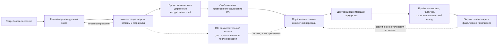
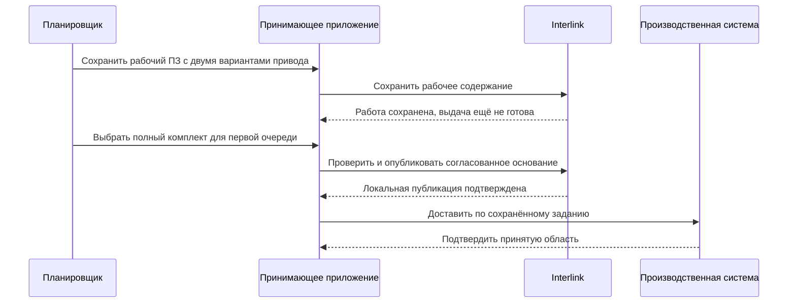

# Заказы в IPS и Interlink

## Как заказ связывает плановую работу и выполнение

Для чтения заказного контура полезна новая глава [об инструкциях, применениях и выполнении](../object-foundation/05-instructions-and-execution.md). Два перехода в маршруте могут использовать одну инструкцию, но сохраняют собственные параметры; фактическая работа по конкретному экземпляру не сливается с её планом. Изменение будущих шагов начатого задания оформляется отдельно и не переписывает завершённое.

[Адрес элемента](../object-foundation/04-elements-and-concepts.md) помогает сохранить связи замечаний, переходов и свидетельств. Он не заменяет точную выдачу заказа и не добавляет прав на изменение чужого содержания. Эти различия входят в принятый план, их сквозная реализация ещё требует подтверждения.

## Назначение пакета

Этот комплект предназначен для продуктовых специалистов IPS, специалистов по конфигурации изделий, планировщиков производства, технологов и руководителей внедрения систем управления жизненным циклом изделия (PLM). Он объясняет весь заказной контур — от потребности заказчика до точной передачи состава в производство и последующей связи с партиями, экземплярами и внешними учётными системами.

Главный вопрос пакета:

> Как сохранить сильные возможности заказов IPS, но разделить живое планирование, точный переданный состав, производственные документы и фактическое исполнение так, чтобы каждое состояние было воспроизводимо и объяснимо?

Документы не утверждают, что весь описанный контур уже реализован в Interlink. Они описывают принятый целевой договор и будущую пользовательскую работу. При этом принципиальные заказные сценарии проверяются уже при опытной проверке фундамента: нельзя сначала окончательно построить подбор и хранение, а затем обнаружить, что они не допускают вариантный ПЗ, частичную передачу или комплектную замену. Полноценные рабочие места и производственные интеграции появятся позже.

## Короткий ответ

В Interlink **заказ остаётся живым версионируемым предметным объектом предприятия**. Он содержит позиции: что требуется изготовить или поставить, в каком количестве и в какой комплектации. Пока заказ планируется, он может читать актуальную конструкторскую и технологическую документацию, получать новые версии и контролируемые замены.

Рабочий производственный заказ (ПЗ) может быть сформирован ещё до окончательного выбора заменителей и маршрутов. Специалисты сохраняют его, видят нерешённые места и продолжают подготовку. Это воспроизводит важный путь IPS и не означает, что производство уже приняло задание.

Для официальной передачи сначала определяют конкретную область: например, первую очередь из десяти насосов. В ней уже необходим однозначный допустимый результат. После согласования публикуется инженерное содержание заказа и отдельным решением — **неизменяемый снимок точного состава**; затем принимающий продукт доставляет его во внешнюю систему и отдельно фиксирует результат приёма. Публикация содержания, публикация снимка, доставка и приём — четыре разных события. Одно опубликованное состояние заказа может иметь несколько снимков, а новый снимок не переписывает предыдущий.

Производственная ведомость (ПВ) также является самостоятельным версионным документом. В зависимости от процесса предприятия она может готовить ПЗ, развиваться параллельно с ним или формироваться из принятой передачи. Со снимком связывается конкретная версия ПВ только там, где такая связь действительно нужна.

Такой подход сохраняет важное поведение IPS: заказ можно развивать, но ранее переданный производственный результат остаётся неподвижным и доступным для разбора истории.

## Какие понятия нельзя смешивать

| Понятие | Что это | Чем не является |
|---|---|---|
| Комплектация | Переиспользуемый набор частично заданных параметров изделия | Не точный заказ и не физический экземпляр |
| Заказ | Живой предметный объект с позициями, количествами и выбранными условиями | Не неизменяемый снимок и не полный процесс ERP |
| Рабочий ПЗ | Подготавливаемый производственный состав, в том числе с ещё не выбранными вариантами | Не уже принятое задание; разрешённая незавершённость не равна готовности передачи |
| Точный состав передачи | Однозначный состав, опубликованный для конкретной официальной передачи | Не текущий живой вид заказа и ещё не подтверждение доставки |
| Точное изделие | Самостоятельное изделие, созданное из конфигурируемого прототипа и получившее собственную историю | Не обязательный побочный результат каждого заказа |
| Производственная ведомость | Самостоятельный версионный производственный документ с карточкой, составом, проверкой и подписью | Не синоним заказа и не просто печатная форма |
| Экземпляр | Конкретная индивидуально учитываемая физическая единица | Не версия проекта и не количество строки заказа |
| Партия | Совместно учитываемая группа изделий или материалов | Не одна версия объекта и не снимок состава |
| Как заказано | Точный нормативный результат, предназначенный для производства | Не подтверждение доставки и не доказательство того, что именно было изготовлено |
| Как изготовлено | Состав, подтверждённый принятыми фактами изготовления и установки | Не переписанный проектный состав и не одно разрешение будущей замены |

## Как появляется и живёт производственный заказ

Потребность клиента может оставаться в системе работы с клиентами или в ERP. Самостоятельный ПЗ создаёт принимающее приложение в выбранный предприятием момент: после принятия потребности, после подтверждения комплектации либо раньше для инженерной проработки. Оно назначает номер и ответственных, показывает задания, проверяет права и ведёт состояния процесса. Сформированный рабочий ПЗ может ещё сохранять варианты; это не подтверждение его приёма производством.

Рабочая правка после проверки публикует новое состояние выбранной инженерной версии. Новая инженерная версия появляется только по предметному решению. Одна публикация содержания может служить нескольким самостоятельным передачам: например, восемь редукторов первой очереди и двенадцать второй. Каждая очередь получает явное количественное основание. Если перед первой передачей изменился подшипник, новая подготовка и публикация нужны затронутому содержанию; остальная работа не переписывается автоматически.

Снимок сам не вычисляет остаток и не заменяет планирование. Нельзя взять строку «20 редукторов», подставить при публикации число 8 и считать, что система уже надёжно учла оставшиеся 12. Область выдачи и распределение сначала оформляются предметным действием. Повтор доставки прежней области сохраняет прежний номер и снимок, не создавая новое количественное обязательство.

## Где находится производственная ведомость

ПВ имеет собственную историю. Её положение относительно ПЗ и снимка задаёт предприятие: она может помогать подготовить ПЗ, развиваться параллельно либо формироваться из готового ПЗ или принятой передачи. Отдельно определяется момент официальной фиксации ведомости относительно снимка.

| Вариант фиксации | Что делает предприятие | Что обязано сохраниться |
|---|---|---|
| ПВ раньше снимка | Согласует и подписывает ведомость, затем включает её точное содержание в основание выдачи | Новая правка ведомости не подменяет ранее подписанное основание |
| ПВ после снимка | Формирует ведомость по уже опубликованному составу и явно связывает результаты | Самостоятельная история ведомости, точный источник и её собственные подписи |
| Совместная фиксация | Проверяет один согласованный комплект и публикует выбранное содержание ПВ и снимок совместно | Ни один обязательный участник не остаётся официально опубликованным отдельно при подтверждённом отказе |

Это не требование завести две ведомости или универсальный порядок IPS. Сначала могут существовать рабочие данные одной ПВ, затем её официальное состояние. Пока общий результат только подготовлен, его номер не является свидетельством публикации. Потеря ответа требует установить исход, а не объявить всё отменённым.

## Что именно доказывает снимок

Снимок точной передачи и временная таблица для экрана имеют разный смысл. Временное представление можно перестроить для удобства чтения; оно не заменяет официальное основание. Снимок фиксирует полный выбранный состав своей области. Для передачи дополнительно удерживаются использованные нормы, маршруты, документы, файлы и разрешения — в самом точном комплекте либо в связанных неизменяемых основаниях.

Если нужен автономный юридически значимый пакет, принимающий продукт собирает его по правилам предприятия: точные файлы, подписи, сопроводительные документы и средства последующего чтения. Он не возникает автоматически от наличия снимка. Архивный срок и запреты удаления назначаются по обязательствам, а не из предположения о вечном хранении всех копий. Закрытие живого заказа не стирает историю действующих обязательств.

## Граница ответственности систем

| Участник | Предметная ответственность |
|---|---|
| Interlink | Общая модель, рабочие данные, инженерные версии и состояния, позиции, проверяемый подбор, происхождение и точные основания |
| Принимающее приложение | Карточки и рабочие места, момент создания ПЗ, номера, роли, задания, согласование, область количества, обязательные проверки допуска |
| Средство интеграции | Долговечное задание отправки, попытки, подтверждения, частичный приём, сверка и поддержанная получателем защита от дублей |
| ERP | Коммерческие и ресурсные данные, сроки, запасы, закупки и планирование в согласованной области |
| MES | Оперативное исполнение, операции, производственные носители и подтверждённые факты |

Эти роли могут размещаться в одном продукте или нескольких. Важно не смешивать их смысл: журнал интеграции допустимо хранить в модели поверх Interlink, но его состояния не становятся состояниями инженерного снимка. Обязательное задание отправки и подтверждение операции сохраняются согласованно с локальным предметным эффектом; надёжность внешнего приёма дополнительно зависит от договора ERP/MES.

## Что подтверждено материалами IPS

Исследованная база IPS подтверждает следующие потребности:

- заказ может включать несколько верхнеуровневых изделий и комплекты запасных частей;
- количество хранится на позиции заказа;
- значения опций могут задаваться отдельно для разных позиций;
- производственный заказ формируется с учётом версий, контекстов, применяемости, аналогов, замен и маршрутов;
- трассировка показывает ошибки и неоднозначные решения;
- после формирования заказа возможны контролируемые замены изделия, версии или маршрута;
- производственные ведомости имеют собственные версии, состав, согласование и подпись;
- материалы, трудоёмкость и данные для 1С могут рассчитываться по составу заказа с учётом количеств;
- экземпляры и партии отделены от типового проектного изделия;
- последующее изменение нормативного изделия не должно незаметно менять ранее переданный результат.

Практика одной изученной установки IPS уточнила важную границу: заказ частично играет роль сбытовой потребности, но цен, сроков, складов и полноценного портфеля заказов в его стандартной предметной модели нет. Эти данные могут добавляться предприятием или жить во внешней производственной и учётной системе. Для других установок это необходимо проверить отдельно.

## Что принято в Interlink

Ключевые решения:

- заказ — обычный версионируемый тип объекта модели предприятия;
- его строки являются позициями состава заказа и могут включать изделия, отдельные поставочные комплекты и ЗИП;
- цены, сроки, статусы, отгрузка и портфель не являются встроенными понятиями ядра;
- опции и условия заказа входят в явные условия формирования состава;
- рабочая область хранит незавершённые правки; независимый контекст подбора хранит принятые предпочтения; пакет изменения определяет, что публикуется совместно;
- сохранение рабочей правки ещё не публикует её; новое опубликованное состояние может принадлежать той же инженерной версии заказа, а новую инженерную версию создают по отдельному предметному решению;
- выпуск версии ПЗ не равен публикации снимка конкретной передачи;
- для каждой существенной передачи создаётся отдельный неизменяемый снимок полного точного состава;
- доставку снимка и результат его приёма ведёт принимающий продукт как отдельное состояние интеграции;
- старый снимок не пересчитывается после выпуска новых версий, правил или конфигураций;
- производственная ведомость выпускается самостоятельно и связывается со снимком только при применимости; процесс согласования, подпись, MRP и обмен с ERP/MES остаются предметными модулями и функциями принимающей системы;
- экземпляры, партии и фактическая история относятся к будущему общему производственному слою, а не к текущему ядру Interlink.

## Что добавилось в новой модели

У заказа появляется собственный выбор из переиспользуемой библиотеки допустимых комплектов. Например, один заказ редукторов использует стандартный привод, второй — усиленный привод с другой плитой и крепежом. Выбор второго заказа не переключает общий состав для первого. Проверяется весь комплект, включая сохраняемые узлы, а не только попарная заменяемость деталей.

Табличная нормативно-справочная информация становится доступной для поиска и расчёта как данные, а не только как приложение к документу. Для заказа можно найти сортамент по размерам, норму по материалу и операции, а разрешённое покрытие — по материалу поверхности и условиям эксплуатации. Результат передачи сохраняет использованную редакцию справочника и основания выбора. Обновление справочника не пересчитывает вчерашнюю передачу.

Более сложные проверки могут учитывать сразу несколько участников: привод, контроллер, прошивку и режим работы. Совместимость каждой пары недостаточна, если комплект в целом превышает мощность питания. Проверка выполняется по фактически выбранному содержанию версий; ошибка не скрывается автоматической подстановкой другой версии.

Продолжение: [Допустимые замены](../substitution-and-compatibility/01-allowed-replacements.md), [Матрицы совместимости](../substitution-and-compatibility/02-compatibility-matrices.md), [Справочные таблицы](../tabular-data/01-reference-tables.md), [Многомерные таблицы](../tabular-data/02-multidimensional-tables.md), [Координатные карты подбора](../tabular-data/03-coordinate-maps.md).

## Состав пакета

### Основа заказа

- [Общая модель и границы заказного контура](01-order-domain-and-boundaries.md)
- [Позиции заказа, количества и несколько изделий](02-order-lines-and-quantities.md)
- [Комплектации, опции и точное изделие](03-configuration-and-exact-product.md)
- [Жизненный цикл живого заказа](04-live-order-lifecycle.md)
- [Точный состав и публикации заказа](05-exact-publication.md)

### Подготовка производства

- [Формирование производственного заказа](06-production-order-resolution.md)
- [Маршруты, нормы и решения о способе обеспечения](07-routes-norms-and-sourcing.md)
- [Производственные ведомости, документы и отчёты](08-production-sheets-and-reports.md)

### Исполнение и изменения

- [Экземпляры, партии и фактический состав](09-units-lots-and-as-built.md)
- [Перепланирование, замены и история изменений](10-replanning-and-deviations.md)
- [MRP, ERP/MES и длительные операции](11-integration-and-mrp.md)
- [Роли, согласование и права](12-roles-approval-and-access.md)

### Сквозная проверка

- [Сквозные машиностроительные сценарии](13-end-to-end-scenarios.md)
- [Покрытие, открытые вопросы и состояние реализации](14-coverage-open-questions-and-status.md)
- [Как пользователи ведут заказ от потребности до производства](15-user-operating-model.md)

## Как читать пакет на продуктовой встрече

Рекомендуемый порядок:

1. Сначала пройти [полный пользовательский путь](15-user-operating-model.md) и согласовать различие живого заказа, точного снимка, производственной ведомости, производственного заказа и фактического изделия.
2. На реальном заказе предприятия перечислить позиции, количества, комплектации и требуемые выходные документы.
3. Определить, какие решения принимаются автоматически, а какие требуют участия специалиста.
4. Отдельно отметить данные PLM и данные внешней производственной или учётной системы.
5. Проверить перепланирование: что меняется в живом заказе и что обязано остаться неизменным.
6. Согласовать момент появления серийных экземпляров и партий.
7. Зафиксировать ответы в профиле конкретной установки IPS и приёмочных сценариях.

## Один путь подготовки — независимые подтверждения

Сначала можно надёжно сохранить незавершённую подготовку. Только после выбора области, полного комплекта и обязательных проверок появляется основание выдачи. Подтверждение Interlink относится к локальной публикации; ответ производственной системы — к приёму. При отсутствии такого ответа приложение сохраняет неизвестность, не добавляет новое количество и не объявляет изготовление.

## Состояние реализации

По состоянию проектных решений на 6 сентября 2026 года заказной контур является целевой продуктовой моделью. Его основные архитектурные ограничения и малые сквозные проверки входят в развитие фундамента; полный прикладной модуль строится поэтапно.

В Interlink уже приняты базовые понятия объекта, версии, позиции состава, явных условий подбора, адреса позиции и неизменяемого снимка. Сейчас развивается фундамент модели и типизированной прикладной поверхности. Запись предметных данных, многоуровневый подбор, применяемость, конфигуратор, бизнес-снимки заказа, производственные документы, экземпляры и партии относятся к последующим этапам.

Следовательно, этот пакет является продуктовой спецификацией, картой решений и основой будущей приёмки. Его нельзя использовать как утверждение о готовом пользовательском модуле заказов.

## Основные источники

- [Функциональная база IPS](../knowledge/04-ips-functional-baseline.md)
- [Формирование состава: IPS → Interlink](../version-selection/README.md)
- [Версии, изменения и снимки](../changes/README.md)
- [Матрица функционального покрытия](../knowledge/02-current-state-and-roadmap.md)
- [Глоссарий](../knowledge/14-glossary.md)
- [Реестр источников](../knowledge/15-source-register.md)

## Основания и проверка источников

Основания: [IPS-A05], [IPS-A13], [IPS-A23], [IPS-M03], [IL-ORDERS], [IL-KERNEL], [IL-DATA-MODEL], [IL-SC], [IL-TD], [IL-PLAN-V2]. Расшифровка и статус материалов — в [реестре источников](../knowledge/15-source-register.md).

Описание IPS относится к подтверждённым материалам и явно указанным профилям установки. Целевое поведение Interlink сверено с принятыми договорами на 6 сентября 2026 года; наличие этого описания не означает приёмки реализации.
