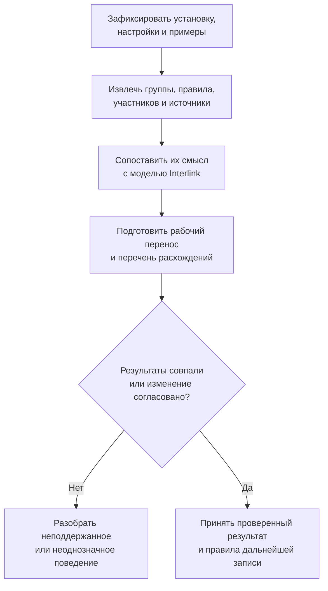
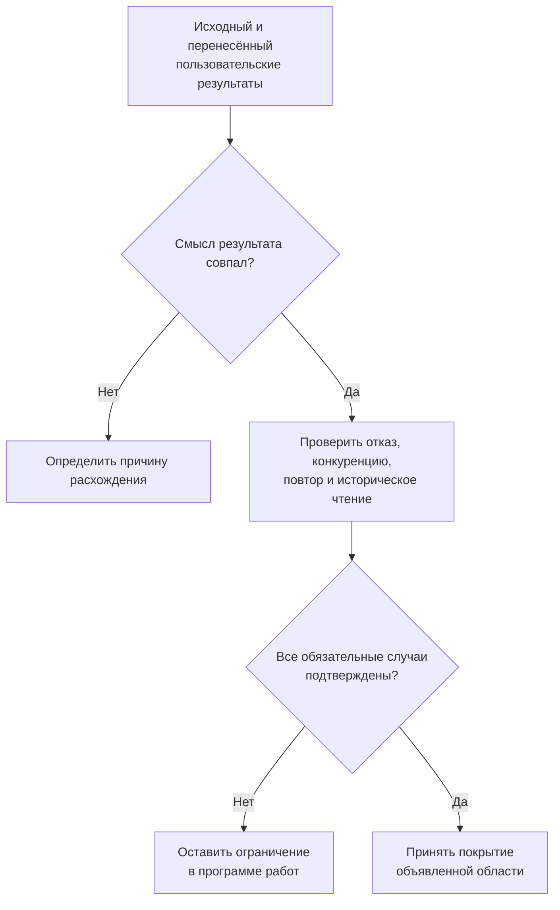

# Как перенести замены и совместимость IPS и доказать полноту

## Цель переноса

Перенос должен сохранить то, что пользователи действительно могут сделать: увидеть все альтернативы, воспроизвести актуальный состав, применить полный комплект, подобрать материал или клей, выявить несовместимость и объяснить результат. Копирование списка ссылок без этого поведения недостаточно.

**Статус: план переноса и приёмки на 6 сентября 2026 года.** Он основан на актуальном контракте Interlink и изученных материалах IPS. Примеры конкретного предприятия должны подтвердить версию продукта, настройки, исходные данные и ожидаемые результаты. Эта глава не объявляет внутренний порядок любой установки IPS полностью известным.

## Не объединять разные исходные механизмы

| Что переносится | Какой смысл нужно сохранить | Что изменяется в собственном процессе Interlink |
|---|---|---|
| Группа замен состава | Полные варианты, участники, количества, область и исходный актуальный выбор | Библиотека альтернатив отделяется от выбора конкретного заказа |
| Глобальные аналоги | Исходная версия, кандидат, сроки, приоритетный признак и режим | Направление, область и основания становятся явно различимыми |
| Заменители материала | Список и происхождение его связей | Допуск и применение могут добавлять необходимые условия без превращения списка в состав |
| Несовместимость опций | Исходное условие, группировка «и / или», сравнения и владелец | Проверка целого сочетания получает ясные результаты и границы |
| Связанные значения | Направление назначения, зависимые опции и область | Изменение показывается как явное действие, а не эффект чтения таблицы |
| Клеи и покрытия | Роли входов, материал или группа, набор результатов и свойства | Используются структурированные карты и точные основания поиска |

Список заменителей материала не становится глобальным аналогом состава только из-за похожего названия. Разрешающий каталог не заменяет общую проверку совместимости. Приведённые формы опираются на [общую модель замен](01-allowed-replacements.md) и [правила совместимости](02-compatibility-matrices.md).

## Какие сведения нужны от продуктового специалиста

Для одного рабочего сценария требуется не только снимок экрана, но и понятное исходное состояние: какое изделие открыто, какое содержание используется, что выбрано в заказе, какие варианты имеются и какие настройки влияют на результат. Полезно вместе разобрать обычный случай, отказ и неоднозначный случай.

Источники должны позволять различать устойчивые объекты, версии, конкретные места состава, группы и участников вариантов. Совпадение наименований не является основанием для объединения. Количество относится к участию в составе, а не становится общим свойством детали.

Если историческое содержание правила не сохранилось, перенос фиксирует доступное наблюдение и его границы. Нельзя из нынешней строки восстановить выдуманную историю прежних допусков или объявить старый заказ точно воспроизводимым без фактически сохранённых оснований.

## Путь переноса

Исходник сначала сохраняется как основание. Преобразование показывает, что с чем сопоставлено. Неизвестные операции, потерянные участники, висячие ссылки и сомнительное членство не исправляются автоматически удалением или выбором первого совпадения.

Затем сравниваются пользовательские результаты: состав, варианты, назначенные значения опций, обнаруженные конфликты и перечни кандидатов. Только после этого может быть принято новое содержание. Длительная подготовка не означает, что уже опубликована половина правил.

## Три режима просмотра группы — три разных результата

Подтверждённое исходное поведение групп замен включает различающиеся представления. Их нельзя заменить одной операцией «скрыть лишние строки».

| Представление | Что в нём должно быть видно |
|---|---|
| Полное | Все варианты групп и обычные позиции в разрешённой области |
| Актуальное | Актуальные варианты и позиции вне групп |
| Без допустимых замен | Только позиции вне групп; участники актуальных вариантов групп тоже исключены |

Переключение представления в одном окне не должно менять данные или вид другого окна. Актуализация, напротив, изменяет выбранный вариант в своей области, сохраняя прежний вариант для истории и дальнейшей работы. Это разные действия, хотя оба влияют на видимый состав.

При переносе сохраняются имена групп, объяснения замен и различие общей и переменной части исполнения. Правка общей части должна показать все затронутые исполнения. Правка переменной части не меняет соседние исполнения. Удаление информации о заменах на текущем уровне не должно незаметно очищать вложенные составы или удалять сами предметные объекты.

Ограничение повторного участия позиции требуется воспроизвести в исходном режиме. Но точную границу — внутри варианта, между вариантами или между группами, по объекту или конкретному месту — нужно подтвердить примером целевой установки. Это не повод ввести общий запрет на полезные пересекающиеся предложения в библиотеке Interlink.

## Глобальный аналог принадлежит своему исходному основанию

Если аналоги назначены исходной версии, при переносе сохраняется именно этот владелец. Нельзя объединить аналоги всех версий насоса в один общий список и считать результат эквивалентным. Для чтения допуска сначала определяется нужная исходная версия и необходимое содержание; затем выбирается новая цель и обычным способом определяется её версия.

Сохраняются исходные режимы: подбор выключен, допускается только однозначный действующий результат либо разрешён выбор одного кандидата. У последнего режима порядок выбора необходимо подтвердить. Нельзя заменить его случайным порядком загрузки или объявить любое многозначие ошибкой, потеряв исходный сценарий.

Исходный признак приоритета не превращается без основания в придуманную числовую шкалу. Дата запроса, период допуска, применяемость конструкции и момент установки не подменяют друг друга. Взаимодействие с жёсткой и мягкой конкретизацией проверяется отдельно: наличие аналога не даёт нового права снять фиксацию.

## Опции: проверить сочетание и назначить значение — не одно действие

Правило несовместимости оценивает выбранный набор. Правило связанных значений изменяет определённые параметры. Например, выбор опции может требовать конкретного топлива и одновременно исключать другую опцию. Эти последствия могут показываться вместе, но должны оставаться различимыми.

При переносе сохраняется исходная группировка «и / или», а не плоский список пар. Если правило относится к конкретному значению опции, нельзя расширять его на все её значения. Отсутствующая зависимая опция должна быть обнаружена до принятия переноса.

Отдельные примеры нужны для конфликта с ручным вводом, двух источников назначения и циклов зависимостей. Неизвестный оператор не пропускается; неподдержанное поведение означает ограничение данного переноса. Безопасный собственный процесс Interlink можно принять осознанно, но нельзя приписывать его IPS задним числом.

## Технологические справочники не откладываются до большого решателя

Обязательные сценарии включают ведение заменителей материала, поиск клея по двум входным ролям и подбор покрытий по материалу и условиям. В каждой роли поиска клея может выбираться материал или группа, а результатом является набор марок, не автоматически первая строка.

Interlink дополнительно планирует явный поиск через подтверждённое членство конкретного материала в группе. В таком случае сохраняется использованное членство и редакция основания. Это ближайшее развитие собственной модели, а не доказанный алгоритм каждой исходной установки IPS.

Симметрия пары, вложенность групп, приоритет прямого материала над группой и смысл пересечений требуют исходных примеров. Пользователь должен понимать, почему предложен определённый клей и какие ещё условия применения остаются проверить. Право посмотреть его свойства не равно праву изменить разрешённые пары.

## Пример 1. Перенос двух групп замен привода

В станке есть две группы: привод главного движения и вспомогательный привод. У каждой имеются исходный актуальный и допустимые полные варианты. Перенос сохраняет участников и количества, после чего специалист последовательно открывает полное, актуальное и представление без групп.

В последнем не должны оставаться участники актуального варианта лишь потому, что он был выбран. При переключении обратно исходные варианты присутствуют: представление ничего не удаляло. Актуализация одной группы меняет нужный выбор, не затрагивая вторую группу и вложенные составы без отдельного намерения.

Далее два заказа независимо выбирают разные полные варианты на основе импортированной библиотеки. Это осознанное улучшение процесса Interlink. Исходный актуальный выбор может стать начальным предложением, но не общим переключателем всех заказов. Если один участник варианта не имеет нужной версии, полный комплект не проводится частично.

## Пример 2. Аналоги разных версий насоса

У исходного насоса есть две инженерные версии с разными разрешёнными аналогами. Специалист готовит два контрольных запроса с явно названным исходным основанием. Перенос должен сохранить разные списки, сроки и режимы, а не собрать общий набор по обозначению насоса.

Один запрос использует жёсткую конкретизацию. При попытке заменить объект система проверяет, допускается ли изменение этой привязки и какое новое основание будет установлено. Если права нет, отказ объясняется; система не «чинит» его переходом к другому кандидату.

Для второго запроса подбор новой версии успешен, но конкретное содержание аналога не проходит проверку присоединительного интерфейса. Это отказ совместимости, а не основание молча перебрать старые версии до успеха. Сравнение с исходной установкой отдельно определяет, какие её режимы нужно воспроизвести и какие изменения процесса согласованы.

## Пример 3. Клей по материалам и группам

Технолог выбирает материал основания и группу материала накладки. IPS возвращает несколько марок клея. Контрольный перенос должен вернуть соответствующий набор с теми же входными ролями и происхождением, а не одну случайную марку.

Затем проверяется обратный порядок ролей. Если эквивалентность не подтверждена, она не предполагается. Ещё один случай сочетает прямую запись по марке с групповым основанием: специалисты определяют исходный ожидаемый результат, а для собственного расширения Interlink — явное правило использования членства и объяснение предложений.

Принятая карта сохраняется отдельно от выбранного клея конкретной операции. Позднее новое правило не переписывает старое точное решение автоматически. Но обязательный отзыв допуска способен остановить новое применение; факт уже выполненной операции остаётся в истории и при необходимости требует отдельного рассмотрения качества.

## Приёмка не заканчивается успешным просмотром

Совпадение результата поиска — начало проверки, а не завершение. Полный вариант должен корректно применяться, отказывать и переживать повтор. После новой публикации должны сохраняться прежние точные основания и объяснимая история.

| Контрольный случай | Ожидаемый результат |
|---|---|
| Один обязательный участник комплекта не подходит | Нет частичного успешного применения |
| Два выбранных плана снимают одну позицию | Конфликт либо отдельная поддержанная совместная композиция |
| Планы правят разные места, но один уничтожает предпосылку другого | Итоговая проверка обнаруживает конфликт |
| Один контроллер требуется двум комплектам и сохраняется | Само общее требование не считается двойным потреблением |
| Пары допустимы, полный набор превышает общий ресурс | Полный набор признаётся несовместимым |
| Правило не поддержано или данных недостаточно | Нет ложного положительного заключения и нет выдуманного технического запрета |
| Часть источника скрыта, не загружена или чтение оборвано | Нет доказательства отсутствия разрешения или запрета по неполной выдаче |
| Состав изменился после подготовки | Показан конфликт исходного основания; новый результат не применяется незаметно |
| Ответ о применении потерян | Выясняется исход прежней операции, а не создаётся новая замена |
| Появилась новая неиспользованная редакция правила | Прежнее точное согласование не переписывается автоматически |
| Введён обязательный действующий запрет | Новое действие проверяет его; прошлые факты сохраняются |
| Исполнение зарегистрировано позже согласования | Решение и фактическая установка остаются разными событиями |

Полный перечень запретов может доказать отсутствие нарушения только этого ограничения. Полный перечень разрешений может подтвердить отсутствие разрешения только своей области. Во всех случаях нужны точная редакция, явно замкнутая область и полное авторитетное чтение; обычная пустая карта не получает этих свойств автоматически.

## Повторный перенос и дальнейшее владение

Повторное поступление связывается с прежними исходными участниками по устойчивому соответствию, а не создаёт новые группы по совпавшим именам. Отсутствие строки в частичной порции не удаляет допуск. Оборванная выгрузка не считается полным источником.

Если IPS и Interlink продолжают работать совместно, требуется определить владельца каждой изменяемой области. Локальное одобрение или фактическая установка не должны стираться очередным импортом. Принятие перенесённых правил не даёт Interlink автоматического права менять исходную систему. Эти границы согласуются с [общим процессом переноса](../data-structure/19-ips-migration-operating-model.md).

## Раннее подтверждение и последующие этапы

До закрепления зависимого устройства ядра нужны небольшие примеры полного комплекта, многоместной проверки, справочного поиска и точного основания. Они проверяют правильность фундаментальных различий сейчас, а не требуют заранее построить весь промышленный конфигуратор.

Затем реализуется общий путь хранения, чтения, оценки и применения. Прикладной этап закрывает подтверждённые сценарии IPS и правила конкретной установки. Продвинутая оптимизация, более сложные логические отношения и внешние средства поиска развиваются отдельно. Обязательный подбор клея или групповая замена не должны ждать их появления.

## Основания и вопросы для обсуждения

Основания: [IL-SC], [IL-TD], [IL-DATA-MODEL], [IL-PLAN-V2]; описание источников — в [реестре](../knowledge/15-source-register.md). Подтверждённые требования отделены от предположений о внутреннем алгоритме IPS.

В первую очередь нужны реальные примеры границ повторного участия, многозначного глобального аналога, конфликта связанных значений, симметрии материалов и группового поиска. Для каждого фиксируются исходный режим, ожидаемый результат и допустимое отклонение нового процесса. Общий список — [вопросы по таблицам, заменам и совместимости](../open-questions/09-tables-replacements-and-compatibility.md).
