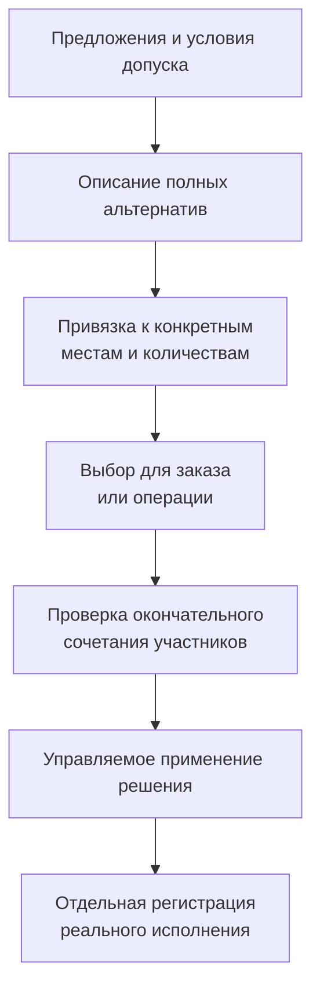

# Допустимые замены и совместимость

## Зачем нужен отдельный пакет

Для производственного решения важно различать «нашёл похожую деталь», «разрешено заменить», «комплект совместим», «вариант выбран для заказа» и «деталь действительно установлена». Если эти факты смешать в одном списке, система не сможет надёжно объяснить ни нынешний допуск, ни историю исполнения.

Interlink планирует сохранять каждый из них с понятной областью и основанием. Перечень заменителей остаётся полезным справочником кандидатов. Полный допуск добавляет направление, условия и необходимые подтверждения. Выбор для заказа не изменяет все применения конструкции. Факт установки появляется отдельно, даже когда замена была заранее согласована.

**Срез: 6 сентября 2026 года. Принятый предметный контракт, не готовая подсистема.** Пакет описывает целевой процесс для продуктовых специалистов IPS и PLM. Ранние проверки входят в переработку фундамента; готовые отраслевые рабочие места и универсальный поиск оптимального решения не объявляются выполненными.

## Маршрут чтения

| Вопрос | Документ |
|---|---|
| Что разрешено поставить вместо исходной детали или комплекта? | [Допустимые замены](01-allowed-replacements.md) |
| Могут ли все выбранные участники работать вместе? | [Матрицы и правила совместимости](02-compatibility-matrices.md) |
| Как перенести исходные группы, аналоги и правила без потери смысла? | [Перенос IPS и программа приёмки](03-ips-migration-and-acceptance.md) |
| Где хранятся сопоставления и что означает пустая клетка? | [Табличные данные](../tabular-data/README.md) |
| Как новое решение становится официальным? | [Пакеты изменения](../changes/README.md) |
| Как различаются заказной вариант и установленная деталь? | [Заказы](../orders/README.md) и [экземпляры и фактический состав](../orders/09-units-lots-and-as-built.md) |

## Как связаны основные понятия

В схеме каждый переход имеет собственный смысл. Библиотека может существовать без выбранного заказного варианта. Выбор может быть подготовлен, но ещё не применён. Применённое изменение может ожидать производства. Фактическая установка не делает любое отклонение разрешённым задним числом.

Совместимость может проверяться на нескольких этапах. Ранние условия отсекают заведомо неверное исполнение; окончательные учитывают реально выбранное содержание участников. Если допуск аналога относится к исходной инженерной версии, сначала нужно установить это основание. Затем новый объект проходит обычный подбор версий. Второго скрытого механизма подбора не появляется.

## Три характерных задачи

### Один подшипник вместо другого

Для насоса найден более доступный подшипник. Он является кандидатом, пока не определены область и условия допуска. После проверки пользователь выбирает его для нужного заказа и отдельно применяет решение. Обратная замена не выводится автоматически, а закупочная доступность не подтверждает техническую пригодность.

### Новый привод целым комплектом

Двигатель и муфта заменяются мотор-редуктором, плитой и крепежом. Разрешение относится к целому варианту. Нельзя выбрать удобные детали из разных вариантов или считать успех двух участников успехом всего комплекта. Два заказа могут независимо выбрать разные варианты одной библиотеки.

### Два устройства используют общий контроллер

Два комплекта модернизации требуют сохранить один контроллер. Это не двойная установка и не ошибка повторного использования. Но другая выбранная правка не должна снять контроллер или изменить его интерфейс несовместимым образом. Отсутствия пересечения изменяемых позиций недостаточно: проверяются также сохраняемые предпосылки и общий итог.

Подробные исходные условия, отрицательные результаты и действия пользователя раскрыты в основных главах, а не ограничиваются этими краткими иллюстрациями.

## Что сохраняется из IPS

Обязательное покрытие включает глобальные аналоги, группы полных замен, исходные режимы просмотра, правила опций и связанных значений, заменители материалов, подбор клеёв и покрытий. Пользовательский результат переносится с доказуемым соответствием исходному поведению конкретной установки.

Внутренняя модель Interlink не обязана наследовать общий переключатель варианта для всех заказов или универсальный запрет хранить пересекающиеся предложения. Такие ограничения сохраняются в соответствующем режиме воспроизведения IPS, если их подтверждают источники. Собственный процесс Interlink разделяет переиспользуемое описание и решения конкретных применений.

Полнота переноса не доказывается одинаковыми названиями меню. Нужны исходные составы, конфигурации, обычные и конфликтные примеры. Если алгоритм исходной установки неизвестен, вопрос остаётся открытым; система не подменяет его случайным порядком строк.

## Что нельзя выводить автоматически

- Из направленного допуска не следуют обратный допуск и цепочка замен через промежуточные детали.
- Из совместимости пар не следует допустимость всего многоместного сочетания.
- Из пустой клетки не следует ни запрет, ни разрешение без явно полного авторитетного основания.
- Из найденной версии не следует совместимость её фактического содержания.
- Из опубликованной карты не следует неизменность всех объектов по её живым ссылкам.
- Из давнего согласования не следует бессрочное право нового действия, но и новая неиспользованная редакция сама не отменяет прежнее точное согласование.
- Из ответа агента не следует системное подтверждение допуска или факт установки.

Эти различия не усложнение ради терминологии. Они позволяют объяснить производственное решение, безопасно пересмотреть его и не потерять историю.

## Состояние и порядок развития

На раннем этапе требуется проверить небольшой полный вариант замены, многоместную совместимость, точный источник правила и отрицательные результаты. Эти проверки выполняются до закрепления зависимого общего устройства системы. Нельзя сначала завершить фундамент с недостаточной адресацией, а все новые случаи отложить «после опытного образца».

Далее общий путь хранения, проверки и применения доводится до сквозной работы. Прикладная приёмка доказывает обязательные сценарии IPS, включая технологические справочники. Большие решатели, оптимизация и специализированные отраслевые способы исполнения вводятся по ценности и измерениям; они не служат причиной отложить обязательное покрытие.

## Основания

Основания: [IL-SC] — допуски и совместимость; [IL-TD] — табличные отношения; [IL-DATA-MODEL] — принадлежность и история данных; [IL-PLAN-V2] — последовательность проверки. Документы и уровни доказательности перечислены в [реестре источников](../knowledge/15-source-register.md).

См. также [глобальные аналоги](../version-selection/14-global-analog.md), [групповые замены IPS](../version-selection/15-nm-substitutions.md) и [вопросы по таблицам, заменам и совместимости](../open-questions/09-tables-replacements-and-compatibility.md).
