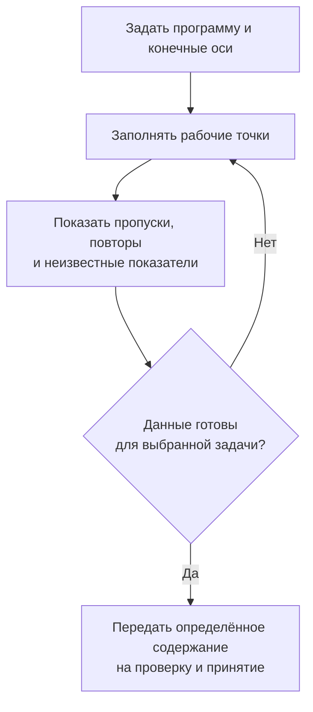
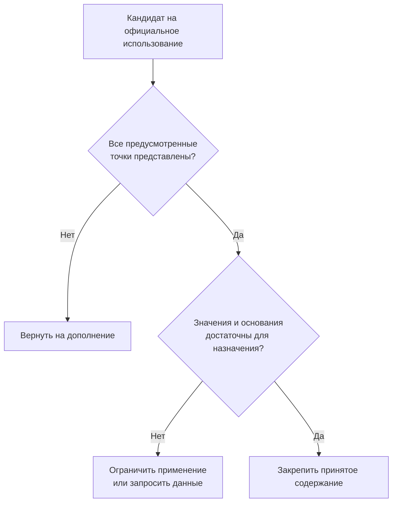

# Полные многомерные таблицы

## Что означает «полная»

Предприятие может заранее определить программу данных: исследовать каждый материал при каждой заданной температуре и каждом давлении. В этом случае важно не просто хранить поступившие результаты, а знать, что ни одна предусмотренная точка не потеряна.

Полная многомерная таблица в целевой модели Interlink содержит по одной клетке для каждого сочетания значений своих конечных осей. Ось — это самостоятельный признак адреса: например, материал, температура или давление. «Многомерная» здесь не означает трёхмерную геометрию изделия. Можно иметь четыре или пять признаков, а на экране выводить два из них, остальные задавая фильтрами.

**Это принятый план, а не готовый численный модуль.** Сначала предстоит проверить небольшие типизированные сетки, их изменение, полноту и точное чтение. Огромные массивы, развитая интерполяция и специализированные способы хранения относятся к дальнейшему развитию.

## Конечная область должна быть названа

Пусть программа испытаний содержит два материала, три температуры и два давления. Тогда ожидаются двенадцать клеток. Утверждение «измерено при всех температурах» не определяет область: температура непрерывна, а таблица содержит конечный список точек.

У клетки может быть несколько показателей — например, прочность, удлинение и ссылка на протокол. Добавление показателя не создаёт новую ось. Напротив, появление ещё одного условия, например среды испытаний, меняет адрес точки и требует осмысленного перехода к новой форме.

| Изменение | Что меняется |
|---|---|
| Температуру показывают строками вместо столбцов | Только представление |
| В программу добавляют ещё одну температурную точку | Состав оси и ожидаемое число клеток нового содержания |
| Исправляют измеренное значение | Показатель определённой клетки |
| Добавляют ось «среда испытаний» | Форма данных и смысл адреса |

Ранее принятое содержание сохраняет прежний состав осей. Появление нового материала в общем справочнике не расширяет старую программу испытаний автоматически. Эквивалентные значения в разных единицах не должны создавать две точки: при согласованных правилах абсолютной температуры 20 °C и 293,15 K обозначают одну координату.

## Три проверки, которые нельзя заменить одной

| Проверка | Что она доказывает | Чего не доказывает |
|---|---|---|
| Все точки представлены | Каждая ожидаемая координата имеет клетку | Что в клетке есть известное измерение |
| Обязательные значения известны | Для назначения имеются нужные показатели | Что они испытаны и разрешены для данного применения |
| Данные пригодны для задачи | Выполнены требования выбранного расчёта или выпуска | Что они пригодны для любого другого назначения |

Клетка с пометкой «не измерено» учитывает точку программы, но не содержит результата испытания. Ноль, «неизвестно», «не измерено» и «не применяется» имеют разные значения. Нулевая теплопроводность не может появиться только потому, что лаборатория ещё не заполнила строку.

Полнота также не сводится к числу строк. Двенадцать строк могут содержать повтор одной координаты и пропуск другой. Система должна проверять принадлежность значений нужным осям, однозначность клеток и покрытие именно одного согласованного содержания. Подмешать температуру из другой редакции программы нельзя.

## Как будет работать пользователь

Лаборант или ответственный технолог создаёт рабочий набор по установленной форме и выбирает конечные списки осей. Он видит ожидаемый объём и заполняет данные частями. Рабочая сетка может быть неполной: это нормальное состояние подготовки, если оно явно обозначено.

Участники подготовки видят незавершённые точки согласно своим правам. Пользователь официального справочника не должен незаметно получить наполовину заполненную сетку вместо принятой. Согласующий получает определённое содержание и отчёт: какие точки предусмотрены, какие показатели известны, откуда они получены и для чего заявляется пригодность.

Схема показывает два разных препятствия: потерянную точку и недостаточное знание в существующей точке. Если во время согласования изменились значения или оси, старый результат проверки не распространяется на новое содержание. Рабочее сохранение не является публикацией.

После принятия новая редакция доступна по установленным правилам. Предыдущие расчёты сохраняют использованные значения, источники и необходимые зависимости. Возврат старого набора в работу создаёт основу для нового изменения; он не переписывает прошлую редакцию.

## Как читать большую сетку

Конструктор может запросить одну точку, сразу несколько нужных точек или срез: например, все температуры для одного материала и давления. Не требуется выводить всё многомерное пространство на экран или передавать его агенту. Система должна показывать выбранную редакцию, зафиксированные оси, единицы и границы выдачи.

Если координата не входит в объявленные оси, правильный ответ — «вне области этой таблицы». Если ожидаемой клетки действительно нет в принятой полной сетке, это уже нарушение её целостности, а не обычная пустота. Если пользователь не имеет доступа к данным, ответ о доступе не должен изображать потерянное измерение.

Точка между узлами не возникает автоматически. При наличии 100 и 200 °C запрос 150 °C не означает разрешения усреднить показатели. Интерполяция должна быть отдельной разрешённой процедурой с указанными входами, методом и областью применимости; она не выдаёт расчётный результат за измеренный.

## Пример 1. Контрольная программа для двух материалов корпуса

Лаборатория сравнивает два материала корпуса насоса при трёх температурах и двух давлениях. Все численные условия этого примера учебные и не являются рекомендацией для проектирования. Программа содержит двенадцать адресов; для каждой точки требуются прочность и протокол.

После первого этапа в десяти клетках есть результаты, в двух стоит «не измерено». Система может подтвердить, что вся программа учтена, но не выдаёт её за полный набор измерений. Инженер использует данные для предварительного сравнения с явно отмеченными ограничениями. Окончательное применение, требующее всех результатов, блокируется до завершения испытаний.

После заполнения двух точек принимается новое содержание. Если импорт случайно дублирует одну точку, заменяя ею другую, одинаковое общее число строк не скроет ошибку. Пользователь получит указание на повтор и пропуск.

## Пример 2. Испытательная карта характеристики насоса

Испытатель ведёт показатели насоса по частоте вращения, подаче и температуре среды. В каждой клетке сохраняются несколько показателей и происхождение результата. Сначала он открывает срез для одной частоты и температуры, чтобы видеть зависимость от подачи; затем меняет срез, не меняя самих данных.

Одна точка испытана дважды разными приборами. Два первичных протокола должны сохраниться как отдельные факты. Если итоговая сетка требует одного значения, выбор или сведение результатов выполняется по объявленной процедуре. Требование одной клетки не даёт права удалить «лишний» протокол.

Заказчик запрашивает показатель между испытанными узлами. Если подходящая расчётная процедура ещё не реализована или не разрешена для данного назначения, система объясняет это ограничение. Она не подбирает ближайшую клетку молча и не выдаёт отсутствие вычислителя за отрицательное испытание насоса.

## Пример 3. Добавление новой оси в справочник режима обработки

Технологическое бюро ведёт полную таблицу рекомендуемых параметров для выбранных материалов заготовки и типоразмеров инструмента. Позднее выясняется, что нужно отдельно учитывать два способа охлаждения. Это не просто новая колонка примечания: от неё зависит адрес и применимость значения.

Перед переходом бюро определяет, какие старые результаты относятся к каждому способу. Нельзя автоматически размножить каждое прежнее значение на оба способа и объявить новые клетки подтверждёнными. Рабочий переход показывает перенесённые основания, новые точки и неизвестные значения. Согласование проводится для получившегося конкретного содержания.

Старый технологический процесс продолжает воспроизводиться по прежней двухосевой таблице. Новый процесс обращается к трёхосевой. Если удаление оси в будущем объединит несколько разных значений в одну координату, потребуется явное решение, а не выбор последней строки. Возможность менять форму не означает права терять смысл истории.

## Пример из одежды: таблица мерок

Технический пакет задаёт размеры и обязательные точки измерения изделия. Для каждого размера требуется значение в каждой точке. Это подходящая полная сетка, хотя ассортимент «цвет × размер × рынок» может содержать далеко не все сочетания.

Часть мерок может быть измерена на образце, часть — рассчитана по правилам градации. Происхождение сохраняется различимым. Полнота мерок не создаёт автоматически товарную карточку для каждого размера и цвета и не подтверждает его готовность к продаже.

## Что это добавляет относительно справочных сценариев IPS

Обязательное покрытие справочников IPS не сводится к полной сетке: многие существующие таблицы являются перечнями строк и должны такими остаться. Полная многомерная сетка — дополнительный явно выделенный договор для программ испытаний, числовых справочников и других задач, где требуется каждая заданная комбинация.

Это расширение позволяет проверять полноту и обслуживать адресный поиск без искусственных объектов на каждое число. Оно не является утверждением, что IMBASE внутренне использует такую же модель или что все её таблицы нужно преобразовать в сетки.

## Этапы и критерии приёмки

Ближайшая реализация должна подтвердить конечные оси, уникальные координаты, рабочую неполноту, принятие полного содержания и точное чтение. Далее могут добавляться условные области, развитые расчёты и хранение больших массивов. Неограниченная размерность и одинаковая скорость всех срезов не обещаются: допустимые объёмы и режимы определяются испытаниями.

Сценарии приёмки включают повтор координаты при правильном числе строк, неизвестный показатель в полной сетке, изменение оси после проверки, запрос между узлами и чтение старого расчёта после новой публикации. В каждом случае пользователь должен понимать, чего именно не хватает: клетки, значения, допуска, доступа или поддержанной процедуры.

Смежные темы: [выбор формы табличных данных](README.md), [обычные справочники](01-reference-tables.md), [разреженные карты](03-coordinate-maps.md), [правила совместимости](../substitution-and-compatibility/02-compatibility-matrices.md).

## Основания и дальнейшая проверка

Описание сверено с принятой архитектурой на 6 сентября 2026 года. Основания: [IL-TD] — табличные формы и их инварианты; [IL-SC] — смысл допусков и совместимости; [IL-DATA-MODEL] — принадлежность данных и точные основания; [IL-PLAN-V2] — порядок опытного подтверждения. Уровни доказательности и исходные документы перечислены в [реестре источников](../knowledge/15-source-register.md).

Полный путь загрузки, принятия, изменения осей и воспроизведения разбирается в [главе о жизненном цикле и приёмке](04-data-lifecycle-and-acceptance.md). Малые проверки ключей, конечных осей, точного содержания и отрицательных результатов нужны на раннем этапе переработки фундамента; они не откладываются целиком за опытный образец. Полные отраслевые рабочие места и большие специализированные массивы относятся к следующим этапам.
