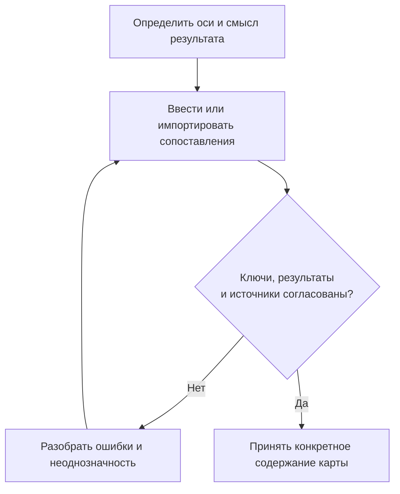
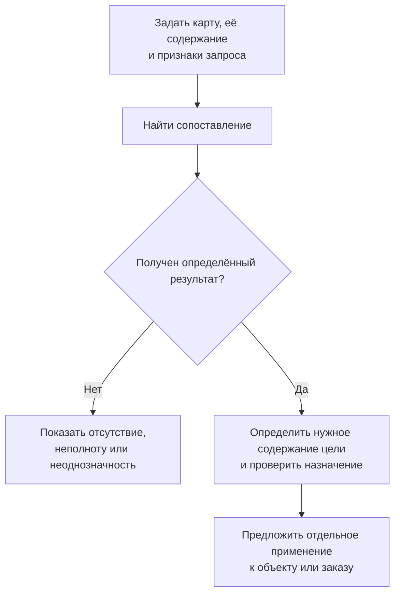

# Карты сопоставлений: результат по сочетанию признаков

## Связь с элементами и предметными понятиями

Новая [общая адресация](../object-foundation/04-elements-and-concepts.md) не расширяет автоматически допустимые значения каждой карты. Карта принимает только объявленные виды целей и нужную точность. Если в дальнейшем её результатом станет инструкция или адресуемая часть, этот вариант сначала должен получить собственные проверки; произвольную цель нельзя считать подходящей из-за общего слова «элемент».

[Предметное понятие](../object-foundation/06-domain-concepts.md) может объяснять смысл оси или значения, но не заменяет устойчивый адрес координаты. Переименование подписи не создаёт новую клетку, а смысловая близость не заполняет отсутствующее соответствие. Для исторического расчёта сохраняются использованные данные и необходимые определения.

## Зачем нужна «таблица с незаполненными пересечениями»

Инженер задаёт рабочую среду, диаметр и климатическое исполнение, чтобы найти конструкцию клапана. Технолог выбирает материалы двух соединяемых поверхностей, чтобы получить перечень клеёв. В каждом случае результат определяется сочетанием признаков, но для всех возможных сочетаний данные вовсе не обязаны существовать.

Для такой задачи в Interlink планируется карта сопоставлений. Она хранит только явно заданные сочетания и их результаты. На экране карта может выглядеть как таблица с пустыми клетками, но не требует создавать объект или пустую запись для каждого пересечения.

**Статус: принятое направление и план реализации.** Ни описанные рабочие места, ни все виды поиска ещё не являются готовой подсистемой. Примеры ниже поясняют предметный договор, а не предписывают устройство интерфейса.

## Координата — смысловой адрес, а не номер клетки

Координатой называется полный набор значений признаков, по которым находится результат. Например: «вода, условный проход 50, морское исполнение». В конкретной карте и её выбранной редакции это устойчивый адрес, даже если пользователь поменял местами строки и столбцы.

В качестве осей подходят:

- значения перечисления, например виды климатического исполнения;
- члены управляемого списка, например утверждённые типоразмеры;
- числовые величины с единицами, например номинальный диаметр;
- ссылки на предметные объекты, например материалы или производственные площадки.

Разрешённые значения атрибута не следует путать со значениями, случайно встречающимися в нынешних заказах. Если в заказах пока нет диаметра 80, он от этого не исчезает из установленного размерного ряда. При фиксации редакции карты сохраняется именно её состав осей; новая строка общего списка не расширяет прежнюю карту автоматически.

Две оси могут ссылаться на один тип объектов, но играть разные роли. «Материал основания» и «материал накладки» — не одна ось. Перестановка их на экране не доказывает, что результат при обратном порядке обязан совпасть. Симметрия задаётся только там, где она предметно обоснована.

## Что можно хранить в пересечении

| Результат | Что получает пользователь | Что ещё не решено |
|---|---|---|
| Число или небольшой набор показателей | Например, норму упаковки и единицу | Можно ли применять её для данной задачи |
| Ссылка на объект | Например, семейство клапана | Какая версия и какое содержание нужны |
| Ссылка на инженерную версию | Выбрана определённая версия объекта | Нужно ли её текущее опубликованное содержание или ранее закреплённое |
| Ссылка на неизменяемое содержание | Определено конкретное сохранённое содержание | Его пригодность для нового применения и необходимые зависимости |
| Несколько предложений | Перечень возможных клеёв или поставок | Какое предложение выбрать и разрешено ли его применить |

Одна карта может быть однозначной: для координаты допускается только один результат. Другая может возвращать набор альтернатив. Этот выбор делается при определении смысла карты, а не случайно из-за того, что импорт прислал две строки.

Если однозначная карта содержит два несовпадающих результата, это конфликт данных. Если объявлен перечень предложений, два результата нормальны. В обоих случаях брать «первый попавшийся» нельзя. Правило предпочтения, если оно нужно, задаётся отдельно и не подменяет проверку пригодности.

Для некоторых задач достаточно самого утверждения, что сочетание разрешено. Заводить фиктивную карточку «допустимая тройка» не требуется. Но такое утверждение уже имеет смысл [правила совместимости](../substitution-and-compatibility/02-compatibility-matrices.md), а не просто найденного значения.

## Как читать пустую клетку

Основной смысл отсутствия записи: **в этой карте сопоставление не задано**. Возможно, сочетание ещё не исследовали, результат ведут в другом источнике или оно не относится к назначению карты. Из пустоты нельзя автоматически вывести запрет, разрешение или отсутствие подходящего объекта во всей системе.

Есть более строгий случай: предприятие объявило данную редакцию полным перечнем разрешений для определённой области. Если вся эта область действительно проверена, отсутствие означает «в этой редакции нет разрешения». Это всё ещё не равнозначно отдельному запрету с собственной причиной и сроком.

Неполная страница результатов, скрытые строки и ошибка чтения не дают права делать такой отрицательный вывод. Пользователь должен получить безопасное объяснение ограничения, а не ложную инженерную определённость. «Не задано», «неизвестно», «запрещено» и «нельзя определить по доступным данным» остаются разными ситуациями.

## Как будет происходить наполнение

Ответственный выбирает форму карты, состав осей, вид результата и правило однозначности. Затем он вводит или импортирует сопоставления в рабочую подготовку. Система показывает недопустимые значения осей, повторяющиеся координаты, неоднозначность и происхождение строк. Пустые пересечения сами по себе не являются ошибкой.

Рабочие правки видят участники подготовки согласно своим правам; обычные потребители принятой карты продолжают получать её прежнее содержание. Сохранить новую строку в работе — не значит опубликовать её и не значит применить найденную деталь в составе.

После проверки и требуемого согласования принимается определённая редакция. Добавленные позднее оси или строки не получают одобрение задним числом. Старые результаты сохраняют своё основание, а новые обращения используют новую редакцию только по установленному правилу её выбора.

## Путь от запроса до применения

Поиск не выполняет правку. Если найдена ссылка на объект, его версия выбирается обычным механизмом с явными условиями. Если получено несколько результатов, система возвращает варианты или использует отдельно объявленное правило выбора. Она не присваивает предпочтение версии и не снимает жёсткую фиксацию в составе только потому, что карта нашла другой объект.

Для применения пользователь видит найденную цель, точность ссылки, исходную карту, условия и затрагиваемое место. При изменении карты или состава между просмотром и подтверждением необходимо проверить основание решения. Неизвестный исход отправленного изменения сначала выясняется по истории операции; слепое повторение не должно создавать второй эффект.

## Пример 1. Конструкция клапана по условиям работы

Конструктор насосного блока задаёт среду, диаметр и исполнение. Для воды, диаметра 50 и обычного исполнения карта содержит одну конструкцию клапана. Для того же диаметра и морского исполнения сопоставление пока не задано.

В первом случае конструктор получает ссылку на конструкцию, после чего система определяет её версию по условиям работы и проверяет требуемые свойства. Во втором случае она не подставляет обычное исполнение в качестве «ближайшего». Пользователь обращается к ответственному за карту либо рассматривает другое явно разрешённое решение.

Если в однозначную клетку ошибочно импортирован ещё один клапан, возникает конфликт. Ответственный должен исправить сопоставление или осмысленно изменить договор на перечень альтернатив. Случайный порядок импорта не определяет будущую комплектацию.

## Пример 2. Подбор клея для основания и накладки

Технолог выбирает материал основания и материал накладки. Для каждой роли может быть предусмотрен выбор конкретного материала либо группы материалов. Карта возвращает несколько марок клея, а не автоматически назначенную марку. Затем учитываются необходимые условия операции и допустимость использования выбранного результата.

Такой предметный поиск входит в обязательное покрытие справочных сценариев IPS. Отдельно Interlink планирует возможность явно использовать подтверждённое членство конкретного материала в группе. Например, точная марка входит в утверждённую группу алюминиевых сплавов, по которой задано сопоставление. В объяснении должны остаться использованные членства и редакции правил.

Нельзя объявить, что IPS во всех установках автоматически раскрывает группы именно так. Порядок ролей, симметрия пары, вложенность групп и приоритет пересекающихся правил требуют проверки. Если прямое сопоставление и два групповых основания дают разные результаты, применимая процедура должна объяснить состав предложений или конфликт, а не скрыть его выбором первой строки.

## Пример 3. Исторический заказ и карта с живыми ссылками

Для электрооборудования станка принята карта «напряжение × исполнение × мощностной класс → преобразователь». Заказ сформирован по конкретному содержанию карты. Однако в клетке хранится ссылка на преобразователь как на объект, а не на неизменяемое содержание его документации.

Позднее у преобразователя появляется новая публикация с изменённым интерфейсом. Сама старая карта не изменилась: она всё ещё указывает на тот же объект. Но повторное чтение его современного содержания уже не воспроизводит решение старого заказа.

Поэтому при точном выпуске закрепляются фактически использованные состояния преобразователя и нужных зависимостей вместе с основанием карты. Новый заказ может рассмотреть обновлённое содержание и пройти новую проверку. Старый продолжает объясняться по прежним данным; если они утрачены, система сообщает об утрате, а не подменяет их современными.

## Пример из логистики: услуги по направлениям

Карта «зона отправления × зона назначения × вид груза» может возвращать несколько предложений перевозчиков. Отсутствующее сопоставление не доказывает, что перевозка невозможна вообще. Оно говорит только об отсутствии предложения в данной карте и её области.

Предложения сохраняются независимо от принятого выбора. При выборе перевозчика для отправки проверяются условия и действующие полномочия, а фактическая отгрузка регистрируется отдельно. Обратное направление не считается автоматически равнозначным: у него могут быть иные ограничения и участники.

## Что даст индексируемый доступ

Планируемое структурированное хранение позволит находить одну координату, получать сразу несколько известных точек и показывать срезы по части признаков. Например, инженер сможет увидеть все заданные диаметры для определённой среды, не выгружая всю карту.

Такой срез показывает данные выбранного отношения. Он ещё не доказывает, что каждое показанное значение можно дополнить до полностью допустимого изделия с учётом всех ограничений. Это работа [проверки совместимости](../substitution-and-compatibility/02-compatibility-matrices.md). Интерполяция, наследование из соседней клетки и условие «любое значение» также не возникают из обычной пустоты; развитые формы требуют собственного явного договора.

## Приёмка и открытые вопросы

Нужны испытания устойчивых адресов при перестановке осей, смешанных типов признаков, различения одного и нескольких результатов, безопасного импорта и чтения старого основания после изменения целей. Отдельно проверяется отрицательный ответ при скрытых данных и отсутствие побочных правок при поиске.

Ближайший план включает типизированные карты и обязательные прикладные подборы. Сложные интервальные правила и универсальный поиск решений развиваются дальше. Системе нельзя объявлять неподдержанное правило выполненным только потому, что его удалось сохранить в таблице.

Связанные материалы: [табличные формы](README.md), [справочники](01-reference-tables.md), [полные сетки](02-multidimensional-tables.md), [допустимые замены](../substitution-and-compatibility/01-allowed-replacements.md), [матрицы совместимости](../substitution-and-compatibility/02-compatibility-matrices.md).

## Основания и дальнейшая проверка

Описание сверено с принятой архитектурой на 6 сентября 2026 года. Основания: [IL-TD] — табличные формы и их инварианты; [IL-SC] — смысл допусков и совместимости; [IL-DATA-MODEL] — принадлежность данных и точные основания; [IL-PLAN-V2] — порядок опытного подтверждения. Уровни доказательности и исходные документы перечислены в [реестре источников](../knowledge/15-source-register.md).

Полный путь загрузки, принятия, изменения осей и воспроизведения разбирается в [главе о жизненном цикле и приёмке](04-data-lifecycle-and-acceptance.md). Малые проверки ключей, конечных осей, точного содержания и отрицательных результатов нужны на раннем этапе переработки фундамента; они не откладываются целиком за опытный образец. Полные отраслевые рабочие места и большие специализированные массивы относятся к следующим этапам.
