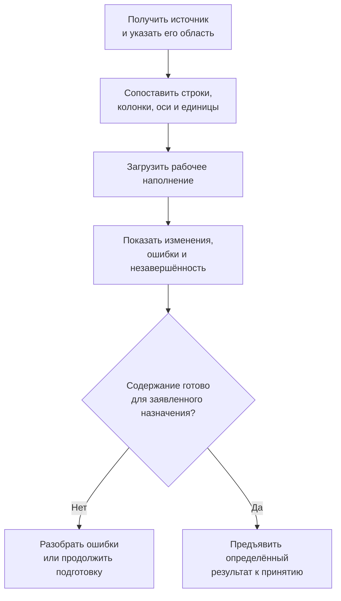
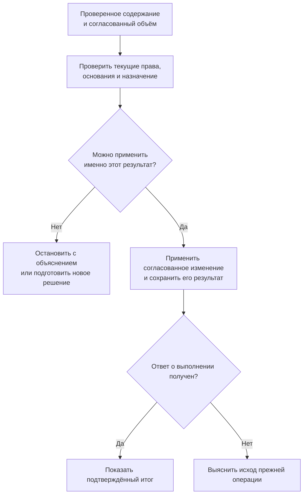

# Как табличные данные проходят от источника до принятого результата

## Задача этой главы

Справочная таблица становится производственно значимой не тогда, когда удалось открыть файл, а когда предприятие понимает, откуда взяты значения, кто их проверил, какие именно сведения приняты и что изменится у потребителей. Эта глава разбирает общий процесс для [справочников строк](01-reference-tables.md), [полных сеток](02-multidimensional-tables.md) и [карт сопоставлений](03-coordinate-maps.md).

**Статус: принятое направление и программа реализации на 6 сентября 2026 года.** Здесь описывается будущий продуктовый процесс. Простые доказательства правильной адресации и истории входят в раннюю переработку фундамента; промышленный редактор, все форматы импорта и сложные вычисления ещё предстоит создавать.

## Сначала определить, что именно меняется

Исправление коэффициента, добавление материала в программу и перестановка столбцов выглядят похожими действиями в редакторе, но имеют разные последствия. Прикладное рабочее место должно помогать пользователю различать их до подтверждения.

| Намерение | Предметный результат | Чего действие не делает само |
|---|---|---|
| Исправить значение в нескольких клетках | Изменяется рабочее содержание или разрешённая оперативная запись | Не публикует всю таблицу |
| Загрузить новую таблицу поставщика | Получается проверяемое поступление данных | Не признаёт все сведения доверенными |
| Принять подготовленный справочник | Закрепляется конкретное содержание для применения | Не переписывает прежние расчёты |
| Добавить температуру в программу | Меняется состав оси нового содержания | Не подтверждает новые испытания |
| Добавить ось «среда» | Меняется сама форма и адрес точки | Не размножает старые значения как доказанные |
| Переставить столбцы | Меняется представление | Не создаёт новую редакцию инженерных данных |
| Обновить карточки из справочника | Производится отдельное согласованное изменение карточек | Не происходит от простого поиска строки |

Не каждому набору нужен инженерный маршрут. Заводской управляемый справочник может иметь рабочее состояние и отдельную публикацию. Оперативный набор может правиться по своим правилам без объявления новой инженерной версии; для доказательного потребления его согласованное содержание закрепляется отдельно. Протокол измерения может изначально быть неизменяемым фактом. Эти варианты используют [общий объектный фундамент](../object-foundation/README.md), а не отдельную систему версий таблиц.

## Роли и исходные условия

Ответственный за источник знает, откуда поступают сведения и для какой области они считаются авторитетными. Ответственный за справочник определяет форму, правила переноса и корпоративные уточнения. Предметный проверяющий оценивает пригодность для применения. Администратор отвечает за разрешённую установку новой формы, когда изменяется не только содержание. Роли могут совмещаться, но право посмотреть таблицу не означает права принять её или изменить чужой источник.

До начала загрузки фиксируются источник и его редакция, перечень переносимых разделов, смысл единиц и пустых полей, способ сопоставления строк, а также ожидаемый результат. Это может быть только подготовка, рабочая правка или кандидат на официальное принятие. Одно и то же поступление нельзя одновременно трактовать как независимое пополнение и полную замену источника.

## Получение, сопоставление и принятие — отдельные этапы

Получение файла означает только, что источник доступен. Разбор показывает, как он прочитан. Сопоставление связывает внешние записи с понятиями Interlink. Рабочая загрузка сохраняет промежуточный результат, который ещё может содержать ошибки. Лишь после проверки становится возможно принять конкретное содержание.

Строки подготовки не выдаются обычным потребителям как уже опубликованный справочник. Участник с правом разбирать ошибки не получает автоматически право применять спорные сведения в изделиях. Для согласования должны быть доступны исходное поступление, сравнение с прежним содержанием и понятный список вопросов.

Количество прочитанных строк не является количеством принятых значений. Одна исходная строка может описывать несколько диаметров и после разрешённого преобразования дать несколько координат. Несколько протоколов могут образовать основания одной итоговой клетки. Эти соответствия нужно сохранить, чтобы позднее объяснить происхождение результата.

## Почему пропущенная строка не всегда удаляется

| Что поступило | Как понимать отсутствие прежней строки |
|---|---|
| Отдельные новые или исправленные записи | Источник ничего не сообщил об остальных; они сохраняются |
| Последовательность изменений | Выбытие должно быть явно обозначено как изменение |
| Подтверждённая полная замена объявленного раздела | Отсутствие может означать выбытие из этого раздела; результат заранее показывается |
| Незавершённая или оборванная выгрузка | Состав неизвестен; пропуск не считается удалением |

Название файла «полный каталог» не доказывает полноту. Нужны правила источника, границы выгрузки и подтверждение завершённости. Если поставщик прислал исправления для восьмидесяти из пятисот типоразмеров, остальные четыреста двадцать не исчезают.

Также различаются «поле не затронуто», «значение очищено», «показатель неизвестен», «записан ноль» и «клетка удалена». Пустая клетка исходного файла не определяет нужное действие без правил переноса. Предварительный просмотр должен показывать получившийся смысл, а не только одинаково пустые клетки.

## Массовая правка согласуется для определённого набора

Технолог выделил сто двадцать клеток и предложил их исправление. Пока он получал согласование, коллега добавил ещё двадцать подходящих по тому же фильтру клеток. Старое одобрение относится к исходным ста двадцати, а не к повторному выполнению фильтра, которое теперь возвращает сто сорок.

Поэтому для согласуемого изменения сохраняются фактический состав выбранных строк или координат и основания правки. Если предприятие действительно хочет операцию «изменить всё подходящее на момент выполнения», это иной явно разрешённый режим с собственными условиями. Его нельзя представить как незаметную оптимизацию прежнего согласованного списка.

Между двумя правками возможен конфликт даже при разных клетках: одна меняет состав осей, другая — показатели прежней программы. Первый вариант реализации может потребовать повторного рассмотрения всего рабочего набора. Более тонкая совместная работа возможна позднее, но не должна позволять собирать одну принятую таблицу из взаимно несогласованных частей.

## Ручное уточнение предприятия не теряется при обновлении источника

Исходная строка поставщика, корпоративное ограничение и конкретное использование — разные сведения. Предприятие может запретить часть покрытий для определённого производства, не удаляя их из исходного размерного ряда. Повторная загрузка поставщика не отменяет такой запрет.

Если сотрудник исправил ошибочную массу, сохраняются автор, причина, область и основание ручного уточнения. Новое поступление показывает сравнение: что сообщил поставщик, какое значение было принято локально и почему. Нельзя ни молча затереть ручную правку, ни навсегда игнорировать поставщика по неявному правилу. В начальном процессе спор может разбирать человек; автоматические приоритеты потребуют отдельного подтверждённого договора.

## Принятие и реакция на сбой

Содержание, которое проверял согласующий, не должно незаметно измениться перед принятием. Новая неиспользованная редакция внешнего правила сама по себе не отменяет согласование точных данных. Но обязательный отзыв допуска, утрата полномочий или явное требование использовать только актуальный источник могут остановить новое применение.

Потеря связи не означает, что операция отменена. Рабочее место должно сначала выяснить исход того же намерения по авторитетной истории. Повторять публикацию как новое действие без этого опасно: первый результат мог уже сохраниться. Если передача во внешнюю систему дала частичный отказ, локальное принятие и внешнее получение показываются раздельно; успешная запись в Interlink не доказывает успешную синхронизацию другого продукта.

Потребитель должен видеть подтверждённый итог: принято, изменений не требовалось, обнаружен конфликт, данные неприменимы к данной цели либо исполнение ещё не завершено. Точные названия сообщений спроектирует приложение. Ни часть принятого файла, ни успешно прочитанное поступление не выдаются за успешное завершение всей заявленной операции.

## Что происходит при изменении формы

Добавление оси, изменение типа результата или правил единиц требует согласованного изменения модели. Оно не эквивалентно ручному добавлению колонки в открытой таблице. Нужно решить, как читать прежнее содержание и что делать с незавершёнными загрузками, рабочими правками и согласованиями.

Возможны совместимое продолжение работы, объяснённое преобразование с проверкой либо сохранение старого состояния для чтения с запретом прежнего способа применения. Система не должна принимать старый результат по новой форме только потому, что названия колонок совпали. Процесс установки и окно изменения определяются общими правилами [развития модели](../data-structure/14-model-lifecycle-and-user-work.md).

Первый безопасный путь такой установки предусматривает регламентное обслуживание: заранее оцениваются последствия, новые операции временно не допускаются, начатые завершаются или останавливаются по правилам, затем выполняются переход и проверка. Только подтверждённый результат открывается совместимым приложениям. Частично перенесённая форма не выдаётся за успешно установленную. Отдельные будущие способы перехода без общего перерыва потребуют собственных доказательств и не обещаются для любого изменения большой сетки.

Переименование подписи обычно не меняет идентичность члена оси. Слияние двух членов может свести разные результаты к одной координате и требует решения. Удаление оси также способно объединить прежде различные клетки; правило «оставить последнюю строку» недопустимо. История удерживает смысл прежних осей, единиц и необходимых вычислений в пределах принятой политики хранения.

## Пример 1. Поставщик исправил массу, предприятие уже внесло уточнение

Завод использует размерный ряд крепежа для крышек редукторов. Сотрудник ранее исправил массу одного исполнения после контрольного взвешивания и сохранил основание. Приходит частичный файл поставщика, содержащий эту строку и ещё несколько исправлений.

Ответственный выбирает режим отдельных изменений. Незатронутые строки сохраняются. Для спорной массы показываются исходное, локально принятое и новое внешнее значения с источниками. Проверяющий решает, какое значение принять для дальнейшего использования и требуется ли пересмотреть незавершённые расчёты массы изделия.

Принятие нового справочника не меняет уже выпущенную спецификацию автоматически. Если правка должна распространиться в карточки, составляется отдельный перечень целей. Поиск одной строки и массовая синхронизация остаются разными действиями.

## Пример 2. Лаборатория расширила температурную программу

В рабочей программе два материала, три температуры и две толщины — двенадцать клеток. Согласующий рассматривает их для предварительного расчёта. В это время лаборатория добавляет четвёртую температуру в новую подготовку, для которой нужны ещё четыре точки.

Прежняя проверка двенадцати клеток не объявляет готовой новую программу из шестнадцати. Новые точки видны как незавершённые; неизвестные показатели не становятся нулём. Если прежнее содержание отдельно принято для ограниченного назначения, оно остаётся воспроизводимым со своей областью, а расширенная программа проходит собственную проверку.

Если затем требуется добавить ось «атмосфера испытаний», нужно определить относимость старых результатов. Дублирование прежних чисел на обе атмосферы не создаёт доказательств. Рабочие правки либо преобразуются по объяснённому правилу, либо сохраняются для чтения до решения.

## Пример 3. Повторная загрузка карты после потери связи

Технолог принял исправления карты выбора клапанов для насосных станций, но рабочее место не получило ответ. Он возвращается к прежней операции. Система устанавливает, сохранился ли результат, и показывает именно его; новая редакция не создаётся только из-за повторного нажатия.

Одновременно другой сотрудник пытается принять изменение одной из тех же координат. Если подготовленное основание уже изменилось, система показывает конфликт, а не собирает скрытый смешанный результат. Подтверждение нового решения относится к заново просмотренному содержанию.

Заказ, ранее выпущенный по старой карте, остаётся связан со своей редакцией и фактически использованным содержанием клапана. Новая карта может использоваться при перепланировании живого заказа, но не пересчитывает прежнюю точную передачу. Доступ к историческому основанию при этом проверяется по нынешним полномочиям.

## Как подтверждается перенос IPS и IMBASE

Предметные потребности справочника — каталог, размерный ряд, вычисляемые поля и управляемое использование — не изобретены заново. Официальное описание IPS IMBase подтверждает разделение общих данных каталога и таблиц типоразмеров, а также вычисляемые поля. Оно не доказывает наличие произвольных полных многомерных сеток или тождество алгоритмов всех поколений IMBASE. [Источник: возможности IPS IMBase](https://intermech.ru/ips_imbase2.html).

При переносе проверяются выбранное исполнение каталога и устойчивая строка, общая таблица нескольких исполнений, допустимая связь только с разделом, формулы, ограничения и обновление уже связанных карточек. Существующая исходная связь не заменяется новым поиском без основания. Порядок выбора при нескольких совпадениях и правила вычисления формул проверяются на исходных результатах целевой установки.

Для каждой ошибки нужен понятный класс: потеря связи, неверное преобразование единиц, неподдержанная формула, неоднозначный источник либо осознанно изменяемый нативный процесс. Нельзя считать перенос завершённым только по совпадению количества строк.

## Поэтапная приёмка

| Когда проверяется | Обязательный результат |
|---|---|
| Ранняя переработка фундамента | Малые примеры трёх форм, устойчивые ключи, конечные оси, разные смыслы пустоты и точности |
| Согласование общего пути данных | Изменения, чтение, импорт, историческое основание и безопасная эволюция работают совместно |
| Прикладное покрытие IPS | Каталоги, размерные ряды, формулы, синхронизация и обязательные подборы дают подтверждённый результат |
| Расширение по измеренной потребности | Сложные вычисления, условные области, большие массивы и дополнительные способы хранения |

Контрольные случаи: правильное число строк при повторе координаты; новая ось после согласования; неизвестные показатели в полной сетке; оборванный полный импорт; ручное уточнение поверх источника; конфликт двух принятий; повтор после потерянного ответа; историческая карта с изменившейся целью; скрытые данные при отрицательном поиске.

Нагрузочная проверка измеряет отдельную клетку, пакет точек, срез и диапазон на реальных объёмах. Не требуется передавать агенту всю таблицу ради одного решения. Но структура хранения сама по себе не обещает фиксированное превосходство над IPS или одинаковую скорость всех запросов.

## Основания и связанные документы

Основания: [IL-TD], [IL-SC], [IL-DATA-MODEL], [IL-PLAN-V2]; уровни доказательности — в [реестре источников](../knowledge/15-source-register.md). Вопросы исходной установки рассматриваются вместе со специалистами, а не превращаются в неподтверждённые свойства IPS.

Продолжение: [путеводитель по таблицам](README.md), [применение замен](../substitution-and-compatibility/01-allowed-replacements.md), [перенос и приёмка правил](../substitution-and-compatibility/03-ips-migration-and-acceptance.md), [доказательства и история изменений](../changes/07-snapshots-evidence-and-user-history.md).
