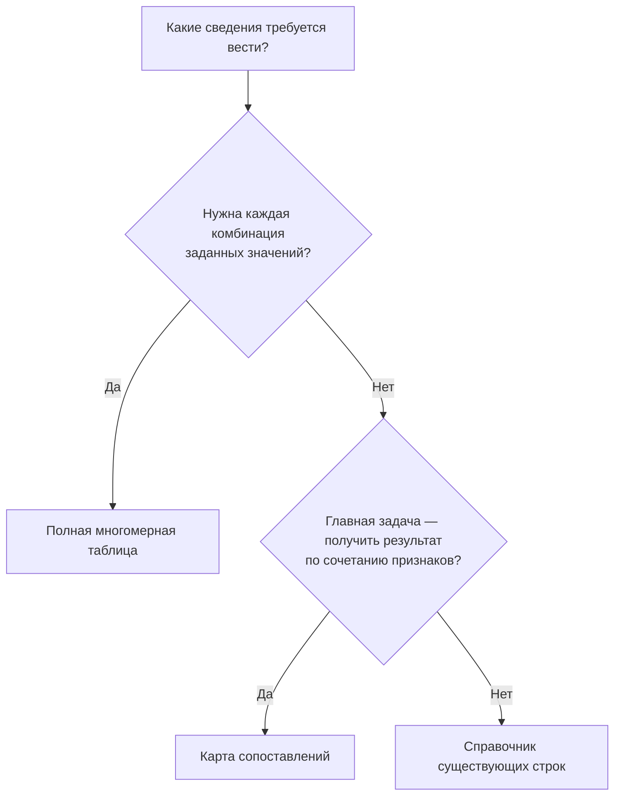

# Таблицы, справочники и многомерные сопоставления

На предприятии значительная часть инженерного знания живёт не в карточке детали, а в таблицах: размерных рядах, нормах расхода, результатах испытаний, перечнях разрешённых сочетаний. Хранить такую таблицу только вложением недостаточно, если конструктор, расчётная программа или агент должны быстро получить конкретное значение, проверить его происхождение и позднее воспроизвести принятое решение.

В целевой модели Interlink табличные сведения становятся самостоятельными управляемыми данными. Файл остаётся удобным источником и способом обмена, но для поиска коэффициента не требуется каждый раз открывать и разбирать всю книгу. При этом одинаковый вид на экране не означает одинаковых правил: справочник типоразмеров, полная сетка измерений и карта допустимых конструкций решают разные задачи.

**Состояние описания: принятое направление и план реализации на 6 сентября 2026 года.** Ниже описан будущий пользовательский процесс, а не уже доступные рабочие места. Точные пределы размера, быстродействие и полнота переноса конкретной установки IPS должны быть подтверждены испытаниями.

## Три формы — под разные обязанности данных

| Форма | На какой вопрос отвечает | Что означает незаполненное место |
|---|---|---|
| [Справочник существующих строк](01-reference-tables.md) | Какие типоразмеры, нормы или предложения действительно заданы? | Такой строки в выбранном источнике нет; все сочетания значений колонок не подразумеваются |
| [Полная многомерная таблица](02-multidimensional-tables.md) | Есть ли результат для каждой точки объявленной конечной программы? | В рабочей таблице — незавершённость; в опубликованной полной сетке — нарушение заявленной полноты |
| [Карта сопоставлений](03-coordinate-maps.md) | Какой результат задан для этого сочетания признаков? | Сопоставление не задано; запрет или разрешение требуют дополнительного правила |

Винты диаметром 6 и 8 мм могут выпускаться не во всех длинах. Поэтому таблица винтов не должна искусственно достраивать отсутствующие типоразмеры. Напротив, если лаборатория обязалась исследовать два материала при трёх температурах и двух давлениях, ожидаются все двенадцать точек. А карта «среда, диаметр, климатическое исполнение → конструкция клапана» хранит только известные сопоставления и может оставаться намеренно разреженной.

Сначала выбирается обязанность данных, затем способ их показа. Изменение строк на столбцы не превращает справочник в полную сетку. Если таблица выражает ещё и инженерный допуск, к выбранной форме добавляются правила его проверки.

## От таблицы к инженерному решению

Путь от получения исходника до согласования, повторного импорта и изменения осей собран в отдельной главе: [жизненный цикл табличных данных и приёмка](04-data-lifecycle-and-acceptance.md). Связанный предметный пакет начинается с [путеводителя по заменам и совместимости](../substitution-and-compatibility/README.md).

Само наличие строки не даёт разрешения использовать её результат в изделии. Для этого нужны ещё два связанных механизма:

- [Допустимые замены](../substitution-and-compatibility/01-allowed-replacements.md) объясняют, **что разрешено поставить вместо исходного объекта или целого комплекта**, в какой области и на каком основании.
- [Матрицы совместимости](../substitution-and-compatibility/02-compatibility-matrices.md) объясняют, **могут ли все выбранные участники работать вместе**, включая ограничения конкретных версий, материалов, режима и общих ресурсов.

Например, справочник может вернуть три уплотнения, подходящих по размерам. Перечень заменителей может разрешать два из них для данного насоса. Проверка среды и температуры может оставить одно. Подбор версии этого уплотнения остаётся обычным [подбором версий](../version-selection/README.md), а фактическая установка — отдельным [событием эксплуатации](../orders/09-units-lots-and-as-built.md). Эти этапы нельзя заменить одним зелёным цветом клетки.

## Что общее у всех форм

У набора есть понятный владелец, назначение, структура и точное содержание. Владелец — например, заводской справочник крепежа или программа испытаний. Структура определяет смысл колонок и осей, типы значений, единицы и допустимые результаты. Редакция закрепляет конкретные строки, значения и состав осей. Представление лишь решает, что показывать строками, столбцами или фильтрами.

Оси могут содержать числа с единицами, значения перечисления вроде «исполнение обычное / морское», элементы управляемого списка или ссылки на материалы и другие объекты. Не требуется заводить отдельную карточку на каждую температуру или каждое число в клетке. Карточка нужна, когда у предмета есть собственные связи, история и ответственность.

Адрес клетки составляется из её смысловых признаков, а не из номера строки на экране. «Сталь для корпуса, 100 °C, толщина 12 мм» сохраняет смысл после перестановки столбцов. Но этот адрес должен относиться к конкретному справочнику и его содержанию: одинаковая координата в двух справочниках не означает одинаковый результат.

## Как будет организована работа

Ответственный за данные выбирает установленную форму, указывает источник и создаёт рабочее наполнение. Он может вводить строки вручную или загружать их частями. Система должна показывать ошибки типов и единиц, повторяющиеся ключи, неизвестные значения, различия с прежним содержанием и границы полученной загрузки.

Рабочее сохранение не означает официальной публикации. Участники подготовки видят незавершённые данные согласно своим правам; потребители утверждённого справочника продолжают работать с прежним принятым содержанием. Если процесс требует согласования, согласующий рассматривает определённый проверенный результат. Изменение одной клетки после согласования не должно незаметно попасть под старое одобрение.

При официальном принятии закрепляются согласованные данные и их происхождение. Новая редакция становится доступна новым обращениям по правилам предприятия. Старый расчёт или заказ не пересчитывается автоматически: он должен хранить то основание, которое действительно использовал. Восстановить старые данные в работу можно; заменить этим действием историю нельзя.

Важно также различать точность самой таблицы и точность ссылок из неё. Неизменяемая карта, указывающая на «клапан такого-то семейства», сохраняет это сопоставление, но не замораживает будущие версии клапана. Для воспроизводимого выпуска отдельно закрепляется фактически использованное содержание целей и необходимых зависимостей.

## Три сквозных примера

### 1. Крепёж для подшипникового узла

Конструктор редуктора ищет винт определённого диаметра, длины и покрытия. Справочник возвращает существующие строки стандарта. Если сочетания нет, система не создаёт новый типоразмер из известных по отдельности диаметра и длины. Конструктор изменяет запрос либо рассматривает разрешённую альтернативу.

Выбранная строка даёт размеры и обозначение. Если по ней нужно создать или обновить карточку применяемой детали, это отдельное действие с сохранением источника. Более поздняя корректировка массы в справочнике не переписывает уже выпущенную спецификацию без управляемого изменения. Подробный процесс — в [справочниках](01-reference-tables.md).

### 2. Подготовка теплового расчёта насоса

Лаборатория ведёт характеристики двух материалов корпуса при трёх температурах и двух давлениях. Технолог видит двенадцать предусмотренных точек, но в одной стоит «не измерено». Программа испытаний учтена полностью, однако данных для окончательного расчёта ещё недостаточно.

После получения последнего измерения принимается новое точное содержание. Расчёт использует его с указанием источников; старый предварительный расчёт сохраняет свою неполноту и прежние входы. Если потребуется промежуточная температура, система не выдаст самопроизвольную интерполяцию за результат измерения. Это задача [полной сетки](02-multidimensional-tables.md) и отдельно разрешённой расчётной процедуры.

### 3. Комплектация насосной станции для морской площадки

Карта по среде, диаметру и исполнению предлагает два клапана. Допуск замены ограничивает выбор для данного места станции. Обычный подбор версий определяет содержание выбранного клапана, после чего проверяются фактический присоединительный размер, покрытие и условия среды.

Неудачная проверка не означает, что система может молча взять другую версию клапана. Пользователю требуется объяснённое новое предложение. Утверждённое решение относится к конкретному заказу или месту состава, а сведения о том, какой клапан действительно установлен, поступят позднее. Здесь последовательно работают [карта](03-coordinate-maps.md), [допуск замены](../substitution-and-compatibility/01-allowed-replacements.md) и [совместимость](../substitution-and-compatibility/02-compatibility-matrices.md).

## Расширение за пределы машиностроения

В одежде таблица мерок может быть полной для всех предусмотренных размеров и точек измерения, а ассортиментная карта «цвет × размер × рынок» — разреженной. Полная таблица мерок не создаёт автоматически товар каждого цвета и размера. Допустимые сочетания могут быть утверждены ещё до заведения конкретных товарных карточек.

В логистике справочник тарифов, полная таблица расстояний и карта обслуживаемых направлений также различаются. Знание расстояния не означает, что перевозчик принимает груз по этому направлению. Универсальность Interlink состоит в сохранении этих различий, а не в навязывании всем данным инженерного жизненного цикла.

## Почему это важно для нагрузки и агентов

Планируется хранить индексируемые значения в структурированном виде. Поэтому система сможет запрашивать одну клетку, небольшую группу точек, диапазон показателей или срез по выбранным осям. Агенту не потребуется получать весь справочник ради одного решения. Это создаёт основу для высокой нагрузки и управляемого объёма ответов, но не является обещанием одинаковой скорости при любом количестве измерений.

Для действительно больших числовых массивов предусмотрено дальнейшее развитие специализированного хранения. Оно не должно менять смысл адреса, терять историю или скрывать неполноту. Продвинутые вычисления и такие массивы не служат причиной отложить обязательные справочные сценарии IPS: типоразмеры, заменители материалов, подбор клея и покрытий.

Агент использует те же ограничения доступа и основания решений, что человек. Текст «подходит» в его ответе не заменяет системной проверки. Неполная выдача, скрытые строки и ошибка чтения не превращаются в доказательство отсутствия данных.

## Что предстоит подтвердить

Приёмка должна показать не только красивую таблицу, но и устойчивые адреса после перестановки строк, управляемую загрузку без потери данных, различение неизвестности и запрета, историческое воспроизведение расчёта, а также корректное поведение при конфликте двух правок. Для переноса IPS дополнительно нужны реальные примеры источников, формул, правил подбора и спорных пустых клеток.

Стартовать можно с ближайшей задачи: [справочная таблица](01-reference-tables.md), [полная многомерная сетка](02-multidimensional-tables.md) или [разреженная карта](03-coordinate-maps.md). Общая модель объясняется в [путеводителе по данным](../data-structure/README.md), состояние работ — в [дорожной карте](../knowledge/02-current-state-and-roadmap.md).

## Основания и дальнейшая проверка

Описание сверено с принятой архитектурой на 6 сентября 2026 года. Основания: [IL-TD] — табличные формы и их инварианты; [IL-SC] — смысл допусков и совместимости; [IL-DATA-MODEL] — принадлежность данных и точные основания; [IL-PLAN-V2] — порядок опытного подтверждения. Уровни доказательности и исходные документы перечислены в [реестре источников](../knowledge/15-source-register.md).

Полный путь загрузки, принятия, изменения осей и воспроизведения разбирается в [главе о жизненном цикле и приёмке](04-data-lifecycle-and-acceptance.md). Малые проверки ключей, конечных осей, точного содержания и отрицательных результатов нужны на раннем этапе переработки фундамента; они не откладываются целиком за опытный образец. Полные отраслевые рабочие места и большие специализированные массивы относятся к следующим этапам.
