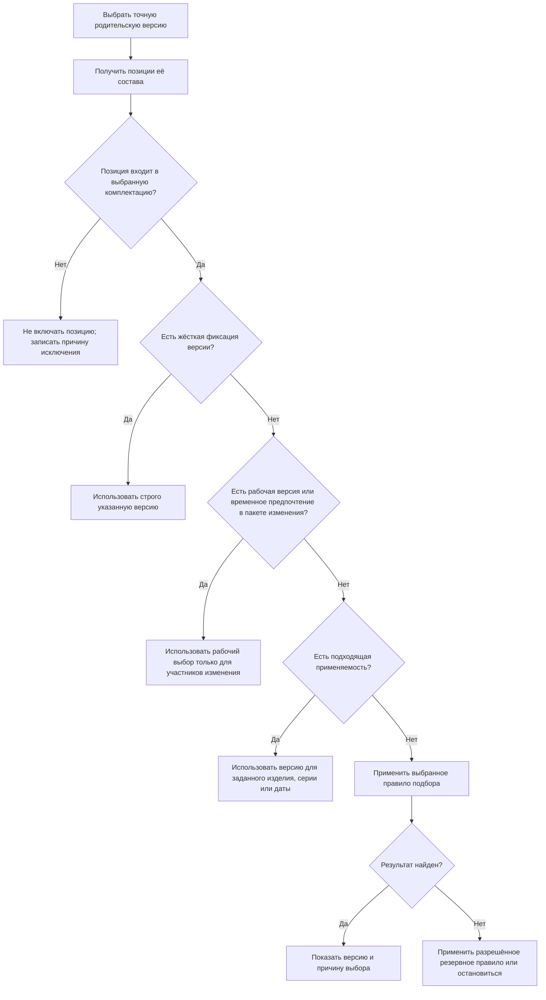

# Что изменилось в подборе версий относительно IPS

## Почему подбор версий является центральной функцией IPS

В машиностроительном PLM состав редко является простым перечнем неизменных деталей. Одна сборочная единица может использоваться в нескольких изделиях, иметь несколько выпущенных версий, проходить очередное изменение и одновременно продолжать применяться в уже запущенных сериях.

Поэтому в IPS позиция состава обычно связывает версию родительской сборки не с единственной дочерней версией, а с дочерним объектом. Когда пользователь открывает дерево, система должна определить, какую версию этого объекта показать.

Например, версия 05 редуктора `РЦ-250` содержит объект `Вал выходной РЦ-250.02.003`. У вала есть версии 01, 02 и 03. Сам факт включения вала в редуктор остаётся прежним, но подходящая версия зависит от того, что делает пользователь:

- рассматривает выпущенное изделие;
- работает над извещением;
- формирует заказ для серии 120;
- проверяет новый вариант технологической подготовки;
- просматривает историю.

Механизм подбора позволяет не выпускать новую версию каждой родительской сборки только потому, что появилась новая версия стандартного или заимствованного компонента. Это сильная сторона IPS, и Interlink её сохраняет.

## Почему прежний механизм трудно объяснять и проверять

В IPS конечный результат складывается из нескольких механизмов:

1. жёсткая конкретизация;
2. применяемость по головному изделию, серии или дате;
3. активный и связанный контекст редактирования;
4. мягкая конкретизация;
5. текущее правило подбора;
6. дополнительный критерий, если основное правило не нашло подходящей версии.

В отдельных исторических материалах применяемость ставится раньше конкретизации, а конфигуратор выделяется отдельным шагом. Это может быть следствием развития продукта, различия модулей или конфигураций заказчиков.

Для пользователя проблема проявляется не в самом наличии нескольких механизмов, а в недостаточной явности:

- результат может зависеть от выбранного правила в конкретном окне;
- фоновая операция может использовать не тот контекст, который ожидал пользователь;
- значок «не совсем подходящая версия» легко не заметить;
- контекст состава, применяемость и правило иногда воспринимаются как один общий фильтр;
- старый заказ опасно пересчитать по новым правилам;
- одинаковая фраза «актуальная версия» у разных специалистов означает базовую, последнюю, выпущенную или применимую версию.

## Что сохраняется без изменения предметного смысла

Interlink не отменяет плавающий состав. В новой системе по-прежнему можно:

- связать родительскую версию с дочерним объектом без немедленного выбора дочерней версии;
- жёстко закрепить отдельную позицию за конкретной версией;
- показать участнику изменения его будущую рабочую версию;
- выбрать версию по головному изделию, серии и дате;
- выбрать базовую, последнюю или выпущенную версию;
- применять корпоративные правила;
- временно предпочесть версию во время проработки;
- показать резервную версию с предупреждением;
- получить точный неизменяемый состав для производства.

Изменяется не набор основных возможностей, а способ их организации и объяснения.

## Главное изменение: каждый механизм отвечает на один вопрос

| Вопрос | Средство Interlink |
|---|---|
| Должна ли позиция входить в выбранную комплектацию? | Условие включения позиции. |
| Какой объект должен быть установлен: исходный или аналог? | Предметное правило выбора объекта. |
| Требуется ли строго определённая версия? | Жёсткая фиксация версии. |
| Есть ли будущая рабочая версия в текущем изменении? | Пакет изменения. |
| Какая версия действует для изделия, серии или даты? | Применяемость. |
| Какую версию выбрать среди остальных допустимых? | Правило подбора. |
| Что делать, если основное правило ничего не нашло? | Резервное правило или сообщение «версия не найдена». |
| Как сохранить результат для производства? | Неизменяемый снимок состава. |

Такое разделение позволяет в любой позиции ответить не только «что выбрано», но и «почему выбран именно этот объект и именно эта версия».

## Новый порядок формирования состава

Для краткости этот порядок можно записать одной строкой: **снимок состава → жёсткая фиксация → пакет изменения → применяемость → правило → резервный выбор или отсутствие версии**.

Продуктовому специалисту важен не сам порядок терминов, а его практическое следствие: **более сильное и более конкретное инженерное решение не может быть незаметно заменено общим правилом**.

## Почему рабочая версия ставится выше применяемости

Это наиболее заметное отличие от консолидированного порядка IPS.

Представим, что версия 02 корпуса редуктора выпущена и применяется для текущих серий. Конструктор выпускает извещение и создаёт рабочую версию 03, в которой усиливает ребро корпуса. Если применяемость всегда проверяется раньше рабочего контекста, конструктор продолжает видеть версию 02 и не может проверить будущий состав в целом.

В Interlink пользователь, явно открывший пакет изменения, видит рабочую версию 03. Все остальные пользователи и производственные системы продолжают видеть выпущенную применимую версию 02.

Это безопасно по следующим причинам:

- рабочая версия видна только при явном выборе пакета изменения;
- она не появляется в производственном чтении;
- перед проведением изменения проверяются будущая применяемость и согласованность состава;
- неизменяемый снимок заказа никогда не содержит рабочие версии.

## Три прикладных примера

### Пример 1. Подшипник редуктора

В редукторе `РЦ-250` используется подшипник `3620`.

- версия 01 разрешена для серий 001–100;
- версия 02 — для серий начиная со 101;
- в версии 03 конструктор проверяет нового поставщика.

Для заказа на серию 145 система выбирает версию 02 по применяемости. Конструктор с открытым пакетом изменения видит версию 03. Если в конкретной позиции конструкторской спецификации жёстко указана версия 01, система использует версию 01 и отдельно показывает конфликт с общей применяемостью.

### Пример 2. Электродвигатель насосного агрегата

Насосный агрегат `АН-160` может комплектоваться двигателем двух производителей. Решение о производителе относится к выбору аналога или варианта комплектации. После выбора объекта двигателя система отдельно выбирает его версию — например, последнюю выпущенную, разрешённую для напряжения 400 В.

Это два разных решения:

1. какой двигатель использовать;
2. какую версию документации и характеристик выбранного двигателя считать действующей.

### Пример 3. Точная передача станка в производство

Для станка `СТ-500` сформирована комплектация с выбранной системой ЧПУ, ограждением, электрошкафом и комплектом кабелей. Пока заказ планируется, состав может изменяться. После передачи цеху публикуется полный снимок состава.

Если позже появилась новая версия кабельного комплекта, старый заказ не пересчитывается. Для следующей передачи создаётся новый снимок.

## Что становится явным для пользователя

### Причина выбора

Вместо одного общего статуса интерфейс может показывать понятную причину:

- «версия жёстко зафиксирована в позиции»;
- «показана рабочая версия пакета изменения ИИ-2028-14»;
- «версия действует для серий 101–200»;
- «выбрана назначенная основная версия»;
- «выбрана последняя выпущенная версия»;
- «основное правило не дало результата, показана резервная версия»;
- «подходящая версия отсутствует».

### Исходные условия

Головное изделие, серия, дата, комплектация, правило и пакет изменения передаются как явные условия подбора. Они не должны незаметно меняться из-за переключения другого окна.

### Различие живого состава и свидетельства

Живой состав отвечает на вопрос «что правильно сейчас при этих условиях?». Снимок состава отвечает на вопрос «что было точно передано или выпущено тогда?». Эти ответы не следует смешивать.

## Что сознательно не переносится из IPS буквально

### Скрытое состояние окна

Пользователь по-прежнему сможет выбрать правило или рабочий контекст в интерфейсе. Но интерфейс передаст этот выбор как часть конкретного запроса. Сервер не будет полагаться на неявное «текущее правило окна».

### Кодированная строка применяемости

Диапазоны изделий, серий и дат становятся самостоятельными проверяемыми данными. Это позволяет заранее обнаруживать пересечения и разрывы.

### Неявный резервный выбор

Если основное правило не нашло подходящую версию, система либо применяет заранее разрешённое резервное правило и показывает предупреждение, либо сообщает об отсутствии версии. Резервный результат не считается обычным успешным подбором.

### Смешение разных видов вариантности

Конфигуратор определяет, входит ли позиция в состав. Допустимая замена выбирает вариант позиций внутри конкретной сборки. Аналог меняет сам используемый объект. Правило подбора выбирает версию уже выбранного объекта. Для пользователя это может выглядеть как один мастер комплектации, но внутри решения остаются разделёнными.

## Как будет проверяться эквивалентность IPS

Одного совпадения названий недостаточно. Для каждой установки нужен набор реальных примеров:

- позиции с жёсткой и мягкой конкретизацией;
- несколько связанных контекстов редактирования;
- границы серий и дат;
- базовая, последняя и выпущенная версии одного объекта;
- правила, дающие «не совсем подходящий» результат;
- повторно используемые подсборки;
- конфигурации с опциями и N:M-заменами;
- ранее переданные производственные заказы.

Одинаковые исходные данные следует прогнать через целевую установку IPS и Interlink, сравнить выбранные версии и причины расхождения. Если IPS ведёт себя по-разному в разных версиях или модулях, это должно быть оформлено как профиль заказчика, а не скрыто в общей логике.

## Текущее состояние реализации

Описанный механизм является целевым продуктовым поведением. Основные понятия и порядок уже приняты, но полный промышленный механизм подбора ещё реализуется поэтапно.

Поэтому этот документ не является утверждением, что все сценарии уже доступны пользователю. Он служит:

- объяснением замысла;
- основой разговора со специалистом IPS;
- перечнем требований к реализации;
- основой будущих приёмочных испытаний;
- средством фиксации открытых вопросов конкретного предприятия.

## Дальнейшее чтение

- [Точная фиксация версии](02-hard-concretion-pin.md)
- [Применяемость](03-effectivity-series-date.md)
- [Работа внутри пакета изменения](04-editing-context-changeset.md)
- [Настраиваемое правило](10-custom-selection-rule.md)
- [Точный состав производственного заказа](16-order-and-snapshot.md)
- [Сквозной сценарий](17-end-to-end-resolution.md)

Основания: [IPS-A04], [IPS-K03], [IPS-M03], [IL-PLM], [IL-VERS-SPEC]. Расшифровка источников приведена в [реестре](../knowledge/15-source-register.md).
