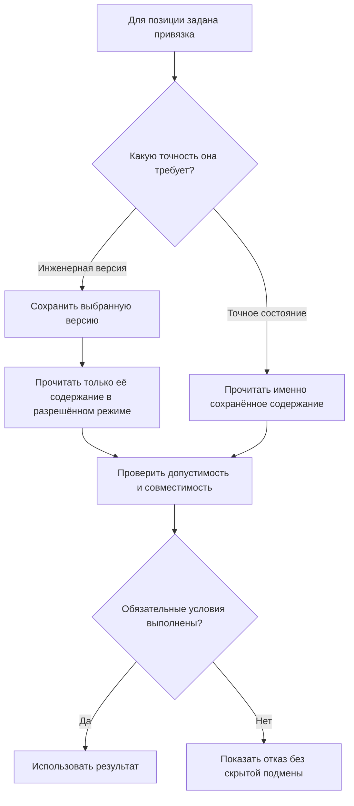
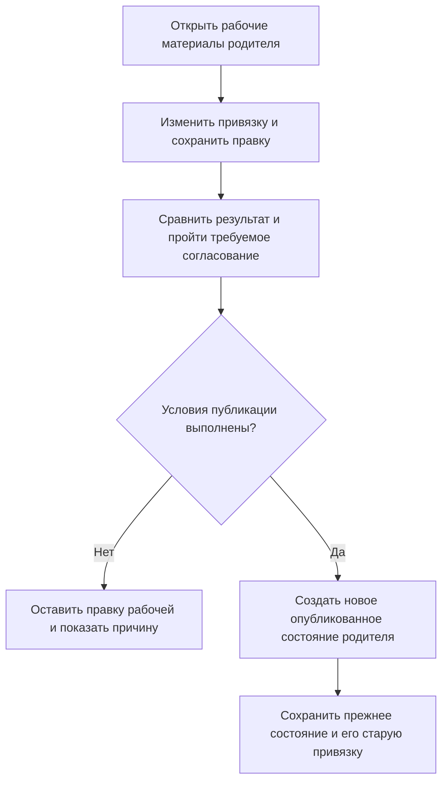

# Жёсткая привязка к инженерной версии и фиксация точного содержания

## Почему теперь нужны два понятия

Инженер может сказать: «В этом редукторе должна оставаться спецификация версии 05». А может потребовать: «Для испытания использовать именно тот комплект файлов версии 05, который был подписан 14 марта». Это разные требования.

В первом случае запрещена подмена инженерной версии, но в разрешённом процессе у самой версии 05 может появиться исправленное содержание. Во втором нельзя подменить даже содержание **той же версии**. В Interlink оба случая предусмотрены явно. Их смешение в прежнем описании делало невозможным одновременно сохранить привычную работу IPS и точные доказательства.

## Что сохраняется из жёсткой конкретизации IPS

Жёсткая конкретизация IPS закрепляет выбранную дочернюю версию и не позволяет обычному правилу заменить её последней или базовой. Interlink должен сохранить этот результат.

Однако при переносе требуется установить, что означает исходная ссылка. Ссылка на инженерную версию и архивная ссылка на конкретное содержание получают разную точность. Уже точные исторические ссылки нельзя ослабить, превратив их в выбор действующего содержания версии.

## Две формы привязки

| Форма | Что остаётся неизменным при подборе | Что ещё определяется |
|---|---|---|
| Жёсткая привязка к инженерной версии | Например, всегда «Спецификация редуктора, версия 05» | Какое содержание этой версии читать: опубликованное или явно доступное рабочее |
| Фиксация точного состояния | Конкретное неизменяемое содержание версии 05 с точными файлами и значениями | Никакой новый подбор содержания не выполняется; проверяются доступ и допустимость операции |

Жёсткая привязка к версии не разрешает взять рабочую копию другой версии. Если закреплена 05, рабочая 06 не может её заслонить. Но в разрешённом режиме редактирования может читаться рабочее содержание самой 05.

Точная фиксация не допускает ни рабочей копии, ни более позднего опубликованного состояния 05. Это подходящая форма для подписанного документа, расчётного основания и архивного свидетельства.

## Как будет работать пользователь

Способ назначения зависит от процесса. В IPS-совместимом режиме жёсткую привязку устанавливает предусмотренная системная или процессная команда; обычный разрешённый пользовательский выбор версии относится к мягкой конкретизации. Нельзя выдать свободное ручное назначение жёстких ссылок за точное повторение интерфейса IPS.

Прикладной продукт на Interlink может отдельно разрешить ручное назначение жёсткой привязки уполномоченному конструктору. Тогда он открывает конкретную позицию родительского состава и указывает, какое требование фиксирует: инженерную версию или точное содержание. Интерфейс должен показывать это различие словами, а не только одним значком замка. Допуск к такой команде не отменяет согласование и ограничения выпуска.

Изменение записывается в рабочие материалы родителя. Простое сохранение не переписывает опубликованный состав. После проверки и разрешённой публикации появляется новое состояние родителя с новой привязкой; прежнее состояние сохраняет прежнее решение.

Главный смысл: привязка отвечает за точность выбора, а проверка допустимости — за право использовать выбранное в данной операции. Запрещённое состояние не заменяется молча другим.

## Пример 1. Спецификация сборочной единицы

Редуктор версии 05 связан со спецификацией инженерной версии 05. Началась разработка спецификации 06 с новыми крепёжными элементами. Жёсткая привязка сохраняет 05 даже при режиме «Последняя версия».

Затем в самой спецификации 05 разрешено исправление технической надписи без создания новой инженерной версии. После публикации нового содержания живой просмотр действующего состояния 05 может показать исправление. Это не нарушение привязки: инженерная версия осталась той же.

Если предприятие требует неизменности именно утверждённого комплекта, связь должна фиксировать точное состояние либо использовать снимок комплекта. Одного совпадающего номера «05» для такого требования недостаточно.

## Пример 2. Исходные документы извещения

Извещение «Модернизация подшипникового узла» изменяет вал версии 02, крышку версии 04 и сборочный чертёж версии 05. Рецензент должен видеть конкретное исходное содержание, по которому принято решение.

Здесь выбираются точные состояния документов. Параллельное исправление крышки 04 или выпуск крышки 05 не подменяет материал старого извещения. Сохраняется ответ не только «какая версия», но и «что именно было рассмотрено».

При подготовке будущего совместного выпуска часть материалов ещё может быть рабочей. До публикации это явно рабочие ссылки. Если процесс выпускает их вместе, система согласованно сопоставляет их с новыми опубликованными состояниями. В официальном результате не остаётся ссылки на исчезающую рабочую копию.

## Пример 3. Сертифицированный тормозной модуль

В подъёмном механизме используется тормозной модуль версии 03. Поставщик выпускает 04 с другим фрикционным материалом. Жёсткая привязка к 03 не даёт общему правилу заменить её на 04.

Протокол испытаний при этом относится к определённому состоянию версии 03. Если поставщик исправит параметры или файлы той же версии, прежний протокол не доказывает безопасность нового содержания. Для сертифицированного комплекта фиксируют точное состояние и область испытания.

Если позднее версия 03 отозвана для новых установок, исторический протокол остаётся читаемым при наличии доступа, но новый выпуск может быть заблокирован. Сохранённое доказательство не равно бессрочному разрешению применения.

## Пример 4. Две несовместимые жёсткие привязки

Внутри типовой насосной установки жёстко задан двигатель версии 02. Конфигурация специального заказа требует двигатель версии 03 на том же месте использования.

Система не выбирает «более локальное» решение автоматически: два обязательных требования противоречат друг другу. Нужно изменить разрешённое исходное решение или пересмотреть заказ.

Если одно требование задаёт версию 02, а другое — точное состояние этой же версии 02, они могут быть совместимы: более точный адрес удовлетворяет обоим. Два разных точных состояния одного места использования автоматически совместимыми не становятся.

## Два строгих режима вместо неоднозначного «только фиксации»

Для проверки инженерных привязок можно потребовать, чтобы каждая нужная позиция имела жёсткое указание версии или точного состояния. Но такой режим ещё не гарантирует неизменности содержания: привязка к инженерной версии допускает предусмотренный способ чтения её состояний.

Для действительно точного чтения нужен более строгий режим: **только точные состояния**. Если позиция содержит лишь номер инженерной версии, проверка заканчивается отсутствием требуемой точности. Контекст, применяемость и резерв не дополняют её незаметно.

Оба режима отличаются от готового снимка. Снимок уже хранит согласованный результат и открывается без повторного живого подбора.

## Как изменить привязку

Уполномоченный пользователь создаёт рабочую правку родителя, показывает сравнение старой и новой привязки, проверяет совместимость и влияние на зависимости. При необходимости запускается формальный пакет изменения. Сохранение правки, согласование и публикация остаются отдельными действиями.

Не каждая такая правка требует новой **инженерной версии** родителя: правила предприятия могут разрешать новое состояние той же версии. Но опубликованное прежнее содержание не переписывается. Если процесс требует новую инженерную версию, она создаётся явной командой.

Эта схема показывает путь изменения, в отличие от первой схемы чтения. Ни сохранение, ни выбор другого номера в форме не переписывают официальное прошлое.

## Что важно проверить при переносе IPS

Нужно разобрать типы связей, системные и пользовательские команды, правила работы с рабочими копиями и архивные ссылки. Особенно важен вопрос: может ли исходная «конкретная версия» менять содержание без смены своего пользовательского номера?

Приёмка:

1. Новая инженерная версия не подменяет жёсткую привязку.
2. Рабочая копия другой версии не проходит через неё.
3. Точная ссылка не меняется после публикации нового содержания той же версии.
4. Два несовместимых жёстких требования дают конфликт.
5. Строгое точное чтение отвергает привязку только к инженерной версии.
6. Проверка допустимости не подменяет выбранное молча.
7. Перепривязка создаёт новый официальный результат, не изменяя старый.
8. В IPS-совместимом процессе жёсткую привязку назначает предусмотренная команда; отдельное разрешение ручного назначения не предоставляется автоматически всем пользователям.

## Где заканчивается гарантия отдельной позиции

Одна точная ссылка не делает точным всё изделие. В редукторе можно закрепить содержание спецификации, оставить подшипники под применяемостью, а крепёж выбирать по правилу последней выпущенной версии. Первая позиция будет неизменной, но результат остальных может измениться при новом живом расчёте.

Для производственной передачи требуется отдельный снимок всей объявленной области: корень, нужные уровни, точное содержание участников и необходимые файлы. Если в область не вошла технологическая оснастка, нельзя заявлять, что снимок зафиксировал и её. Пользователь должен видеть границу сохранённого комплекта.

Проверка принадлежности также обязательна. Нельзя закрепить состояние другого объекта, даже если его обозначение или номер версии совпадает. Ошибочная ссылка на крышку однотипного, но другого редуктора должна быть отвергнута до публикации, а не обнаружена при чтении архива.

## Привязка противоречит применяемости: как это разбирать

Допустим, позиция редуктора удерживает уплотнение версии 01, а применяемость для серии 150 указывает 02. Причина выбора остаётся «жёсткая привязка к 01». Отдельно оценивается возможность применения 01 для этой серии и цели.

В исследовательском просмотре может быть допустимо показать обе причины для анализа. Новая производственная выдача при обязательном запрете останавливается. Инженер выясняет, ошибочен ли диапазон, устарела ли привязка или требуется допустимое предметное исключение. Система не делает это решение за него и не превращает предупреждение в разрешение.

В карточке проблемы полезны родитель, конкретная позиция, привязанная инженерная версия, требуемая точность, предложенная применяемостью версия и действие, которым создана привязка. Недоступные сведения не раскрываются ради подробного объяснения.

## Состояние реализации

Обе формы приняты в целевой модели. Полная запись связей, совместная публикация, строгие режимы и пользовательское объяснение реализуются поэтапно. Документ не утверждает, что эти рабочие места уже готовы.

## Связанные документы

- [Мягкая конкретизация](20-durable-soft-concretion.md)
- [Временная проработка](05-soft-concretion-override.md)
- [Версии и состояния](README.md)
- [Точный состав заказа](16-order-and-snapshot.md)

## Основания и границы источников

Основания: [IL-SOFT], [IL-IPS-COVERAGE], [IPS-A04], [IPS-M03], [IL-PLM], [IL-SC], [IL-KERNEL], [IL-VERS-SPEC], [IL-DATA-MODEL], [IL-PLAN-V2]. Расшифровка и статус источников — в [реестре источников](../knowledge/15-source-register.md).

Источники IPS задают проверяемые исходные сценарии и вопросы к конкретной установке. Текущее поведение Interlink определяется действующим семантическим договором и планом реализации; наличие этих описаний не заменяет испытаний.
