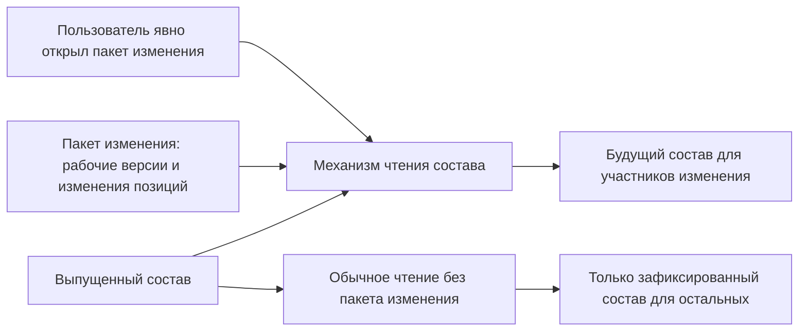

# Работа внутри пакета изменения: согласованный будущий состав

## Какую проблему решает контекст редактирования

Инженерное изменение редко ограничивается одним документом. Замена подшипника может потребовать изменения вала, крышки, спецификации, сборочного чертежа и технологического процесса. Все будущие версии должны быть видны участникам изменения как единый согласованный состав.

Одновременно они не должны появляться в обычном производственном или эксплуатационном чтении до завершения согласования.

В IPS эту задачу решает контекст редактирования. В Interlink используется **пакет изменения** — контейнер рабочих версий и изменений состава, который рассматривается и проводится как единое целое.

## Как контекст работает в IPS

Контекст IPS содержит точные версии объектов. Пользователь активирует контекст, после чего при формировании состава система предпочитает версии, включённые в него.

Связанные контексты образуют группу. Внутри группы не должно быть двух разных версий одного объекта, иначе система не сможет однозначно решить, какую показать.

Извещение, комплект извещений, запись журнала изменений или заказ могут использовать контекстный механизм.

Для пользователя это удобная модель. Однако исторически активный контекст мог быть связан с состоянием окна или сеанса. Отсюда возникают известные проблемы:

- переключение окна способно повлиять на фоновую операцию;
- забытый режим автопополнения добавляет лишние версии;
- два окна требуют согласования текущего состояния;
- сложно доказать, с каким контекстом был выполнен отчёт.

## Как работает пакет изменения в Interlink

Пакет изменения содержит:

- перечень затронутых объектов;
- их рабочие версии;
- изменения позиций состава;
- временные предпочтения версий;
- планируемую степень готовности и применяемость;
- результаты проверок;
- точное содержимое, которое было согласовано.

Пользователь или фоновая задача явно указывает, какой пакет изменения следует учитывать. Если пакет не указан, рабочие версии не видны.

## Пример 1. Изменение выходного вала редуктора

Извещение `ИИ-РЦ250-047` предусматривает увеличение посадочного диаметра подшипника.

В пакет изменения входят:

- `Вал выходной РЦ-250.02.003` — рабочая версия 04;
- `Крышка подшипника РЦ-250.02.011` — рабочая версия 06;
- `Редуктор РЦ-250` — рабочая версия 07 с изменённым составом;
- `Спецификация РЦ-250 СБ` — рабочая версия 07;
- `Операционная карта механической обработки вала` — рабочая версия 03.

Конструктор и технолог, открывшие пакет `ИИ-РЦ250-047`, видят все новые версии совместно. Они могут проверить посадку, комплектность и технологичность будущего состояния.

Сотрудник производства, который открывает обычный состав редуктора, продолжает видеть выпущенные версии 03, 05 и 06. Изменение не раскрывается до проведения.

## Пример 2. Комплект связанных извещений для станка

Модернизация станка `СТ-500` затрагивает механическую часть, электрошкаф и программно-эксплуатационную документацию. По правилам предприятия оформляются три отдельных извещения, но они должны внедряться согласованно.

В IPS такую задачу может решать комплект связанных контекстов. В Interlink возможны два варианта:

1. один общий пакет предметных изменений, а три извещения остаются процессными документами;
2. несколько пакетов с явно указанным порядком и зависимостью, если изменения действительно должны проводиться раздельно.

Главное — не скрывать зависимость в одном номере группы. Система должна понимать, какие версии образуют согласованный будущий комплект и можно ли провести их независимо.

## Пример 3. Фоновая проверка полного состава

Инженер запускает длительную проверку покупных изделий и запрещённых материалов для пакета `ИИ-АН160-052`. После запуска он открывает другое окно и переключается на обычный выпущенный состав.

Проверка должна продолжать работать с тем же пакетом изменения, с которым была запущена. В Interlink это обеспечивается тем, что номер пакета входит в исходные условия самой операции, а не читается из текущего состояния интерфейса.

По завершении отчёт может однозначно указать: «Проверено будущее состояние по пакету ИИ-АН160-052».

## Пример 4. Параллельная работа двух подразделений

Конструкторское бюро начинает изменение корпуса насоса. Одновременно отдел надёжности пытается открыть другое изменение того же корпуса.

Если оба изменения создадут разные рабочие версии одного объекта, итог будет неоднозначным. Поэтому Interlink не позволяет одному объекту одновременно принадлежать двум открытым пакетам изменения.

Второе подразделение должно:

- присоединиться к существующему пакету;
- дождаться его завершения;
- либо выполнить формальное вытеснение по экстренной процедуре с указанием причины.

## Как выполняется проведение пакета изменения

Для продуктового специалиста эта операция называется **проведением и фиксацией пакета изменения**.

Перед проведением система:

1. проверяет все рабочие версии и изменения состава;
2. убеждается, что ни один объект не изменился после согласования;
3. проверяет применяемость, обязательные связи и комплектность;
4. требует разрешить все временные предпочтения;
5. связывает решение согласующих с точным содержимым пакета;
6. фиксирует либо весь пакет, либо ничего.

Частичное проведение, при котором вал стал новым, а крышка осталась старой, не допускается, если они входят в один атомарный пакет.

## Чем пакет изменения отличается от извещения и процесса

Эти понятия связаны, но не равны:

- **извещение** описывает деловое основание и правила проведения изменения;
- **процесс согласования** назначает задания, рецензентов и подписи;
- **пакет изменения** содержит конкретные рабочие версии и изменения состава;
- **снимок состава** фиксирует результат выпуска или передачи.

Интерфейс может объединять их в одно рабочее место, но внутри системы обязанности разделены.

## Почему решение закрывает требование IPS

Interlink сохраняет основные свойства контекстов IPS:

- участники видят будущие версии;
- остальные пользователи их не видят;
- несколько объектов рассматриваются согласованно;
- для одного объекта нет двух равноправных рабочих версий;
- пакет может быть связан с извещением;
- после проведения появляется новый зафиксированный состав.

Дополнительно устраняется зависимость от неявного состояния окна.

## Что пользователь увидит

Рекомендуемое объяснение в интерфейсе:

- `Показана рабочая версия 04`;
- `Источник: пакет изменения ИИ-РЦ250-047`;
- `Обычная выпущенная версия: 03`;
- `Рабочая версия доступна только участникам изменения`;
- `Пакет затрагивает 5 объектов и 2 позиции состава`.

## Вопросы для проверки с заказчиком

- Какие объекты IPS выступают контекстами редактирования?
- Как используются связанные контексты и комплекты извещений?
- Допускается ли несколько активных контекстов в одном окне?
- Какие функции автопополнения применяются?
- Как обрабатываются длительные фоновые операции?
- Нужна ли видимая история промежуточных итераций?
- Какие срочные изменения могут вытеснить обычный пакет?

## Приёмочные сценарии

1. Рабочая версия видна только при явном выборе её пакета.
2. Другой пользователь продолжает видеть выпущенный состав.
3. Фоновая проверка не меняет контекст после переключения окна.
4. Два пакета не могут одновременно изменять один объект.
5. Все версии согласованного пакета проводятся целиком либо не проводится ни одна.
6. Изменение содержимого после согласования требует повторного решения.

## Состояние реализации

Полный пакет изменения является целевым механизмом последующих этапов Interlink. Документ фиксирует продуктовую семантику и требования к будущей реализации.

## Связанные документы

- [Временное предпочтение версии](05-soft-concretion-override.md)
- [Последовательное проведение изменений](09-sequential-change-policy.md)
- [Точный заказ](16-order-and-snapshot.md)

Основания: [IPS-A05], [IPS-K04], [IL-VERS-CONCEPTS], [IL-VERS-SPEC]. Расшифровка источников — в [реестре](../knowledge/15-source-register.md).
