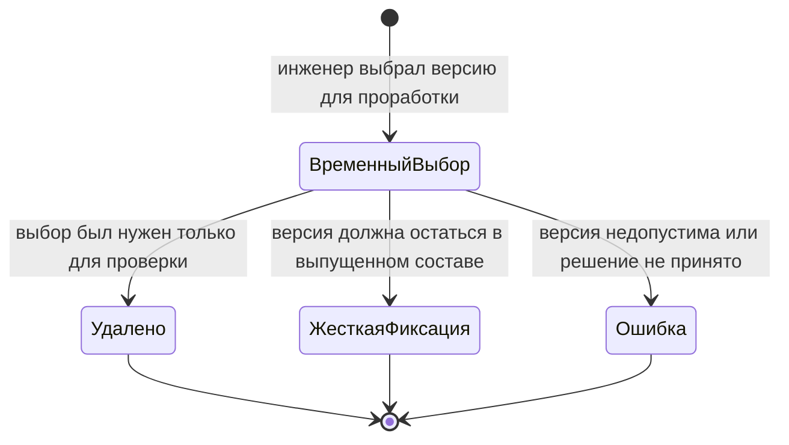

# Временное предпочтение версии (мягкая конкретизация IPS)

## Суть сценария

Инженеру часто нужно временно показать в составе конкретную версию компонента, не превращая это решение в постоянную точную фиксацию.

Например, конструктор хочет проверить новую версию подшипникового узла, сравнить два исполнения покупного электродвигателя или подготовить изменение, решение по которому ещё не принято.

В IPS это называется **мягкой конкретизацией**. В Interlink используется более прямое понятие **временное предпочтение версии**: во время текущей проработки выбранная версия временно ставится выше обычного правила.

## Как мягкая конкретизация работает в IPS

Пользователь может назначить конкретную версию на тех связях, где это разрешено настройками.

От жёсткой конкретизации мягкая отличается тем, что:

- назначается пользователем для рабочей ситуации;
- не обязана оставаться постоянной;
- может автоматически удаляться при переходе родительского объекта на шаг жизненного цикла с фиксацией базовой версии;
- при вытеснении со шага может восстанавливаться, если это предусмотрено настройкой.

Смысл механизма полезен: временно удержать рабочий вариант. Но зависимость от переходов жизненного цикла делает состояние связи менее очевидным.

## Как сценарий организован в Interlink

Временное предпочтение существует только внутри конкретного пакета изменения.

Для пользователя это означает:

- он открывает пакет изменения;
- выбирает позицию состава;
- указывает, какую версию временно использовать;
- только участники этого пакета видят выбранную версию;
- перед проведением пакета требуется решить судьбу предпочтения.

Перед проведением пакета допускаются только два нормальных решения:

1. удалить временное предпочтение и вернуться к применяемости или общему правилу;
2. преобразовать его в жёсткую фиксацию версии в новой версии родительского состава.

Оставить временное предпочтение «как-нибудь после выпуска» нельзя.

## Пример 1. Проверка нового подшипника в редукторе

В выпущенном составе редуктора `РЦ-250` правило выбирает подшипник `3620`, версия 02. Поставщик передаёт обновлённую версию 03 с изменённой смазкой.

Конструктор хочет проверить:

- осевые зазоры;
- требования к монтажу;
- допустимую температуру;
- влияние на ведомость покупных изделий.

Он создаёт пакет проработки и временно предпочитает версию 03 в позиции «Подшипник выходного вала».

Участники проработки видят версию 03. Обычный выпущенный состав продолжает показывать версию 02.

После проверки возможны решения:

- версия 03 отклонена — временное предпочтение удаляется;
- версия 03 должна применяться с серии 201 — оформляется применяемость;
- версия 03 обязательна только в этой позиции — предпочтение превращается в жёсткую фиксацию.

## Пример 2. Временный выбор электродвигателя насосного агрегата

Для насосного агрегата `АН-160` рассматриваются две версии документации двигателя одного производителя:

- версия 06 — серийно поставляемая;
- версия 07 — опытная, с другим классом изоляции.

Технологу нужно оценить изменение кабельных вводов и режима испытаний. Временное предпочтение версии 07 позволяет сформировать будущий состав и технологическую документацию для оценки, не меняя действующие заказы.

Если испытания успешны, предприятие решает, является ли версия 07:

- новой общей действующей версией;
- применимой только для тропического исполнения;
- точной версией для одного специального заказа.

Каждый исход оформляется своим механизмом. Временное предпочтение не подменяет окончательное решение.

## Пример 3. Сравнение двух версий сварной рамы

Для станка `СТ-500` подготовлены две зафиксированные версии сварной рамы:

- версия 04 — текущая производственная;
- версия 05 — экспериментальная, с усиленными косынками.

Отдел расчётов должен сравнить массу, жёсткость и собственные частоты. В пакете изменения временно выбирается версия 05. После расчёта она может быть отклонена без изменения выпущенного состава.

Такой сценарий показывает отличие временного предпочтения от выпуска новой версии станка: система поддерживает проработку, но не выдаёт её за принятое решение.

## Почему Interlink не сохраняет мягкую конкретизацию как постоянное свойство выпущенной связи

Если временный выбор живёт в выпущенной связи и автоматически исчезает или восстанавливается при переходах жизненного цикла, одна и та же версия состава может вести себя по-разному в зависимости от процессного состояния.

Interlink разделяет ответственность:

- временный выбор — внутри пакета изменения;
- постоянная точная зависимость — жёсткая фиксация;
- общий выбор основной или последней версии — правило подбора;
- выбор по серии и дате — применяемость.

Это делает результат предсказуемым и облегчает объяснение пользователю.

## Что происходит при конфликте с жёсткой фиксацией

Если позиция уже жёстко закреплена за версией 02, временное предпочтение версии 03 не может просто заслонить её.

Чтобы проверить или внедрить версию 03, пакет изменения должен затронуть саму позицию состава и явно изменить жёсткую фиксацию. Такое правило защищает точные конфигурационные решения от случайной подмены.

## Что пользователь увидит

Понятные сообщения могут выглядеть так:

- `В пакете ИИ-РЦ250-052 временно выбрана версия 03`;
- `В обычном составе используется версия 02`;
- `Перед проведением выберите: удалить предпочтение или закрепить версию 03`;
- `Позиция уже имеет жёсткую фиксацию; измените саму позицию состава`.

## Почему сценарий эквивалентен IPS

Сохраняются основные пользовательские возможности:

- временно предпочесть конкретную версию;
- видеть её только во время соответствующей работы;
- отменить выбор;
- превратить выбор в постоянный;
- показать отдельный статус в составе.

При этом временное состояние больше не зависит неявно от шага жизненного цикла.

## Вопросы для проверки с заказчиком

- На каких типах связей разрешена мягкая конкретизация?
- Используются ли команды массового назначения и удаления?
- Как часто применяется восстановление при вытеснении со шага ЖЦ?
- Есть ли отчёты, зависящие от мягкой конкретизации?
- Должна ли временная версия участвовать в расчётах и выгрузках?
- Кто принимает окончательное решение: удалить, применить по серии или зафиксировать?

## Приёмочные сценарии

1. Временная версия видна только внутри своего пакета изменения.
2. После удаления предпочтения снова применяется обычное правило.
3. Проведение пакета запрещено, пока судьба предпочтения не определена.
4. Преобразование в жёсткую фиксацию создаёт новое зафиксированное состояние родительского состава.
5. Жёсткая фиксация не заслоняется временным выбором.
6. Обычный производственный заказ не видит временную версию.

## Состояние реализации

Временное предпочтение входит в целевую модель полного пакета изменения. Документ задаёт продуктовое поведение, которое должно быть реализовано и проверено на сценариях IPS.

## Связанные документы

- [Точная фиксация версии](02-hard-concretion-pin.md)
- [Работа внутри пакета изменения](04-editing-context-changeset.md)
- [Применяемость](03-effectivity-series-date.md)

Основания: [IPS-A04], [IPS-A05], [IL-VERS-CONCEPTS], [IL-VERS-SPEC]. Расшифровка источников — в [реестре](../knowledge/15-source-register.md).
