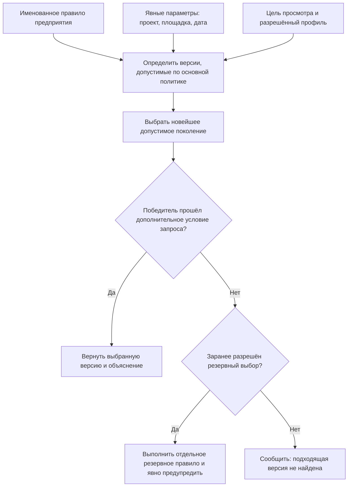

# Настраиваемое правило подбора версий

## Зачем нужны настраиваемые правила

Несколько стандартных режимов — «основная версия», «последняя версия» и «версия не ниже заданной степени готовности» — закрывают типовые случаи, но не всё разнообразие реального предприятия. В разных подразделениях действуют свои ограничения. Например, конструктор может работать с версиями, находящимися на согласовании, а технологу для выпуска маршрутной документации разрешены только утверждённые версии. Для изделия специального исполнения могут подходить лишь версии, допущенные для конкретного проекта, заказчика или климатического района.

В IPS для таких ситуаций применяются общие, системные и персональные правила подбора. Interlink сохраняет саму возможность описать особый способ отбора, но делает его более прозрачным. В документах Interlink такой способ называется **настраиваемым правилом подбора**. Во внутренних материалах разработки для него может встречаться английское слово `Policy` — то есть именованное и управляемое правило выбора.

Настраиваемое правило отвечает на три последовательных вопроса:

1. Какие версии вообще допустимо рассматривать?
2. Если допустимых версий несколько, какую из них предпочесть?
3. Что делать, если подходящей версии нет?

Третий вопрос не прячется внутри правила. Для него отдельно задаётся резервное поведение, подробно описанное в [следующем документе](11-fallback-and-no-match.md).

При этом важно не смешивать **основную политику выбора** и **дополнительное условие уже сформированного запроса**. Основная политика определяет, какое поколение считается победителем. Например, режим «последняя допустимая версия» выбирает наиболее новое поколение среди версий, допустимых для этого режима. Дополнительное условие — например, требование показать только строки с определённым поставщиком — проверяет уже выбранного победителя. Оно не имеет права вернуться в историю и подобрать более старую версию лишь потому, что она лучше подошла условию экрана или отчёта.

## Что сохраняется относительно IPS

Interlink должен сохранить следующие продуктовые возможности IPS:

- корпоративное правило может использоваться всеми сотрудниками;
- разные процессы могут применять разные правила к одному и тому же объекту;
- специалист может задавать разрешённые параметры правила, например проект, подразделение или требуемую степень готовности;
- из нескольких подходящих версий выбирается одна по заранее известному порядку;
- два открытых представления состава могут одновременно использовать разные правила;
- фоновый расчёт или отчёт не меняет результат из-за того, что пользователь переключил режим в другом окне;
- по результату можно объяснить, какое правило и какие значения параметров были применены.

При этом Interlink не переносит историческую внутреннюю конструкцию правила IPS буквально. Для продуктового специалиста важен не способ хранения логических условий, а управляемый и проверяемый смысл правила.

## Как правило работает в Interlink

Правило описывается как именованная управляемая часть модели предприятия. У него есть понятное название, назначение, владелец, область применения и официальные редакции. Например:

> «Документация для подготовки производства: брать наиболее новую версию, достигшую степени готовности “Согласовано технологом”, если она относится к выбранной площадке».

Для каждого запуска система получает явные исходные данные: выбранное правило, требуемую площадку, проект, дату или другие предусмотренные значения. Эти данные относятся именно к текущему просмотру, расчёту или формированию состава. Они не считываются из незаметного общего состояния пользовательского окна.

Если сам общий алгоритм правила был изменён, он выпускается как новая редакция модели предприятия. Старый зафиксированный состав продолжает ссылаться на прежнюю редакцию модели и прежний смысл правила, поэтому остаётся объяснимым. Если меняется только назначение уже выпущенного профиля определённой операции — например, разрешён ли резерв при предварительном расчёте, — выпускается новая версия административной настройки принимающего продукта.

## Почему позднее условие не выбирает более старую версию

У версии есть история поколений. Если после обычного выбора разрешить каждому фильтру снова просматривать эту историю, один и тот же объект начнёт незаметно означать разные поколения в разных отчётах. В составе может быть выбрана версия 05, а отчёт с условием по поставщику внезапно покажет версию 03. Пользователь увидит подходящую строку, но потеряет главный факт: действующее поколение 05 условию не соответствует.

Поэтому для основных режимов «последняя допустимая», «последняя выпущенная» и «не ниже заданной степени готовности» действует строгая последовательность:

1. Система формирует множество версий, допустимых именно основной политикой. Например, для режима «выпущенная» рабочие и выведенные из обычного применения версии в него не входят.
2. Среди этого множества выбирается наиболее новое поколение одного и того же объекта.
3. Только после выбора проверяется дополнительное пользовательское условие, условие связи или отчёта.
4. Если победитель не прошёл эту проверку, старая версия не подставляется вместо него. Система возвращает диагностируемый результат «подходящая версия не найдена».
5. Перейти к другому способу поиска можно только через отдельный, заранее разрешённый резервный выбор. Пользователь видит, что результат получен не по основному правилу.

Это не означает, что проект, климатическое исполнение или площадку всегда проверяют слишком поздно. Если такой признак объявлен частью самого корпоративного правила и его основной области допустимости, он участвует в формировании кандидатов на первом шаге. Поздним считается условие, добавленное поверх уже определённого смысла правила: фильтр открытого списка, отчёта, связи или конкретного запроса. Граница задаётся выпущенной моделью и не должна зависеть от случайного порядка действий пользователя.

### Пример: поставщик подшипника не возвращает старое поколение

Для подшипника выходного вала существуют выпущенные версии 03 и 04. Версия 03 содержит поставщика «Подшипник-Сервис», а в версии 04 он исключён после повторной оценки качества. Производственный отчёт использует основную политику «последняя выпущенная версия» и дополнительное условие «поставщик — Подшипник-Сервис».

Система сначала выбирает версию 04 как новейшее выпущенное поколение. Затем проверяет поставщика и обнаруживает, что версия 04 условию не отвечает. Корректный результат — «подходящая версия не найдена», с пояснением о выбранном поколении и непройденном условии. Версия 03 не появляется в отчёте: иначе исключённый поставщик фактически вернулся бы через историческое состояние объекта. Если предприятию действительно нужен разрешённый поиск прежней версии для ремонта, для него создаётся отдельный явный профиль с собственными ограничениями и согласованием.

## Пример 1. Подшипник для серийного редуктора

Предприятие выпускает цилиндрический редуктор `РЦ-250`. В узле быстроходного вала используется подшипник `3620`. У подшипника в системе существуют три версии описания:

| Версия | Состояние | Дополнительные сведения |
|---|---|---|
| Версия 01 | утверждена | базовый поставщик |
| Версия 02 | согласуется | добавлен второй поставщик с теми же присоединительными размерами |
| Версия 03 | разработка | экспериментальный сепаратор для нового проекта |

Для обычного серийного производства действует правило «брать наиболее новую утверждённую версию». Оно выберет версию 01.

Для подготовки производства по проекту модернизации применяется другое правило: «допускать утверждённые и согласуемые версии данного проекта, затем выбирать наиболее новую». Оно выберет версию 02.

Версия 03 не попадёт ни в один результат, потому что относится к экспериментальному проекту и ещё находится в разработке. Важно, что система не просто показывает версию 02, а сообщает: версия допущена правилом подготовки производства, относится к нужному проекту и является самой новой среди прошедших проверку.

## Пример 2. Электродвигатель для разных производственных площадок

Насосный агрегат выпускается на двух площадках. На первой площадке разрешены двигатели двух отечественных изготовителей, на второй — двигатель локального поставщика с отдельным комплектом сопроводительных документов.

Для объекта «Электродвигатель 30 кВт, исполнение У2» заведено несколько версий описания поставки. Геометрические и электрические характеристики совпадают, но отличаются утверждённые поставщики, упаковка и состав документов.

Правило подбора получает параметр «производственная площадка»:

- для площадки «Север» выбирается последняя утверждённая версия с перечнем поставщиков этой площадки;
- для площадки «Восток» выбирается последняя утверждённая версия, в которой присутствует местный поставщик;
- если площадка не указана, система не должна угадывать её по подразделению вошедшего пользователя — она сообщает о недостающем параметре.

Такой подход особенно важен для автоматического формирования заданий в нерабочее время. Ночной расчёт использует параметры конкретного заказа и не зависит от того, какое представление состава было последним открыто у диспетчера.

## Пример 3. Гидроцилиндр специального исполнения

Для карьерной техники применяется гидроцилиндр `ГЦ-180`. У него есть исполнения для умеренного, холодного и тропического климата. Версии отличаются материалом уплотнений, рабочей жидкостью и допустимым температурным диапазоном.

Предприятие вводит правило:

> Для проекта карьерного экскаватора выбирать наиболее новую утверждённую версию гидроцилиндра, допускающую заданный климатический район и рабочую жидкость. При равенстве предпочитать версию, уже применяемую на площадке сборки.

Заказ для Якутии указывает холодный климат и жидкость `ВМГЗ`. Правило исключает обычную и тропическую версии, затем выбирает самую новую из двух холодостойких. Если обе версии одинаково новы, предпочтение получает уже освоенная площадкой версия.

Этот пример показывает различие между **условиями основной политики** и **поздним дополнительным условием**. Климатический район и рабочая жидкость здесь заранее объявлены частью корпоративного правила: сначала они определяют допустимую область, а уже внутри неё выбирается новейшее поколение. Если же пользователь открыл общий список с режимом «последняя выпущенная» и лишь затем добавил экранный фильтр «ХЛ1», фильтр не вправе вернуть старую холодостойкую версию вместо более нового победителя. Победитель либо проходит фильтр, либо пользователь получает объяснимое отсутствие результата.

## Пример 4. Оснастка для конкретной операции

На нескольких заводах используется один типовой технологический процесс обработки корпуса редуктора. Для операции растачивания имеются разные версии установочного приспособления:

- старая утверждённая версия для станка первого поколения;
- новая утверждённая версия для обрабатывающего центра;
- согласуемая версия для роботизированной ячейки.

Правило получает номер операции, тип оборудования и цель работы. При выпуске сменного задания оно допускает только утверждённую оснастку. При моделировании будущей роботизированной ячейки может быть разрешена согласуемая версия. Одна и та же технологическая структура поэтому даёт разные, но закономерные результаты.

## Персональные настройки без персональной логики

Пользователю удобно сохранить часто применяемые значения: свою площадку, проект или тип расчёта. В IPS это могло выглядеть как персональный вариант правила. Interlink сохраняет удобство, но разделяет:

- корпоративный смысл правила — одинаковый и контролируемый;
- сохранённый набор значений пользователя — лишь быстрый способ заполнить параметры;
- фактические значения текущего запроса — часть объяснения результата.

Таким образом, личная настройка не превращается в незаметное ответвление корпоративной логики. Два специалиста, задавшие одинаковые параметры, должны получить одинаковый результат при одинаковых правах и исходных данных.

## Как правило становится официальным

Общее правило подбора влияет сразу на множество объектов, составов и заказов. Поэтому его нельзя проводить как пакет изменения одного редуктора, насоса или станка. Такой пакет предназначен для предметных данных конкретных объектов: применяемости, точной фиксации позиции, аналога или изменения состава.

Новая редакция общего правила проходит жизненный цикл модели предприятия:

1. Методист описывает деловой смысл, разрешённые параметры, основную политику, порядок сравнения и возможный резервный выбор.
2. Команда модели проверяет правило на эталонных изделиях, границах применяемости, случаях отсутствия результата и больших многоуровневых составах.
3. До выпуска показывается влияние новой редакции: какие позиции изменят выбор и где появятся новые отказы.
4. Правило выпускается вместе с новой редакцией модели и, если нужно, с управляемым переходом существующих данных.
5. Принимающий продукт отдельной версионируемой настройкой назначает, в каких операциях и каким ролям разрешён новый профиль.
6. Ранее опубликованные снимки сохраняют ссылку на прежнюю редакцию и не пересчитываются задним числом.

Таким образом, есть два разных решения. **Смысл общего правила** выпускается через модель предприятия. **Разрешение применить уже выпущенный профиль в конкретном процессе** выпускается через настройки принимающего продукта. Ни одно из них не следует маскировать под предметный пакет изменения.

## Что увидит продуктовый специалист

Для каждой выбранной версии достаточно понятного объяснения, например:

> Выбрана версия 02. Применено правило «Подготовка производства по извещению». Версия относится к проекту модернизации, достигла требуемой степени готовности и является наиболее новой среди двух допустимых версий.

Если ничего не найдено, объяснение должно сообщать, какие существенные условия не были выполнены:

> Подходящая версия не найдена. Ни одна версия гидроцилиндра не сочетает утверждённое состояние, климатическое исполнение ХЛ1 и рабочую жидкость ВМГЗ.

Пользователю не требуется видеть техническое выражение правила. Для анализа достаточно его названия, делового описания, фактических параметров и причин допуска или исключения кандидатов.

## Чем решение отличается от IPS

| Аспект | IPS | Interlink |
|---|---|---|
| Способ задания | общее, системное или персональное правило | именованное управляемое правило и отдельно сохранённые значения пользователя |
| Параметры | могли зависеть от состояния конкретного окна | явно относятся к каждому просмотру, расчёту или заказу |
| Выбор из нескольких версий | условие и специальный критерий выбора | основная политика сначала выбирает поколение; поздний фильтр только принимает или отклоняет победителя и не возвращает историческую версию |
| Отсутствие результата | могло смешиваться с поиском «не совсем подходящей» версии | резервное поведение задаётся отдельно и всегда заметно |
| Выпуск общего правила | зависел от принятой в IPS схемы ведения системных правил | новая редакция выпускается через жизненный цикл модели; назначение операции — через версионируемую настройку принимающего продукта |
| История | важен факт использования правила | сохраняются редакция модели, назначенный профиль и фактические параметры |

Это не отказ от возможностей IPS, а более явное разделение ответственности.

## Открытые продуктовые вопросы

- Кто на предприятии имеет право создавать и утверждать корпоративные правила?
- Какие параметры пользователю разрешено менять, а какие фиксируются процессом?
- Нужно ли показывать специалисту список исключённых версий или достаточно сводной причины?
- Какие правила допустимы в производственном заказе, а какие предназначены только для анализа?
- Как долго следует хранить старые версии правил для объяснения архивных составов?
- Должно ли изменение правила автоматически инициировать проверку затронутых живых заказов?

## Критерии приёмки

1. Два представления состава с разными правилами работают независимо друг от друга.
2. Отсутствующий обязательный параметр выявляется до формирования состава.
3. Одинаковые исходные данные дают одинаковый выбор и одинаковое объяснение.
4. Фоновый расчёт не меняется после переключения режима в пользовательском интерфейсе.
5. Старый зафиксированный состав остаётся объяснимым после выпуска новой редакции правила.
6. Правило не может незаметно подменить отсутствие результата резервной версией.
7. Дополнительный фильтр, которому не соответствует новейшая допустимая версия, не возвращает более старое поколение того же объекта.
8. Общая редакция правила выпускается через жизненный цикл модели, а не через пакет изменения отдельного изделия.
9. Назначение профиля операции имеет отдельную версионируемую историю в принимающем продукте.

## Состояние реализации

Описанное поведение является принятым целевым контрактом. В архитектуре Interlink уже предусмотрены явный контекст, стандартные политики и диагностируемое отсутствие результата. Именованные настраиваемые правила, их выпуск в составе модели, полный редактор, испытательный контур и версионируемое назначение профилей принимающим продуктом относятся к последующим этапам и ещё не являются готовым пользовательским механизмом.

## Связанные документы

- [Что делать, если подходящая версия не найдена](11-fallback-and-no-match.md)
- [Подбор по степени готовности](08-maturity-level-policy.md)
- [Сквозное формирование многоуровневого состава](17-end-to-end-resolution.md)
- [Как создаются и изменяются правила подбора](19-selection-rule-lifecycle.md)

Основания: [IPS-A04], [IPS-K03], [IL-QUERY], [IL-VERS-SPEC §6], [IL-ADR ADR-023, ADR-044]. Расшифровка обозначений источников приведена в [реестре источников](../knowledge/15-source-register.md).
