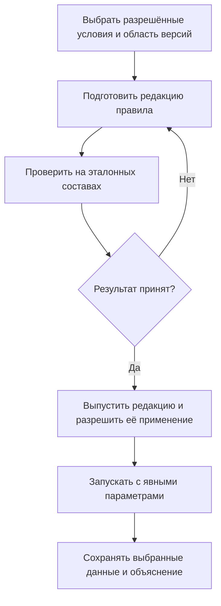
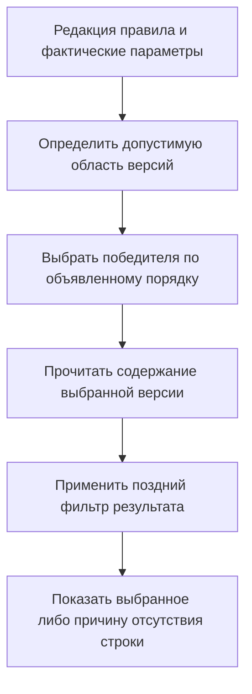

# Настраиваемые правила: общие и персональные, но с единым смыслом исполнения

## Зачем нужны правила предприятия

Типовые режимы «Основная», «Последняя» и «Разрешённая для производства» не исчерпывают реальную работу. Технолог выбирает документацию для определённой площадки, конструктор — для проекта, сервисный инженер — для ремонтной программы. У каждого могут быть свои разрешённые параметры и критерии.

В IPS эту задачу решают системные, общие и персональные правила. Interlink должен сохранить не только несколько встроенных вариантов, но и управляемое создание именованных правил. Персональное правило не сводится обязательно к запоминанию значений формы: ему могут быть разрешены собственные критерии в пределах, установленных предприятием.

## Что меняется относительно прежнего описания Interlink

Ранняя редакция описания утверждала, что общий смысл любого правила можно изменить только выпуском всей модели предприятия. Это слишком жёсткое ограничение и не покрывает привычный каталог правил IPS.

В новой целевой модели разделяются:

- допустимые понятия, параметры и виды условий — их задаёт модель;
- конкретное именованное правило с критериями и значениями — это управляемые данные с редакциями;
- разрешение применять правило в определённой операции — это настройка прикладного продукта.

Если методист изменяет критерий из уже разрешённых видов, не обязательно заново выпускать всю модель. Если нужен новый вид предметного условия, которого модель ещё не знает, требуется её расширение. При этом правила не становятся произвольными программами и не могут обходить права или обязательные запреты.

## На какие вопросы отвечает правило

Правило должно явно определить область инженерных версий, условия допуска, порядок выбора среди допустимых и допустимое поведение при отсутствии результата. Способ чтения содержания выбранной версии задаётся согласованно с целью операции, а не угадывается по названию правила.

Например:

> «Документация для подготовки производства: в серийной программе выбранной площадки брать последнюю инженерную версию, достигшую технологического согласования; читать опубликованное содержание».

Область важна: новая опытная ветвь не должна попадать в серийный состав только потому, что создана позже.

## Как будет создаваться и применяться правило

Методист выбирает разрешённые условия, задаёт название, назначение и владельца. Система проверяет полноту параметров и непротиворечивость, затем позволяет испытать правило на эталонных составах.

Каждая принятая редакция сохраняется отдельно. Операция использует конкретную редакцию и фактические значения параметров. Правка персонального правила в соседнем окне не подменяет уже подготовленный расчёт или согласованный точный результат.

Схема описывает целевой процесс прикладного продукта. Наличие такого договора не означает готового визуального редактора правил.

## Главное различие: условия поиска и фильтр результата

Условие, входящее в правило допуска кандидатов, применяется до выбора победителя. Поздний фильтр экрана проверяет уже выбранный результат и не должен незаметно возвращать старую версию.

Если режим «Последняя серийная» выбрал двигатель версии 06 с IP55, экранный фильтр IP54 может скрыть строку. Он не делает версию 05 победителем. Для задачи «последняя серийная версия с IP54» признак защиты должен заранее входить в само правило.

Такое разделение особенно важно для совместимости и безопасности. Отказ итоговой проверки состава не запускает скрытый перебор старых версий до первого удобного сочетания.

В отличие от схемы выпуска правила, здесь показано одно его применение. Стрелки не возвращаются от экранного фильтра к поиску более старой версии. Проверки доступа и обязательной допустимости сохраняются на всём пути.

## Пример 1. Подшипник для серийного и подготовительного состава

Для подшипника редуктора существуют:

| Версия | Готовность и область |
|---|---|
| 01 | Утверждена для серийного производства |
| 02 | На согласовании в проекте модернизации |
| 03 | Экспериментальная разработка другого проекта |

Серийное правило выбирает 01. Правило подготовки производства модернизации допускает согласуемые версии своего проекта и выбирает 02. Версия 03 не попадает в результат только из-за большего номера: она не входит в нужную область.

Технолог видит причину: «Версия 02 допущена для подготовки производства проекта модернизации; производственная выдача по этому профилю не разрешена». Если требуется воспроизводимый расчёт, сохраняется также использованное точное содержание.

## Пример 2. Электродвигатель для двух площадок

На площадке «Север» и площадке «Восток» действуют разные перечни квалифицированных поставщиков. Версии описания двигателя содержат различные утверждённые комплекты документов поставки.

Общее правило получает параметр площадки и выбирает допустимую версию в её области. Технолог может сохранить персональный вариант с площадкой «Восток» и дополнительными разрешёнными критериями, например наличием определённого сертификата.

Это отдельная редакция персонального правила, а не скрытое изменение общего. Ночной расчёт получает её и значения явно. Если площадка не задана, система не берёт подразделение последнего вошедшего пользователя в качестве ответа.

## Пример 3. Гидроцилиндр для холодного климата

Правило проекта карьерного экскаватора требует утверждённую версию гидроцилиндра, допустимую для холодного климата и рабочей жидкости ВМГЗ. Эти условия входят в правило до выбора новейшей версии.

Из нескольких разрешённых холодостойких версий выбирается победитель по установленному порядку в этой области. Если две ветви несопоставимы и порядок не определён, система сообщает конфликт правила. Время записи строки или случайная сортировка названия не становятся скрытым критерием.

После выбора содержания дополнительно проверяется совместимость всего гидропривода. Соответствие цилиндра климату не доказывает допустимость сочетания с насосом, уплотнениями и жидкостью.

## Пример 4. Оснастка для будущей роботизированной ячейки

Типовой техпроцесс имеет оснастку для обычного станка, обрабатывающего центра и будущей роботизированной ячейки. Методист создаёт правило моделирования ячейки, разрешающее проверенные, но ещё не введённые в производство версии.

Расчётный отдел получает состав для симуляции с явным ограничением цели. Для сменного задания применяется другое правило, допускающее только официально введённую оснастку. Пользователь не превращает исследовательский результат в производственный простым изменением заголовка отчёта.

Если после согласования моделирования изменились критерии правила, ранее полученное согласование остаётся свидетельством прежней редакции. Новое применение проверяется отдельно.

## Единое исполнение вместо отдельного механизма для каждого правила

Общее, персональное и встроенное правило используют один договор: одинаковое понимание инженерной версии, содержания, доступа, отсутствия результата и объяснения. Они различаются данными и разрешёнными условиями, а не независимыми скрытыми алгоритмами.

Правило не снимает жёсткую привязку и не отменяет активные источники, которые стоят выше него в выбранном порядке. Порядок взаимодействия с применяемостью, контекстом и мягкой конкретизацией также имеет явную редакцию.

## Как изменять правило без потери истории

Автор готовит новую редакцию и сравнивает результаты со старой. Изменившиеся позиции, новые отказы и резервные результаты должны быть видны до активации.

Новый живой расчёт может использовать новую редакцию после её разрешения. Старый снимок не пересчитывается. Само появление новой неиспользованной редакции не делает прежнее точное согласование автоматически недействительным; отдельно проверяются условия применения и действующие обязательные запреты.

## Вопросы и критерии приёмки

С предприятием нужно определить права создания персональных критериев, утверждение общих правил, доступные параметры, сроки хранения редакций и перечень операций, в которых допускается резерв.

Приёмка:

1. Общие и персональные правила сохраняются как различимые редакции.
2. Для изменения разрешённого критерия не требуется искусственно менять всю предметную модель.
3. Новый неподдерживаемый вид условия не исполняется произвольно.
4. Два окна и фоновые расчёты используют свои явные правила и параметры.
5. Поздний фильтр не возвращает старую версию.
6. Редактирование правила не подменяет уже подготовленное точное решение.
7. Правило не обходит доступ, жёсткие привязки и обязательную совместимость.
8. Отсутствие результата и резерв имеют разные объяснения.

## Подробный пограничный пример: исключённый поставщик

В опубликованном содержании подшипника версии 03 указан поставщик «Подшипник-Сервис». В версии 04 этот поставщик исключён после повторной оценки качества. Отчёт использует правило «Последняя выпущенная» и добавленное условие показа строк с данным поставщиком.

Сначала выбирается 04 как победитель в заданной области. Затем позднее условие обнаруживает, что нужного поставщика в выбранных данных нет. Версия 03 не возвращается в отчёт: иначе исключённый поставщик незаметно появился бы через старое инженерное решение.

Интерфейс должен различать отсутствие строки после фильтра и отсутствие допустимой версии до фильтра. Для переноса конкретного правила IPS необходимо сохранить подтверждённый смысл его результата и объяснения, а не только похожую пустую таблицу.

Если предприятию нужен исторический анализ работы с этим поставщиком, создаётся отдельный разрешённый режим с соответствующей областью и целью. Он может читать прежние данные как историю, но не превращает их в основание новой закупки. Действующий обязательный запрет нельзя обойти более узким правилом.

## Как готовить корпоративную редакцию к приёмке

Владелец правила описывает не только положительный пример, но и случаи, в которых правило обязано отказать. Испытательный набор включает недостаточную готовность, неизвестную площадку, пересечение областей, аннулированную версию, несопоставимые ветви, точную привязку и конфликт контекстов. Для больших составов проверяют повторные использования и время полного расчёта.

Рецензент сравнивает прежнюю и новую редакции на одинаковых исходных материалах. Если состав изменился у сотен изделий, этого недостаточно назвать ожидаемым эффектом: нужны перечень затронутых областей и объяснение, какой критерий изменил выбор. Версия данных испытательного набора также должна быть определена, иначе два прогона могут различаться не из-за правила.

После принятия редакции прикладной продукт отдельно разрешает её применение в рабочих местах. Общая редакция и назначение конкретной операции могут иметь разных владельцев. Пользователь, которому разрешено готовить персональное правило для анализа, не получает автоматически права назначить его производственной передаче.

Для готовящегося точного выпуска сохраняются использованные редакция, параметры и содержание. Новая правка правила не подменяет это основание. Если предприятие требует обязательного пересчёта по самой новой редакции, такой режим устанавливается и проверяется явно.

## Как сохранить удобство персональной работы

Личная форма может просто подставлять площадку и проект в общее правило, а может содержать разрешённые собственные критерии. Интерфейс должен различать эти случаи, чтобы методист видел действительное происхождение результата.

Для повторяемости недостаточно совпадения видимого названия «Мой производственный состав». Нужны конкретная редакция, фактические значения, выбранный профиль, область версий и согласованные исходные данные. При одинаковых условиях и полномочиях исполнение должно давать тот же результат; случайное состояние соседней вкладки в условия не входит.

## Состояние реализации

Каталог общих и персональных правил, их редакции и единое исполнение входят в целевой договор. Полный редактор, процедуры утверждения, анализ влияния и испытания на правилах IPS ещё должны быть реализованы.

## Связанные документы

- [Жизненный цикл правил](19-selection-rule-lifecycle.md)
- [Последняя допустимая версия](07-latest-version-policy.md)
- [Резерв и отсутствие результата](11-fallback-and-no-match.md)
- [Контексты подбора](21-selection-contexts.md)

## Основания и границы источников

Основания: [IPS-A04], [IPS-K03], [IL-QUERY], [IL-DSL], [IL-SC], [IL-KERNEL], [IL-VERS-SPEC], [IL-DATA-MODEL], [IL-PLAN-V2]. Расшифровка и статус источников — в [реестре источников](../knowledge/15-source-register.md).

Источники IPS задают проверяемые исходные сценарии и вопросы к конкретной установке. Текущее поведение Interlink определяется действующим семантическим договором и планом реализации; наличие этих описаний не заменяет испытаний.
