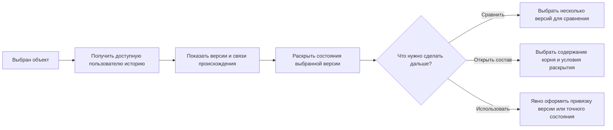

# Просмотр всех версий объекта

> Описана целевая работа Interlink. Пользовательское представление истории и его проверка на сценариях IPS ещё должны быть реализованы; наличие такого описания не означает готового экрана.

## Зачем пользователю нужны все версии

Большинство режимов подбора должны вернуть одну версию объекта: ту, которая действует для заказа, подходит по степени готовности или назначена основной. Однако бывают задачи, где специалисту нужен не готовый состав, а история изменения самого объекта.

В IPS для этого могло использоваться специальное правило «Все версии объектов», в том числе в портфельных и аналитических представлениях. Interlink сохраняет возможность увидеть все доступные версии, но отделяет её от обычного формирования состава.

**Просмотр всех версий — это историческое представление, а не способ автоматически выбрать одну версию для каждой позиции состава.**

Это различие защищает пользователя от неоднозначности. Если у редуктора двадцать деталей, а у каждой детали по пять версий, команда «показать все версии» не должна превращать один состав в сотни искусственных комбинаций, которые никогда не существовали как изделие.

## Что показывает историческое представление

В новой модели важно различать **пользовательскую версию** и **сохранённое неизменяемое состояние её содержания**. Например, «Редуктор РЦ-250, версия 05» может пройти несколько публикаций уточнявшейся документации, не получая каждый раз нового номера версии. Каждая такая публикация оставляет отдельное неизменяемое состояние. Незавершённое редактирование существует отдельно — в рабочей копии соответствующей рабочей области. Обычное сохранение рабочей копии ещё не создаёт опубликованного состояния.

Поэтому история должна позволять сначала увидеть пользовательские версии объекта, а затем раскрыть историю содержания выбранной версии. Новая версия может быть создана на основе старой, а не только последней; для параллельных разработок важны связи происхождения, а не одна воображаемая цепочка «предыдущая — следующая».

Для выбранного объекта пользователь видит версии и основные признаки, важные для понимания истории:

- обозначение и наименование объекта;
- номер или название версии;
- дату создания версии и даты публикации её состояний;
- степень готовности и состояние процесса согласования;
- применяемость по изделиям, серийным номерам или датам, если она задана;
- сведения об извещении или пакете изменения;
- отметку основной версии;
- причину снятия с применения или замены;
- доступность версии для текущего пользователя.

Рабочие копии показываются только при явно разрешённом доступе к соответствующей рабочей области и условиям совместной работы. Пакет изменения может объединять результаты для публикации, но не подменяет рабочую область и правила доступа. Чужая незавершённая работа не становится видимой лишь потому, что пользователь запросил «все версии». Доступ к истории также проверяется по сегодняшним полномочиям, а не по правам человека, когда-то создавшего запись.

Схема показывает путь анализа, а не автоматическое изменение изделия. Просмотр, сравнение и выбор строки ничего не публикуют и не перенастраивают действующие составы. Если нужно изменить привязку в позиции, пользователь оформляет отдельную управляемую операцию.

## Пример 1. История зубчатого колеса после производственного дефекта

На партии редукторов обнаружен повышенный шум. Специалист по качеству открывает объект «Колесо зубчатое быстроходной ступени» и видит его историю:

| Версия | Содержание изменения | Положение в процессе и применении |
|---|---|---|
| Версия 01 | исходная геометрия зубьев | снята с применения |
| Версия 02 | изменён припуск после термообработки | утверждена |
| Версия 03 | изменён режим шлифования | утверждена, применяется серийно |
| Версия 04 | увеличена ширина венца | находится на согласовании |

Специалист сравнивает версии 02 и 03, проверяет дату выпуска проблемной партии и выясняет, какая технология действовала в этот момент. Для анализа важны все версии, но для конкретной позиции зубчатого колеса в точном составе редуктора всё равно выбирается одна версия и одно её состояние.

У версии 03 при этом могут быть два опубликованных состояния: в первом указан исходный режим шлифования, во втором уточнены требования к контролю поверхности. Для расследования недостаточно сообщения «использовалась версия 03». Специалист открывает точное состояние, вошедшее в производственную передачу проблемной партии, и сравнивает его со следующим. Номер версии отвечает на вопрос, какое инженерное решение применяли; точное состояние — какие данные реально были переданы.

Если требуется воспроизвести ранее переданный состав изделия с конкретным заводским номером, пользователь открывает исторически зафиксированный состав. Новый расчёт по серийному номеру полезен для проверки действующих правил, но сам по себе не доказывает, какой результат был выдан раньше.

## Пример 2. Сравнение исполнений электродвигателя

Для электродвигателя `АИР180М4` накопилось несколько версий документации. Одна добавила нового поставщика подшипников, другая изменила схему подключения датчиков температуры, третья была отозвана после испытаний.

Конструктор насосного агрегата хочет понять, с какой версии появилась возможность подключения к новой системе диагностики. В историческом представлении он видит изменения по версиям и выбирает две из них для сравнения.

Это исследовательская операция. Она не означает, что дерево насосного агрегата должно одновременно содержать все версии двигателя. После анализа конструктор либо оставляет правило подбора без изменения, либо оформляет изменение и точно указывает требуемую версию.

## Пример 3. Расследование отказа гидроцилиндра

Сервисная служба получила рекламацию на течь гидроцилиндра. По заводскому номеру известно, что цилиндр был изготовлен в период перехода на новый материал манжеты.

История объекта «Комплект уплотнений ГЦ-180» позволяет увидеть:

- версию со старым материалом;
- переходную версию, действовавшую только для ограниченного диапазона номеров;
- текущую серийную версию;
- рабочую копию экспериментальной версии, содержание которой никогда не передавалось в производство.

Специалист сопоставляет даты и применяемость. Экспериментальная версия может быть полезна для понимания развития решения, но она не должна ошибочно считаться установленной в рекламационном изделии. Зафиксированный состав показывает выданное задание. Ответ на вопрос «что фактически было изготовлено» подтверждается отдельным учётом исполнения и экземпляров, включая отклонения от задания, а не простой хронологией версий.

## Пример 4. Очистка данных после переноса из старой системы

После переноса данных обнаружено, что у типового крепежа существует семь версий, хотя содержательно отличаются только две. Остальные возникли из-за старых административных операций.

Группа качества данных использует историческое представление, чтобы:

- увидеть все перенесённые версии;
- найти версии без понятной причины создания;
- сопоставить их с извещениями;
- определить, какие версии должны остаться доступными только для истории;
- проверить, правильно ли назначена основная версия.

Такое представление помогает исправить справочные данные, но само по себе не меняет составы и не объединяет версии. Любое исправление оформляется отдельной управляемой операцией.

## Почему нельзя использовать «все версии» как обычное правило состава

Представим сборочную единицу из трёх позиций. Для первой детали существует четыре версии, для второй — пять, для третьей — три. Механическое раскрытие всех вариантов даст уже шестьдесят сочетаний. В многоуровневом изделии число сочетаний растёт ещё быстрее.

Большинство таких комбинаций:

- никогда не выпускались вместе;
- нарушают применяемость по времени или серии;
- смешивают рабочие и утверждённые данные;
- не соответствуют ни одному заказу;
- не имеют самостоятельного продуктового смысла.

Поэтому Interlink показывает историю локально для выбранного объекта или для явно заданной области анализа. Для достоверного сравнения двух ранее выданных составов берутся два зафиксированных состава. Можно также сравнить два расчёта по явно заданным условиям, но это уже сравнение расчётов, а не доказательство истории производства.

Даже точное опубликованное состояние корневого редуктора само по себе не фиксирует всё дерево: сохранённая в нём позиция подшипника может по-прежнему требовать подбора версии. При открытии такого корня система должна явно показать условия раскрытия. Неизменяемое свидетельство всего изделия получается только при сохранении точного полного состава в объявленной области.

Отдельно сохраняется потребность IPS в **вариантном плановом заказе**: на стадии планирования он может содержать разрешённые заменители и ещё не выбранные маршруты. Это не режим «показать все версии каждой детали» и не готовая однозначная передача в производство.

## Как перейти от истории к точному составу

Из исторического представления пользователь может выбрать конкретную версию и:

- раскрыть историю её опубликованных состояний и разрешённых рабочих копий;
- открыть состав выбранного состояния с явно указанными условиями раскрытия;
- сравнить её с другой версией;
- использовать её как исходную для управляемого изменения;
- при наличии полномочий закрепить пользовательскую версию в определённой позиции либо сильнее зафиксировать конкретное неизменяемое состояние;
- посмотреть, где эта версия применялась.

Переход всегда явный. Сам факт выделения строки в истории не меняет действующее правило подбора и не влияет на другие окна.

Два вида привязки нужны для разных задач. Конструктор может потребовать «использовать именно версию 05 корпуса», сохранив возможность получать дальнейшие опубликованные уточнения этой версии. Для воспроизведения проведённого испытания нужно более строгое решение: «использовать содержание корпуса, вошедшее в испытательный комплект». Эти действия не должны скрываться под одной неоднозначной командой «зафиксировать».

## Чем решение отличается от IPS

| Аспект | IPS | Interlink |
|---|---|---|
| «Все версии» | могло выглядеть как специальное правило подбора | отдельное историческое представление |
| Результат | набор версий в привычном интерфейсе | пользовательские версии, история их содержания и связи происхождения |
| Переход к составу | конкретные режимы проверяются при переносе | явно выбираются содержание корня и условия раскрытия; точный снимок открывается отдельно |
| Многоуровневое раскрытие | сохраняется требование различать историю и конкретный состав | просмотр всех версий не выдаётся за однозначный производственный состав |
| Рабочие данные | действуют правила доступа и контекста исходной установки | явно разрешённые рабочие копии не смешиваются с опубликованной историей |

## Открытые продуктовые вопросы

- Какие столбцы исторического представления наиболее важны специалистам IPS?
- Нужно ли показывать версии, снятые с применения, по умолчанию или только по отдельной команде?
- Следует ли по умолчанию раскрывать только опубликованные состояния или также разрешённые пользователю рабочие копии?
- Нужна ли массовая история по группе объектов для задач качества данных?
- Как показывать ветвящиеся изменения, если две новые версии создавались параллельно от одной исходной?
- Какие сравнения — атрибутов, состава, геометрии, документов — должны запускаться прямо из истории?

## Критерии приёмки

1. Пользователь видит все доступные ему пользовательские версии, связи происхождения и опубликованные состояния каждой версии.
2. Рабочая копия из чужой рабочей области не раскрывается без соответствующего доступа.
3. Назначение основной версии, применяемость, состояние согласования и наличие рабочей копии не смешиваются в одну отметку.
4. Команда «все версии» не создаёт ложный многоуровневый состав из всех сочетаний.
5. Открытие версии и выбор её содержания выполняются явно и не меняют режим других представлений; точный корень не выдаётся за фиксацию всех вложенных связей.
6. Для версии можно понять, когда и в связи с каким изменением она появилась.

## Состояние реализации

Разделение объекта, пользовательской версии, неизменяемого опубликованного состояния и рабочей копии закреплено в целевой модели. Полный пользовательский вид истории, сравнение, ветвящееся происхождение и отображение перенесённых данных должны быть реализованы и проверены совместно. Эта страница описывает ожидаемое поведение, а не подтверждает готовность перечисленных экранов.

## Связанные документы

- [Основная версия объекта](06-base-version-current.md)
- [Последняя допустимая версия](07-latest-version-policy.md)
- [Закрепление версии и точного состояния](02-hard-concretion-pin.md)
- [Точный состав производственного заказа](16-order-and-snapshot.md)

## Основания и границы подтверждения

Основания IPS: [IPS-A04], [IPS-K03]. Современный архитектурный смысл: [IL-KERNEL], [IL-VERS-SPEC], [IL-DATA-MODEL], [IL-PLAN-V2]; запросы и исторические представления — [IL-QUERY]. Историческое описание IPS не заменяет проверку поведения целевой установки. Расшифровка и статус источников приведены в [реестре источников](../knowledge/15-source-register.md).
