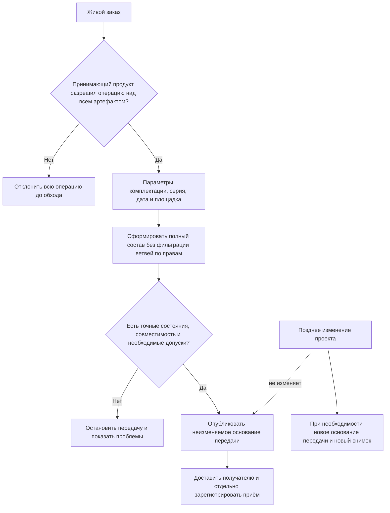
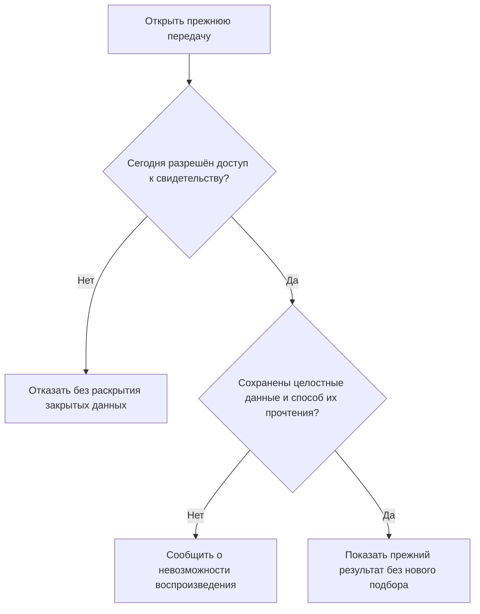

# Точный состав производственного заказа

> Описан целевой договор официальной передачи в производство. Он ещё требует сквозной реализации и проверки; ниже не утверждается, что готовые рабочие места заказа и публикации уже поставлены.

## Почему живого состава недостаточно

Пока изделие проектируется или заказ уточняется, его состав может закономерно меняться. Выпускаются новые версии деталей, согласуются извещения, меняются разрешённые поставщики, уточняются параметры комплектации и выбираются варианты замен.

Такой **живой состав** полезен для текущей работы: при открытии он рассчитывается в явно выбранных условиях и согласованном срезе данных. Правила могут использовать действующие назначения либо заданные исторические условия; «живой» не означает «всегда взять всё самое новое». Но производство не может опираться на плавающий результат. После передачи задания в цех должно быть однозначно известно:

- какое точное опубликованное состояние головного изделия использовано;
- какие позиции вошли в заказ;
- какая пользовательская версия и какое её точное опубликованное содержание выбраны для каждой позиции;
- какие варианты комплектации и групповых замен приняты;
- какие количества и единицы действуют;
- по каким условиям получен результат;
- почему более позднее изменение проекта не переписывает уже выданное задание.

IPS закрывает эту потребность формированием точного дерева заказа. Interlink сохраняет тот же продуктовый результат, но ясно различает изменяемый заказ и неизменяемое свидетельство конкретной передачи.

## Два связанных, но разных объекта

### Живой производственный заказ

Живой заказ существует в процессе планирования. В нём можно уточнять количество изделий, сроки, заводские номера, площадку, климатическое исполнение, дополнительные опции и выбранные варианты замен. Изменения сначала сохраняются в рабочей копии. Пользовательская версия заказа и её опубликованное состояние — не одно и то же: после отдельного согласованного проведения может появиться новое неизменяемое состояние той же версии. Новую пользовательскую версию создают, когда этого требует принятый процесс, а не при каждом сохранении.

Живой заказ не обязан сразу содержать точное состояние каждой детали. Пока планирование не закончено, часть состава может определяться правилами; вариантный плановый заказ может также хранить ещё не выбранные заменители и маршруты. Это полезные результаты планирования, но не однозначное задание производству.

### Зафиксированный состав передачи

Перед выдачей согласованного задания Interlink публикует **долговечный неизменяемый снимок полного точного состава**. Внешняя доставка использует уже опубликованный снимок и отдельно фиксирует, принят ли он получателем.

Снимок содержит полное выбранное дерево от головного изделия до требуемых конечных объектов для **одной явно определённой области передачи**. Он не пересчитывается автоматически. Одно опубликованное состояние заказа может иметь несколько официальных передач с собственными основаниями и областями. Повторная доставка уже существующей передачи из-за сбоя связи при этом не создаёт новый заказ или новое деловое намерение.

Если изменились инженерное содержание, комплектация или распределение количества, результат оформляется управляемым изменением. Для новой передачи фиксируется соответствующее новое основание — например, новое опубликованное состояние заказа — и новый снимок. Старый снимок не переписывается. Нужно ли дополнительно присвоить новый номер пользовательской версии заказа, определяет корпоративный процесс.

Схема разделяет расчёт, официальную публикацию и внешнюю доставку. Нажатие «сохранить заказ» не заменяет ни публикацию, ни подтверждение приёма получателем. Неизвестный исход доставки выясняется для того же переданного результата; он не оправдывает незаметное создание другого состава.

## Что должно сохраняться в снимке

С точки зрения продукта снимок должен отвечать на следующие вопросы.

### Что было передано

- пользовательская версия и точное опубликованное состояние головного изделия;
- полный перечень включённых позиций;
- пользовательская версия и точное опубликованное состояние каждого выбранного объекта;
- количество, единица измерения и номер позиции;
- выбранный вариант конфигурации;
- принятый аналог или групповая замена;
- существенные данные связи, например исполнение или указание на комплект.

### При каких условиях

- номер, пользовательская версия и точное опубликованное состояние заказа;
- точный корень и область одной передачи: заводской номер, однозначно определённая партия или явно оформленное распределение;
- дата, производственная площадка и проект;
- параметры комплектации;
- цель передачи;
- точные редакции применённых правил подбора и совместимости;
- существенные нормы, единицы, файлы и предметные сведения, без которых переданное решение нельзя правильно прочитать.

### Почему получился именно этот результат

Для каждой позиции сохраняются отдельно **основание выбора пользовательской версии** и **основание выбора её содержания**. Например: «версия 03 подшипника выбрана по применяемости для данной серии; использовано опубликованное состояние, действовавшее при формировании передачи». Если выбран аналог или комплект замены, дополнительно сохраняются само решение, точная редакция разрешения и результат проверки всего комплекта.

Обязательные производственные роли снимка содержат реально опубликованные неизменяемые состояния с необходимым допуском к применению. Рабочая копия может участвовать в предварительном расчёте, но не подменяет такое состояние. Нужное содержание должно быть опубликовано отдельной управляемой операцией либо согласованным проведением подготовленного комплекта; простое сохранение рабочей копии этого не делает. При подготовке и публикации проверяется именно соответствие точного полного результата согласованному намерению, без незаметной подстановки более новых данных.

Это требование связано с назначением свидетельства. Исследовательский комплект для анализа может удерживать неизменяемую копию незавершённой работы. Но неизменяемость такой копии ещё не означает, что её разрешено выдать производству как опубликованную и допущенную документацию. Разные назначения комплектов не должны обходить производственные требования вложенными ссылками.

### Кто и когда зафиксировал результат

Снимок содержит автора, время, основание операции и связь с процессом согласования. Для регулируемых процессов могут дополнительно потребоваться электронные подписи и отдельный комплект доказательных материалов.

## Пример 1. Серийный заказ на редукторы

Завод планирует изготовить десять редукторов `РЦ-250` с заводскими номерами 1201–1210. Для заказа указаны дата запуска, серийный диапазон и стандартное горизонтальное исполнение.

При формировании состава система получает:

- корпус версии 04 по правилу «последняя утверждённая»;
- быстроходный вал версии 03 по применяемости для номеров начиная с 1200;
- подшипник версии 02 по применяемости в составе данного редуктора;
- стандартную систему смазки по условиям горизонтального исполнения;
- исходный вариант кронштейна, потому что литая замена разрешена только другой площадке.

Для каждого включённого заводского номера проверяется применяемость; в этом примере результат одинаков для всех десяти редукторов. Диапазон номеров не считается одной произвольной «координатой»: если внутри него меняется состав, требуются явные области и соответствующее распределение.

После проверки создаётся снимок одной официальной передачи заказа. На следующей неделе утверждается версия 05 корпуса и новый подшипник версии 03. Живой просмотр будущего заказа может выбрать новые версии, если они подходят по его правилам, но опубликованный состав прежней передачи останется тем же.

Если производство ещё не началось и планировщик решает перепланировать заказ, он открывает рабочую копию, меняет намерение и сравнивает новый расчёт с прежней передачей. После согласования отдельно публикуется необходимое содержание и создаётся новая передача с новым снимком. При этом может сохраниться номер пользовательской версии заказа. Первый снимок не редактируется: отмена прежней передачи оформляется отдельной записью процесса, а её исходное содержание остаётся историческим свидетельством.

## Пример 2. Заказной обрабатывающий центр

Обрабатывающий центр выпускается по индивидуальной комплектации. Заказчик выбрал:

- магазин на 60 инструментов;
- внутреннее охлаждение;
- измерительный щуп;
- стружечный транспортёр;
- напряжение 400 В;
- полное защитное ограждение.

Конфигуратор исключает позиции, относящиеся к магазину на 30 инструментов и ручному удалению стружки. Для оставшихся позиций подбираются версии. Привод магазина имеет два допустимых варианта; для этой площадки выбран комплект из двигателя, муфты и редуктора.

Снимок должен сохранить не только точные опубликованные состояния комплектующих, но и сам выбор варианта. Иначе через полгода, когда предпочтительным станет покупной мотор-редуктор, будет невозможно понять, почему в заказе присутствуют три отдельные позиции.

Перед публикацией выясняется, что у измерительного щупа нет утверждённой версии для выбранной системы управления. Заказ нельзя считать точным. Система сохраняет рабочий результат планирования и показывает проблему, но не создаёт производственный снимок до её устранения.

## Пример 3. Партия насосных агрегатов и смена поставщика

Заказ включает двадцать насосных агрегатов. Для применяемой версии электродвигателя разрешены два глобальных аналога. После проверки допуска и совместимости планировщик выбирает двигатель изготовителя А с учётом принятого приоритета и подтверждённого срока поставки. Наличие приоритета само по себе не заменяет разрешения применять двигатель в этом заказе.

После изготовления пяти агрегатов поставщик сообщает о задержке. Предприятие решает перевести оставшиеся пятнадцать агрегатов на двигатель изготовителя Б.

Снимок сам не «отрезает» часть количества от живого заказа. Корректная история может выглядеть так:

- исходная передача на двадцать агрегатов с двигателем А и её снимок сохраняются без изменений;
- учёт исполнения фиксирует изготовление агрегатов с номерами 001–005 со ссылкой на исходное задание;
- для ещё не изготовленных агрегатов 006–020 оформляется явное распределение и решение заменить прежнее задание новой передачей;
- новый снимок содержит двигатель Б и точное опубликованное состояние переходной документации для этой области;
- связь отменённой в соответствующей части и новой передачи показывает, какое задание продолжает действовать. Области и последовательность решений определены деловыми записями, а не скрытым делением количества внутри снимка.

Попытка просто заменить двигатель в уже опубликованном снимке уничтожила бы связь между фактически собранными изделиями и выданным заданием.

## Пример 4. Ремонт и отличие от фактического исполнения

Для ремонта пресса сформирован точный сервисный комплект: уплотнения, крепёж, новый датчик и переходной кронштейн. Это состояние **заказано и передано** ремонтной бригаде.

Во время ремонта выясняется, что переходной кронштейн не понадобился, а дополнительный кабель пришлось изготовить на месте. Фактическое состояние после ремонта отличается от исходного заказа.

Снимок заказа нельзя переписывать под факт. Он отвечает на вопрос «что было предписано и выдано». Фактическое состояние оборудования должно фиксироваться отдельным учётом исполнения, экземпляров и выполненных работ. Это различие важно для анализа отклонений и качества процесса.

## Пример 5. Повторное использование узла в двух местах

В прокатном стане один насосный модуль установлен в двух технологических линиях. В первой линии он работает при высокой температуре, во второй — в обычных условиях. Из-за разных параметров один и тот же повторно используемый объект может получить разные выбранные версии уплотнений в двух ветвях.

Снимок должен сохранять не только обозначение детали, но и её место в конкретном пути состава. Иначе две одинаковые строки сольются, и станет непонятно, какое уплотнение относится к какой линии.

## Жёсткие условия создания точного снимка

Для производственного свидетельства недостаточно частично раскрытого дерева. Перед созданием система должна проверить:

1. Головное изделие задано точным опубликованным состоянием пользовательской версии.
2. Вся применимая конфигурация объявленной области раскрыта до её конечных участников; ограничение глубины экрана не обрезает эту область.
3. Для каждой обязательной позиции выбрано одно точное опубликованное состояние с необходимым производственным допуском.
4. Подтверждена совместимость всего выбранного комплекта, включая ограничения, зависящие от содержания выбранных состояний; неизвестный результат не считается положительным.
5. Все групповые замены выбраны целиком, а их применение разрешено в данной области.
6. Нет скрытых резервных результатов, запрещённых производственным процессом.
7. Принимающий продукт до обхода разрешил операцию над полным деловым артефактом и корнем передачи.
8. Запись выполняется целиком: либо сохранён полный снимок, либо не сохранено ничего.

После разрешения Interlink раскрывает весь граф без построчной фильтрации по правам. Ограниченный по глубине или обрезанный по правам просмотр не может быть выдан за точный производственный состав. Если полномочия на весь артефакт отсутствуют, операция отклоняется целиком, а не создаёт частичный снимок.

Например, выбор контроллера и преобразователя по отдельности может пройти все правила версий, но выбранные состояния их программного обеспечения используют несовместимые протоколы. Такой комплект нельзя публиковать. Система объясняет нарушение, а не молча возвращается к старому состоянию контроллера. Аналогично локальное разрешение замены не отменяет обязательный запрет для данной среды эксплуатации.

## Что происходит при повреждении снимка

При чтении Interlink проверяет вид, корень и целостность опубликованного снимка. Если проверка не пройдена, пользователь получает отказ и причину. Система не пересчитывает вместо него живой состав: сегодняшний результат не является заменой исторического свидетельства. Сравнение со свежим составом запускается только как отдельная операция рядом с исходным снимком.

Снимок сохраняет содержание, но не старые полномочия. При его просмотре и передаче проверяются сегодняшние права. Отказ в доступе не разрешает выдать урезанный состав под видом полного или раскрыть закрытые сведения в объяснении. Новое применение исторического решения также требует текущего допуска назначения: отзыв допуска не переписывает прошлую передачу, но может запретить использовать тот же комплект снова.

Для длительного воспроизведения нужны не только ссылки на версии. Если передавались чертёж, программа обработки или нормы расхода, должны сохраняться требуемые байты, значения и способ их прочтения в границах соответствующего доказательного комплекта. Современный файл с тем же названием не заменяет старый. Сроки хранения задаются правилами предприятия и обязательными требованиями; разрешённое выбытие оформляется явно и честно ограничивает последующее воспроизведение.

Если получатель должен работать автономно, без обращения к исходной системе, может потребоваться отдельная упаковка нужных файлов, подписей и поясняющих сведений. Прикладная система связывает такой комплект с точным основанием передачи и проверяет его полноту. Сам факт наличия снимка состава ещё не доказывает, что получатель получил все необходимые материалы.

Историческое чтение идёт по сохранённому результату. Ни недостаток доступа, ни потеря обязательного файла не переключают его на сегодняшний состав. Если нужен новый расчёт, он выполняется отдельно и явно обозначается как новый.

## Что происходит с исключёнными позициями

В само производственное дерево входят только позиции выбранной комплектации. Система не обязана передавать цеху все отвергнутые альтернативы. Однако для объяснения результата сохраняются исходные параметры, версия правил и сведения о выбранных вариантах.

При необходимости отдельный аналитический отчёт может показать, какие позиции полной структуры были исключены и почему. Это вспомогательная информация, а не часть выдаваемой спецификации.

## Чем снимок заказа не является

- Он не является живым деревом, которое автоматически меняется при каждом открытии.
- Он не заменяет производственную ведомость, если у ведомости есть собственное согласование, подписи и жизненный цикл.
- Он не является учётом фактически изготовленного изделия.
- Он не является временным ускоряющим кэшем системы.
- Он не обязан дублировать все документы, файлы и атрибуты выбранных объектов. Его ядро — точный граф и существенные данные позиций; связанный доказательный комплект удерживает необходимые исходные данные и файлы. Без этого нельзя обещать воспроизведение содержания, требуемого назначением передачи.
- Он не является юридическим архивом файлов и подписей. Принимающий продукт формирует отдельный доказательный комплект и связывает его с неизменяемым снимком Interlink.
- Он не делит количество заказа сам по себе. Частичная передача требует отдельного корня передачи, явного распределения или нового официального основания заказа.

## Чем решение отличается от IPS

| Аспект | IPS | Interlink |
|---|---|---|
| Планируемый заказ | уточняется в процессе работы | сохраняется как версионируемый живой объект заказа |
| Точный состав | формируется для передачи в производство | создаётся как отдельный неизменяемый снимок |
| Последующие изменения | не должны менять ранее сформированный заказ | технически отделены созданием нового снимка |
| Объяснение выбора | зависит от доступных сведений заказа | для каждой позиции сохраняется деловое основание выбора |
| Неполный результат | должен выявляться процессом | наличие любой обязательной неразрешённой позиции запрещает публикацию |
| Перепланирование | поведение проверяется по процессу целевой установки | рабочее изменение, отдельная публикация нужного содержания и новая передача; новый номер пользовательской версии не обязателен при каждом изменении |

## Открытые продуктовые вопросы

- Какой уровень раскрытия считается конечным для разных видов производственных передач?
- Какие предупреждения допустимы в снимке, а какие всегда блокируют публикацию?
- Должны ли исключённые позиции храниться в доказательной части результата?
- Как снимок связан с производственной ведомостью, маршрутами, системой планирования ресурсов предприятия и системой управления исполнением производства?
- Какие электронные подписи обязательны для разных предприятий?
- Как оформляется отмена опубликованного снимка без физического удаления истории?
- Как разделять один заказ на несколько диапазонов заводских номеров при частичном перепланировании?

## Критерии приёмки

1. Для каждой включённой позиции сохранены пользовательская версия, одно точное опубликованное состояние и её место в составе.
2. Изменение исходных данных после публикации не меняет старый снимок.
3. Сохранение рабочего перепланирования не публикует его автоматически; новая официальная передача использует явно закреплённое основание и не перезаписывает прежнюю.
4. Хотя бы одна обязательная позиция без версии останавливает публикацию целиком.
5. Нельзя выдать за точный состав дерево, обрезанное по глубине или правам.
6. Выбранные параметры, аналоги и групповые замены остаются объяснимыми.
7. Снимок заказа отличается от учёта фактически изготовленного или отремонтированного изделия.
8. Проверяется совместимость выбранных состояний и необходимые допуски; успешный подбор версий сам по себе не разрешает передачу.
9. Историческое чтение соблюдает текущие права и использует удерживаемые данные, а не сегодняшние замены файлов или правил.

## Состояние реализации

Неизменяемый снимок производственного заказа закреплён как целевой продуктовый контракт. Его полная реализация зависит от готовности сквозного формирования состава, конфигуратора, замен и правил подбора версий.

## Связанные документы

- [Применяемость по головному изделию, серии и дате](03-effectivity-series-date.md)
- [Условия включения позиций и конфигуратор](13-configurator-and-presence.md)
- [Допустимые групповые замены](15-nm-substitutions.md)
- [Сквозное формирование многоуровневого состава](17-end-to-end-resolution.md)

## Основания и границы подтверждения

Основания IPS: [IPS-A13], [IPS-M03]. Современный архитектурный смысл: [IL-KERNEL], [IL-VERS-SPEC], [IL-DATA-MODEL], [IL-PLAN-V2], [IL-SC]. Конкретная форма официальной передачи, подписи, правила приёма и сроки хранения уточняются по процессу предприятия. Расшифровка и статус источников приведены в [реестре источников](../knowledge/15-source-register.md).
