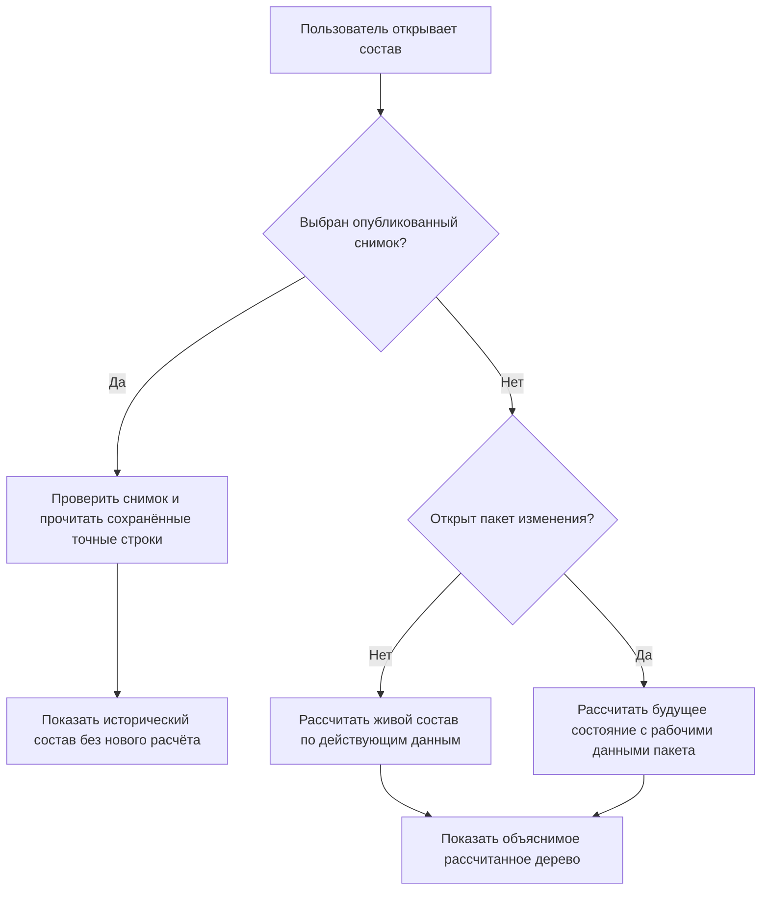
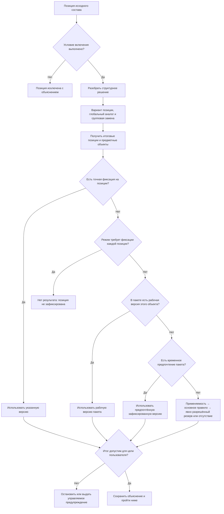

# Как пользователи работают с подбором версий

## Что именно называется подбором

Подбор версий — это не кнопка «взять последнюю». В живом или будущем составе это общий расчёт, который для каждой позиции многоуровневого изделия отвечает на несколько последовательных вопросов:

1. Должна ли позиция присутствовать в этой комплектации?
2. Остаётся ли исходный объект или выбирается допустимый аналог либо групповая замена?
3. Какую точную зафиксированную версию выбранного объекта следует использовать?
4. Допустим ли итог для текущей цели — просмотра, изменения, выпуска, заказа или ремонта?
5. Можно ли продолжать обход нижних уровней состава?

Пользователь получает не только выбранную версию, но и объяснение каждого решения. Однако открытие ранее опубликованного снимка — принципиально другой путь: система не повторяет эти вопросы, а читает уже сохранённый точный состав. Это различие защищает производственный заказ и историческое свидетельство от последующих изменений правил.

## Три режима работы

### Живой состав

Система рассчитывает состав по сегодняшним официальным данным, действующим правилам и заданным условиям. Результат может законно измениться после выпуска новых версий или новой редакции правила.

Так работают обычный просмотр конструктора, предварительный расчёт заказа, оценка обеспеченности и поиск современной замены для ремонта.

### Будущий состав внутри пакета изменения

Участник открытого пакета видит официальные данные, дополненные его рабочими версиями и подготовленными операциями. Этот режим нужен для ответа «что получится после проведения».

Остальные пользователи без контекста пакета продолжают видеть официальное состояние.

### Ранее опубликованный снимок

Система сначала распознаёт, что пользователь открыл именно опубликованный снимок, проверяет право доступа, вид снимка и его целостность, а затем читает сохранённые строки. Она не проверяет заново условия включения позиций, не ищет современные аналоги, не применяет текущую применяемость и не запускает действующее правило выбора версий. Так открываются уже переданный производственный заказ, состав выпуска и историческое свидетельство.

Новая версия компонента не меняет старый снимок.

Главный смысл развилки: готовый снимок завершает выбор режима до любого живого обхода состава. Нельзя сначала пересчитать позицию по сегодняшним условиям, а затем попытаться заменить результат строкой снимка — это дало бы гибрид исторических и современных данных.

## Кто участвует

### Конструктор и технолог

Открывают состав, задают инженерно понятную цель, создают точные фиксации на позициях, готовят применяемость в пакете изменения и исправляют предметные ошибки.

Они не должны вручную вводить внутренние идентификаторы правил или версий. Рабочее место показывает обозначение, поколение, степень готовности и причину выбора.

### Менеджер комплектации или заказа

Задаёт требования заказа: исполнение, климат, напряжение, дополнительные опции, площадку, дату и плановый диапазон серийных номеров. Он выбирает из разрешённых бизнес-параметров, а не редактирует структуру правил.

### Методист состава и администратор модели

Определяют, какие параметры допустимы, какие позиции они включают, какие виды аналогов и групповых замен разрешены, какие корпоративные политики выбора доступны. Изменения проходят рецензирование, испытания и управляемый выпуск.

### Владелец продукта или НСИ

Управляет основной версией, применяемостью, корпоративными правилами и конфликтами диапазонов. Полномочия разделяются по типам объектов и предметным областям.

### Планировщик производства

Запускает полный расчёт заказа, разбирает отсутствие подходящих компонентов, согласует разрешённые резервные результаты и публикует точный снимок передачи.

### Сервисный специалист

Сначала читает исторический состав конкретного экземпляра или выпуска, затем отдельно рассчитывает современный допустимый вариант ремонта. Историческая и предлагаемая конфигурации не смешиваются.

## Откуда берутся исходные условия

Пользователь не заполняет десятки технических полей при каждом открытии. Прикладная система собирает контекст из понятных источников.

| Условие | Типичный источник | Кто отвечает |
|---|---|---|
| Головное изделие | Открытая карточка, заказ или проект | Прикладное рабочее место |
| Исполнение и опции | Комплектация заказа или выбранный вариант изделия | Менеджер комплектации |
| Серийный номер или диапазон | Заказ, партия либо план выпуска | Планировщик |
| Дата действия | План производства, дата ремонта или явно выбранная дата анализа | Пользователь и процесс |
| Площадка и предприятие | Заказ, проект и организационная настройка | Принимающий продукт |
| Цель выбора | Просмотр, расчёт, выпуск, заказ, ремонт | Рабочее место и политика |
| Правило выбора | Разрешённый профиль операции | Администратор правил |
| Пакет изменения | Открытая рабочая задача пользователя | Принимающий продукт |
| Снимок | Ранее опубликованный выпуск или передача | Пользователь выбирает деловой артефакт |

Перед расчётом рабочее место показывает краткое резюме: «РЦ-250, исполнение У2, серия 145, площадка Пермь, дата 12.05.2027, политика выпуска». Пользователь может раскрыть подробности и увидеть происхождение каждого значения.

## Какие значения пользователь выбирает вручную

Ручной выбор нужен только там, где существует реальное деловое решение:

- выбрать комплектацию заказчика;
- указать дату или серию для анализа;
- выбрать разрешённую цель просмотра;
- подтвердить допустимый резервный результат;
- создать точную фиксацию критической позиции;
- выбрать один из разрешённых вариантов групповой замены;
- открыть конкретный исторический снимок.

Нельзя позволять пользователю незаметно менять системную политику только для своего окна. Персональная настройка представления допустима; скрытая персональная логика состава — нет.

## Проверка режима и исходных условий

Сначала система определяет не параметры подбора, а сам режим работы.

Если пользователь выбрал опубликованный снимок, проверяются его вид, корневое изделие, целостность и право чтения. При успешной проверке система сразу переходит к сохранённым строкам. Серия, сегодняшняя дата, текущая комплектация и действующая редакция корпоративного правила в этом пути не используются. Если снимок повреждён, имеет другой вид или относится к другому деловому артефакту, чтение останавливается целиком; система не пытается незаметно заменить его живым расчётом.

Только для живого или будущего состава до обхода проверяется следующее:

- существует ли точная корневая версия, от которой начинается обход;
- заполнены ли обязательные параметры конфигурации;
- согласованы ли серия и дата;
- разрешена ли выбранная политика для этой операции;
- доступен ли пакет изменения и имеет ли пользователь право видеть его рабочее состояние;
- нет ли взаимоисключающих значений, например одновременно «северное исполнение» и «тропическое исполнение».

Ошибка входа показывается до долгого расчёта. Пользователь видит поле, источник неверного значения и разрешённое действие. Разделение проверок важно и для доверия: неисправность исторического снимка нельзя маскировать новым составом, а неполные условия живого заказа нельзя маскировать старыми строками снимка.

## Полный порядок живой обработки одной позиции

Следующая последовательность относится только к живому составу и к будущему составу внутри пакета изменения. При чтении готового снимка она не запускается даже частично.

Первые шаги решают, **какой объект и какая позиция вообще участвуют**. Только затем выбирается версия объекта. Это предотвращает смешение конфигуратора, замен и версионной политики.

Важная граница зрелости: проверка условия присутствия до выбора версии закреплена нормативно. Богатая модель вариантов структуры, глобальных аналогов и групповых замен пока является целевой продуктовой гипотезой. Их точное взаимное старшинство, адресация повторных вхождений и носитель решения конкретного заказа ещё должны быть приняты. Диаграмма показывает нужное разделение вопросов, а не объявляет окончательный порядок трёх структурных механизмов.

## Порядок выбора версии

Если позиция существует и итоговый объект определён, для живого расчёта применяется единый приоритет:

1. **Точная фиксация конкретной позиции** — использовать явно указанную версию. Фиксация принадлежит не объекту вообще, а позиции в точной родительской версии: один и тот же подшипник в двух узлах может быть зафиксирован по-разному.
2. **Проверка строгого режима «только точные фиксации»** — если фиксации нет, результатом сразу становится «позиция не зафиксирована». Рабочая версия, применяемость, обычное правило и резервный выбор в этом режиме не продолжают подбор. Профиль с резервным правилом уже не должен называться строгим режимом точных фиксаций.
3. **Рабочая версия объекта в выбранном пакете изменения** — участник пакета видит будущее состояние, которое сам пакет собирается провести. Рабочая версия сильнее временного предпочтения того же пакета.
4. **Временное предпочтение пакета** — если собственной рабочей версии объекта нет, пакет может временно выбрать существующую зафиксированную версию для проверки будущего состава.
5. **Применяемость** — выбрать версию для головного изделия, серии, даты и других утверждённых координат.
6. **Основное корпоративное правило** — например, назначенная основная, последняя допустимая или версия требуемой степени готовности.
7. **Заранее объявленное резервное правило** — выполнить только тогда, когда более сильные слои и основное правило ничего не нашли. Результат обязательно помечается как ухудшенный по отношению к основному правилу.
8. **Отсутствие подходящей версии** — сохранить понятную диагностику, если резерв не задан или тоже не дал результата.

Если выбран готовый снимок, эта цепочка вообще не запускается: система читает сохранённые точные версии и отдельно показывает сохранённые при публикации причины первоначального выбора.

Более слабый механизм не отменяет более сильный. Например, «последняя версия» не пересиливает точную фиксацию, временное предпочтение не заслоняет рабочую версию того же объекта, а новое правило не переписывает старый снимок.

## Точная фиксация, рабочая версия и временное предпочтение

Эти три механизма часто выглядят для пользователя как ручной выбор версии, но означают разные решения.

**Точная фиксация позиции** изменяет сам родительский состав. Например, версия 05 редуктора может требовать в позиции «Подшипник выходного вала» строго версию 02 подшипника, тогда как версия 06 того же редуктора уже использует живое правило. Поэтому фиксация сохраняется вместе с новой родительской версией и видна каждому, кто читает эту версию.

Внутри одного пакета точная фиксация может указывать и на рабочую версию целевого объекта из этого же пакета. Сначала пользователь видит связанное будущее состояние, а при проведении система одной неделимой операцией фиксирует целевую рабочую версию и родительскую версию с новой позицией. Указать на рабочую версию другого пакета нельзя: это раскрыло бы чужую незавершённую работу и сделало результат непроводимым.

**Рабочая версия объекта** возникает потому, что пакет действительно изменяет этот объект. Если пакет одновременно содержит рабочую версию электродвигателя и старое временное предпочтение другой зафиксированной версии этого же двигателя, выбирается рабочая версия. Иначе пользователь проверял бы не то будущее состояние, которое собирается провести.

**Временное предпочтение** — средство проработки, а не новый официальный факт состава. Оно помогает сравнить уже существующие версии, не меняя каждую позицию немедленно. Перед проведением предметного пакета каждое такое предпочтение должно получить явный исход: его снимают либо превращают в точные фиксации на перечисленных позициях. Молчаливого превращения всех затронутых позиций в фиксации нет.

Для отдельной передачи конкретного заказа допустим другой путь: временное решение используется только при формировании нового снимка заказа. Тогда официальная конструкция не изменяется, а точный результат и основание решения остаются в отдельном неизменяемом снимке передачи. После публикации рабочее предпочтение не продолжает жить как скрытая настройка последующих расчётов.

## Резервное правило и ручное решение заказа — не одно и то же

Резервное правило заранее утверждено для класса операций. Например, предприятие может разрешить при обзорном расчёте, если назначенная основная версия отсутствует, показать последнюю выпущенную и выделить предупреждение. Оно исполняется одинаково для всех пользователей с тем же профилем и всегда оставляет признак резервного результата.

Ручное решение заказа возникает после рассмотрения конкретной ситуации ответственным человеком. Например, из-за дефицита планировщик предлагает для одной насосной станции разрешённый двигатель другого поставщика, инженер подтверждает совместимость, а согласующий принимает отклонение только для данной передачи. Такое решение не становится резервным правилом предприятия и не должно незаметно влиять на следующий заказ. Оно либо оформляется предметным изменением, либо фиксируется только в снимке конкретной передачи вместе с основанием и согласованием.

## Карточка результата одной позиции

Для каждой позиции система должна сохранить и уметь показать:

- путь от корня состава;
- включена позиция или исключена;
- исходный объект;
- применённый вариант позиции;
- выбранный аналог или групповая замена;
- точную версию итогового объекта;
- механизм, который победил;
- использованные условия;
- какие слои подбора были испробованы и какой из них дал результат либо не дал его;
- предупреждения;
- допустимо ли использовать результат для выбранной цели;
- следующее разрешённое действие.

Для значимых случаев целевое рабочее место также показывает отклонённые версии и понятные причины: например, «не действует для серии 145» или «не достигнута требуемая степень готовности». Полный перечень каждого просмотренного внутреннего кандидата текущим контрактом не обещан: обязательны испробованные слои, фактическая причина результата, отсутствие результата и предупреждения. Состав подробного списка кандидатов остаётся вопросом проектирования пользовательского интерфейса и требований к диагностике конкретной операции.

Важно различать «версия выбрана» и «результат разрешено публиковать». Точная фиксация может однозначно выбрать версию, выведенную из обычного применения. Это не означает ни автоматического разрешения, ни безусловного запрета. Действующая политика предприятия для конкретной цели решает, можно ли использовать такую версию: обычный выпуск может быть заблокирован, историческое чтение остаётся допустимым, а ремонт сертифицированного старого изделия может потребовать специального согласования. Пользователь всегда видит состояние версии, решение политики и требуемое следующее действие.

## Как выглядит полное дерево

Рабочее место показывает обычное дерево изделия, а не таблицу внутренних правил. На каждой позиции доступны понятные признаки:

- «включена условием комплектации»;
- «заменена аналогом»;
- «версия зафиксирована в позиции»;
- «выбрана для серии 145»;
- «показана рабочая версия пакета»;
- «использован разрешённый резерв»;
- «нет допустимой версии».

Цвет не является единственным носителем смысла. Значок, текст и подробное объяснение должны быть доступны для поиска, отчёта и выгрузки.

## Что происходит при ошибке

### Ошибка входных условий

Расчёт не начинается или останавливается на входе. Ответственный исправляет комплектацию, дату, серию или профиль операции.

### Нет допустимой версии

Позиция получает результат «не найдено», точный путь и причину. В зависимости от цели:

- обычный просмотр может показать неполное дерево с предупреждением;
- диагностический живой расчёт выпуска может показать неполноту для анализа;
- публикация неизменяемого снимка всегда запрещена, потому что снимок обязан содержать полный точный граф и не может иметь строку без выбранной версии;
- проведение предметного изменения или выпуск делового результата блокируется только тогда, когда действующая корпоративная контрольная политика требует полной и однозначной разрешимости состава для этой операции;
- планировщик получает задание выпустить версию, изменить контекст, исправить управляющие данные или согласовать предусмотренное решение конкретного заказа.

Таким образом, отсутствие результата всегда наблюдаемо, но не превращается в один универсальный запрет для всех работ. Инженер может сохранить диагностический расчёт и продолжить исправление. Опубликовать неполный снимок нельзя ни при каких настройках. Возможность провести изменение, не связанное с полной готовностью всего дерева, определяется явной политикой предприятия и показывается пользователю до согласования.

### Конфликт применяемости

Система показывает пересекающиеся диапазоны и их владельцев. Исправление выполняется через пакет изменения правил применяемости, а не случайным выбором одной записи.

### Неоднозначная замена

Пользователь видит допустимые варианты и основание каждого. Если политика не определяет победителя, система не выбирает по случайному порядку. Владелец НСИ или заказа принимает явное решение.

### Недопустимая точная фиксация

Версия определяется однозначно, после чего проверяется её пригодность для заявленной цели. Версия, выведенная из обычного применения, не запрещается самим механизмом фиксации: решение принимает корпоративная политика выпуска, ремонта или исторического воспроизведения. Если политика запрещает результат, пользователь видит конкретную причину — недостаточную степень готовности, несовместимость, вывод из применения или иной запрет — и исправляет фиксацию, меняет предметное состояние версии либо запускает предусмотренное согласование исключения.

Отдельно проверяется происхождение рабочей версии. Фиксация может указывать на рабочую версию только внутри того же пакета, который одновременно проводит родительский состав и целевой объект. Ссылка на рабочую версию другого пакета останавливает проверку как несогласованная, а не заменяется ближайшей официальной версией.

## Повторный расчёт

После исправления пользователь запускает повтор. Система использует новую редакцию исходных данных и показывает различия:

- какие позиции изменились;
- где исчезла ошибка;
- появились ли новые предупреждения;
- изменился ли итоговый отпечаток;
- какие прежние решения утратили силу.

Для большого состава повтор может пересчитать только безопасно определённую затронутую область, но итог публикации всё равно проверяется как полный граф.

## Когда результат становится официальным

Живой расчёт сам по себе не является публикацией. Он может использоваться для просмотра, анализа и предпросмотра пакета.

Предметный результат становится официальным в двух разных формах:

- проведённое предметное изменение фиксирует новые версии, точные позиции, применяемость и другие управляющие данные конкретных объектов;
- бизнес-снимок фиксирует полный выбранный граф для выпуска или заказа.

Общие правила и настройки не являются третьей формой предметного результата. Новая редакция общего алгоритма выбора становится официальной отдельным путём — через выпуск модели предприятия и управляемый переход данных. Назначение профиля конкретной деловой операции выпускается в принимающем продукте. Эти контуры подробно разведены в документе об управлении правилами.

Пользователь должен явно видеть, находится ли он в пробном расчёте, в будущем состоянии пакета или в неизменяемом опубликованном снимке.

## Пример 1. Конструктор проверяет будущую серию редуктора

Конструктор открывает редуктор РЦ-250 для серии 145 внутри пакета «Модернизация подшипникового узла». В пакете есть рабочая версия крышки редуктора и рабочая версия нового подшипника. Ранее для сравнения конструктор временно предпочёл уже выпущенную версию этого подшипника, но после появления собственной рабочей версии система показывает именно её: реальное будущее содержание пакета сильнее прежней пробы.

Позиция в рабочей версии крышки получает точную фиксацию на рабочую версию подшипника того же пакета. На другой позиции старая фиксация манжеты вызывает предупреждение о несовместимости. Конструктор переходит из объяснения к позиции, заменяет фиксацию, снимает ставшее ненужным временное предпочтение и повторяет расчёт. При проведении крышка, подшипник и связь между ними становятся официальными одновременно. Остальные пользователи до проведения продолжают видеть прежний официальный состав.

## Пример 2. Планировщик формирует насосную станцию

Заказ задаёт северное исполнение, 400 В, площадку Норильск и дату поставки. Конфигуратор включает подогрев, исключает стандартный шкаф и выбирает утеплённый вариант. Для двигателя применяется корпоративный аналог разрешённого поставщика, затем правило выбирает выпущенную версию.

На глубине состава нет кабельного ввода нужной степени готовности. Заранее утверждённое резервное правило для предварительной оценки может показать более раннюю выпущенную версию с предупреждением, но профиль производственной передачи такой резерв не разрешает. Пробный расчёт поэтому показывает неполноту и запрещает публикацию.

Планировщик не может объявить старую версию «резервным правилом» только для этого окна. Он либо ждёт выпуска подходящего кабельного ввода, либо оформляет и согласует исключение именно для данной станции. Во втором случае точный выбор сохраняется в отдельном снимке передачи и не меняет будущие заказы. После устранения проблемы повтор меняет одну ветвь, заказ согласуется и публикуется как точный снимок.

## Пример 3. Сервис ремонтирует старый пресс

Сервисный специалист сначала открывает исторический снимок пресса и видит установленную версию гидрораспределителя без пересчёта. Даже если сегодняшнее условие комплектации уже исключает эту позицию, а действующий справочник предлагает другой аналог, чтение снимка не запускает проверку присутствия и подбор. Пользователь получает именно состав прежней передачи и сохранённое основание выбора.

Затем специалист создаёт отдельный ремонтный расчёт на текущую дату. Только в новом живом расчёте глобальный аналог предлагает современный распределитель, а групповая замена добавляет переходную плиту и крепёж.

Интерфейс одновременно показывает «было установлено» и «предлагается для ремонта», но не смешивает деревья. После инженерного решения ремонт оформляется отдельным пакетом.

## Пример 4. Методист проверяет новое правило

Методист хочет для площадки Пермь предпочитать подшипники локального поставщика. Он испытывает правило на наборе редукторов и заказов. В одном сертифицированном узле точная фиксация сохраняет импортный подшипник; правило правильно не пересиливает её. В другом случае два локальных кандидата равнозначны, и испытание выдаёт неоднозначность.

Методист добавляет явный критерий, повторяет испытания и выпускает новую редакцию правила вместе с новой редакцией модели предприятия и проверенным переходом данных. Старые снимки остаются прежними, а новые живые расчёты используют выпущенную редакцию после её установки.

## Пример 5. Ремонт узла с версией, выведенной из применения

В архивном составе прокатного стана зафиксирована версия 03 преобразователя, которая позднее была выведена из обычного применения. При чтении исторического снимка она показывается без запрета: иначе предприятие потеряло бы достоверное описание поставленного оборудования.

Для нового серийного стана профиль выпуска исключает эту версию и требует действующую замену. Для ремонта конкретного сертифицированного экземпляра отдельная корпоративная политика допускает повторное использование версии 03 только после подтверждения службы безопасности и при наличии складского изделия с прослеживаемым происхождением. Один и тот же статус версии поэтому приводит к разным, но объяснимым результатам в зависимости от цели. Сам механизм подбора не скрывает решение и не объявляет вывод из применения абсолютным физическим запретом.

## Критерии продуктовой приёмки

Пользовательский механизм можно считать воспроизведённым корректно, если на эталонных изделиях подтверждены следующие наблюдаемые результаты:

- открытие готового снимка не запускает условие включения, поиск аналогов, применяемость или современное правило выбора;
- отсутствие фиксации в строгом режиме «только точные фиксации» даёт понятное отсутствие результата, а не резервный или последний вариант;
- рабочая версия объекта из выбранного пакета побеждает старое временное предпочтение того же пакета;
- фиксация на рабочую версию принимается только внутри того же пакета и становится официальной одновременно с обеими связанными версиями;
- перед проведением предметного пакета каждое временное предпочтение явно снято или превращено в фиксации конкретных позиций;
- отдельное решение заказа может попасть в новый снимок передачи, но не меняет правило для следующих заказов;
- резервное правило всегда заранее задано профилем и заметно помечено, а ручное исключение заказа имеет собственное основание и согласование;
- версия, выведенная из применения, читается в истории, а её допустимость для выпуска или ремонта определяется явной корпоративной политикой;
- для каждой выбранной и невыбранной позиции пользователь видит условия, победивший механизм, предупреждение и разрешённое следующее действие.

## Граница ответственности

Interlink отвечает за типизированные данные состава, единый порядок, точный результат, причины выбора, проверки и публикацию снимка.

Принимающий продукт отвечает за рабочие места, получение деловой цели, права, задания, согласование, уведомления и внешние передачи.

ERP, MES, CAD/PDM и архив получают согласованные представления и подтверждают собственную обработку. Их ответ не должен скрытно менять правила подбора Interlink.

## Состояние реализации

Порядок выбора версии известного объекта и форма основных причин результата определены нормативно. Исполняемого подбора версий в текущем срезе ещё нет: существуют носители контекста, политик, причин и будущих прикладных контрактов, а неподдерживаемые режимы закрываются явным отказом. Команды, запросы, рекурсивный обход, политики и техническая проекция реализуются поэтапно. Применяемость, полный пакет, конфигуратор, богатая семантика аналогов и групповых замен, бизнес-снимки и рабочие места относятся к последующим этапам. Документ описывает целевой пользовательский контракт, а не готовую функцию.

Связанные документы: [сквозное формирование состава](17-end-to-end-resolution.md), [управление правилами подбора](19-selection-rule-lifecycle.md), [пакет изменения](../changes/README.md), [точный заказ](16-order-and-snapshot.md).

Основания: [IL-VERS-SPEC §4–§6], [IL-QUERY], [IL-PLM §5–§7], [IPS-A06], [IPS-A07], [IPS-A08], [IPS-A13]. Расшифровка — в [реестре источников](../knowledge/15-source-register.md).
