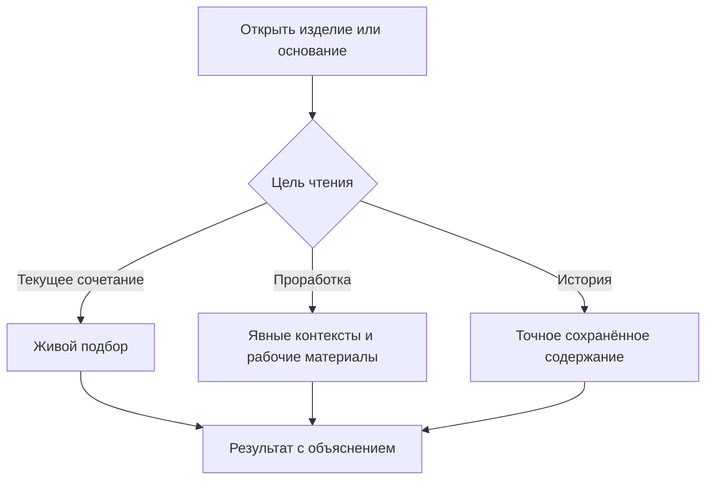
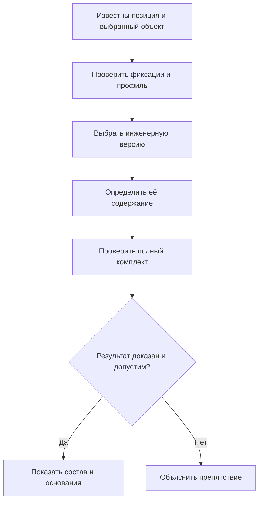
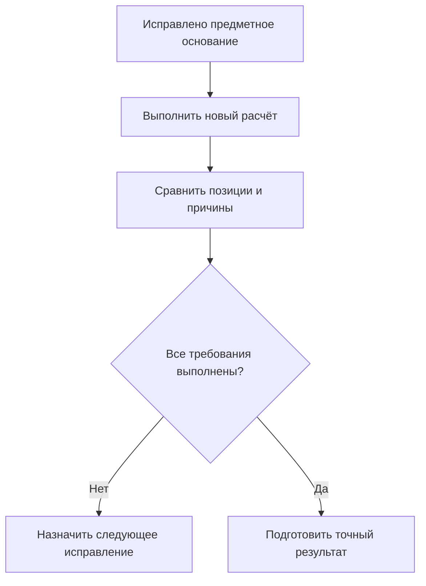

# Как пользователи работают с подбором версий

## Что пользователь получает в результате

Подбор должен дать не просто обозначение детали, а понятный ответ: какая позиция нужна, какой объект используется, почему выбрана его инженерная версия, какое содержание показано и допустим ли весь комплект для текущей задачи.

Например: «Уплотнение нагнетательного фланца: версия Г выбрана по сохранённой мягкой конкретизации; показана доступная рабочая копия этой версии; производственная передача пока недопустима». Здесь не смешаны выбор версии, видимость незавершённой работы и разрешение выпуска.

**Документ фиксирует целевой пользовательский процесс на 6 сентября 2026 года.** Полного готового рабочего места и промышленного исполнения всех описанных механизмов пока нет.

## С чего начинается работа

Пользователь открывает изделие, проект изменения, заказ, итерацию или ранее опубликованный снимок. Система сначала различает назначение чтения.

### Живой состав по опубликованным данным

Он рассчитывается в объявленных условиях: для головного изделия, серии, даты, площадки, комплектации и выбранного профиля. При следующем запуске ответ может измениться, если законно изменились существенные исходные данные.

«Опубликованные данные» не означает «все они автоматически допущены в производство». Жизненный цикл, квалификация и нынешние запреты проверяются отдельно.

### Проработка с рабочими материалами

Пользователь явно подключает контекст или группу и разрешённые рабочие области. Так он видит будущее сочетание версий, в том числе тех, которые сейчас не редактирует. Рабочие копии не выбираются только потому, что принадлежат тому же человеку или находятся в открытом пакете.

Рабочая область, контекст и пакет не совпадают. Контекст отвечает за назначения, область — за незавершённое содержание, пакет — за совместное проведение. Их различия подробно описаны в [контекстах и группах](21-selection-contexts.md).

### Точный сохранённый результат

Исторический снимок читается без нового выбора версий. Именованная итерация также открывает сохранённое содержание своей объявленной области. Сначала проверяются вид, принадлежность, целостность, возможность чтения и текущие права. Повреждённый результат не заменяется свежим расчётом.

Различия режимов видны в рабочем месте постоянно, а не скрыты в глубокой настройке. Историческое чтение не подменяется живым, рабочее содержание — опубликованным без объявленного перехода.

## Роли и их решения

Конструктор создаёт версии, правит состав и назначает разрешённые предпочтения. Технолог проверяет производимость, маршруты, нормы и связь с конструкторским основанием. Менеджер комплектации задаёт опции заказа и выбирает допустимые варианты. Планировщик готовит точную передачу и разбирает препятствия.

Методист задаёт формы правил и испытательные примеры; владельцы предметных данных управляют применяемостью, допусками и редакциями справочников. Общие и персональные правила могут сохраняться как управляемые данные. Не всякое изменение параметра требует выпуска новой модели предприятия; изменение самой формы допустимых правил — другой уровень ответственности.

Принимающий продукт предоставляет рабочие места, роли, согласования и интеграции. Interlink должен сохранять и исполнять согласованный смысл, точные основания, ограничения и результаты ошибок.

## Откуда берутся условия

Пользователь не должен вручную заполнять служебные поля. Рабочее место собирает данные из предметных источников и показывает их происхождение.

| Условие | Пример источника | Что нужно сделать явным |
|---|---|---|
| Головное изделие и корень | Карточка, заказ, проект | Что именно раскрываем и в какой структуре |
| Исполнение и опции | Требования заказчика | Явно выбранное, унаследованное и пока неизвестное значение |
| Серия или заводской номер | План выпуска, экземпляр | Конкретное значение либо отдельно обрабатываемый диапазон |
| Дата применяемости | План производства, ремонта, анализа | Какой деловой смысл имеет дата; дата поставки не подставляется автоматически |
| Площадка | Заказ или проект | Где действует решение и нормы |
| Профиль | Цель операции и разрешённая настройка | Совместимость IPS или явно выбранный редакторский режим |
| Именованное правило | Общий либо персональный вариант | Его редакция и параметры |
| Контексты и рабочие области | Выбор команды | Назначения и разрешённая видимость материалов |
| Режим содержания | Просмотр, редактирование, точное основание | Опубликованное, рабочее или конкретное сохранённое содержание |

Перед расчётом достаточно компактной строки: «Насосная станция, северное исполнение, серия 145, площадка Норильск, дата применяемости 12 мая, профиль производственной подготовки». Подробности раскрывают источники и недостающие обязательные значения.

За достоверность значений отвечают предметные роли. Менеджер комплектации подтверждает согласованные опции; планировщик — диапазон выпуска и деловой смысл даты; владелец процесса — разрешённый профиль и строгость передачи; руководитель инженерной работы — подключённые контексты и область рабочих материалов. Конкретное распределение полномочий задаёт предприятие. Рабочее место показывает источник и ответственного, а не предлагает оператору самостоятельно догадаться о недостающем условии.

Диапазон номеров 501–508 не является одним условным номером. Если внутри него проходит граница применяемости, составы нужно разделить по соответствующим областям или использовать явно поддержанный договор расчёта диапазона.

## Как принимаются решения

Для живого состава сначала определяются необходимые позиции и кандидатные структурные решения. Если допуск аналога привязан к версии исходного компонента, эта версия и нужное содержание устанавливаются до чтения допуска. Затем выполняется явный выбор варианта; его участники разрешаются обычным механизмом подбора.

Для каждого выбранного объекта проверяются жёсткие ограничения и строгая точность. При отсутствии жёсткого ответа профиль упорядочивает источники инженерной версии. В совместимом профиле IPS: применяемость, контекст или группа, активная мягкая конкретизация, именованное правило, явно разрешённый резерв. В отдельном редакторском профиле контекст может предшествовать применяемости.

Эти уровни не обязаны выполняться все. Уже выбранную версию более слабый источник не меняет. Явное исключение, конфликт и отказ доступа не приравниваются к отсутствию записи. Строгий режим без нужного вида фиксации останавливается, не запуская резерв.

После выбора инженерной версии определяется её содержание. Обычный рабочий режим может взять разрешённую копию **этой версии**, а при её отсутствии — опубликованное содержание. Но если сам контекст закрепил конкретную рабочую копию или точное состояние, это уточнение не теряется. Несовместимый режим даёт конфликт, а не ослабление требования.

Схема начинается после определения цели. Проверка полного комплекта включает ограничения, зависящие от точных свойств, файлов, интерфейсов и соседних участников. Если выбранная прошивка несовместима с контроллером, нельзя молча вернуться к старой версии. Пользователь может отдельно запросить поиск альтернативного комплекта в объявленных границах.

## Как выглядит рабочее дерево

На позиции показываются объект, инженерная версия, вид содержания и краткая причина. По раскрытию доступны путь, область конкретизации, источник назначения, применяемость, выбранная замена, результат совместимости и допустимые действия.

Полезные объяснения:

- «Версия Б жёстко задана; показано её опубликованное содержание после исправления».
- «Предпочтение Г сохранено, но временно выключено жизненным циклом родителя».
- «Версия В назначена технологическим контекстом; показана его рабочая копия».
- «Сохранённое точное состояние читается из передачи заказа».
- «Набор участников выбран, но совместимость прошивки ещё не доказана».

Цвет и значок не являются единственным носителем смысла. Причины доступны текстом для поиска и отчёта. Закрытые данные не раскрываются через подробное объяснение.

Развёрнутая карточка должна показывать, какие источники действительно участвовали в этом расчёте, какой из них определил версию, каким способом выбрано её содержание и какие предупреждения остаются. Для планировщика полезен итог: «Для просмотра допустимо; для передачи не хватает подтверждения морозостойкости; ответственный — специалист по квалификации комплектующих».

Это не обещание выгрузить все внутренние кандидаты, закрытые версии и ход каждой служебной проверки. Объяснение должно быть достаточным для принятия решения, соответствовать правам и различать доказанный факт, допущение и неустранённое препятствие.

## Ошибки и следующий шаг

| Ситуация | Что видит пользователь | Допустимое продолжение |
|---|---|---|
| Нет обязательного параметра | Значение и его ожидаемый источник | Заполнить либо выбрать другой разрешённый режим |
| Конфликт контекстов | Несовместимые назначения версий или содержания | Согласовать список, не выбирать «последний открытый» |
| Нет подходящей версии | Обязательная позиция и разрешённая причина | Выпустить версию, исправить условия либо разобрать разрешённый резерв |
| Нет содержания выбранной версии | Версия выбрана, читать нечего или режим несовместим | Исправить назначение или завершить нужную работу |
| Применяемость явно исключает результат | Действующее ограничение | Изменить предметное основание или оформить предусмотренное исключение |
| Полный комплект несовместим | Затронутые участники и правило | Явно пересмотреть комплект, не подменять версию скрыто |
| Недостаточно доказательств | Какая проверка не завершена | Получить данные или использовать поддержанный способ проверки |
| Недостаточно прав | Безопасная диагностика | Получить полномочия; закрытая версия не заменяется старой доступной |

Предварительный просмотр может показывать неполноту и предупреждения. Полная производственная передача не может превратиться в обрезанное дерево из успешно прочитанных позиций. Отдельная частичная выдача допустима только как самостоятельная явно объявленная область, а не как скрытая потеря ветвей.

## Резервное правило и разовое решение заказа

Заранее разрешённый резерв действует для определённого класса операций и сохраняет причину своего применения. Например, в обзорном расчёте методист может разрешить показать назначенную основную версию, когда основное правило не дало результата и переход действительно допускается. Это не разрешение обходить обязательную применяемость, точную привязку, права или несовместимость.

Разовое решение выглядит иначе. Для заказа на насосную станцию поставщик не может поставить выбранный двигатель. Менеджер предлагает двигатель другого семейства вместе с переходной плитой. Инженер проверяет допустимость полного комплекта, а уполномоченный согласующий принимает решение для указанного заказа и области выпуска. Результат сохраняется как явный выбор конфигурации с основаниями, а не как невидимый переход на следующий алгоритм.

Следующий заказ не получает эту замену автоматически. Чтобы решение стало общим, потребуется отдельное включение в управляемую библиотеку допусков или изменение правила предприятия. Даже правильно оформленное разовое решение не отменяет обязательный неотменяемый запрет.

## Повторный расчёт после исправления

После изменения опции, устранения конфликта или публикации недостающего материала пользователь запускает новый расчёт. Рабочее место сравнивает его с предыдущим: какие позиции изменились, какие ошибки исчезли, появились ли новые предупреждения и сохранились ли ранее принятые решения.

Например, опубликованный чертёж переходной плиты устранил отсутствие содержания, но проверка выявила новый конфликт её крепления с кожухом. Это не «старая ошибка осталась», а новый обоснованный результат. Планировщик видит разницу и возвращает инженеру конкретную задачу.

Повторный расчёт не является публикацией и не обновляет уже переданный снимок. В будущем можно ускорить его обработкой только зависимых ветвей, но это способ исполнения, а не право пропустить обязательные проверки полной передачи. Повтор команды после сбоя связи также имеет другой смысл: сначала нужно выяснить исход прежней операции, а не создавать новое деловое действие.

## Как сохраняют полезное решение

Если инженер просто попробовал другой вариант, временная настройка не должна автоматически стать официальной. Он выбирает носитель результата: сохранить назначение контекста, мягкую конкретизацию позиции, жёсткую привязку, конкретный выбор заказа либо именованную итерацию.

Выбор зависит от смысла. «Этот подшипник предпочитать на данной позиции» — мягкая конкретизация. «Эти версии читать вместе в проекте» — контекст. «Передать именно этот комплект» — точное основание публикации. Временную настройку не нужно обязательно превращать в жёсткую фиксацию, как ошибочно предполагала прежняя модель.

## Подготовка, согласование и публикация

Живой расчёт сам по себе ничего не выпускает. Перед официальным действием фиксируются выбранные правки и точные основания, на которых будет принято решение. При изменении подготовленного публикуемого содержания или самого плана результат подготавливается заново и проходит требуемое согласование; согласующий не должен подписывать одно, а получить другое.

Различаются согласование **самих правок** и согласование **полной конфигурации**. Одобрение исправления корпуса не доказывает неизменность незатронутого двигателя, если тот продолжал подбираться живым правилом.

Если договор требует выпустить именно одобренный точный комплект, смена чужой основной версии не подменяет его. Если дополнительно требуется актуальность объявленных зависимостей на момент проведения, их изменение вызывает конфликт. В обоих случаях проверяются нынешние обязательные запреты, права и отсутствие перезаписи чужих изменений.

Рабочие копии могут войти в совместно подготовленную публикацию и получить официальное содержание одновременно. Производственный снимок ссылается уже на реально опубликованные результаты; изменяемые рабочие материалы не выдаются за них. Нельзя между согласованием и публикацией свободно пересчитать комплект и молча выпустить новый.

## Пять примеров работы

### 1. Конструктор готовит будущую серию редуктора

Серия 145 использует корпус Б; контекст опытной модернизации назначает В. В совместимом профиле IPS применяемость сохраняет Б. Для проработки конструктор явно выбирает редакторский профиль и доступную рабочую область В.

На двух позициях уплотнения сохранены разные мягкие предпочтения. Он проверяет, какие из них участвуют, а какие заслонены назначением контекста. После выбора правильного сочетания сохраняет итерацию «До ресурсного испытания». Серийные пользователи не получают эту работу без собственного разрешённого контекста.

### 2. Планировщик формирует северную насосную станцию

Заказ задаёт северное исполнение и номера 501–508. В номере 505 меняется применяемость уплотнения, поэтому планировщик получает две области состава, а не условный один ответ на весь диапазон.

Для двигателя выбирается разрешённый заменитель с плитой и крепежом. Подбор участников успешен, но испытание низкотемпературной смазки ещё не подтверждено. Статус «не доказано» не превращается в «совместимо». После получения точного основания и одобрения публикуются соответствующие полные передачи.

### 3. Сервис ремонтирует старый пресс

Сервисный специалист открывает исторический снимок и отдельно подтверждённые данные фактических установок. Первое отвечает «что передали», второе — «что установили и затем изменили».

Современный распределитель допускается вместо исходной версии только с переходной плитой. Инженер проверяет допуск именно этой исходной версии, выбирает полный комплект и получает результат совместимости точного содержания. Новый ремонтный комплект не переписывает прежнюю передачу; установка регистрируется отдельным фактом.

### 4. Методист меняет общее правило

Методист создаёт новую редакцию правила «Выпущенные компоненты площадки Пермь» и испытывает её на контрольных изделиях. Экспериментальная ветвь не должна побеждать только потому, что появилась позже; область новизны задана явно.

Среди контрольных примеров есть сертифицированный узел с точной фиксацией: новое правило не должно заменить его более свежим содержанием. Другой пример содержит двух равнозначных кандидатов. Методист либо задаёт допустимый явный критерий различия, либо получает понятную неоднозначность — порядок строк на экране не становится правилом.

Два окна могут использовать разные редакции или параметры, если это разрешено и передано в условиях. Уже подготовленный точный комплект сохраняет использованное правило. Изменение самого словаря допустимых операторов требует отдельного обновления модели, а обычный новый набор параметров — нет.

### 5. Преобразователь выведен из применения, но установлен в старом прессе

Преобразователь версии 03 больше не разрешён для нового серийного выпуска. Сервису при этом нужно понять комплектацию пресса, поставленного несколько лет назад. Историческое чтение сохраняет прежнее точное основание, если пользователь имеет нынешнее право доступа, а необходимые данные и файлы сохранены. Современный запрет нового применения не переписывает историю.

Для нового пресса расчёт должен учитывать действующее разрешение применения: старое основное назначение или мягкое предпочтение не делает снятую версию автоматически пригодной. Если нужного разрешённого варианта нет, требуется предметное решение, а не скрытый возврат к версии 03.

Ремонт сертифицированного экземпляра может иметь отдельный явно разрешённый процесс сохранения прежнего исполнения. Тогда проверяются основание ремонта, допустимость такого применения, происхождение складского преобразователя и условия конкретного экземпляра. Это не универсальное разрешение использовать любое снятое оборудование и не обход обязательного запрета. После ремонта факт установки регистрируется отдельно от разрешения и переданного комплекта.

## Приёмка и границы ответственности

Приёмка проверяет одинаковый ответ в дереве, отчёте и фоновом расчёте при одинаковых условиях; различие версии и содержания; сохранение мягкой конкретизации и контекста после пакета; точность одобрения; полную совместимость; отсутствие скрытой подмены при ошибке.

Прикладной продукт определяет деловой процесс и полномочия; Interlink применяет обязательные проверки в операциях и выдаче. Предварительное разрешение на артефакт не является бесконтрольным обходом прав на данные. Полнота производственного основания проверяется целиком; персонально отфильтрованный экран не задаёт границу передачи.

Файлы, внешние PLM, ERP, MES и САПР имеют собственные договоры доставки и подтверждения. Их ответ не меняет сохранённое содержание Interlink автоматически. Неизвестный исход операции требует установления результата, а не повторного делового действия под новым именем.

Далее: [сквозные сценарии](17-end-to-end-resolution.md), [правила и их редакции](19-selection-rule-lifecycle.md), [пакет изменения](../changes/README.md), [контексты](21-selection-contexts.md), [мягкая конкретизация](20-durable-soft-concretion.md), [снимок заказа](16-order-and-snapshot.md).

## Основания и границы подтверждения

Сведения о сценариях IPS: `IPS-A04`, `IPS-A05`, `IPS-A06`, `IPS-A07`, `IPS-A08`, `IPS-A13`. Принятые решения Interlink: `IL-KERNEL`, `IL-VERS-SPEC`, `IL-IPS-COVERAGE`, `IL-DATA-MODEL`, `IL-SC`. Текущее состояние и порядок реализации — `IL-PLAN-V2`.

Расшифровка, происхождение и ограничения этих оснований приведены в [реестре источников](../knowledge/15-source-register.md). Целевой договор задаёт будущую реализацию; соответствие конкретной установке IPS подтверждается сценарными испытаниями и переносом её данных, а не одним совпадением терминов.
