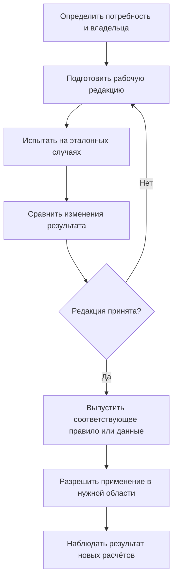
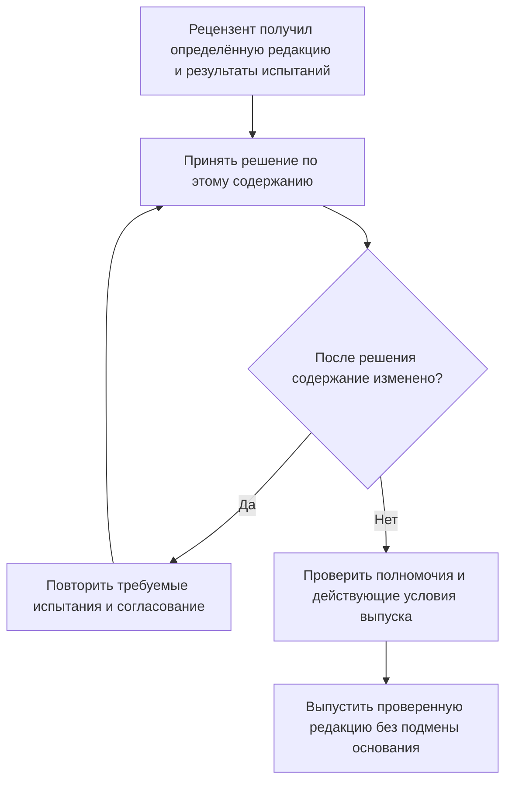

# Как создаются, проверяются и изменяются правила подбора

## Почему недостаточно описать алгоритм

Предприятие само создаёт значительную часть условий формирования состава: применяемость, основные назначения, мягкие и жёсткие привязки, аналоги, групповые замены и правила подразделений. Без владельца, редакций и испытаний даже хороший алгоритм даст непредсказуемый результат.

Целевой подход Interlink — управлять смыслом каждого решения и сохранять, **какая редакция и какие исходные данные были фактически использованы**. Это не означает, что все изменения обязаны проходить один и тот же пакет.

## Что именно меняется и кто за это отвечает

| Вид изменения | Типичный владелец | Какой результат сохраняется |
|---|---|---|
| Новый тип объекта, параметр или вид условия | Архитектор модели и предметный методист | Редакция модели и необходимый переход данных |
| Общее или персональное правило из разрешённых условий | Методист либо уполномоченный пользователь | Новая редакция именованного правила |
| Назначение правила производственной операции | Владелец прикладного процесса | Версия настройки и область разрешённого применения |
| Применяемость, привязка позиции, декларация замены | Владелец предметных данных | Управляемое изменение конкретного объекта или состава |
| Долговечный контекст выбора | Владелец проекта или совместной работы | Редакция назначений, основания и разрешённые связи с другими контекстами |
| Разовое решение заказа | Планировщик и согласующие | Отдельное решение с областью, полномочиями и точными основаниями |

Каталог общих и персональных правил является управляемыми данными. Не каждое изменение критерия требует выпуска всей модели. Но новый вид условия нельзя вводить обходным способом, если модель и исполнитель его ещё не поддерживают.

## Общая последовательность

Владелец определяет потребность, готовит рабочую редакцию, проверяет её на характерных изделиях и сравнивает результат с действующей. После принятия выпускается именно тот носитель, который изменялся: модель, правило, настройка, контекст или предметные данные.

Сохранение рабочей редакции не является публикацией. Согласование относится к определённому содержанию. Если оно изменилось, требуется повторная проверка по правилам процесса. Уже опубликованные снимки не пересчитываются.

## Что видят разные участники

Автор и допущенные участники получают рабочую редакцию. Рецензент видит её точное содержание, испытательный набор и сравнение «до/после». Обычные пользователи продолжают применять действующую разрешённую редакцию.

Права просмотра не дают права на выпуск. Фоновый расчёт и агент получают явно определённые правила, параметры и полномочия; последнее переключение пользовательского окна не становится их скрытой настройкой.

Согласование не относится к одному только названию правила. Вторая схема объясняет, почему правка уже рассмотренного критерия требует возврата к проверке, а не тихого включения в выпуск.

## Пример 1. Изменение производственного правила

Методист готовит новую редакцию правила для насосной станции: кроме утверждения документации теперь требуется квалификация поставщика для площадки сборки.

Он проверяет серийный заказ, опытный проект, отсутствие поставщика, аннулированную версию и два несопоставимых семейства версий. Сравнение показывает, какие позиции изменили выбор, где появилась проблема и где правило по-прежнему выбирает то же содержимое.

Если добавленный критерий использует уже предусмотренные данные и условия, выпускается редакция правила. Если квалификация поставщика вообще ещё не представлена в модели, сначала требуется её расширение и подготовка данных.

Ранее согласованный точный заказ остаётся связанным со своей редакцией и своим содержимым. Появление нового правила само по себе не переписывает его. Но при новой выдаче отдельно проверяются действующие обязательные запреты.

## Пример 2. Введение крышки с серии 145

Владелец редуктора задаёт применение новой крышки с серии 145. Система показывает старые диапазоны и проверяет серии 144, 145 и 146, а также заказ, пересекающий эту границу.

Если другое правило уже действует с серии 150 и создаёт неоднозначность, изменение не публикуется как корректное. Владелец уточняет области. Когда извещение одновременно меняет крышку, крепёж и чертёж, проверяется согласованность полного изменения, а не только одной строки.

После публикации новые живые расчёты используют соответствующую редакцию применяемости. Архивный снимок заказа не меняется.

## Пример 3. Сохраняемая мягкая конкретизация

Конструктор предпочёл версию 03 уплотнения в определённой позиции насосной сборки. Это долговечное намерение, а не временная настройка пакета. Оно сохраняется при публикации содержания владельца.

Настроенный переход жизненного цикла может приостановить действие такого выбора. Причина приостановки хранится отдельно от неизменяемого содержания. Разрешённый последующий переход может восстановить действие того же намерения.

Если инженер явно удалил выбор или заменил его новым, старое процессное событие не должно восстановить прежнее решение. Операции «приостановить», «удалить» и «не учитывать в этом просмотре» имеют разный смысл. Именно это требуется проверить при переносе мягкой конкретизации IPS.

## Пример 4. Допустимая замена насоса комплектом

Служба НСИ готовит декларацию: старый насос можно заменить новым насосом вместе с переходной плитой и крепежом. Проверяются направление замены, область применения, количества, обязательные участники и ограничения интерфейса.

Разрешённая альтернатива ещё не является выбранной альтернативой заказа. Затем комплект привязывается к конкретным местам состава, ответственный принимает выбор и система проверяет весь итог — включая точное содержание выбранных компонентов.

Если допуск принадлежит определённой версии исходного насоса, сначала устанавливается эта версия и читается её декларация. Правило другой исходной версии не подставляется по общему названию объекта.

Выпуск декларации, решение заказа и фактическая установка на изделие — три разных результата. Ни один не записывается автоматически вслед за другим.

## Как вести жёсткие привязки и основные назначения

Для жёсткой привязки всегда определяется требуемая точность: инженерная версия или точное содержание. В IPS-совместимом процессе её назначает предусмотренная системная или процессная команда; обычная пользовательская конкретизация относится к мягкому выбору. Прикладной продукт на Interlink может отдельно разрешить уполномоченному специалисту ручное назначение жёсткой привязки. Это самостоятельное расширение прав, а не автоматическое право каждого конструктора.

Исправление той же версии не равно смене версии; подписанный комплект требует точного основания независимо от того, какая команда создала ссылку.

Основное назначение указывает инженерную версию в явно названной области. Его смена не меняет содержание версии и не пересчитывает старые снимки. Если назначение меняется вместе с жизненным циклом или вытеснением прежней основной версии, обязательные связанные действия выполняются согласованно.

## Как развивать конфигуратор и совместимость

Модель определяет доступные параметры и значения. Методист описывает условия присутствия позиций, полные варианты замен и обязательные ограничения сочетаний. Менеджер заказа выбирает разрешённую комплектацию.

Нужно испытывать не только отдельные пары деталей. Совместимость может зависеть от трёх и более участников — например, контроллера, привода, прошивки и способа подключения. Часть условий проверяется до окончательного выбора, часть — по выбранному точному содержанию.

Отсутствие строки в неполной матрице не означает автоматически ни разрешения, ни запрета. Для вывода по отсутствию должны быть явно установлены полнота и область действия соответствующей таблицы.

## Как разбирать ошибку после выпуска

Ответственный получает воспроизводимый случай: изделие, путь позиции, цель, параметры, использованные редакции и объяснение исхода. Затем определяется, что ошибочно:

- исходные условия заказа;
- управляющие данные конкретного объекта;
- редакция правила;
- сама модель или неподдерживаемый режим;
- недостаток сведений для проверки;
- права доступа или техническое выполнение.

Эти причины требуют разных действий. Нельзя исправлять ошибку модели ручной заменой версии в каждом заказе или выдавать отказ доступа за отсутствие подходящего компонента.

## Изменение и возврат редакции

Нежелательную редакцию не редактируют задним числом. Выпускают исправление либо управляемо возвращают разрешённую прежнюю редакцию там, где это допускается и совместимо с текущими данными.

Для модели учитывается состояние базы и возможность безопасного перехода. Для правила сохраняются история и область активации. Для предметного состава создаётся новое опубликованное содержание; старое не переписывается.

Новое правило не обязано автоматически аннулировать прежнее точное согласование. Нужно различать сохранённое основание, решение перейти на новую редакцию и действующее обязательное ограничение, которое действительно запрещает дальнейшее применение.

## Как оценивать качество после внедрения

Полезны доля неразрешённых позиций, частота резерва, причины конфликтов, неожиданное изменение живых составов и время полного расчёта. Показатели помогают найти проблему, но не меняют правило без решения владельца.

Эталонный набор должен включать обычные и отрицательные случаи: точную привязку, мягкий выбор и его восстановление, конфликт контекстов, границу применяемости, отсутствие данных, недоступный объект, полную групповую замену и несовместимость итоговых состояний.

## Что проверить со специалистом IPS

Важно определить, кто редактирует общие и персональные правила, какие действия выполняются автоматически на шагах жизненного цикла, какие массовые команды применяются и где требуется строгое совпадение с историческим результатом.

Приёмка:

1. Изменения модели, правила, контекста и состава не смешиваются.
2. Рабочая редакция не становится официальной при сохранении.
3. Изменение согласованного содержания требует предусмотренной повторной проверки.
4. Мягкая конкретизация не удаляется при закрытии пакета.
5. Ручное удаление не отменяется поздним автоматическим восстановлением.
6. Разрешённая замена не считается автоматически выбранной или установленной.
7. Итоговая совместимость проверяется по полному выбранному комплекту.
8. Старые снимки и использованные редакции остаются объяснимыми.

## Подробные пути изменения: от потребности до применения

### Путь предметных данных

Если меняется применяемость крышки с серии 145, привязка подшипника или конкретная декларация замены, владелец готовит правки этих данных. Рабочая область хранит незавершённое содержание; пакет определяет, какие правки и связанные действия должны стать официальными вместе. Не нужно искусственно переносить изменение одного изделия в общий выпуск модели.

Перед согласованием показываются затронутые объекты и позиции, старые и новые значения, зависимые заказы, граничные серии, конфликты с другими работами и неразрешённые условия. Если правка требует формального согласования, решение относится к точному проверенному содержанию. Изменение диапазона после проверки требует предусмотренного возврата на проверку.

Публикация выполняет согласованный комплект целиком. Это не означает, что любой справочный факт обязан иметь инженерные версии или что любая правка требует длительного извещения: нейтральные записи и разрешённый короткий путь изменения сохраняют свои договоры. Но обязательные совместные проверки нельзя обойти другим названием команды.

### Путь модели и новых возможностей языка

Если предприятие впервые вводит ось «производственная площадка» или новый вид проверки, одной редакции правила недостаточно. Архитектор модели определяет новый смысл данных, способ заполнения существующих записей и совместимость старых операций. Методист проверяет, что изменение выражает реальные потребности, а не только позволяет заполнить дополнительное поле.

Подготавливаются модель, переход данных и испытания. Установка может иметь несколько управляемых этапов; это не обещание одной бесконечно долгой неделимой операции. Главное — не выдать прикладному процессу несогласованное сочетание описания и данных и не объявить неподдерживаемый режим готовым.

Пример: площадку нужно учитывать одновременно для редукторов, насосных станций и станков. Сначала выпускается способность представлять площадку и её правила. Затем наполняются соответствующие предметные данные, создаётся редакция правила и разрешается её применение нужным операциям. До этого отсутствие площадки в старом заказе не заполняется случайным значением «по умолчанию».

### Путь каталога общих и персональных правил

Когда все необходимые понятия уже существуют, методист меняет редакцию именованного правила как управляемые данные. Добавление разрешённого критерия квалификации поставщика не требует заново определять тип двигателя, если модель уже умеет выражать эту квалификацию.

Автор задаёт область версий, критерии допуска, порядок выбора и разрешённый резерв. Проверка использует общие договоры исполнения, поэтому персональное правило не получает отдельный скрытый алгоритм. Редакция сохраняет свой смысл и параметры; её нельзя заменить другой под тем же названием в уже согласованном точном результате.

Этот путь принципиально добавлен относительно прежней редакции документа: настраиваемое правило не обязано каждый раз выпускаться вместе со всей моделью. С другой стороны, правило из каталога не может самовольно вводить новый неподдерживаемый вид данных или проверки.

### Путь настройки принимающего продукта

Администратор процесса определяет, какие редакции и профили доступны в рабочем месте, кто может их запускать и какие действия требуют согласования. Он готовит изменение настройки, указывает область и условия активации, проверяет роли и типовые операции.

Например, предварительная оценка насосной станции может допускать резерв при отсутствии основной версии, а производственная передача — требовать строгий результат. Если способы подбора уже предусмотрены, меняется назначение профилей операциям, а не конструкция станции.

Новая настройка не подменяет основание открытого согласования. Для дальнейшей операции учитываются её актуальные полномочия и обязательные запреты. Если требуется пересчёт по новой редакции, это должно быть отдельным видимым условием. Старое точное свидетельство остаётся историей, даже когда новое применение по нему уже запрещено.

### Путь отдельного заказа

Дефицит двигателя для одной насосной станции может потребовать согласованного отклонения. Ответственный показывает исходный отказ, полный предложенный комплект, совместимость, количественную область и необходимые полномочия. Разрешение относится к этой передаче, а не ко всем последующим заказам.

Если заменитель — другой объект, сначала оформляется соответствующее решение замены. Подбор версий лишь определяет версии и содержание участников. Новый точный снимок хранит принятое основание; дальнейшая доставка и установка учитываются отдельно.

Повторяющийся дефицит может стать поводом пересмотреть общий справочник допустимых замен или правило снабжения. Но частота ручных исключений не превращает их автоматически в корпоративное разрешение.

## Копирование, выпуск и взаимодействие нескольких инициатив

Одна инициатива может потребовать всех перечисленных путей. Открытие новой площадки затрагивает модель, классификацию поставщиков, конкретную применяемость изделий и права производственного рабочего места. Поэтому нужны порядок зависимостей и владельцы каждого шага.

При этом не следует собирать всё в фиктивное единое извещение. Предметный пакет редуктора не выпускает модель предприятия, а активация административного профиля не заменяет согласование состава. В истории сохраняется связь инициативы с каждым результатом, но сами результаты остаются различимыми.

Копирование правила или конфигурации также должно показывать, что перенесено: критерии, значения, область применения либо ссылки на конкретные предметные данные. Копия не наследует автоматически права выпуска и не становится согласованной только из-за согласованности прототипа.

## Как направлять найденную проблему

Полезное рабочее место не ограничивается советом «обратитесь к администратору». Оно сохраняет воспроизводимый случай и показывает владельца соответствующего вида решения.

| Найденная причина | Кому направить | Что исправлять |
|---|---|---|
| Неверная серия, дата или комплектация | Ответственному за заказ | Исходные условия и при необходимости точный план передачи |
| Ошибочный диапазон или привязка позиции | Владельцу конструкции или изменения | Предметные данные с проверкой затронутых использований |
| Неверный разрешённый критерий именованного правила | Владельцу правила | Его редакцию и испытательный набор |
| Отсутствующий вид данных или проверки | Архитектору модели и команде продукта | Расширение модели и путь перехода |
| Неправильное назначение профиля или роль | Владельцу прикладного процесса | Настройку рабочего места и полномочия |
| Отсутствующая версия нужной готовности | Владельцу соответствующего документа | Подготовку, проверку и допуск содержания |
| Недоказанная совместимость | Ответственному предметному специалисту | Полноту исходных сведений или явный поиск разрешённого комплекта |
| Сбой выполнения | Службе сопровождения | Восстановление корректного исполнения без подмены предметного результата |

После исправления повторяется именно затронутая проверка на определённых исходных данных. Предыдущая проблема остаётся объяснимой: видно, каким решением её устранили.

## Возврат разных носителей не взаимозаменяем

Для предметных данных готовится новое исправление. Для каталога правил выпускается следующая редакция или активируется разрешённая прежняя. Для модели нужен безопасный путь с учётом уже изменённых данных. Для настройки процесса сохраняется собственная история активации. Для заказа публикуется новый результат в допустимой области.

Ни один такой возврат не переписывает сохранённый снимок другой передачи. Если отмена настройки сделала старое правило снова доступным, это ещё не отменило текущий запрет применения конкретного компонента. Все обязательные ограничения проверяются совместно.

## Состояние реализации

Описан целевой процесс управления правилами и управляющими данными. Конкретные редакторы, административные рабочие места, испытательные наборы и показатели относятся к последующим этапам реализации. Порядок зависимостей замен и подбора уже определён предметно; точные профили совместимости с установками IPS подтверждаются сравнительными испытаниями.

## Связанные документы

- [Настраиваемые правила](10-custom-selection-rule.md)
- [Применяемость](03-effectivity-series-date.md)
- [Мягкая конкретизация](20-durable-soft-concretion.md)
- [Контексты подбора](21-selection-contexts.md)
- [Групповые замены](15-nm-substitutions.md)

## Основания и границы источников

Основания: [IL-SOFT], [IL-IPS-COVERAGE], [IPS-A06], [IPS-A07], [IPS-A08], [IL-QUERY], [IL-DSL], [IL-PLM], [IL-SC], [IL-KERNEL], [IL-VERS-SPEC], [IL-DATA-MODEL], [IL-PLAN-V2]. Расшифровка и статус источников — в [реестре источников](../knowledge/15-source-register.md).

Источники IPS задают проверяемые исходные сценарии и вопросы к конкретной установке. Текущее поведение Interlink определяется действующим семантическим договором и планом реализации; наличие этих описаний не заменяет испытаний.
