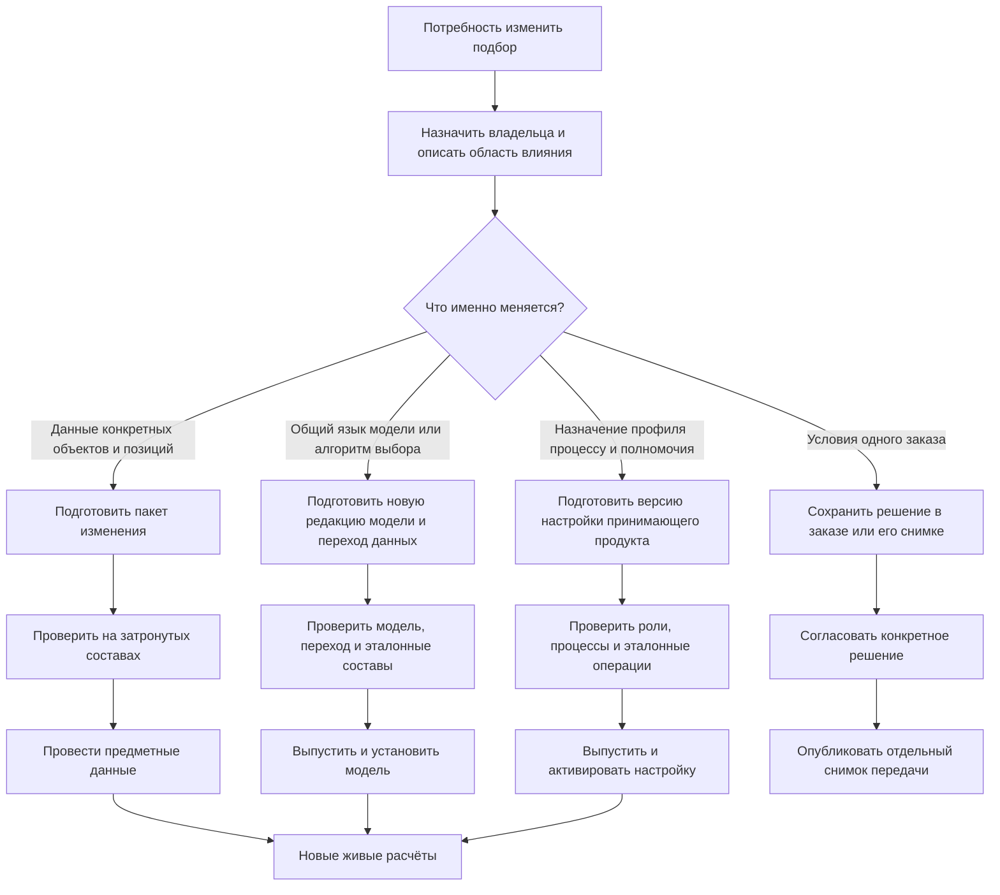
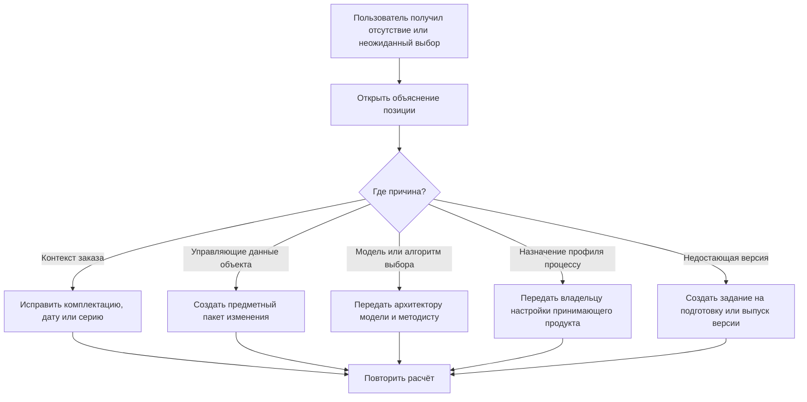

# Как создаются и изменяются правила подбора

## Почему пользователю недостаточно знать алгоритм

Стабильность состава зависит не только от программы Interlink. Предприятие создаёт применяемость, назначает основные версии, определяет аналоги, варианты, групповые замены и корпоративные правила. Если эти управляющие данные меняются без владельца, испытаний и выпуска, одинаковый заказ может неожиданно получить другой состав.

Слово «правило» здесь объединяет предметно близкие, но технически и организационно разные вещи. Диапазон применяемости крышки редуктора является данными конкретного изделия. Порядок сравнения кандидатов относится к выпущенной модели предприятия. Разрешение использовать определённый профиль для производственного заказа может принадлежать административным настройкам принимающего продукта. Поэтому у них не может быть одного универсального пути выпуска.

Главный принцип: сначала владелец определяет, **какой именно носитель решения изменяется**, и только затем выбирает правильный жизненный цикл. Попытка провести всё через пакет изменения объекта либо, наоборот, через выпуск модели создаёт неверную историю и затрудняет откат.

## Четыре слоя управления

### Модель предприятия

Определяет, какие типы объектов и связей существуют, где допустима точная фиксация, какие координаты применяемости поддерживаются и какие параметры конфигурации разрешены.

Владелец: архитектор предметной модели вместе с продуктовыми специалистами.

### Корпоративные правила

Определяют доступные режимы: назначенная основная версия, последняя допустимая, выпущенная, минимальная степень готовности, разрешённый резерв и профиль конкретной операции.

Владелец: методист PLM или НСИ. Здесь важно разделить два вида. Сам алгоритм выбора и его разрешённые параметры входят в выпущенную модель предприятия. Административное назначение профиля конкретному процессу — например, какой профиль разрешён для предварительного расчёта и какой для производственной передачи, — принадлежит принимающему продукту и должно иметь собственную версионируемую историю.

### Управляющие данные объекта

Это применяемость конкретной версии, точная фиксация позиции, список аналогов, вариант структуры и групповая замена.

Владелец: конструктор, технолог, служба НСИ либо менеджер продукта — по корпоративной матрице.

### Контекст конкретной операции

Это изделие, серия, дата, комплектация, площадка, заказ, пакет изменения и цель расчёта.

Владелец: пользователь и принимающий процесс. Контекст не переписывает корпоративное правило, а задаёт его входные условия.

## Четыре носителя и четыре пути изменения

| Что меняется | Пример | Где становится официальным | Почему именно там |
|---|---|---|---|
| Предметные управляющие данные | Применяемость версии крышки с серии 145, точная фиксация подшипника в позиции, утверждённый аналог | В пакете изменения объектов и состава | Решение относится к конкретным версиям и позициям и должно фиксироваться вместе с ними |
| Модель и встроенное или настраиваемое правило выбора | Новая ось «производственная площадка», новый разрешённый критерий, иной порядок сравнения кандидатов | В выпуске модели предприятия с управляемым переходом данных | Меняется общий язык и поведение для множества типов и процессов, а не один объект |
| Административная политика принимающего продукта | Для предварительной оценки разрешён резерв, для производственной передачи — запрещён | В целевом версионируемом жизненном цикле настроек принимающего продукта | Это правило назначения и полномочий процесса, а не инженерное содержание изделия |
| Контекст отдельного расчёта или заказа | Серия 145, дата 12.05.2027, площадка Пермь, цель «ремонт» | В заказе, задаче или опубликованном снимке конкретной передачи | Это исходные условия одного решения; они не должны менять общие правила предприятия |

Пакет изменения, выпуск модели и выпуск настройки принимающего продукта могут быть связаны общей инициативой, но остаются разными официальными действиями. Например, ввод новой площадки может потребовать сначала выпустить расширенную модель, затем перенести данные, потом провести применяемость конкретных изделий и лишь после этого включить новый профиль в рабочем месте заказа.

## Как пользователь выбирает правильный путь

Во всех путях до официального шага выполняются проверка непротиворечивости, испытание на эталонных составах и сравнение «до/после». Но официальный носитель различается. Старые снимки продолжают показывать прежние точные результаты и происхождение. Новая редакция влияет на будущие живые расчёты только после выпуска и активации соответствующего носителя.

## Путь 1. Предметные данные конкретных объектов

Этот путь используется, когда решение отвечает на вопрос «что верно для данной детали, версии или позиции состава». Владелец открывает пакет изменения, берёт затронутые объекты в работу и готовит применяемость, назначение основной версии, точную фиксацию, аналог или структурную замену. Остальные пользователи до проведения видят прежнее официальное состояние; участники пакета могут рассчитать будущее.

Перед согласованием система показывает:

- точные затронутые изделия и позиции;
- старое и будущее значение каждого управляющего факта;
- составы, заказы и граничные серии, где изменится результат;
- конфликты с другими диапазонами, фиксациями и рабочими пакетами;
- отсутствие подходящей версии, неоднозначность и предупреждения.

Согласование относится к точному содержанию пакета. Если после него изменили диапазон, целевую версию или состав затронутых объектов, проверка и согласование повторяются. При проведении предметные данные и связанные версии фиксируются одновременно либо не фиксируется ничего. Этот путь сохраняет понятную связь: «правило действует потому, что его выпустили вместе с такой-то версией изделия».

Временное предпочтение версии внутри пакета не является предметным правилом и не выпускается как самостоятельный факт. Перед проведением его снимают либо явным решением превращают в точные фиксации перечисленных позиций. Если предпочтение нужно только для одной передачи заказа, оно используется при публикации отдельного снимка заказа и после этого не влияет на последующие живые расчёты.

## Путь 2. Модель предприятия и настраиваемый алгоритм

Этот путь нужен, когда меняется общий язык данных или единый способ сравнения кандидатов: добавляется координата применяемости, новый вид связи, новый критерий выбора либо новая редакция настраиваемого правила. Такое изменение не относится к одному редуктору и не должно маскироваться под пакет изменения его состава.

Архитектор модели и методист готовят новую редакцию модели. До выпуска они проверяют, что существующие данные можно перенести без потери смысла, а эталонные изделия дают ожидаемый результат. Рабочее место сравнения должно показать не только отсутствие формальных ошибок, но и предметное влияние: сколько позиций меняют выбор, где появляется отсутствие результата, какие ранее допустимые заказы требуют уточнения.

После согласования выпускается новая редакция модели и управляемый план перехода данных. Установка выполняется целиком: либо новая модель и необходимые преобразования доступны согласованно, либо предприятие продолжает работать на прежней редакции. Версия модели, фактически использованная при расчёте и публикации снимка, сохраняется в происхождении результата. Поэтому позднейшее улучшение алгоритма не переписывает старую передачу.

Откат означает возврат принимающего решения на ранее проверенную редакцию либо выпуск исправленной следующей редакции с безопасным обратным переходом. Редактировать уже выпущенную модель задним числом нельзя.

## Путь 3. Административная политика принимающего продукта

Принимающий продукт определяет, кто может запускать профиль, для какой деловой операции он разрешён, нужен ли согласующий и можно ли публиковать резервный результат. Это не данные конструкции и не описание типов Interlink. Поэтому такая политика должна иметь собственный целевой версионируемый жизненный цикл в принимающем продукте.

Администратор готовит новую редакцию, указывает область действия и дату активации, проверяет её на эталонных ролях и операциях, а затем передаёт на согласование владельцу процесса. Новая редакция не должна незаметно заменять настройку уже открытого согласования: заказ показывает, с какой редакцией он был рассчитан, и требует явного повторного расчёта при переходе.

Полный административный контур является целевой ответственностью принимающего продукта. Interlink должен принимать выбранный явный профиль, проверять поддерживаемость режима и сохранять происхождение результата, но не подменять систему ролей и согласований внешнего продукта.

## Путь 4. Решение одного заказа

Серия, дата, площадка и комплектация являются контекстом расчёта. Ручное исключение для одной передачи — например, разрешение поставить согласованный двигатель другого поставщика из-за дефицита — тоже не превращается автоматически в корпоративное резервное правило.

Ответственный видит исходный отказ, предлагаемый вариант, влияние на совместимость и требуемых согласующих. После решения формируется новый полный снимок заказа. В нём остаются точные версии и основание исключения, но следующий заказ снова рассчитывается по общим правилам. Если предприятие обнаруживает повторяющуюся потребность, владелец отдельно решает, нужно ли превратить её в предметный аналог, новую редакцию модели или административную политику.

## Как создаётся применяемость

Владелец изменения задаёт не техническую формулу, а предметный диапазон: головное изделие, начало и окончание серий, даты и другие утверждённые координаты.

Система должна:

- показать существующие диапазоны того же объекта;
- обнаружить пересечение и пробел;
- рассчитать примеры на границах «до», «с» и «после»;
- показать затронутые заказы и выпуски;
- провести применяемость вместе с версиями, к которым она относится.

### Пример

Новая крышка редуктора применяется с серии 145. Испытание проверяет серии 144, 145 и 146. Для 144 выбирается старая версия, для 145 и 146 — новая. Если другой диапазон уже начинается с 150 и перекрывается, выпуск останавливается до явного разрешения.

## Как назначается основная версия

Уполномоченный пользователь выбирает конкретную официальную версию и видит, где политика «основная версия» изменит живой состав. Назначение выполняется через быстрое или формальное предметное изменение в зависимости от готовности объекта и масштаба влияния; в обоих случаях остаётся тот же проверяемый и прослеживаемый путь фиксации.

Отсутствие основной версии не означает автоматический переход к последней. Резерв должен быть явно предусмотрен профилем операции.

## Как создаётся точная фиксация позиции

Конструктор открывает конкретную позицию точной родительской версии, выбирает требуемую версию целевого объекта и указывает основание: сертификация, интерфейсная совместимость, договорное требование или воспроизводимость испытаний. Фиксация принадлежит этой позиции родительской версии, а не целевому объекту вообще.

Обычно целью является уже зафиксированная версия. Если один пакет одновременно изменяет родительский узел и целевой компонент, фиксация может указывать на рабочую версию этого же пакета. Тогда обе версии становятся официальными одной неделимой фиксацией. Рабочая версия другого пакета недопустима: пользователь не должен публиковать ссылку на чужую незавершённую работу.

Проверка показывает:

- текущую и предлагаемую версии;
- допустимость версии;
- влияние на каждое использование позиции;
- конфликт с применяемостью и предупреждение о будущем устаревании;
- отличие от фиксации полного снимка.

Фиксация проводится вместе с новой родительской версией и её позицией, а не хранится как скрытая настройка пользователя. Проверка пригодности выполняется отдельно: версия, выведенная из обычного применения, может оставаться точным историческим или ремонтным выбором, но её использование для конкретной цели решает корпоративная политика.

## Как ведутся глобальные аналоги

Служба НСИ создаёт связь между исходным и альтернативным объектом, область допустимости и ограничения: предприятие, вид использования, температура, сертификация, направление замены.

Перед выпуском проверяются:

- совместимость ключевых характеристик;
- односторонняя или взаимная заменяемость;
- отсутствие запрещённых цепочек и циклов;
- результат на типовых составах;
- необходимость человеческого решения для критических объектов.

Временный дефицит поставщика не обязательно должен менять глобальный справочник. Для конкретного заказа может быть правильнее явное решение заказа.

## Как создаются групповые замены

Владелец состава определяет исходный набор позиций, альтернативный набор и точную область действия в структуре. Система проверяет количества, единицы, обязательность участников, повторное использование и пересечение с другими заменами.

Испытание должно показать полный результат «до» и «после». Нельзя считать групповую замену удачной, если главный узел заменён, а необходимый переходник или крепёж потерян.

## Как выпускается настраиваемое правило

### Подготовка

Методист выбирает разрешённые критерии и порядок сравнения кандидатов. Обычный пользователь не пишет программный код и не получает возможность выполнить произвольный запрос к базе.

### Испытательный набор

Для правила хранится набор реалистичных примеров:

- обычный серийный состав;
- граница применяемости;
- точная фиксация;
- отсутствие кандидата;
- два равных кандидата;
- выведенная из обычного применения или недостаточно готовая версия;
- большая повторно используемая сборка.

### Сравнение влияния

Перед выпуском методист видит, какие позиции на эталонных изделиях изменят выбор относительно действующей редакции. Неожиданное массовое изменение требует объяснения или исправления.

### Выпуск

Настраиваемое правило является частью выпущенной модели предприятия. Оно получает новую официальную редакцию вместе с проверенным описанием модели и управляемым переходом данных. После установки разрешённые профили операций явно переходят на эту редакцию; отдельная административная настройка принимающего продукта определяет, где и кем профиль может применяться. Снимки сохраняют происхождение прежнего выбора.

## Как изменяется конфигуратор

Администратор модели определяет общий набор параметров, их типы и допустимые значения. Эта часть выпускается с моделью и при необходимости сопровождается переходом существующих данных. Методист конкретного изделия связывает уже разрешённые параметры с условиями включения его позиций и ограничениями совместимости; такие предметные условия проводятся в пакете изменения соответствующего состава. Менеджер заказа только заполняет разрешённую форму комплектации и не меняет ни модель, ни условия изделия.

Перед выпуском проверяются:

- полнота значений по умолчанию;
- взаимоисключающие и обязательные опции;
- вложенные конфигурации;
- отсутствие комбинаций, дающих неполный состав;
- стабильность ранее согласованных продуктовых вариантов.

Изменение списка параметров может требовать миграции существующих заказов. Система должна показать, какие заказы нельзя автоматически привести к новой редакции.

## Как обрабатывается обнаруженная проблема

Проблема не должна завершаться сообщением «обратитесь к администратору». В ней сохраняются корневое изделие, путь позиции, условия, кандидаты, действующая редакция модели, применённый профиль принимающего продукта и деловая цель. Владелец получает воспроизводимый случай и сразу понимает, какой жизненный цикл нужно запустить.

## Кто имеет право менять что

| Действие | Типичный владелец | Как фиксируется |
|---|---|---|
| Состав параметров конфигуратора и их типы | Архитектор модели | Выпуск модели и управляемый переход данных |
| Условия включения позиции | Владелец конструкции | Пакет изменения состава |
| Применяемость версии | Владелец изделия или изменения | Предметный пакет изменения |
| Точная фиксация | Конструктор с предметным полномочием | Пакет изменения позиции |
| Аналоги конкретных объектов | Служба НСИ и ответственные специалисты | Предметный пакет изменения или управляемое изменение справочника в том же предметном контуре |
| Групповая замена | Владелец состава | Пакет изменения структуры |
| Общий алгоритм и настраиваемая политика выбора | Методист PLM и архитектор модели | Выпуск новой редакции модели и переход данных |
| Назначение профиля операции, полномочия и согласование | Владелец процесса принимающего продукта | Целевой версионируемый выпуск настройки принимающего продукта |
| Резерв для конкретного заказа | Планировщик и согласующий | Решение заказа с основанием |
| Публикация снимка | Владелец выпуска или заказа | Отдельная контролируемая операция |

Конкретные роли на предприятии могут называться иначе. Важны разделение ответственности и прослеживаемость решения.

## Наблюдение после выпуска

Принимающий продукт собирает показатели:

- доля позиций без результата;
- частота резервного выбора;
- конфликты применяемости;
- число ручных решений;
- изменение состава после новой редакции правила;
- время полного расчёта;
- наиболее частые причины остановки;
- расхождение ожидаемого и фактически использованного состава.

Показатель сам по себе не меняет правило. Владелец анализирует примеры и запускает управляемое улучшение.

## Откат редакции правила

Если новая редакция даёт нежелательный результат, её не редактируют задним числом. Способ исправления зависит от носителя:

- для предметных данных готовится новый пакет изменения, который корректирует применяемость, фиксацию, аналог или структуру;
- для модели выпускается следующая редакция либо выполняется предусмотренный безопасный возврат к ранее проверенной редакции вместе с согласованным состоянием данных;
- для административной политики принимающий продукт активирует ранее проверенную версию настройки или выпускает следующую;
- для отдельного заказа публикуется новая передача и новый снимок, а прежний снимок остаётся свидетельством уже принятого решения.

История сохраняет период действия, владельца, основание и влияние каждого решения. Возврат не смешивает разные носители: переключение административного профиля не отменяет применяемость изделия, а предметный пакет не переписывает выпущенную модель.

Уже опубликованные снимки не пересчитываются. Открытые заказы должны явно показать, какой редакцией они рассчитаны и требуется ли повтор.

## Прикладные примеры, показывающие разные носители

### Пример 1. Новая крышка редуктора с серии 145

Конструктор выпускает версию 07 крышки редуктора РЦ-250 и задаёт её применяемость с серии 145. Это предметные данные конкретного изделия, поэтому работа идёт в пакете изменения вместе с новой версией крышки. Предпросмотр проверяет серии 144, 145 и 146, показывает переход между версиями и обнаруживает пересечение с прежним диапазоном. После устранения конфликта согласующий утверждает точное содержание пакета, и новая версия с применяемостью фиксируется одновременно.

Если вместо этого изменить общий алгоритм выбора, предприятие потеряет понятную связь между серией и версией крышки, а изменение может случайно затронуть тысячи других изделий. Поэтому пакет объекта является не формальностью, а правильным носителем решения.

### Пример 2. Предпочтение локального поставщика для нескольких классов изделий

Методист хочет учитывать площадку производства и при равной пригодности предпочитать детали утверждённого местного поставщика. Существующая модель ещё не содержит площадку как разрешённую координату и не знает нового критерия. Значит, одного пакета редуктора недостаточно.

Команда модели добавляет координату и новую редакцию настраиваемого правила, готовит перенос существующих настроек и испытывает результат на редукторах, насосных станциях и станках. Сравнение показывает, где выбор действительно изменится, где точная фиксация сохранит прежнюю версию и где кандидаты останутся равнозначными. После выпуска и установки модели живые расчёты используют новую редакцию, а старые снимки продолжают ссылаться на прежнее происхождение.

### Пример 3. Разные требования предварительного и производственного расчёта

Для оценки стоимости насосной станции предприятие разрешает показать последнюю выпущенную версию как явно отмеченный резерв, если назначенная основная отсутствует. Для передачи в производство тот же резерв запрещён: требуется точный обычный результат или остановка. Алгоритм резервного выбора уже присутствует в модели; меняется только назначение профилей деловым операциям.

Владелец процесса выпускает новую версию настройки принимающего продукта, проверяет роли планировщика и согласующего, дату активации и открытые заказы. Заказ, рассчитанный до активации, не переключается молча: пользователь видит прежнюю редакцию профиля и решает, нужен ли повтор. Никакие версии изделия и диапазоны применяемости при этом не меняются.

### Пример 4. Единовременная замена двигателя в заказе

Поставщик задерживает двигатель для одной насосной станции. Инженер подтверждает совместимость уже разрешённой версии другого поставщика, планировщик описывает причину, а согласующий принимает исключение только для этой передачи. Новый снимок заказа фиксирует точную версию двигателя и основание решения.

Следующий заказ снова использует общую политику. Если такие исключения повторяются, служба НСИ отдельно анализирует, следует ли выпустить глобальный аналог как предметные данные или изменить модель. Частое ручное решение само по себе не превращается в корпоративное правило.

## Критерии продуктовой приёмки

Управление правилами можно считать понятным и контролируемым, если:

- пользователь до редактирования видит, относится ли решение к объекту, модели, настройке принимающего продукта или одному заказу;
- предметные данные нельзя провести в обход пакета изменения связанных объектов и позиций;
- редакция настраиваемого алгоритма не проводится как изменение одного изделия, а выпускается с моделью и проверенным переходом данных;
- назначение профиля процессу имеет отдельную версию, владельца, область действия и дату активации в принимающем продукте;
- изменение после согласования требует повторной проверки именно того содержания, которое будет выпущено;
- сравнение на эталонных составах показывает позиции, изменившие результат, отсутствие выбора и новые предупреждения;
- каждый опубликованный снимок сохраняет происхождение использованных модели, профиля и предметных данных;
- откат одного носителя не переписывает остальные и не изменяет ранее опубликованные снимки;
- ручное решение одного заказа не становится скрытым резервным правилом для последующих заказов.

## Состояние реализации

Разделение механизмов, порядок подбора и требование объяснимости приняты как целевой контракт. Пакет изменения является принятым целевым носителем предметных управляющих данных, а определения модели и настраиваемые алгоритмы должны выпускаться через жизненный цикл модели и управляемый переход данных. Полный административный контур назначения профилей является целевой ответственностью принимающего продукта; его конкретная версионируемая форма ещё должна быть спроектирована вместе с этим продуктом.

Испытательные наборы, анализ влияния, применяемость, конфигуратор, полные пакеты изменения и описанные рабочие места ещё не образуют готовой пользовательской функции текущего среза. Их процессы и роли должны быть подтверждены специалистами IPS и пилотными предприятиями. Документ не обещает единый уже реализованный «редактор всех правил», а фиксирует, как не смешивать три разных официальных контура при дальнейшей реализации.

Связанные документы: [работа пользователей](18-user-operating-model.md), [настраиваемое правило](10-custom-selection-rule.md), [применяемость](03-effectivity-series-date.md), [конфигуратор](13-configurator-and-presence.md).

Основания: [IL-VERS-SPEC §4–§6], [IL-QUERY], [IL-DSL], [IL-PLM §5–§7], [IPS-A06], [IPS-A07], [IPS-A08]. Расшифровка — в [реестре источников](../knowledge/15-source-register.md).
