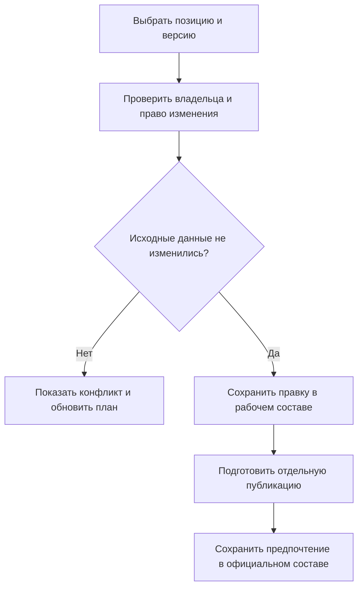
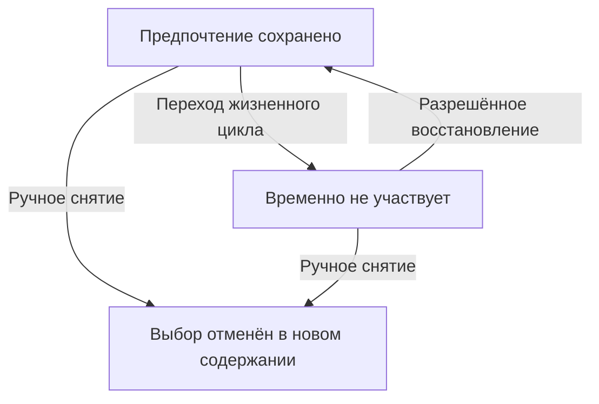

# Мягкая конкретизация: сохранить выбор версии на позиции

## Зачем она нужна

Мягкая конкретизация отвечает на очень практический вопрос: «Какую инженерную версию я предпочёл именно в этом месте состава?». Решение должно сохраняться после завершения работы, но не превращать позицию в безусловно жёсткую связь и не мешать предусмотренным режимам подбора.

В IPS это не только ручное указание версии. Существенны выбор показанной версии, массовые команды, автоматическая конкретизация новых связей, снятие и восстановление по жизненному циклу. Interlink должен воспроизвести весь этот набор результатов, а не заменить его временным параметром пакета.

**Состояние реализации:** ниже зафиксирован целевой договор на 6 сентября 2026 года. Полные команды, хранение, совместная работа и интерфейс ещё требуют реализации и приёмки.

## Что именно сохраняется

Предпочтение относится к позиции в содержимом родительской инженерной версии. Оно указывает инженерную версию дочернего объекта, например: «На нагнетательном фланце насоса предпочитать уплотнение версии Г».

Сохраняется не только выбранная версия, но и происхождение решения: его назначил инженер, его захватили из показанного состава, оно возникло при создании связи или перенесено при копировании. После публикации родительского содержания это намерение остаётся в составе и истории.

Мягкая конкретизация выбирает **версию**, а не неизменяемые байты. В опубликованном режиме показывается опубликованное содержание выбранной версии. В разрешённом рабочем режиме может показываться её рабочая копия. Рабочая копия другой версии не подходит. Чтобы закрепить конкретное содержание для подписи или передачи, нужна [точная ссылка либо снимок](02-hard-concretion-pin.md).

## Почему «мягкая» не значит «ненадёжная»

Предпочтение не обязано побеждать в каждом расчёте. Его могут заслонить жёсткая привязка, применяемость или назначение контекста согласно выбранному профилю. Жизненный цикл может временно выключить участие предпочтения. Но это не разрешает ссылаться на чужой объект, несуществующую версию или незаметно терять выбор при закрытии пакета.

В профиле совместимости IPS активная мягкая конкретизация рассматривается после применяемости и контекста, перед общим правилом. Если для этой цели контекст ничего не назначил, предпочтение может участвовать. Особые настройки установки проверяются отдельно; наличие вообще какого-то открытого контекста не должно незаметно менять смысл.

Пользователь видит две вещи: **какое намерение сохранено** и **какой источник определил результат сейчас**. Иначе он примет временно заслонённый выбор за удалённый.

## Ручной выбор и захват показанной версии

Инженер выбирает позицию и команду «Выбрать версию». Рабочее место показывает объект, возможные инженерные версии, текущий выбор и родителя, который будет изменён. После подтверждения правится рабочий состав родителя; обычное сохранение ещё не изменяет опубликованный состав.

Команда «Использовать показанную версию» имеет другой удобный смысл: инженер уже видит подходящий результат и хочет сохранить именно этот выбор. Если пока он размышлял назначенная основная версия изменилась, команда не должна незаметно сохранить новую. Она сохраняет показанную инженерную версию и проверяет, не изменилась ли сама редактируемая позиция.

В совместимом сценарии IPS захват показанной версии применяется к исходной неконкретизированной связи. Уже имеющаяся конкретизация не исчезает от того, что её заслонил контекст или режим просмотра. Для замены существующего предпочтения нужна явная команда выбора, а не обход этого условия.

Схема различает подготовку и официальное действие. Инженер не должен терять выбор из-за чужой публикации, но и не должен перезаписывать чужую правку незаметно.

## Четыре разных действия с предпочтением

| Действие | Что происходит | Что произойдёт позже |
|---|---|---|
| Временно выключить по жизненному циклу | Намерение сохранено, но не участвует в подборе | Предусмотренный переход может восстановить его |
| Восстановить автоматически выключенное | Снимаются подходящие причины выключения | Возвращается допустимое прежнее намерение, а не любой старый выбор |
| Снять вручную | Новое содержание родителя больше не содержит это предпочтение | Позднее автоматическое восстановление его не возвращает |
| Игнорировать при просмотре | Меняются только условия текущего чтения | В сохранённых данных ничего не удалено |

Выключение относится к инженерной версии родителя и не обнуляется только потому, что опубликовано её новое содержание. Иначе обычное исправление атрибута могло бы обойти ограничения жизненного цикла.

Если причин выключения несколько, устранение одной не отменяет остальные. Если инженер заменил Б на Д, позднее событие, относящееся к прежнему Б, не меняет новое решение. Это важно для повторов операций и долгих согласований.

Из отменённого решения нет автоматической стрелки назад. Чтобы снова предпочесть ту же версию после ручного снятия, пользователь создаёт новое явное решение.

## Что означает восстановление

По принятому умолчанию восстанавливается ранее выбранная **инженерная версия**. Её содержание читается по текущему объявленному режиму. Если с момента выключения версия Г получила разрешённое исправленное содержание, восстановление выбора Г не означает возврат прежнего файла.

Если установка требует повторно выбрать версию по правилу, это отдельная операция повторного выбора с новым основанием. Её нельзя прятать под видом восстановления старого намерения.

Чтение старого содержания родителя в сегодняшнем живом режиме также не равно «как показывали тогда»: жизненный цикл и подбираемые дочерние состояния могли измениться. Для прошлого результата нужен снимок либо явно поддержанное историческое чтение со всеми согласованными временными условиями.

## Автоматическая конкретизация

Предприятие определяет, для каких видов связей разрешён пользовательский и автоматический выбор. Для конкретного состава можно включить режим: при создании новой допустимой позиции запоминать версию, выбранную в объявленных условиях.

У владельца состава различаются три намерения: наследовать правило предприятия, явно включить режим или явно выключить его — в пределах возможностей, разрешённых для данного вида связи. Явное выключение не должно исчезнуть после изменения общей настройки предприятия. И наоборот, включение на одном владельце не даёт права обойти запрет самого вида связи или ограничения жизненного цикла.

Настройка действует на будущие связи и отдельно сопровождается планом захвата уже существующего первого уровня. Не нужно незаметно брать на редактирование все вложенные сборки. Расширенная команда «весь состав» показывает затрагиваемых владельцев, доступный поднабор и пропущенные места.

Выключение автоконкретизации в совместимом процессе IPS не только отключает режим для будущих связей, но и снимает мягкие предпочтения в объявленном изменяемом поднаборе первого уровня, в том числе ручные. Жёсткие привязки оно не снимает. Пользователь должен видеть область снятия и пропущенные недоступные позиции до подтверждения. Команда Interlink «не запоминать версии новых связей, но оставить существующие решения» допустима как отдельное действие с другим названием; её нельзя выдавать за тот же результат IPS.

Выключенный режим владельца сохраняется и для пустого состава. Если сегодня ни одной позиции нет, завтрашняя первая связь всё равно должна создаваться по сохранённой настройке.

## Массовые команды и повторные использования

«Выбрать версию во всём составе» означает построить список конкретных локальных связей и их владельцев. Это не скрытое правило «для этого объекта во всём мире всегда Б». Нередактируемые подсборки явно пропускаются либо требуют отдельного решения. Отчёт «изменено 12, пропущено 3» не равен полной конкретизации всех 15.

Если одна подсборка используется дважды, её внутренняя локальная позиция может быть одной и той же. Одна массовая команда не должна записывать туда Б от левого пути, затем Г от правого и считать последнее значение победителем.

Для выбора только в одном использовании повторной подсборки Interlink предусматривает отдельное решение конкретной конфигурации: «в левом насосном модуле этой станции». Это расширение модели, а не новое толкование локальной конкретизации IPS. Путь и головное изделие являются частью области такого решения; другая установка модуля не меняется.

## Копирование и связанные процессы

При новом опубликованном содержании той же инженерной версии неизменённое предпочтение сохраняет свою историю выключения. При создании новой инженерной версии или нового объекта по прототипу возникают собственные решения с указанным происхождением. Чужое состояние жизненного цикла не переносится как действующее ограничение нового владельца.

Политика копирования должна явно сказать: перенести предпочтения, опустить их либо повторно выбрать по правилу. Смена самого дочернего объекта требует нового допустимого выбора; версия старого объекта не становится версией заменителя.

Синхронное завершение или выпуск связанных версий тоже не возникает от одного наличия мягких ссылок. Настройка процесса определяет связи и действия, после чего пользователь получает полный план затрагиваемых версий, прав и конфликтов.

## Три подробных примера

### 1. Два уплотнения одного насоса

У насоса НС-80 на всасывающем фланце допустимо уплотнение Б, на нагнетательном после испытаний предпочтительна Г. Инженер назначает два выбора и публикует содержание насоса. Общее правило предприятия впоследствии начинает выбирать Д, но в обычном режиме без более сильных источников позиции по-прежнему показывают Б и Г.

Если контекст явно назначит всему объекту уплотнения Г, профиль IPS может показать Г в обеих позициях. Рабочее место объясняет, что контекст заслонил локальный выбор Б, а не удалил его. Отключение этого контекста возвращает участие Б.

### 2. Выпуск и возврат редуктора на доработку

В составе редуктора сохранены предпочтения подшипников и крышек. Настроенный переход жизненного цикла выключает эти предпочтения для обычного серийного чтения. Инженер затем исправляет обозначение в том же родителе и публикует новое содержание — выключение остаётся действующим.

При возврате на шаг восстановления допустимые прежние выборы снова участвуют. Но одну крышку инженер перед этим явно абстрагировал и опубликовал это снятие. Она не возвращается автоматически. Пользователь видит различие между оставшимся приостановленным намерением и отменённым решением.

### 3. Два насосных модуля прокатного стана

Один типовой модуль установлен в горячей и обычной зонах. Внутренняя локальная конкретизация подшипника принадлежит самому модулю и затрагивает оба использования его содержания. Для разных подшипников по зонам инженер создаёт отдельные конфигурационные решения по местам установки либо отдельные инженерные исполнения — согласно задаче.

Массовая локальная команда при несовместимых пожеланиях сообщает конфликт. Она не создаёт видимость двух независимых настроек там, где хранится одна связь. После выбора правильной области проверяются все участники комплекта и формируется точное основание передачи.

## Приёмка и вопросы специалисту IPS

Нужно проверить сохранение выбора после завершения работы, два предпочтения одной детали, захват именно показанной версии, запрет обхода уже существующей конкретизации, массовый доступный поднабор, выключение пустого состава, восстановление после нескольких публикаций и отсутствие «воскрешения» ручного снятия.

Для конкретной установки уточняются настройки шагов жизненного цикла, допустимые виды связей, поведение копирования и взаимное влияние контекста и конкретизации. Эти уточнения не отменяют обязательность полного механизма.

Далее: [жёсткая привязка](02-hard-concretion-pin.md), [контексты](21-selection-contexts.md), [временная проработка](05-soft-concretion-override.md), [итерации](22-iterations-and-checkpoints.md), [допустимые замены](../substitution-and-compatibility/01-allowed-replacements.md), [путеводитель](README.md).

## Основания и границы подтверждения

Сведения о сценариях IPS: `IPS-A02`, `IPS-A04`, `IPS-A05`, `IPS-K03`, `IPS-M03`. Принятые решения Interlink: `IL-KERNEL`, `IL-VERS-SPEC`, `IL-SOFT`, `IL-IPS-COVERAGE`, `IL-DATA-MODEL`. Текущее состояние и порядок реализации — `IL-PLAN-V2`.

Расшифровка, происхождение и ограничения этих оснований приведены в [реестре источников](../knowledge/15-source-register.md). Целевой договор задаёт будущую реализацию; соответствие конкретной установке IPS подтверждается сценарными испытаниями и переносом её данных, а не одним совпадением терминов.
