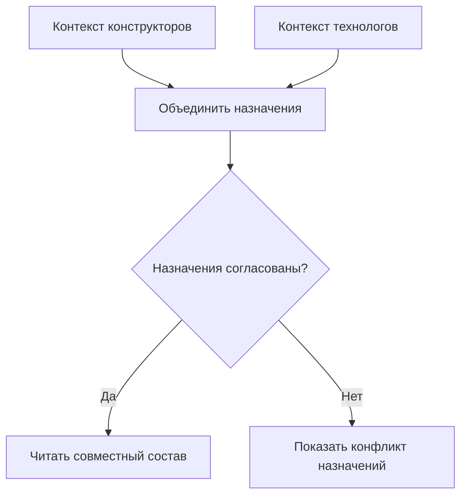
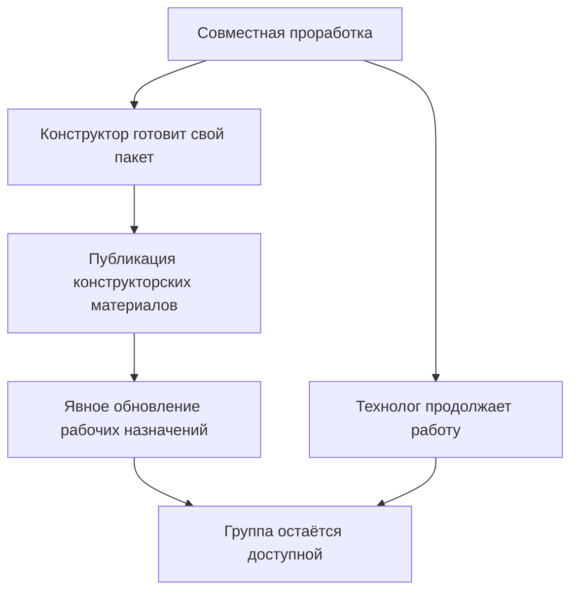

# Контексты подбора и совместная работа

## Зачем сохранять контекст отдельно от изменения

Инженерный проект редко состоит только из объектов, которые прямо сейчас редактирует одна команда. Для проверки нового редуктора могут понадобиться рабочая версия корпуса, уже опубликованная версия вала, точный чертёж поставщика и технологический маршрут соседнего подразделения.

Контекст подбора сохраняет такие назначения и позволяет открыть тот же замысел после завершения отдельного пакета. Он отвечает на вопрос «какие версии рассматриваем вместе?», а не «какие файлы сейчас редактируются?» и не «что должно быть опубликовано одной операцией?».

В IPS существуют обычные контексты, контексты извещений, их объединение и автоматическое пополнение. Целевая модель Interlink сохраняет эти пользовательские возможности, не связывая их жизнь с временным контейнером проведения.

**Состояние реализации:** принятый целевой договор на 6 сентября 2026 года. Полный цикл чтения, команд, переноса и пользовательских рабочих мест ещё предстоит проверить исполнением.

## Четыре понятия, которые легко перепутать

| Понятие | Что содержит | Чем заканчивается |
|---|---|---|
| Рабочая область | Незавершённые материалы команды или задачи | Явным закрытием либо продолжением работы после отдельных публикаций |
| Контекст подбора | Назначенные инженерные версии и при необходимости способ чтения их содержания | Живёт по собственному процессу, сохраняет редакции и основания назначений |
| Пакет изменения | Правки и действия, которые должны стать официальными вместе | Проведением, отказом или пересмотром конкретного пакета |
| Полные условия расчёта | Цель, профиль, контексты, дата, серия, режим содержания и другие входы | Относятся к одному расчёту; для доказательства сохраняется нужное точное основание |

Не каждый просмотр обязан создавать отдельный долговечный контекст. Можно явно передать условия разовой проверки. И наоборот, выбранный сохранённый контекст не определяет автоматически дату производства, права, все опции и требуемую точность.

## Что значит назначить версию контексту

Обычное назначение говорит: «Для корпуса использовать инженерную версию Б». Дополнительное уточнение может сказать: «Читать конкретное опубликованное содержание Б» либо «Использовать указанную рабочую копию Б».

Это не взаимозаменяемые записи. Если контекст закрепил точное содержание, расчёт не должен оставить только букву Б и затем взять её последнее исправление. Если он явно требует рабочую копию, производственный режим не может незаметно заменить её архивным содержанием. Сначала нужно явно изменить назначение или выполнить предусмотренный переход к опубликованному результату.

У каждого назначения есть происхождение: инженер добавил его вручную, включённый режим обновил обычный контекст или запись появилась из состава извещения. Если одна версия включена по двум основаниям, удаление одного не обязано удалять второе.

## Как действует группа контекстов

Группа объединяет назначения для чтения. Например, «Механика модернизации» и «Технология модернизации» дают совместную картину проекта.

Объединение не выбирает победителя по тому, чей контекст открыли последним. Корпус Б в одном контексте и корпус В в другом — конфликт. Два одинаковых назначения Б могут объединиться. Но если они дополнительно закрепили **разные точные состояния Б**, совпадения обозначения версии недостаточно: содержание тоже должно быть совместимо.

Однозначность назначения объекту в группе не запрещает разные версии одной детали на отдельных позициях. [Позиционная мягкая конкретизация](20-durable-soft-concretion.md) имеет другую область; её взаимодействие с общим назначением определяется явным профилем.

## Совместно читать не значит одновременно выпускать

Конструктор может завершить свою часть, пока технолог продолжает редактирование. При этом группа остаётся полезной и читаемой. Ссылки на рабочие материалы не должны зависнуть после завершения или незаметно переключиться на глобальную основную версию.

Для назначения инженерной версии действует сохранённый режим содержания. Для явной ссылки на рабочую копию применяется заранее объявленная политика: заменить её опубликованным результатом этой работы либо потребовать отдельного подтверждения. Это изменение не должно происходить случайно.

Если две части действительно должны стать официальными одновременно, создаётся отдельный общий комплект проведения. Сам факт объединения контекстов такого требования не создаёт.

## Автоматическое пополнение обычного контекста

Режим автоматического обновления — управляемая настройка. В совместимом сценарии IPS при его включении взятие версии на редактирование, создание новой инженерной версии и создание нового объекта в составе обновляют назначения обычного контекста. При выключении режима эти события сами список не меняют.

Назначение не записывается поверх чужого незамеченного изменения. Перед действием проверяются исходная редакция и согласованность группы. Если добавляемая версия конфликтует с уже назначенной в связанном контексте, операция требует разрешить конфликт.

Не следует расширять список событий по аналогии. Добавление **существующего** объекта в состав не считается тем же автоматическим триггером обычного контекста; специальная логика извещения рассматривается отдельно.

## Контекст извещения и ручная часть

Состав извещения является самостоятельным основанием назначений. Если чертёж включён в извещение, его назначение синхронизируется с соответствующей частью контекста. Выключение обычного автоматического пополнения не отключает эту связь.

Инженер может добавить справочный материал вручную. Если позднее строка извещения удалена, система удаляет её производное основание, но сохраняет независимое ручное назначение той же версии. Нельзя вручную исправить производную часть так, будто состав извещения остался прежним.

При возникновении конфликта группы изменение строки извещения и её назначения должно отклоняться вместе. Пользователь не должен получить извещение с одной версией и контекст с другой из-за половинчатого выполнения.

Разрешённое удаление архивной версии очищает её назначения в действующих контекстах. При этом исторические редакции и удерживаемые доказательства не переписываются. Возможность физически удалить содержание определяется отдельными обязательствами хранения.

## Видимость и параллельные рабочие копии

Контекст не является разрешением смотреть чужую работу. Прикладной продукт задаёт участников, полномочия и видимость рабочих областей. Закрытый материал не заменяется старой доступной версией только ради полного дерева; пользователь получает безопасное объяснение отказа.

В одной рабочей области допускаются разные инженерные версии одного объекта. Разные области могут иметь рабочие копии одной версии. Если группа явно указывает две несовместимые копии, возникает конфликт чтения. Если два инженера пытаются опубликовать изменения одной версии, возникает уже **конфликт публикации**: второй результат не переписывает первый, а рабочие материалы сохраняются.

Это разные ситуации. Конфликт выбора устраняется согласованием назначений; конфликт публикации — сравнением и интеграцией содержания либо выделением новой инженерной версии.

## Три прикладных примера

### 1. Корпус и вал опытного редуктора

Конструктор создаёт контекст «Испытание усиленного корпуса». Он назначает корпус В, вал Б и опубликованный чертёж подшипникового узла. Рабочая копия есть только у корпуса. Прочие назначения не становятся рабочими копиями автоматически.

После испытания корпус публикуется. Контекст продолжает описывать проверенное инженерное сочетание. Если нужен точный повтор самого испытания, дополнительно сохраняется точное основание с содержанием и входами: одного долговечного списка версий для этого недостаточно.

### 2. Извещение с независимым справочным материалом

В извещение по насосной станции включён чертёж крышки Б. Он автоматически появляется в контексте. Технолог также добавляет тот же чертёж вручную для проверки обработки и прикрепляет норматив по герметичности.

Позднее крышку исключают из состава извещения. Производное основание исчезает, ручное остаётся; норматив также не затрагивается. Рабочее место показывает, почему чертёж всё ещё присутствует. Нельзя объяснять это «неудаляемой записью» или молча вычеркнуть полезное ручное решение.

### 3. Конструкторы и технологи меняют один станок

Конструкторский контекст закрепляет исправленное точное опубликованное состояние станины Б. Технологический контекст закрепляет прежнее точное содержание той же Б, на котором рассчитаны базы обработки. Это два разных закреплённых содержания: при объединении нельзя считать их согласованными только по букве Б. Если бы первый контекст назначал только инженерную версию Б без собственного требования к содержанию, сам факт такого назначения ещё не доказывал бы конфликт.

Команды сравнивают различие, пересчитывают маршрут и явно обновляют технологическое основание. После этого конструктор публикует свою часть, а технолог продолжает работу. Группа не превращается в обязательный общий выпуск и не уничтожается после первого завершения.

## Что должен показывать интерфейс

Для каждого назначения нужны объект, инженерная версия, уточнение содержания, источник включения и состояние доступа. Для группы — список участников и причина каждого конфликта. Перед автоматическим обновлением важны последствия: что добавится, что заменится, какие независимые основания сохранятся.

Пользователь должен различать «нет назначения для объекта» и «назначения противоречат». В первом случае профиль может перейти к мягкой конкретизации или общему правилу. Во втором он не вправе скрыто выбрать первое удобное значение.

## Как принимать и что уточнить у специалиста IPS

Обязательны проверки сохранения контекста после проведения, независимого завершения группы, двух оснований одной записи, различия обычного автообновления и извещения, конфликтов инженерных версий и их содержания, корректного перехода от рабочей копии к публикации.

Для переноса уточняются реальные настройки автоматического пополнения, специальные операции извещений и производственных заказов, права на связанные контексты и последствия удаления архивных версий. Целевая архитектура предусматривает эти различия; фактическое соответствие установке подтверждают испытания, а не названия сущностей.

Далее: [мягкая конкретизация](20-durable-soft-concretion.md), [пакет изменения](04-editing-context-changeset.md), [последовательное проведение](09-sequential-change-policy.md), [итерации](22-iterations-and-checkpoints.md), [общий путеводитель](README.md).

## Основания и границы подтверждения

Сведения о сценариях IPS: `IPS-A05`, `IPS-K04`, `IPS-M03`. Принятые решения Interlink: `IL-KERNEL`, `IL-VERS-SPEC`, `IL-IPS-COVERAGE`, `IL-DATA-MODEL`. Текущее состояние и порядок реализации — `IL-PLAN-V2`.

Расшифровка, происхождение и ограничения этих оснований приведены в [реестре источников](../knowledge/15-source-register.md). Целевой договор задаёт будущую реализацию; соответствие конкретной установке IPS подтверждается сценарными испытаниями и переносом её данных, а не одним совпадением терминов.
