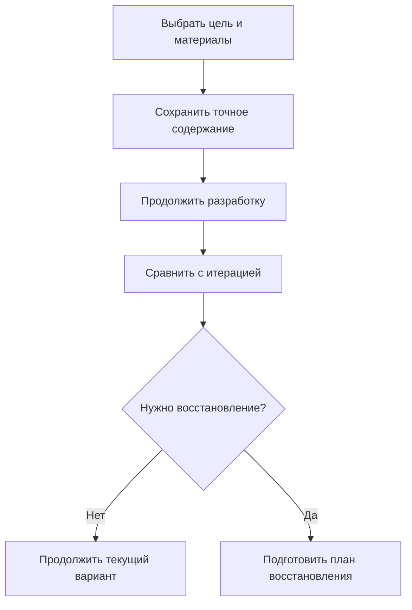
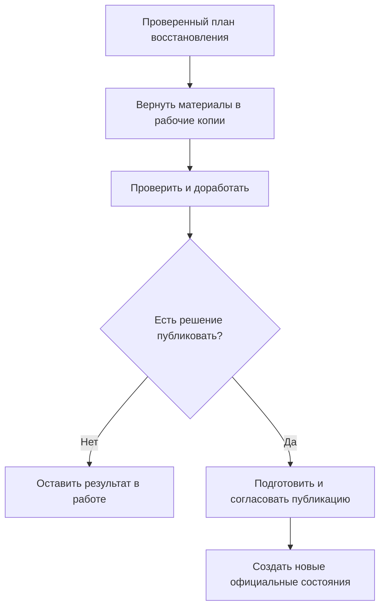

# Именованные итерации, сравнение и восстановление

## Какую инженерную потребность решает итерация

Перед расчётом, экспериментом или сложной переделкой инженер хочет сохранить понятную точку: «До усиления рамы», «После первой компоновки», «Вариант для испытания на морозе». Позднее нужно сравнить с ней результат и, если направление оказалось неудачным, вернуть выбранные материалы в работу.

В IPS итерация может объединять несколько версий и оставаться доступной после завершения редактирования. Поэтому она не может быть заменена кнопкой отмены последних действий или временной точкой отката внутри пакета.

Interlink предусматривает долговечную именованную итерацию с точным сохранённым содержанием. **Статус на 6 сентября 2026 года — принятый целевой договор; полный пользовательский цикл и перенос ещё не реализованы и не приняты испытаниями.**

## Что хранит итерация

Инженер выбирает набор объектов и версий, нужный для поставленной цели. Итерация сохраняет их точные атрибуты, состав, необходимые файлы и другие объявленные входы. Уже опубликованное содержание может сохраняться ссылкой на удерживаемое точное состояние. Незавершённые материалы получают неизменяемую сохранённую копию.

Последний случай важен: фиксация рабочей проработки для сравнения **не публикует её в производство** и не создаёт фиктивное официальное состояние инженерной версии. Итерация доказывает, что именно было сохранено, но сама по себе не доказывает согласование, квалификацию или допуск использования.

Если предприятие сохраняет новое содержание под прежним именем итерации, создаётся новая редакция её состава. Прежние данные не переписываются. Пользователь видит имя точки, историю редакций, автора, назначение и область полноты.

## Чем итерация отличается от похожих вещей

| Средство | Для чего нужно | Чего не обещает |
|---|---|---|
| Сохранение рабочей копии | Не потерять текущую работу | Само по себе не создаёт именованной исторической точки |
| Локальная отмена | Быстро отменить недавнее действие | Не заменяет долговечную историю нескольких версий |
| Контекст подбора | Сохранить назначения инженерных версий | Без точных оснований не фиксирует их содержание навсегда |
| Именованная итерация | Сравнить и восстановить определённый этап работы | Не объявляет его производственно выпущенным |
| Снимок производственной передачи | Доказать точный переданный комплект | Не является разрешением свободно восстановить его в любую текущую версию |
| Новая инженерная версия | Начать самостоятельную линию разработки | Не нужна автоматически при каждом сохранении итерации |

## Как инженер создаёт и использует точку

Сначала задаются цель и граница: только рама с кронштейнами либо ещё гидравлика, расчёт и файлы. Интерфейс показывает включённые материалы и то, что осталось за пределами точки. Затем система проверяет, что данные сохранены согласованно и будут доступны для требуемого срока хранения.

При просмотре итерации выполняется чтение её точного содержания, а не новый подбор по сегодняшнему правилу. Если требуемый файл утрачен или сохранённый формат больше невозможно прочитать, система сообщает об ограничении. Современный файл с тем же именем не подставляется как исторический.

Сохранение точки и решение восстановить её разделены. Наличие подходящего прошлого варианта не отменяет проверки нынешних адресатов и прав.

## Как выбираются адресаты восстановления

Источник и адресат — не всегда одна и та же инженерная версия. В итерации могли быть рама Б и кронштейн В, а текущий контекст разработки назначает раму Г и кронштейн Д. Пользователь должен заранее увидеть, **какое сохранённое содержание в какую рабочую версию будет перенесено**.

План фиксирует выбранное подмножество, точные источники, адресатов, их нынешнее содержание, необходимые права и переходы жизненного цикла. После одобрения исполнение не подбирает адресатов повторно незаметно. Если кто-то изменил записываемую рабочую копию, устаревший план не может затереть эту работу.

Изменение постороннего назначения контекста само по себе не обязано отменять уже закреплённое точное отображение. Если процесс требует, чтобы план всё ещё соответствовал текущему контексту, это условие указывается явно и проверяется при выполнении.

## Восстановить в работу — не опубликовать

Обычный безопасный путь возвращает материал в рабочие копии. Опубликованное содержание инженерных версий остаётся прежним. Пользователь получает возможность доработать, пересчитать и согласовать восстановленный вариант.

Если он затем явно выбирает публикацию, создаются новые опубликованные состояния соответствующих инженерных версий. Система не переводит указатель назад так, будто промежуточных публикаций никогда не существовало. История сохраняет опубликованное и явно зафиксированное содержание, включая неудачный вариант, если он был сохранён. Несохранённые перезаписанные рабочие материалы не получают обещания автоматической восстанавливаемости.

Схема не разрешает обойти жизненный цикл. Если восстановление требует возврата на начальный шаг, смены полномочий или повторной подписи, эти действия заранее включаются в план.

## Страховочная итерация и частичный результат

До перезаписи рабочих материалов процесс может потребовать страховочную точку. Она сохраняет **нынешнее заменяемое содержание**, а не повторяет старый источник восстановления. Тогда инженер может вернуться и к состоянию, которое было непосредственно перед операцией.

Если часть адресатов недоступна или не может быть изменена, возможны два явных пути: отказаться от всего либо подтвердить допустимое подмножество, если процесс это разрешает. Скрытая формула «восстановили всё, что получилось» недопустима.

Повтор команды после потерянного ответа не должен создавать второе восстановление и дополнительные публикации. При неизвестном исходе сначала выясняется результат прежнего действия. Это обязанность исполнительного механизма, а не требование к инженеру вручную угадывать, что произошло.

## Три прикладных примера

### 1. Крышка редуктора до изменения масляного канала

Конструктор сохраняет итерацию «До переноса масляного канала»: крышку Б, её состав и чертёж. Затем изменяет канал, но расчёт показывает ухудшение смазки. Он сравнивает геометрию, сохраняет неудачный рабочий вариант в страховочную итерацию и выбирает восстановление крышки Б в рабочую копию.

Опубликованный чертёж не меняется от этого действия. Инженер корректирует только крепление датчика и отдельно завершает согласование. Новое содержание остаётся версией Б, если процесс допускает её редактирование; прежняя итерация и промежуточный вариант доступны для объяснения решения.

### 2. Рама и кронштейны после неудачного испытания

В итерации «До облегчения рамы» сохранены рама Б и два кронштейна. Текущая разработка уже ведётся в раме В. Пользователь задаёт перенос сохранённой формы рамы в рабочие материалы В, а один кронштейн оставляет новым, потому что его испытание успешно.

Перед применением сохраняется страховочная итерация нынешней облегчённой конструкции. План явно показывает подмножество, адресатов и неизменяемый кронштейн. После восстановления необходимо снова проверить сопряжения: перенос хорошего прошлого содержания не гарантирует совместимость с оставленным новым участником.

### 3. Шкаф управления и параллельная работа технолога

Команда сохраняет итерацию шкафа, схемы подключения и настроек привода. После закрытия первого пакета выясняется, что испытанный вариант был надёжнее. Инженер открывает ту же итерацию через месяц и готовит восстановление в текущие рабочие версии.

Технолог тем временем исправил схему подключения. При выполнении обнаруживается изменение адресата; система не перезаписывает его новой старой копией. Команды сравнивают различия, согласуют обновлённый план и проводят восстановление. Старая подпись испытательного комплекта остаётся подписью старого содержания и не превращается в подпись новой выдачи.

## История для интеграций и агентов

Те же основания нужны будущим автоматическим исполнителям. Чтобы разобраться, почему расчётчик или агент предложил изменение, мало знать инженерную версию по обозначению: требуется содержание, которое он действительно получил, включая разрешённые рабочие материалы и файлы.

Итерация помогает сохранять предметный этап, но не заменяет всю историю выдачи контекста агенту. Цель, область сохранения и необходимые внешние входы должны быть объявлены. Система управления агентами отвечает за организацию цикла; Interlink должен предоставить пригодные точные основания без подмены прошлого сегодняшними данными.

## Что проверять при приёмке

Итерация должна открываться после завершения рабочей области; новое сохранение под тем же именем — сохранять прежние редакции. Восстановление только в работу не должно создавать официальное содержание. Адресаты должны совпасть с одобренным планом, чужие правки — сохраниться при конфликте, а частичный набор — требовать явного подтверждения.

Отдельно проверяются страховочная точка, необходимые переходы жизненного цикла, повтор после сбоя, доступ к файлам и точность переноса старых итераций IPS. Импорт незавершённой итерации не должен задним числом объявлять её опубликованной инженерной версией.

Вопросы конкретной установке: какие материалы входят в итерацию по умолчанию, как выбираются адресаты, когда допускается подмножество, какие переходы и страховочные точки обязательны. Эти ответы уточняют профиль, не отменяя базовую долговечность и сохранность истории.

См. [контексты](21-selection-contexts.md), [работа и публикация](04-editing-context-changeset.md), [мягкая конкретизация](20-durable-soft-concretion.md), [точный состав заказа](16-order-and-snapshot.md), [путеводитель](README.md).

## Основания и границы подтверждения

Сведения о сценариях IPS: `IPS-A02`, `IPS-A05`, `IPS-K04`. Принятые решения Interlink: `IL-KERNEL`, `IL-VERS-SPEC`, `IL-IPS-COVERAGE`, `IL-DATA-MODEL`. Текущее состояние и порядок реализации — `IL-PLAN-V2`.

Расшифровка, происхождение и ограничения этих оснований приведены в [реестре источников](../knowledge/15-source-register.md). Целевой договор задаёт будущую реализацию; соответствие конкретной установке IPS подтверждается сценарными испытаниями и переносом её данных, а не одним совпадением терминов.
