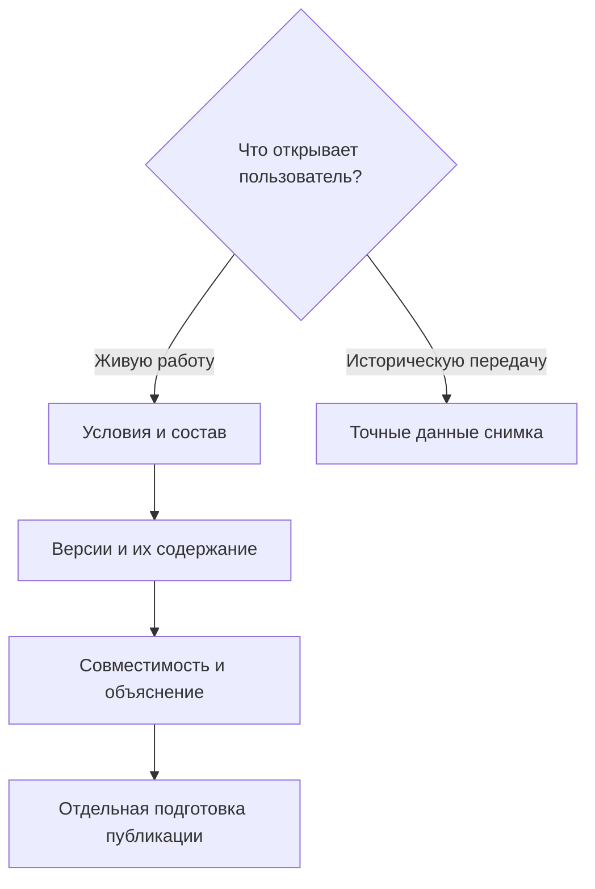

# Подбор версий в IPS и Interlink: путеводитель

## Для кого и зачем

Комплект адресован продуктовым специалистам IPS, конструкторам, технологам, специалистам по конфигурации и руководителям внедрения. Для чтения не требуется знание программирования. Главный вопрос: **каким образом Interlink должен воспроизводить инженерно правильный результат IPS и что изменится в ежедневной работе?**

Материалы обновлены по целевой архитектуре на 6 сентября 2026 года. Принятые решения не означают готовность всех функций: они задают поведение для реализации, переноса данных и будущей приёмки.

## Сначала договоримся о словах

| Понятие | Что оно означает |
|---|---|
| Объект | Сам редуктор, деталь или документ независимо от версий |
| Инженерная версия | Версия с устойчивым обозначением, происхождением и жизненным циклом, например «Корпус, версия Б» |
| Опубликованное состояние | Неизменяемое содержание этой версии после конкретного завершения работы |
| Рабочая копия | Изменяемые материалы выбранной инженерной версии; сохранение ещё не является публикацией |
| Позиция состава | Конкретное место использования дочернего объекта в содержимом родителя |
| Рабочая область | Место длительной работы с незавершёнными материалами |
| Контекст подбора | Сохраняемый набор назначений версий и при необходимости их содержания |
| Группа контекстов | Согласованное объединение назначений нескольких контекстов для совместного чтения |
| Пакет изменения | Выбранные правки и действия, которые проверяются и проводятся вместе |
| Жёсткая привязка версии | Требование использовать одну инженерную версию, не заменяя её другой |
| Точное состояние | Требование читать конкретное неизменяемое содержание |
| Мягкая конкретизация | Долговечное предпочтение инженерной версии на отдельной позиции |
| Временное предпочтение | Пробная настройка с явно ограниченной областью и сроком, не замена мягкой конкретизации |
| Условия расчёта | Полный набор входов операции: цель, профиль, контексты, координаты, режим содержания и другие существенные сведения |
| Применяемость | Условия действия версии для изделия, серии, заводского номера или даты |
| Профиль подбора | Явно выбранный порядок взаимодействия источников, например совместимый с IPS или редакторский |
| Именованное правило | Сохраняемое общее или персональное правило выбора с параметрами и редакцией |
| Неизменяемый снимок | Полный точный результат для объявленной области выпуска, заказа или обмена |
| Именованная итерация | Сохраняемая точка инженерной работы, которую можно сравнить и восстановить после её завершения |

Версия Б может получить исправленное опубликованное содержание, не превратившись в В. Поэтому «жёстко связать с Б» и «сохранить именно то содержание Б, которое подписали» — разные требования. Контекст может пережить пакет, а мягкая конкретизация — несколько публикаций. Именно эти различия важно усвоить до чтения отдельных правил.

## Рекомендуемый маршрут знакомства

1. [Что изменилось относительно IPS](01-overview.md) — общая картина, причины пересмотра и смысл одного механизма.
2. [Как пользователи работают с подбором](18-user-operating-model.md) — входы, роли, объяснение, исправление ошибок и официальный результат.
3. [Сквозное формирование состава](17-end-to-end-resolution.md) — совместная работа механизмов на реальных изделиях.

Затем полезно прочитать три страницы, которых не хватало прежнему объяснению: [полная мягкая конкретизация](20-durable-soft-concretion.md), [контексты и их группы](21-selection-contexts.md), [итерации и восстановление](22-iterations-and-checkpoints.md).

## Как выглядит решение в целом

Живой расчёт отвечает на текущий вопрос с заданными условиями. Снимок читает уже сохранённый ответ и не пересчитывает его. Публикация не следует автоматически ни из просмотра, ни из сохранения рабочей копии.

Внутри живого подбора профиль IPS ставит применяемость перед контекстом и активной мягкой конкретизацией. Редакторский профиль Interlink может явно отдавать контексту приоритет. Оба используют один механизм выбора версии и затем её содержания. Жёсткие ограничения и требуемая точность проверяются до результата; ошибка не означает разрешение перейти к более удобному правилу.

## Все сценарии по темам

### Конкретизация, контексты и работа

- [Жёсткая привязка и точное состояние](02-hard-concretion-pin.md) — как сохранить версию или конкретное содержание, не смешивая эти гарантии.
- [Мягкая конкретизация](20-durable-soft-concretion.md) — ручной выбор, захват показанной версии, автоконкретизация, массовые действия, жизненный цикл и восстановление.
- [Контексты и связанные группы](21-selection-contexts.md) — назначения, автоматическое пополнение, извещение, конфликты и независимое завершение.
- [Работа и пакет изменения](04-editing-context-changeset.md) — подготовка будущего состава и граница официальной публикации.
- [Временное предпочтение для проработки](05-soft-concretion-override.md) — пробный выбор и способы сохранить полезное решение.
- [Последовательное проведение изменений](09-sequential-change-policy.md) — согласованный выбор версий в процессе проведения, без обязательного слияния всех работ.
- [Итерации, сравнение и восстановление](22-iterations-and-checkpoints.md) — долговечная история работы, восстановление в рабочие копии и отдельная публикация.

### Применяемость и правила

- [Применяемость по изделию, серии и дате](03-effectivity-series-date.md) — условия внедрения, исключения, границы и неоднозначность.
- [Назначенная основная версия](06-base-version-current.md) — управляемое назначение, не обязательно самая новая версия.
- [Последняя допустимая версия](07-latest-version-policy.md) — новизна внутри объявленного множества, а не случайная экспериментальная ветвь.
- [Подбор по готовности](08-maturity-level-policy.md) — жизненный цикл, готовность, разрешение использования и точные подписи.
- [Общие и персональные правила](10-custom-selection-rule.md) — именованные варианты, параметры и явный выбор в разных окнах.
- [Как правила создаются и изменяются](19-selection-rule-lifecycle.md) — обязанности методиста, испытание, редакции и влияние на результаты.
- [Резервный результат или отсутствие версии](11-fallback-and-no-match.md) — где допустимо предупреждение, а где требуется остановка.
- [Просмотр всех версий](12-all-versions-view.md) — анализ истории без выдачи многозначного списка за производственный состав.

### Конфигурация, замены и точная передача

- [Условия включения позиций](13-configurator-and-presence.md) — переход от избыточного состава к выбранной комплектации.
- [Глобальные аналоги](14-global-analog.md) — направленные допуски, в том числе относящиеся к версии исходного объекта.
- [Групповые замены](15-nm-substitutions.md) — полная замена нескольких позиций несколькими другими.
- [Библиотека допустимых замен](../substitution-and-compatibility/01-allowed-replacements.md) — повторное использование решений, их привязка к составу и выбор для заказа.
- [Матрицы совместимости](../substitution-and-compatibility/02-compatibility-matrices.md) — совместная проверка участников, включая их точное содержание.
- [Точный состав заказа](16-order-and-snapshot.md) — полный снимок передачи, его история и отличие от фактической установки.

## Три примера, связывающих темы

### Редуктор серий 080 и 145

Для ранней серии действует подшипник версии А, для поздней — Б. Назначенной основной уже может быть Б, но применяемость ранней серии сохраняет А. Конструкторская проработка В не должна попадать в заказ без явного выбора режима и допуска. Здесь вместе работают применяемость, контекст, основное правило и видимость рабочих материалов.

### Насос с двумя разными предпочтениями

На всасывающем и нагнетательном фланцах стоит одно семейство уплотнений, но сохранены предпочтения Б и Г. Они относятся к позициям и сохраняются после завершения работы. Переход жизненного цикла может временно выключить их, а штатное восстановление — вернуть прежние намерения. Ручное снятие одного выбора не должно быть отменено этим восстановлением. Это предметная полнота мягкой конкретизации, которую нельзя заменить временной настройкой.

### Сервис старого пресса

Сначала специалист читает точную прежнюю передачу пресса. Отдельно он выбирает современный заменитель распределителя вместе с переходной плитой. Допуск проверяется для исходной версии, затем подбираются версии новых участников и совместимость всего комплекта. Именованная итерация сохраняет вариант до испытаний. После испытаний восстановление может вернуть материалы только в работу, а официальный ремонтный комплект выпускается отдельным действием. Запись фактической установки также не возникает от одного разрешения замены.

## Что ещё нужно подтвердить вместе со специалистами IPS

Неизвестные особенности установки нельзя заменить удобным предположением Interlink. Нужны реальные примеры порядка источников, пересечения серий и дат, автоматического пополнения контекстов, восстановления конкретизации, последовательного проведения, вариантов групповых замен и допустимости резервного результата.

Проверяется не только конечный номер версии: важны права, область действия, содержание, ошибки, история и поведение при параллельной работе. Известное обязательное поведение IPS остаётся требованием; непроверенная особенность конкретной доработки отмечается как вопрос, а не объявляется отсутствующей функцией.

## Связь с общей продуктовой картиной

Этот пакет раскрывает поведение подбора. Его дополняют [обязательные пользовательские возможности IPS](../knowledge/04-ips-functional-baseline.md), [общая модель формирования состава](../knowledge/05-composition-resolution.md), [различия IPS и Interlink](../knowledge/06-ips-to-interlink-delta.md) и [связь версий, изменений и снимков](../knowledge/07-versioning-changes-snapshots.md). Для терминов служит [глоссарий](../knowledge/14-glossary.md). Эти главы помогают связать выбор отдельной позиции с изменением изделия, выпуском заказа и доказательством переданного результата.

## Состояние реализации и основания

Наличие архитектурного описания или носителей данных ещё не доказывает готовый подбор, миграцию либо рабочее место. Полнота будет подтверждаться исполняемыми сценариями и данными пилотной установки. Обновление этой книги устраняет прежнюю смысловую путаницу, но не является объявлением релиза.

См. [состояние и план развития](../knowledge/02-current-state-and-roadmap.md), [переход от IPS](../knowledge/06-ips-to-interlink-delta.md), [вопросы о составе](../open-questions/03-composition-configuration-and-resolution.md), [глоссарий](../knowledge/14-glossary.md), [достоверность и источники](../knowledge/15-source-register.md).

## Основания и границы подтверждения

Сведения о сценариях IPS: `IPS-A04`, `IPS-A05`, `IPS-M03`. Принятые решения Interlink: `IL-KERNEL`, `IL-VERS-SPEC`, `IL-IPS-COVERAGE`, `IL-DATA-MODEL`, `IL-SC`. Текущее состояние и порядок реализации — `IL-PLAN-V2`.

Расшифровка, происхождение и ограничения этих оснований приведены в [реестре источников](../knowledge/15-source-register.md). Целевой договор задаёт будущую реализацию; соответствие конкретной установке IPS подтверждается сценарными испытаниями и переносом её данных, а не одним совпадением терминов.
