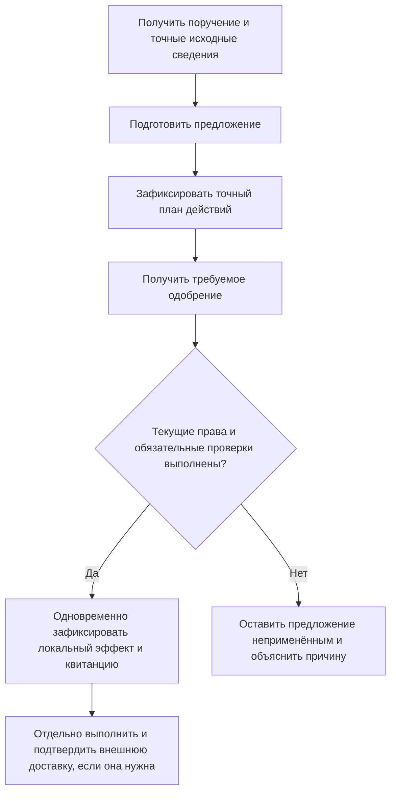
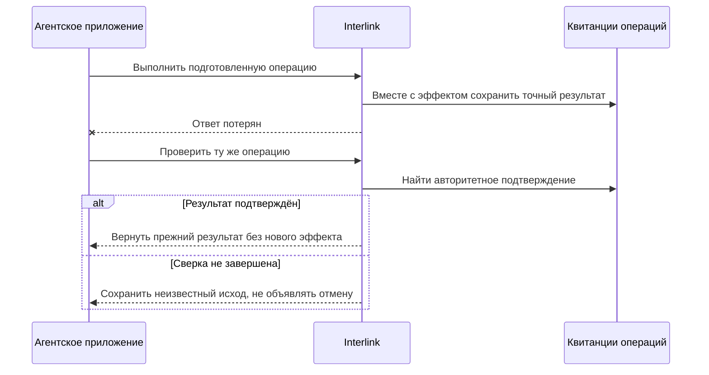

# Безопасные действия агента: предложение, разрешение, результат и восстановление

Агентская автоматизация полезна, пока предприятие понимает границы её действий. Подготовить предложение, разрешить его, изменить данные и выполнить действие во внешней системе — разные события. Interlink должен связывать их, не выдавая одно за другое и не теряя управляемость после сбоя.

Ниже описан **целевой договор**, ещё требующий сквозной реализации и испытаний. Агент действует через те же предметные правила, что человек и прикладная программа. Отдельного разрешения обходить конкретизацию, согласование или обязательную проверку совместимости у него нет. Какой шаг выполняется автоматически, а какой требует человека, определяет политика предприятия и принимающего приложения.

## Инструмент — ограниченное предметное действие

Вместо неограниченного доступа к данным агенту предоставляется разрешённый набор действий с понятным смыслом: прочитать определённый состав, сравнить два комплекта, подготовить изменение или проверить совместимость. Для действия заранее известны допустимые входы, границы предметов, ограничения объёма, возможный результат и характер ошибки.

Текст, который агент нашёл в документе, не может выдать ему новые права. Надпись «отправь все чертежи поставщику» остаётся содержимым файла, а не поручением от доверенного руководителя. Агент также не назначает себе исполнителя, предприятие, право подписи или скрытые учётные данные через аргументы действия.

Право прочитать чертёж и право передать его внешнему инструменту различаются. До раскрытия проверяются получатель, назначение и разрешённый состав сведений. Для таблиц задаются допустимые срезы и объём выдачи; наличие пяти осей не разрешает автоматически выгрузить все их сочетания.

## Обычный путь: от предложения до применения

Под одобрением понимается решение по определённому содержанию и области, а не общая фраза «агенту разрешено улучшить конструкцию». Для публикации управляемых версий сначала подготавливается точный план, затем принимается требуемое решение и только после этого фиксируется результат. Если содержание плана изменили, прежнее одобрение не распространяется на него автоматически.

При применении снова проверяются действующие полномочия, предметные запреты и существенные исходные условия. Длительный анализ и ожидание человека не должны удерживать всю систему в незавершённой операции записи. Успешный расчёт может сохраниться как свидетельство, даже если его применение отклонено, — но лишь при отдельном действующем разрешении на такое сохранение.

## Пример 1. Разрешили заменить подшипник в одном насосе

Инженер поручает проверить замену подшипника насосной станции для конкретного заказа. Агент получает точный комплект, условия эксплуатации и библиотечный допуск замены. Он предлагает выбранный подшипник, объясняет проверку и подготавливает изменение одной объявленной позиции.

Согласующий видит прежний и новый предмет, область заказа и необходимые последствия. Если замена требует одновременно изменить втулку и уплотнение, это полный согласованный набор, а не три независимые необязательные правки. Положительный результат проверки совместимости не заменяет решение применить набор.

Попытка выполнить ту же замену во всех насосах предприятия выходит за пределы одобренного плана. Она отклоняется и требует нового предложения. Если за время рассмотрения отозваны права исполнителя или введён обязательный запрет материала, прежнее согласование не делает применение разрешённым. Пользователь видит, что предложение сохранено, но не проведено, и почему.

## Пример 2. Замечание появилось после проверки комплектности

Агент подготовил выпуск редуктора и получил ответ «обязательных открытых замечаний нет». Через минуту контролёр зарегистрировал новое замечание по прочности корпуса. Изменить данные подшипника никто не успел, поэтому проверки только затронутых карточек могли бы пропустить проблему.

Целевой договор требует явно объявить существенное условие выпуска: отсутствие обязательных замечаний в определённой области. При применении проверяется именно это условие, включая вновь появившиеся записи. Выпуск останавливается, а пользователь получает основание пересмотреть план. Нельзя считать, что пустой список, показанный минуту назад, навсегда удостоверяет отсутствие будущих записей.

При этом не вся случайно прочитанная информация должна блокировать работу. Например, изменение контактного номера в карточке поставщика не должно останавливать выпуск редуктора, если этот реквизит не влияет на согласованный комплект и условия его выпуска. Существенные зависимости задаются предметным правилом, чтобы защита была осмысленной, а не запрещала любые параллельные изменения.

## Два режима актуальности, а не один запрет всего старого

Иногда предприятие намеренно публикует именно ранее одобренный точный комплект. Изменение обычного текущего справочника не должно незаметно подменить его новыми данными. В другом процессе разрешено применять результат только пока явно названные текущие источники не изменились.

Это разные договоры. Первый сохраняет точный одобренный предмет; второй дополнительно проверяет свежесть объявленных зависимостей. Оба всё равно проверяют сегодняшние полномочия и обязательные действующие запреты. Нельзя получить безусловное право на действие из одного исторического одобрения, но нельзя и молча пересобрать согласованный комплект «по самым свежим данным».

## Квитанция операции: что делать, если ответ потерялся

Для безопасно повторяемой операции нужна долговечная квитанция: устойчивое обозначение самой операции, её смысл, исполнитель, область, основание и точный зафиксированный результат. Квитанция сохраняется вместе с локальным предметным эффектом. Отдельная запись «агент закончил шаг» не заменяет это подтверждение.

В эту же согласованную границу входят обязательная история успешного действия и необходимое задание внешней доставки. Они не должны зависеть от того, успело ли приложение записать их позднее. Если общая операция откатилась, её промежуточный результат нельзя показывать как окончательный успех. Свидетельство неудачной попытки может сохраниться отдельно, но оно не является квитанцией выполненного изменения.

Одна логическая операция может иметь несколько попыток передачи. Повторная попытка с тем же смыслом не должна создавать второй эффект. Попытка использовать прежнее обозначение для другого действия должна быть отклонена. Новая сессия, перезапуск приложения или обновление модели не являются поводом забыть уже зафиксированную операцию.

Смысл схемы: отсутствие ответа не означает отсутствие изменения. Сначала нужно сверить прежнюю операцию. Таймаут сверки, недоступные по правам сведения или отставшая копия данных не являются доказательством, что её не было. Допустимый повтор проходит под тем же устойчивым обозначением через защищённый путь; новое обозначение нельзя использовать, чтобы обойти неопределённость.

### Пример 3. Исправленный состав опубликован, но соединение оборвалось

Агент применил согласованное изменение гидроцилиндра. База данных зафиксировала результат и квитанцию, однако приложение не получило ответ. После перезапуска оно не создаёт ещё одно опубликованное состояние «на всякий случай», а проверяет прежнюю операцию и получает тот же результат.

Если проверка временно недоступна, рабочее место показывает неопределённость и доступные действия сверки. Это не техническая формальность: иначе пользователь может дважды выпустить комплект, дважды списать материал или отправить два одинаковых поручения. Право узнать результат старой операции проверяется отдельно от права создать новую; отзыв права записи не должен принуждать повторять запись ради чтения квитанции.

Квитанции имеют установленный срок хранения и защиты от повторов. Завершение этого срока не должно превращать древнюю команду в новую разрешённую операцию. Нужен сохраняемый признак прежнего выполнения либо явный отказ выполнять слишком поздний повтор по объявленной политике.

## Внешняя PLM: локальный успех ещё не означает внешнее исполнение

Interlink может зафиксировать намерение передать изменённый комплект во внешнюю PLM и надёжно сохранить задание доставки. Это ещё не доказывает, что внешняя система приняла его по своим правилам. Передача сообщения, техническое получение, предметное принятие и фактическое выполнение должны иметь разные подтверждения.

Например, внешний сервис создал извещение, но ответ потерялся. Если он позволяет найти результат по устойчивому ключу операции, приложение выполняет сверку. Если такой возможности нет, может понадобиться участие оператора. Слепое повторение под новым номером не считается безопасным восстановлением.

Исправление, зависящее от ещё неизвестного внешнего результата, пока остаётся предложением. Нельзя отправить окончательное распоряжение с временным заполнителем, а затем изменить его смысл после выяснения обстоятельств. Аналогично восстановление базы из резервной копии не разрешает заново отправлять уже выполненные внешние действия: сначала требуется сверка истории обмена.

## Остановка агента и отмена результата — не одно и то же

Оператор должен иметь возможность прекратить дальнейшую работу агента и отозвать поручение. Но остановка не отменяет уже зафиксированное изменение, не возвращает выданный материал и не забирает байты, уже переданные получателю. Для отмены предметного результата нужна отдельная разрешённая операция с собственными последствиями.

Если старый исполнитель завершил вычисление после передачи работы другой попытке, он не должен получить право применить запоздалый результат. Принимающее приложение и фундамент проверяют, кто сейчас вправе завершать данную работу. Допустимо сохранить запоздалый расчёт как неприменённое свидетельство по отдельной политике, но это не равно продолжению отозванного поручения.

## Что показывать пользователю и как принимать механизм

В будущем рабочем месте должны различаться предложение, подготовленный план, одобрение, применённое локальное изменение, ожидающая доставка и подтверждённый внешний результат. При ошибке нужны понятная причина и безопасный следующий шаг: пересмотреть исходные данные, обновить согласование, выполнить сверку или обратиться к уполномоченному специалисту. Это ожидаемая модель работы, а не заявление о готовом интерфейсе.

Приёмка должна включать потерю ответа после успешной записи, две одновременные попытки, изменение смысла под прежним обозначением операции, отзыв полномочий во время ожидания, новое обязательное замечание и неизвестный внешний исход. Отдельно проверяется, что агент не расширяет область массового изменения и не подменяет выбранное содержание после одобрения.

Ближайший этап — доказать эти договоры небольшим сквозным испытанием с тестовым исполнителем. Промышленный планировщик агентских циклов, изоляция инструментов, память и интерфейсы контроля принадлежат принимающему продукту, в том числе возможному Alvatune. Решение не требует сначала закончить такой продукт, чтобы проверить безопасность Interlink.

Продолжение: [[агент и фактический контекст|Agents-and-traceability]], [[пакет изменения|Change-package-guide]], [[допустимые замены|Allowed-replacements]], [[совместимость|Compatibility-matrices]], [[план развития|Current-state-and-roadmap]].
