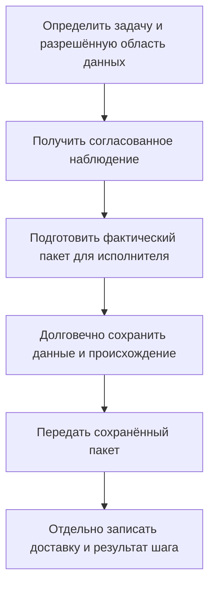
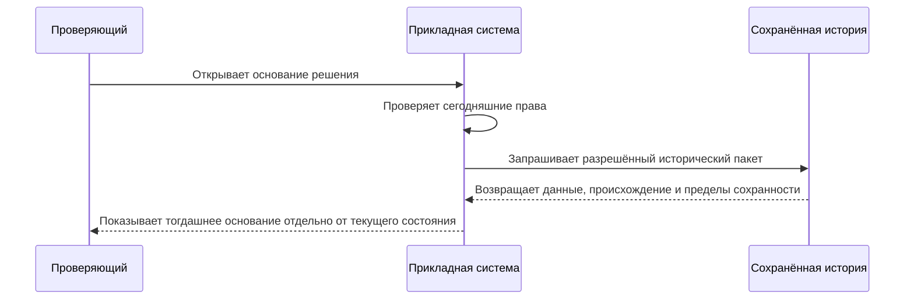

# Агент, его поручение и данные, на которых принято решение

Если агент предложил заменить подшипник или выпустить исправленный комплект, предприятие должно суметь восстановить не только его ответ. Важно понять, кто фактически работал, кто поручил работу, какие сведения были доступны, что агент действительно получил, какое действие согласовали и что в результате изменилось.

Для Interlink это требование к фундаменту, а не дополнительный журнал чата. **Описанное ниже — целевой договор; полноценная агентская система ещё не реализована.** Будущий Alvatune рассматривается как отдельная система запуска и контроля агентских циклов, с возможностями планирования работ, управления требованиями и качеством. Его основной замысел предполагает интеграции с внешними PLM; Interlink также может служить основой экспериментальной собственной PLM. Конкретное устройство Alvatune ещё может меняться.

## Что даёт Interlink и что делает принимающее приложение

Interlink должен предоставлять проверяемые данные, точные исторические основания, безопасные предметные команды и подтверждение локального результата. Принимающее приложение организует расписания, ожидания, память агента, выбор модели, инструменты, взаимодействие с человеком и ограничения внешней среды. Оно может использовать Interlink для хранения части этих сведений, но общий фундамент не требует встроить один обязательный механизм управления агентами во все приложения.

Это разделение полезно и без искусственного интеллекта. Расчётная программа, импортёр, фоновая проверка и человек нуждаются в тех же гарантиях происхождения, прав и восстановления. Агент не получает отдельный облегчённый путь изменения состава или обход правил конкретизации.

## Кто действует: три понятных случая

**Самостоятельный цикл.** Ночная служба контроля комплектности регулярно проверяет новые заказы. У неё собственная служебная идентичность и явно выданное поручение. Не нужно записывать вымышленного человека как автора каждого ночного действия. Сам агент, определение его процедуры и отдельный ночной запуск различаются: повторный запуск не создаёт нового субъекта.

**Ручной запуск.** Конструктор просит ту же службу проверить насосную станцию. Он становится инициатором. Это ещё не означает, что агент может всё, что может конструктор. Работа от его имени допускается только по проверенному поручению с конкретными действиями, предметами и границами. В истории сохраняются и человек-инициатор, и фактический исполнитель.

**Подагент.** Основной агент поручает отдельному исполнителю извлечь таблицу из чертежа. История связывает дочернюю работу с родительской, но причинная связь не является разрешением. Подагент получает собственное разрешённое поручение; его права не расширяются от самого факта происхождения. Завершение родительского запуска и отзыв поручения также должны иметь явное, а не подразумеваемое поведение.

Позднее переименование службы не должно менять авторство прошлого. При этом исторические сведения о поручении объясняют прошлое, но не восстанавливают права, которые сегодня уже отозваны. Секреты и ключи доступа не должны сохраняться в общем журнале ради доказательства авторства.

## Три набора данных, которые часто ошибочно называют одним контекстом

| Набор | На какой вопрос отвечает | Чего сам по себе не доказывает |
|---|---|---|
| Условия инженерного подбора | По каким правилам, назначениям и условиям формировали состав | Что именно было показано агенту |
| Свидетельство конкретного чтения | Какие значения или точные состояния система вернула в данном запросе | Что приложение потом не сократило и не преобразовало ответ |
| Фактически подготовленный пакет для шага агента | Какие сообщения, данные, фрагменты файлов и инструкции направили исполнителю | Что модель внутренне учла каждую строку или повторит тот же ответ |

Контекст подбора может хранить долговечные назначения инженерных версий и содержания. Полный запрос дополнительно задаёт режим, правила и существенные условия. Это инженерный механизм. Пакет сведений для агента — другой предмет: он может содержать результат такого запроса вместе с вопросом человека, выдержкой из инструкции и разрешёнными страницами документа.

Если система получила весь комплект из тысячи позиций, а агенту передала двадцать строк, нельзя утверждать, что агент проанализировал тысячу. Если ответ был отсортирован, сокращён или переведён в другую единицу, нужно сохранить именно переданное представление и происхождение преобразования.

## Сначала сохранить наблюдение, затем передать его

Это порядок для режима, в котором требуется доказательная прослеживаемость. Система не должна отправить сведения, а затем надеяться сохранить их после ответа агента: сбой между этими событиями оставил бы решение без основания. Подтверждение сохранения также отличается от подтверждения доставки. При потере ответа о доставке исход остаётся неизвестным, но сам подготовленный пакет уже известен.

Для большого состава могут передаваться страницы. Каждая выданная часть получает своё основание, а итог показывает, какие страницы действительно завершены и где чтение остановилось. Несколько точных страниц не становятся автоматически единым согласованным снимком: режим единого среза требует отдельного обеспечения. Обрыв после второй страницы не записывается как «агент прочитал весь состав».

## Пример 1. Корпус насоса изменился во время анализа

Агент получает рабочее содержание корпуса: толщина стенки 8 мм. На второй странице приложенного расчёта находится таблица нагрузок. Пока агент анализирует данные, конструктор меняет толщину на 10 мм, а расчётный файл заменяют новой редакцией.

При последующем разборе пользователь должен увидеть 8 мм и именно прежнюю переданную таблицу. Поэтому сохраняются наблюдавшиеся значения рабочего содержания, точное разрешённое представление страницы и происхождение извлечения. Ссылка на сегодняшнюю карточку корпуса и текущее вложение не решает задачу.

Такой захват не публикует черновик и не делает его согласованной инженерной конфигурацией. Новый запрос покажет 10 мм. Если агент предложит изменить корпус на основании прежних 8 мм, применение будет отдельно проверять актуальность существенных исходных данных. Точная история объясняет решение, но не разрешает затереть чужую правку.

## Пример 2. «Открытых замечаний нет» оказалось слишком сильным выводом

Перед выпуском привода агент спрашивает, есть ли незакрытые замечания. Ему может быть возвращён пустой результат по разрешённой области. Это не всегда означает, что замечаний во всём проекте нет: часть данных может быть недоступна, поиск — отставать, а выдача — относиться только к одному узлу.

Свидетельство должно сохранять сам ответ об отсутствии, область, ограничения и известную границу актуальности. Одного списка найденных объектов недостаточно: он не показывает, какой отрицательный вывод был передан исполнителю. Диагностика при этом не раскрывает закрытые замечания или их количество.

Если выпуск требует доказанного отсутствия обязательных замечаний, предметная команда выполняет соответствующую авторитетную проверку. Даже вчерашний полный отрицательный результат не даёт права игнорировать замечание, появившееся между анализом и публикацией. Агент видит, что основание устарело или недостаточно, а не получает ложный успех.

## Пример 3. Замена привода и неполная таблица совместимости

Агенту поручено оценить замену привода станка. Он получает разрешённый срез таблицы: двигатель, силовой модуль и версии управляющей программы. Совместимость двух отдельных пар не доказывает пригодность полной тройки. Также остановка поиска по ограничению времени не означает, что допустимый комплект существует.

В истории нужны выбранные входы, точные редакции обязательных правил, проверенные опубликованные состояния и предел проведённой проверки. Пользователь должен различать «найден полный допустимый вариант», «пока не выявлен конфликт в проверенной части» и «проверку завершить не удалось».

Положительное техническое заключение остаётся заключением. Отдельно сохраняется решение выбрать замену для данного станка, отдельно — её разрешённое применение, а фактический монтаж подтверждается собственными сведениями. Агент не может молча выбрать другую версию вопреки конкретизации только для того, чтобы проверка стала успешной.

## Файлы, память и внешние источники

Для файла важны и исходный материал, и то представление, которое было выдано: отдельная страница, изображение, распознанный текст или извлечённая таблица. Разрешение читать страницу не обязательно разрешает сохранять весь исходный документ. Если установленный для задачи режим требует сохранять исходник, а законного и разрешённого основания для этого нет, выполнение задачи в таком режиме отклоняется. Нельзя продолжить ту же задачу, просто ослабив обязательную гарантию. Отдельную задачу с менее полным набором оснований можно выполнить только по явно разрешённому для неё режиму: например, сохранить одну разрешённую страницу и её происхождение, не обещая сохранность всего исходного документа.

Внешняя PLM может предоставить точную редакцию либо только наблюдение текущей карточки. Во втором случае сохраняются источник, время и фактически полученное содержание; система не выдумывает общий моментальный снимок нескольких независимых систем. Точные исходные данные для решения и наблюдение внешнего состояния остаются различимыми.

Память агента тоже имеет редакции, происхождение, права и срок хранения. Новое резюме не заменяет прежний пакет сведений и не становится инженерным фактом только потому, что его сформировал агент. Для следующего шага проверяются назначение и актуальность памяти. Объяснение решения опирается на сохранённые материалы и наблюдаемые действия, а не на обещание доступа к скрытым внутренним рассуждениям модели.

## Что увидит проверяющий

Предполагаемое рабочее место должно показывать поручение, фактического исполнителя, цепочку запусков, переданные материалы, ограничения чтения, результат анализа и связанные действия. Рядом можно открыть текущее состояние для сравнения. Это описание ожидаемого поведения, не перечень готовых экранов.

Историческое чтение проверяет права сегодняшнего проверяющего. Прежнее разрешение агента не открывает проверяющему закрытые сейчас данные. Если обязательное содержимое выбыло по разрешённой политике или утрачено, интерфейс честно сообщает ограничение. Сохранённый контрольный отпечаток файла помогает проверить известные байты, но не восстанавливает исчезнувший документ.

## Границы и критерии проверки

Сохранность нужна для объявленной цели и срока, а не для бессрочного накопления всего. Помимо данных необходимо удержать существенный смысл чтения: единицы, правила преобразования и пригодный способ прочесть исторический формат. История, резервные копии, чувствительные сведения и ограничения внешних получателей требуют отдельной политики предприятия.

Точность одной записи не делает точным всё, на что она ссылается. Неизменяемый результат испытания может ссылаться на изменяемую карточку калибровки. Если калибровка нужна для обоснования вывода, её тогдашнее содержание тоже должно войти в сохраняемый комплект. Граница определяется целью доказательства: не нужно копировать весь доступный граф, но нельзя потерять зависимость, от которой зависит смысл решения.

Ближайшее испытание фундамента может проводиться без настоящей языковой модели: тестовый исполнитель читает рабочий насос, получает дочернее поручение, сохраняет точное предложение и сталкивается с конкурентной правкой. Проверяется, что тогдашнее содержание восстановимо, права не наследуются автоматически, а неполная выдача не заявляется полной. Настоящие расписания, память, изоляция инструментов и пользовательский контроль развиваются в принимающем приложении.

Для продуктового обсуждения особенно важны три вопроса: какие действия требуют полного доказательного пакета; что допустимо передавать внешнему исполнителю; сколько времени и кому должны быть доступны основания. Ответы влияют на стоимость хранения и устройство процесса, но не отменяют различие фактических данных, поручения и полномочий.

Продолжение: [[безопасные действия и восстановление|Agent-safe-actions]], [[производительность при агентской нагрузке|Performance-and-agents]], [[цифровые двойники|Digital-twins]], [[текущее состояние и план|Current-state-and-roadmap]].
