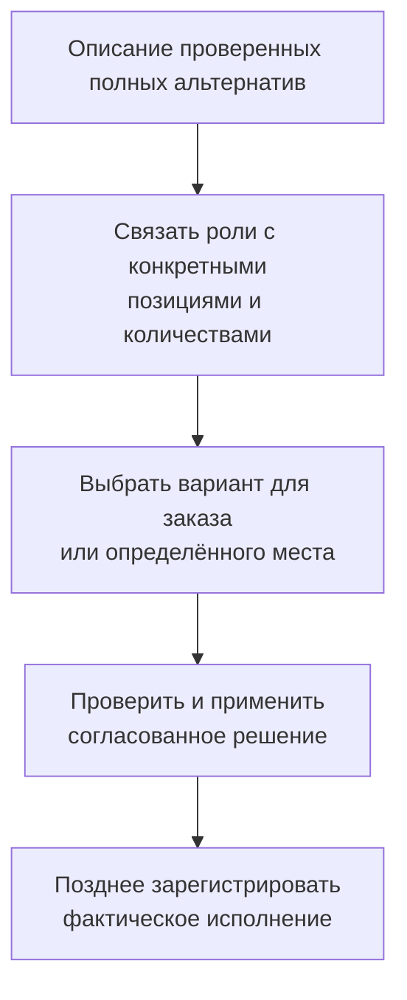
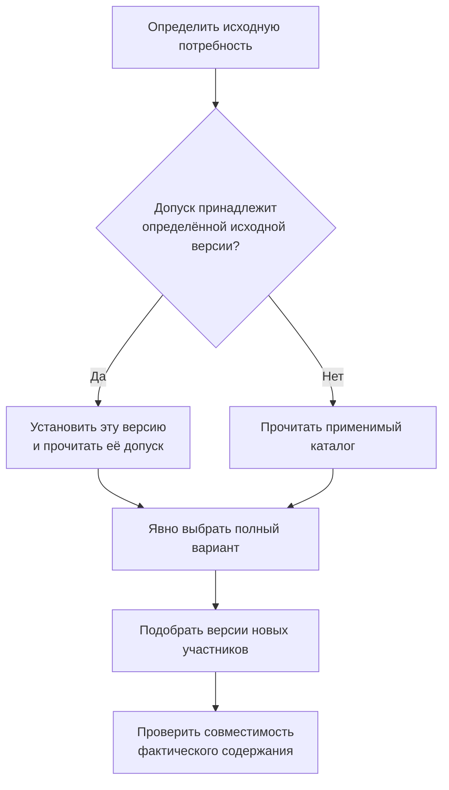

# Допустимые замены: от разрешения до применения

## Пять разных вопросов вместо одной отметки «аналог»

Когда привычная деталь недоступна, предприятие должно понять не только, чем её можно заменить, но и кто это разрешил, где разрешение действует и что изменится в конкретном изделии. Для ремонта добавляется ещё один вопрос: что в итоге действительно установили.

В целевой модели Interlink эти факты разделяются:

| Этап | Предметный смысл |
|---|---|
| Предложение | Этот объект или комплект стоит рассмотреть |
| Разрешение замены | Указано, чем, вместо чего и при каких условиях разрешено заменить |
| Выбор для места применения | Определён вариант для конкретного заказа, узла или экземпляра |
| Применённое решение | Согласованная замена внесена в заявленный рабочий состав или выпуск |
| Фактическое исполнение | Зарегистрировано, какие детали или партии действительно использованы |

Обычный список аналогов может оставаться списком кандидатов. Не нужно превращать каждую полезную ссылку в длительное согласование. Но когда от ссылки ожидают доказуемого разрешения для производства, у неё должны появиться соответствующие условия и основания.

**Статус: принятый целевой контракт, реализация и пользовательские рабочие места планируются.** Обязательные результаты IPS сохраняются, однако внутреннее устройство IPS не переносится буквально. Точный порядок спорных исходных режимов необходимо проверить на примерах конкретной установки.

## Разрешение направлено и ограничено

Разрешение «подшипник усиленного исполнения допускается вместо стандартного в этом насосе» не означает обратного разрешения. Если усиленный подшипник, в свою очередь, имеет заменитель, из этого не получается автоматическая цепочка разрешённых замен исходного подшипника.

Допуск должен определять направление, область применения, количество и единицы, условия, источник и содержание правила. При необходимости учитываются версии, испытания, площадка, среда или серия. «Глобальный аналог» означает область объявленного каталога, а не безусловную взаимозаменяемость во всех изделиях предприятия.

Срок действия допуска, применяемость конструкции и дата фактической установки — разные сведения. Для конкретного процесса должно быть ясно, какую дату проверяют. Предпочтение по стоимости или наличию применяется к уже допустимым предложениям и не превращает технически неподходящую деталь в подходящую.

## Один комплект вместо другого, а не независимые пары

В IPS есть важный сценарий: несколько исходных участников заменяются несколькими новыми. Например, двигатель и муфта заменяются мотор-редуктором, переходной плитой и комплектом крепежа. Разрешение относится к полному варианту. Нельзя взять мотор-редуктор из одного варианта, плиту из другого и назвать получившийся набор уже согласованным.

Interlink сохраняет полный состав каждой альтернативы, количества, роли и соответствие заменяемым участникам. Если один обязательный участник отсутствует или для него не найдена подходящая версия, комплект не считается успешно подобранным. Применение полного варианта должно изменить всех заявленных участников совместно либо не изменить никого.

При этом библиотеку альтернатив не требуется ограничивать одним «актуальным вариантом» для всех будущих применений. Такое понятие сохраняется там, где необходимо воспроизвести авторскую модель группы IPS. В собственном процессе Interlink одна библиотечная схема может предлагать несколько полных вариантов, а разные заказы выбирать разные варианты независимо.

## Библиотека, привязка, выбор и факт

Библиотечная схема описывает роли: «главный привод», «переходная плита», «сохраняемый контроллер». Привязка показывает, каким реальным участникам они соответствуют в данном изделии, и определяет количества. Выбор указывает нужный полный вариант для конкретной области. Он не переписывает общий состав других заказов.

Особенно важно различать правый и левый насосный блок одной станции. Совпадения детали или версии недостаточно, чтобы адресовать место замены. Перед подтверждением пользователь должен понимать, меняет ли он общий состав подсборки, только её правое применение в заказе или фактическую комплектацию определённого экземпляра.

Несколько библиотечных предложений могут затрагивать одну позицию: пока они лишь альтернативы, это не ошибка. Конфликт появляется при попытке одновременно применить несовместимые действия. Нельзя дважды снять одну деталь или независимо изменить одно место двумя противоречивыми способами.

Есть и более тонкая зависимость: два комплекта могут требовать сохранения одного контроллера. Это допустимая общая предпосылка, а не двойное потребление контроллера. Но третий план не должен удалить или несовместимо изменить этот контроллер. Поэтому проверяются не только изменяемые строки, но и условия, которые итоговое изделие обязано сохранить.

## Как замена соединяется с подбором версий

Иногда разрешение относится к объекту в целом, иногда — к определённой исходной версии или её содержанию. Источник IPS описывает настройку глобальных аналогов для версии объекта. Поэтому нельзя всегда считать, что выбор заменителя предшествует любому определению исходной версии.

Если допуск закреплён за исходной версией, сначала требуется установить именно её и прочитать нужное содержание допуска. Затем выбирается заменитель, а его версия и содержание определяются обычным механизмом. Если исходное точное содержание уже известно, оно читается непосредственно. Каталог, не зависящий от исходной версии, не требует искусственного предварительного шага.

Эта последовательность отражает зависимость данных, а не приписывает IPS неподтверждённый внутренний алгоритм. Нельзя взять допуск соседней исходной версии, если нужный не найден, или рекурсивно перейти по цепочке аналогов без специального разрешённого правила.

После подбора новых участников проверяется [[совместимость их фактического содержания|Compatibility-matrices]]. Например, монтажные отверстия конкретной плиты должны подходить к выбранному мотор-редуктору. Неудача этой проверки не разрешает системе молча взять следующую версию плиты. Допустим выход с новым объяснённым предложением, которое проходит собственное рассмотрение.

## Что происходит с конкретизацией

Жёсткая фиксация определённой инженерной версии и фиксация неизменяемого содержания — не одно и то же. В первом случае запрещён переход к другой инженерной версии; во втором закреплено конкретное содержание. Ни одно ограничение не снимается автоматически из-за наличия аналога.

При замене самого объекта прежняя зафиксированная версия не может «переехать» к новому объекту. Пользователь или процесс должен иметь право изменить привязку и явно определить новую. Иначе применение отклоняется.

Мягкое предпочтение прежнего объекта также не переносится по совпадению обозначения версии. Если для старого двигателя предпочиталась версия «Б», это не означает предпочтение версии «Б» нового двигателя. Новая цель получает отдельно согласованное правило: новый выбор без предпочтения, новое мягкое предпочтение либо допустимую жёсткую или точную фиксацию. Подробнее — [[механизмы подбора|Version-selection-guide]].

## Как пользователь готовит и подтверждает замену

Инициатор указывает деловую причину, исходные участники, область и назначение: предварительная проработка, выпуск заказа, ремонт экземпляра. Система показывает доступные предложения и полные составы вариантов, условия допуска, источник, ограничения и результат проверки.

Выбранный вариант сначала образует подготовленное решение. Пользователь видит сравнение «до / после», количества, новые привязки версий и сохранённые предпосылки. Работа доступна её участникам; принятие решения для одного заказа не должно незаметно переключать состав других заказов. Если процесс требует согласования, одобряется именно показанное содержание.

При подтверждении проверяются актуальные полномочия, допуски и неизменность значимых исходных данных. Изменившийся состав или отозванная квалификация требуют объяснённой остановки либо нового решения. Система не подменяет согласованный комплект современным вариантом без ведома пользователя. Официальная публикация остаётся отдельным шагом там, где применяется инженерно управляемое содержание; рабочее сохранение не выпускает его автоматически.

Согласованное точное основание не теряет силу только потому, что в библиотеке появилась новая, ещё не использованная редакция. Иное дело — действующий обязательный запрет или правило, требующее актуального основания: они могут блокировать новое применение. История при этом не переписывается, а зарегистрированная установка не отменяется автоматически.

## Пример 1. Подшипник для серийного насоса

Снабжение сообщает о задержке стандартного подшипника. Инженер находит допуск усиленного подшипника для нужного семейства насосов, серии и условий эксплуатации. Разрешение направлено: оно не утверждает пригодность стандартного подшипника для всех мест, где применяется усиленный.

Для заказа выбирается разрешённый заменитель. Система определяет его версию, проверяет посадочные размеры и другие обязательные условия. Если исходная позиция имеет запрещённую к изменению жёсткую фиксацию, одного допуска аналога недостаточно: требуется отдельное полномочие или процессное решение.

После согласования изменяется комплектация выбранного заказа. В мастер-состав других изделий замена не попадает без отдельного намерения. Сообщение производства об установке конкретной партии подшипников появится позднее и не подменяется фактом согласования.

## Пример 2. Замена привода полным комплектом

Для станка предусмотрены два проверенных варианта: двигатель с муфтой либо мотор-редуктор с плитой и крепежом. Первый заказ оставляет исходный привод; второй выбирает альтернативный из той же библиотечной схемы. Общего переключателя, который изменил бы оба заказа, не требуется.

Во втором заказе роли схемы связываются с конкретным местом станка. Система рассчитывает количества крепежа, определяет версии участников и проверяет монтажные интерфейсы. Обнаружено, что выбранное содержание плиты имеет иной шаг отверстий. Вариант не становится допустимым только потому, что у всех участников найдены версии.

Инженер получает причину и готовит новое предложение с подходящей плитой или иным полным вариантом. Нельзя провести мотор-редуктор и крепёж, оставив неудавшуюся плиту «на потом», если согласуется полный комплект. Частичная подготовка возможна в работе, но не выдаётся за завершённое применение.

## Пример 3. Два ремонта и общий контроллер

В станции стоят два одинаковых насосных блока. Для правого планируется замена датчика, для левого — модернизация исполнительного устройства. Обе библиотечные схемы требуют сохранить общий контроллер с определённым интерфейсом.

При выборе каждого комплекта указывается нужное место применения. Система не распространяет замену датчика на оба блока только из-за совпадения объекта. Совместное требование к контроллеру допустимо: его не нужно устанавливать дважды.

Позднее появляется третий план, меняющий контроллер. Даже если он правит другое место состава, необходимо проверить сохранение предпосылок двух первых решений. Несовместимая новая прошивка контроллера останавливает совместное применение. Выход — согласовать новый общий комплект действий, а не считать отсутствие пересечения изменяемых позиций доказательством безопасности.

## Пример из пищевого производства: замена набора ингредиентов

Рецептура может допускать замену одного ингредиента полным сочетанием концентрата и воды с заданным количественным основанием. Это не независимые замены «ингредиент на концентрат» и «ингредиент на воду». Проверяются весь состав, требования рецептуры и допустимость конкретного применения.

Принятие альтернативы для производственного задания не доказывает, что именно эти партии фактически использованы. Факты расхода регистрируются отдельно. Такой сценарий использует общий фундамент полных комплектов, но количественные и отраслевые ограничения определяет предметный модуль.

## Полнота IPS, расширение и приёмка

Обязательное покрытие включает [[глобальные аналоги IPS|Selection-global-analog]], [[групповые замены|Selection-group-substitution]], полные варианты, их представления и работу с вариантностью планового заказа. Разрешение одного актуального варианта в исходной группе сохраняется в соответствующем режиме совместимости, а не становится ограничением всей библиотеки Interlink.

При переносе должны быть сохранены исходные участники, количества, версии владельцев допусков, даты, приоритеты и смысл режимов. Неясную границу повторного участия позиции в группе нельзя «исправить» автоматическим объединением или удалением. Нужны исходные примеры и сравнение результатов.

Приёмка проверит независимый выбор двух заказов, полный отказ при неудаче участника комплекта, запрет скрытого снятия фиксации, версионного владельца аналога, сохранение общих предпосылок и отдельность фактической установки. Более сложный поиск оптимального комплекта остаётся направлением развития; обязательные сценарии IPS не должны ждать универсального решателя.

Дальнейшее чтение: [[совместимость|Compatibility-matrices]], [[табличные основания|Tabular-data]], [[изменения и свидетельства|Changes-and-evidence]], [[заказы|Orders-guide]].
