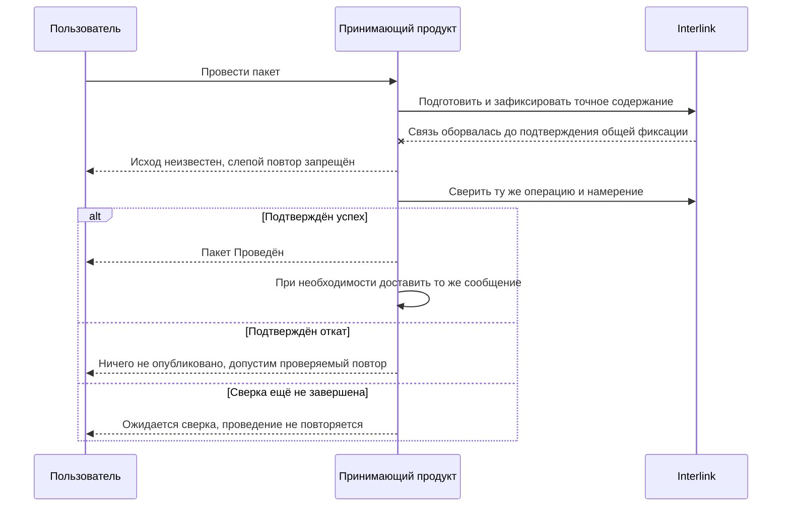

# Фиксация, отмена и восстановление после ошибок

## Что означает «провести изменение»

Проведение делает официальным заранее выбранный и проверенный результат. До него черновики сохраняются в рабочей области, а пакет определяет, какие из них и какие дополнительные операции провести сейчас. Контекст подбора отвечает за то, какие версии видеть при проработке. Это три разных назначения: проведение пакета не обязано закрывать рабочую область и не уничтожает оставшуюся работу.

Главное требование: выбранный план проводится **целиком либо не проводится вообще**. При этом он может включать только готовую часть рабочей области. Нельзя выпустить вал со ссылкой на ещё не опубликованный черновик крышки, оставив крышку вне того же выпуска: нужно включить зависимую часть, выбрать допустимое опубликованное основание либо отложить выпуск. Несколько действительно неразделимых пакетов объединяются в атомарный комплект; совпадение автора, контекста или извещения само по себе не требует такого объединения.

Проведение черновика создаёт новое **опубликованное состояние инженерной версии**. «Чертёж вала, версия 03» после разрешённого исправления может остаться версией 03, но получить новое точное содержание. Старое содержание сохраняется для прежних подписей и передач. Создание версии 04 — отдельное действие, а не автоматический результат каждого сохранения. Разрешённость исправления версии на её текущем шаге жизненного цикла проверяется отдельно.

Ниже описан целевой договор, уточнённый в сентябре 2026 года, а не уже готовое рабочее место.

## Полный путь проведения

```mermaid
flowchart TD
    A["Точный выбранный план"] --> B["Проверить разрешение и основания"]
    B --> C{"Проверки успешны?"}
    C -->|"Нет"| D["Ничего не публиковать"]
    C -->|"Да"| E["Единая фиксация плана"]
    E --> F{"Исход подтверждён?"}
    F -->|"Успех"| G["Показать проведённый результат"]
    F -->|"Откат"| D
    F -->|"Неизвестно"| H["Сверить ту же операцию"]
    H --> F
```

Схема показывает границу одного проведения. Отдельно разрешённый снимок может входить в общий план, но не возникает сам собой. Внешняя доставка начинается по уже подтверждённому результату и имеет собственное состояние.

### 1. Проверка разрешения

Прикладная система устанавливает личность пользователя, корпоративные роли, допустимость подписи и смысл разрешения. Interlink не назначает эти роли самостоятельно, но на границе записи выполняет подключённые обязательные проверки текущего допуска, отзыва полномочий и запретов. Старого разрешения недостаточно, если действие больше не допускается сегодня.

Одновременно проверяется точный предмет: выбранные черновики и операции, используемые редакции модели и правил, значимые данные и условия. Разрешение нельзя применить к другому содержанию. Проверка полномочий, неизменность плана и предметная допустимость дополняют друг друга; ни одна не заменяет остальные.

### 2. Повторное чтение официальной основы

Система проверяет ожидаемое опубликованное состояние каждой изменяемой инженерной версии. Если другой инженер уже опубликовал свою правку, старый черновик нельзя наложить поверх неё. Возникает конфликт основы; черновик сохраняется для сравнения и осознанного переноса изменений. Предприятие вправе дополнительно включить исключительное взятие на редактирование, но универсальная многодневная блокировка всего объекта не является обязательным устройством Interlink.

### 3. Повторение предметных проверок

Проверяются обязательные данные, допустимость связей, уникальность, отсутствие запрещённых циклов, применяемость, конкретизация и обязательные условия процесса. Мягкая конкретизация — сохраняемое предпочтение версии в определённой позиции — не обязана удаляться перед выпуском. Временные настройки проработки нельзя молча превратить в постоянное решение: план должен явно определить, что публикуется, что остаётся в контексте и как его рабочие ссылки будут продолжены после выпуска.

### 4. Общая проверка будущего состава

Некоторые ошибки видны только после соединения всех частей: две допустимые замены вместе создают конфликт; новая версия узла делает позицию неприменимой; пакет из нескольких частей оставляет обязательную зависимость без результата. Проверяется итоговый граф, а не каждая команда изолированно. Для групповой замены учитываются все снимаемые, добавляемые и сохраняемые позиции и количества. Две альтернативы могут храниться в библиотеке, но быть несовместимыми при одновременном применении к одному заказу.

Проверка продолжается и после выбора конкретных состояний версий: подходящая модель двигателя ещё не доказывает совместимость её клеммной коробки с выбранным кабелем. Отказ не разрешает системе тайно выбрать старое состояние или другой двигатель. Пользователь получает объяснение и готовит новое явное решение. Для сложного геометрического расчёта может потребоваться подключённая САПР; Interlink не выводит все такие ограничения из одного названия детали.

### 5. Единая фиксация

Если всё допустимо, система одновременно:

- создаёт новые неизменяемые состояния выбранных инженерных версий;
- применяет изменения карточек, связей и списков;
- назначает степень готовности и применяемость только через явные операции пакета;
- выбирает версию как основную или предпочтительную только отдельной явной операцией, если это разрешает настраиваемая политика предприятия;
- записывает происхождение, обязательный журнал действия и подтверждение его точного результата;
- сохраняет обязательное намерение внешней передачи, если оно входит в договор операции;
- обновляет либо помечает устаревшими обслуживающие представления; заменяемая техническая проекция может отставать и не является источником истины;
- завершает выбранный пакет и участвующие черновики согласно плану;
- продолжает рабочие ссылки контекстов по явно заданному правилу; оставляет непубликуемые черновики в работе.

Промежуточное состояние не должно становиться доступным обычным читателям. Если общей фиксацией управляет прикладная система, она завершает весь подготовленный набор одним локальным результатом либо откатывает его целиком. Пока операция ещё не завершена, подготовленные состояния и снимок не являются официальными. Если же ответ о завершении потерян, они уже могли стать долговечными: до сверки нельзя объявить ни подтверждённый успех, ни отсутствие публикации. Подтверждённый откат не оставляет результатов этой попытки.

## Что пользователь видит при успехе

Рабочее место показывает:

- номер и время проведения;
- новые опубликованные состояния там, где менялось версионное содержание, и отдельно проведённые операции над карточками, связями и состояниями;
- итоговое сравнение;
- решения, на основании которых проведён пакет;
- предупреждения и подтверждённые исключения;
- отдельно запрошенные и опубликованные снимки, а также состояние внешних передач;
- следующие задания процесса.

Живой просмотр после проведения выбирает содержание согласно своим условиям: он может показать новое опубликованное состояние, сохранённый черновик или ранее выбранное точное основание. Исторический снимок не обновляется вслед за ним. Рабочее место должно различать эти режимы и предупреждать об изменившейся основе, а не молча менять согласованный результат.

## Что пользователь видит при отказе

При подтверждённом отказе проверки или откате эта попытка не меняет официальные данные. При конфликте они могли измениться другой успешно проведённой операцией; чужой результат не отменяется. Рабочий пакет остаётся доступным для исправления. При неизвестном исходе система показывает «Ожидает сверки» и блокирует слепое новое проведение. Поддержанный автоматический протокол может сверить ту же операцию и продолжить её по тому же намерению; если данных для достоверного решения недостаточно, назначается ответственная сверка. До её завершения система не утверждает ни успех, ни отказ.

Диагностика должна отвечать на четыре вопроса:

1. Что именно не проведено?
2. Какое правило или внешнее условие нарушено?
3. Подтверждено ли, что официальные данные не изменились, или исход ещё неизвестен?
4. Что может сделать пользователь — исправить, обновить основу, получить новое согласование, повторить позже или отменить пакет?

## Типовые причины отказа

| Причина | Что произошло | Действие пользователя |
|---|---|---|
| Содержание изменилось после согласования | Отпечаток не совпал с разрешённым | Просмотреть различия и согласовать заново |
| Официальная основа стала другой | Опубликованное состояние изменяемой инженерной версии уже не совпадает с ожидаемым | Разобрать конфликт и подготовить новое изменение от явно выбранной допустимой основы |
| Не определена судьба рабочего выбора | План оставляет ссылку на завершаемый черновик без допустимого продолжения | Явно определить новое основание контекста; постоянную мягкую конкретизацию не удалять автоматически |
| В составе нет допустимой версии | Полный снимок запрещён; проведение самого пакета проверяет все обязательные условия выбранного профиля и целостность зависимостей | Устранить причину либо провести без снимка, только если сам выбранный план допустим; обязательные проверки обходить нельзя |
| Появился запрещённый цикл | Новые связи замкнули состав | Исправить структуру |
| Изменилось значимое основание | Нарушено объявленное условие актуальности либо действующий обязательный допуск | Разобрать конкретную зависимость; новая неиспользованная редакция правила сама по себе не отменяет прежнее точное согласование |
| Исход общей фиксации неизвестен | Связь потеряна до подтверждения успеха или отката | Не создавать слепо новое проведение; сверить ту же операцию и продолжить её лишь по доказанному договору |

## Согласованный комплект и обязательная актуальность

Перед согласованием определяется смысл проведения. Можно разрешить выпуск именно испытанного точного комплекта: позднее назначение другого двигателя основным не подменяет его. Можно дополнительно потребовать, чтобы перечисленные текущие основания оставались прежними. Если решение обусловлено текущим назначением двигателя, его смена требует нового разбора.

В обоих случаях повторно проверяются изменяемые адресаты, текущие полномочия и обязательные запреты. Появление нового запрета качества может остановить проведение даже прежнего согласованного комплекта. Новая неиспользованная редакция справочного правила, напротив, сама по себе не отменяет его точное историческое основание. Подробнее — [[предмет решения и актуальность|Change-package-preview]].

## Четыре разных сбоя и правильное восстановление

До первой попытки целевой механизм связывает устойчивое обозначение операции с её точным намерением. Вместе с успешным результатом сохраняется подтверждение, позволяющее узнать то же проведение после потери ответа. Совпадения номера недостаточно: под ним нельзя провести другой набор правок. Этот договор принят, но его полное исполнение ещё требует реализации. Важно различать четыре ситуации.

1. **Подтверждённый откат.** Доказано, что общая фиксация не состоялась. Для того же намерения допустим проверяемый повтор; исправление самого содержания создаёт новый предмет подготовки и, при необходимости, согласования.
2. **Конфликт параллельной записи.** Нужно различать изменившуюся основу черновика и столкновение одновременных операций. В первом случае правку осознанно переносят и готовят заново. Во втором разрешённый повтор охватывает всю необходимую операцию с чтением и проверками, а не только последнюю неудавшуюся запись. Нельзя незаметно изменить согласованный план ради успешного повтора.
3. **Неизвестный исход общей фиксации.** Ответ потерян до подтверждения. Рабочее место показывает «Ожидает сверки». Система проверяет ту же операцию и её точный результат в достоверном источнике. Тайм-аут, отсутствие доступа или пустой ответ от отстающей копии данных не доказывают отсутствия эффекта. Нельзя обходить ожидание новым обозначением операции.
4. **Фиксация подтверждена, но исходящее сообщение не доставлено.** Предметный результат не повторяется. Принимающий продукт повторяет только доставку того же сообщения со ссылкой на тот же результат или снимок.

## Граница общей операции с принимающим продуктом

Interlink может участвовать в общей операции окончательной фиксации, которой управляет принимающий продукт. Предметное решение «провести пакет» и решение «опубликовать снимок» при этом остаются разными: каждое должно быть явно запрошено, отдельно подготовлено и проверено, даже если затем оба результата получают одно общее подтверждение либо один общий откат.

Сначала подготавливается точный совместный план. Если публикация снимка отдельно разрешена, его полный состав также подготавливается и проверяется. Уже согласованный комплект при выполнении материализуется без нового скрытого подбора. Пока общая операция не завершена, оба результата ожидают фиксации. Единый успех делает их официальными, единый откат не оставляет ни одного; потерянный ответ означает неизвестный исход обоих, а не доказанное отсутствие публикации.

Однако внешняя система планирования ресурсов предприятия (ERP) или система управления производством (MES) обычно не участвует в той же фиксации базы. Поэтому правильный результат выглядит так:

1. Общая операция одним подтверждением фиксирует предметное изменение и отдельно разрешённый снимок. Обязательные история действия, подтверждение результата и намерение передачи фиксируются вместе с ними, а не позднее.
2. Если необходимое намерение передачи сохранить невозможно, общая операция не завершается. Это относится и к самостоятельной операции Interlink, если передача объявлена обязательной для неё.
3. При недоставке повторяется только то же исходящее сообщение со ссылкой на тот же подтверждённый результат; проведение и создание снимка не повторяются.
4. При неизвестном исходе доставки возможен повтор того же сообщения по доказанному договору защиты от повторного эффекта у получателя. Если такого договора нет или он не позволяет установить исход, нужна отдельная сверка с внешней системой.

Надпись «проведено» не должна означать «ERP точно приняла», если подтверждения ещё нет. Приём производством, изготовление и фактическая установка также фиксируются отдельно: разрешение замены не является свидетельством установленного двигателя.

## Обычная отмена до проведения

Автор или уполномоченный пользователь выбирает отмену и сначала получает перечень последствий:

- какие черновики останутся в работе, а от каких отдельно предложено отказаться;
- какие новые объекты допустимо удалить и какие защищены зависимостями;
- какие подготовленные связи и состояния не состоятся;
- какие объекты освободятся;
- какие задания и внешние ожидания нужно закрыть.

Отмена плана проведения не обязана удалять черновики рабочей области. Пользователь отдельно выбирает, какие материалы сохранить для другой проработки, а от каких отказаться. Если запрошено удаление, проверяется целостность всего выбранного набора и обязательства хранения. Официальная история и удерживаемые свидетельства не уничтожаются; сохраняется причина отмены.

## Разница между удалением рабочей версии и отменой пакета

Рабочую версию существующего объекта можно убрать из открытого пакета, если остальные операции остаются целостными. Сам объект и его официальная история сохраняются.

Новый объект можно убрать простой командой только в узком случае: предварительная карточка и первый черновик не имеют другой инженерной версии, чужой работы, сохранённой итерации или обязательного основания хранения. При наличии таких зависимостей команда отказывает. Она не расширяет удаление автоматически; более широкое действие требует отдельного проверенного плана и полномочия.

Отмена всего пакета отменяет его будущее проведение. Отказ от черновиков и закрытие рабочей области — отдельные действия с явно показанными последствиями.

## Вытеснение срочным изменением

Если предприятие выбрало исключительное редактирование, срочная работа может потребовать пересмотра прежнего допуска. В общем случае Interlink допускает независимые рабочие области с последующим обнаружением конфликтов и не требует вытеснения при любой второй правке объекта.

Сначала пользователь видит владельца, цель и последствия изменения допуска. Отзыв права на редактирование не уничтожает материалы прежней команды. Новая работа получает явно выбранную основу, а сохранение, перенос или удаление прежних черновиков оформляются отдельными действиями. Автоматическая полная отмена чужого пакета не является универсальным правилом.

Частичное сохранение незавершённых правок в новом пакете возможно лишь как отдельное осознанное действие с повторной проверкой происхождения.

## Восстановление после ошибки пользователя

Если ошибка сделана в рабочей области, участник может восстановить выбранные данные из именованной итерации. Сначала показываются источник, текущие адресаты и перезаписываемые правки; страховочная итерация сохраняет нынешнее содержимое до замены. Восстановление только в черновик не создаёт опубликованного состояния и не меняет официальную историю. Его последующий выпуск является отдельным действием.

Если ошибочный пакет уже проведён, «откатить базу назад» нельзя. Создаётся новое корректирующее изменение, которое:

- явно ссылается на ошибочный результат;
- сначала подготавливает рабочие данные, а при явном проведении создаёт новое опубликованное состояние нужной инженерной версии;
- проходит применимые проверки и согласование;
- сохраняет обе части истории.

Такой подход важен для прослеживаемости производства: нельзя сделать вид, что выпущенной версии никогда не существовало.

## Пример 1. Комплексное изменение редуктора

В рабочей области находятся вал, крышка, спецификация и обсуждаемая инструкция. Для серии с заводского номера 145 готовы первые три части и применяемость. Действующая опубликованная инструкция остаётся допустимой, поэтому её незавершённую правку можно не включать. Проверка показывает, что вал и крышку разрывать нельзя: изменённый буртик требует новой расточки.

На последней проверке обнаруживается занятое обозначение крышки. Никакая часть плана не становится официальной. Конструктор исправляет обозначение, получает нужное решение для нового содержания и проводит весь выбранный набор вместе. Черновик инструкции остаётся в рабочей области. Если бы для новой пары была обязательна именно новая инструкция, проверка потребовала бы включить её в выпуск либо отложить его.

## Пример 2. Обрыв связи при передаче заказа

Планировщик отдельно разрешает проведение нового содержания заказа и публикацию точного снимка. Общая операция подтверждённо завершается вместе с обязательным намерением передачи. Затем связь с системой управления производством (MES) пропадает. Пользователь видит: результат опубликован, но исход внешней передачи неизвестен. Оператор выполняет сверку, а при необходимости прикладная система продолжает доставку того же сообщения со ссылкой на тот же снимок. Проведение и публикация заново не запускаются. Защита от второго внешнего заказа требует также договора повторов или сверки с принимающей системой; одной локальной квитанции Interlink недостаточно.

## Пример 3. Исправление уже выпущенной инструкции

После выпуска инструкции сборки обнаружена неверная величина момента затяжки. Старое опубликованное содержание не удаляется. Инженер восстанавливает нужный фрагмент из проверенной итерации в черновик и отдельно исправляет условие применения. До проведения цех продолжает видеть прежний официальный документ.

Правила жизненного цикла определяют, разрешено ли новое состояние прежней инженерной версии или требуется новая версия инструкции. После проверки влияния и согласования публикуется выбранный результат. Старые подписи остаются основаниями прежнего содержания, а открытые передачи получают явное корректирующее уведомление. История не изображает, будто ошибочной инструкции никогда не существовало.

## Состояние реализации

Атомарность выбранного плана, сохранение остальной работы, подтверждение результата по устойчивой операции, обязательная сверка неизвестного исхода и разделение публикации от доставки входят в целевой договор. Полные исполнители и пользовательские экраны ещё требуют реализации. Для приёмки нужны испытания конфликтов, обрывов связи и перезапуска, а также доказательство того, что восстановление в работу не становится скрытой публикацией.

Связанные документы: [[рабочее состояние и параллельность|Change-package-visibility]], [[предпросмотр и согласование|Change-package-preview]], [[снимки и доказательства|Change-package-snapshots]], [[итерации и восстановление|Selection-iterations]], [[мягкая конкретизация|Selection-soft-concretion]].
