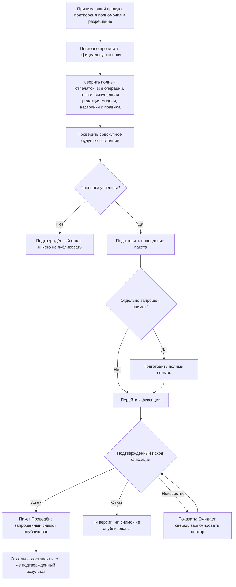

# Фиксация, отмена и восстановление после ошибок

## Что означает «провести изменение»

Проведение — это единственный момент, когда подготовленное будущее состояние становится официальным. До него рабочие версии и операции видны только в контексте пакета. После него появляются новые зафиксированные версии, связи и состояния, которые могут читать остальные пользователи и системы.

Главное требование: пакет проводится **целиком либо не проводится вообще**. Нельзя получить новую версию вала без связанного чертежа, половину заменённого состава или степень готовности без самой версии.

## Полный путь проведения



### 1. Проверка разрешения

Принимающий продукт устанавливает личность пользователя, проверяет его роли и полномочия, действительность подписи, срок разрешения и то, что оно используется только для предусмотренной операции. После этого он связывает разрешение с точным контрольным отпечатком будущего содержания. Interlink не решает, имеет ли конкретный человек право согласовать изменение: он проверяет, что переданное разрешение относится именно к текущему отпечатку всех подготовленных операций, точной уже выпущенной редакции предметной модели, применимым настройкам и фактически использованным правилам, а сами данные не нарушают предметных ограничений. Одно не заменяет другое.

### 2. Повторное чтение официальной основы

Система проверяет, что каждая рабочая версия всё ещё продолжает ту официальную версию, от которой была создана. Даже при удержании объектов эта проверка остаётся обязательной защитой от административных операций, миграции и гонок.

### 3. Повторение предметных проверок

Проверяются обязательные данные, допустимость связей, уникальность, отсутствие запрещённых циклов, применяемость, точные фиксации, степень готовности, незавершённые временные предпочтения и политика изменения.

### 4. Общая проверка будущего состава

Некоторые ошибки видны только после соединения всех частей: две допустимые замены вместе создают конфликт; новая версия узла делает позицию неприменимой; пакет из нескольких частей оставляет внешний состав без результата. Проверяется итоговый граф, а не каждая команда изолированно.

### 5. Единая фиксация

Если всё допустимо, система одновременно:

- превращает рабочие версии в новые зафиксированные поколения;
- применяет изменения карточек, связей и списков;
- назначает степень готовности и применяемость только через явные операции пакета;
- выбирает версию как основную или предпочтительную только отдельной явной операцией, если это разрешает настраиваемая политика предприятия;
- записывает происхождение и причины;
- обновляет либо помечает устаревшими обслуживающие представления; заменяемая техническая проекция может отставать и не является источником истины;
- закрывает пакет;
- освобождает удерживаемые объекты.

Промежуточное состояние не должно становиться доступным читателям. При самостоятельной операции Interlink оно становится официальным только после подтверждённой фиксации собственной операции «всё либо ничего». Если фиксацией управляет принимающий продукт, используется общая операция окончательной фиксации. Она даёт одно подтверждение для всего подготовленного результата либо выполняет единый откат. До подтверждения подготовленные версии и снимок ещё не долговечны; подтверждённый откат общей операции не публикует ничего.

## Что пользователь видит при успехе

Рабочее место показывает:

- номер и время проведения;
- новые зафиксированные версии там, где менялось версионное содержание, и отдельно проведённые операции над карточками, связями и состояниями;
- итоговое сравнение;
- решения, на основании которых проведён пакет;
- предупреждения и подтверждённые исключения;
- отдельно запрошенные и опубликованные снимки, а также состояние внешних передач;
- следующие задания процесса.

Пользователь, открывающий изделие после проведения, видит новое официальное состояние согласно своему контексту подбора. Открытая до проведения карточка должна получить уведомление, что официальная основа изменилась, а не продолжать бесшумно показывать устаревшее дерево.

## Что пользователь видит при отказе

При подтверждённом отказе проверки, конфликте параллельной записи или подтверждённом откате официальные данные остаются прежними. Рабочий пакет остаётся доступным для исправления, если политика не требует его отменить. При неизвестном исходе система не утверждает ни успех, ни отказ: она показывает обязательный статус «Ожидает сверки: исход фиксации неизвестен», блокирует повтор и назначает ответственному пользователю сверку фактического результата. Статус сохраняется до подтверждения успеха либо отката.

Диагностика должна отвечать на четыре вопроса:

1. Что именно не проведено?
2. Какое правило или внешнее условие нарушено?
3. Подтверждено ли, что официальные данные не изменились, или исход ещё неизвестен?
4. Что может сделать пользователь — исправить, обновить основу, получить новое согласование, повторить позже или отменить пакет?

## Типовые причины отказа

| Причина | Что произошло | Действие пользователя |
|---|---|---|
| Содержание изменилось после согласования | Отпечаток не совпал с разрешённым | Просмотреть различия и согласовать заново |
| Официальная основа стала другой | Рабочая версия больше не продолжает ожидаемую версию | Разобрать конфликт и подготовить новое изменение от актуальной основы |
| Осталось временное предпочтение | Аналитический выбор не удалён перед проведением | При необходимости создать и проверить точную фиксацию в позиции рабочей версии родительского состава либо оформить применяемость или постоянное правило; затем обязательно удалить исходное предпочтение |
| В составе нет допустимой версии | Снимок публиковать нельзя; проведение пакета блокируется лишь по политике предприятия | Выпустить нужную версию, скорректировать правило или провести пакет без снимка, если политика это разрешает |
| Появился запрещённый цикл | Новые связи замкнули состав | Исправить структуру |
| Изменились модель или политика | Согласование относится к старым правилам | Повторить предпросмотр и решение |
| Исход общей фиксации неизвестен | Связь потеряна до подтверждения успеха или отката | Не повторять проведение; выполнить обязательную сверку фактического результата |

## Четыре разных сбоя и правильное восстановление

Нельзя обещать безопасный повтор проведения по одному номеру попытки: такого готового договора Interlink пока не имеет. Важно различать четыре ситуации.

1. **Подтверждённый откат.** Доказано, что общая фиксация не состоялась и ни версии, ни снимок не опубликованы. После исправления можно начать новую попытку.
2. **Конфликт параллельной записи.** Это подтверждённый отказ, а не неизвестность. Нужно перечитать основу, заново построить предпросмотр и получить новое решение, если изменился отпечаток.
3. **Неизвестный исход общей фиксации.** Ответ потерян до того, как принимающий продукт узнал об успехе или откате. Рабочее место показывает «Ожидает сверки: исход фиксации неизвестен». Слепой повтор запрещён; обязательна сверка фактического состояния.
4. **Фиксация подтверждена, но исходящее сообщение не доставлено.** Предметный результат не повторяется. Принимающий продукт повторяет только доставку того же сообщения со ссылкой на тот же результат или снимок.

```mermaid
sequenceDiagram
    participant П as Пользователь
    participant А as Принимающий продукт
    participant И as Interlink
    П->>А: Провести пакет
    А->>И: Подготовить и зафиксировать точное содержание
    И--xА: Связь оборвалась до подтверждения общей фиксации
    А-->>П: Исход неизвестен; повтор заблокирован
    А->>А: Обязательная сверка фактического состояния
    alt Подтверждён успех
        А-->>П: Пакет Проведён
        А->>А: При необходимости доставить то же сообщение
    else Подтверждён откат
        А-->>П: Ничего не опубликовано; допустима новая попытка
    else Сверка ещё не завершена
        А-->>П: Ожидается сверка; проведение не повторяется
    end
```

## Граница общей операции с принимающим продуктом

Interlink может участвовать в общей операции окончательной фиксации, которой управляет принимающий продукт. Предметное решение «провести пакет» и решение «опубликовать снимок» при этом остаются разными: каждое должно быть явно запрошено, отдельно подготовлено и проверено, даже если затем оба результата получают одно общее подтверждение либо один общий откат.

Сначала Interlink подготавливает проведение пакета. Если публикация снимка отдельно разрешена, следующим действием он строит и проверяет снимок будущего результата. Ни подготовленное проведение, ни подготовленный снимок в этот момент ещё не являются официальными. До окончательной фиксации общей операции они имеют состояние «подготовлено, ожидает фиксации». Только единое подтверждение управляющей операции делает пакет проведённым, а отдельно запрошенный снимок — опубликованным. Единый откат не публикует ни один результат; неизвестный исход переводит оба результата в видимое ожидание обязательной сверки.

Однако внешняя система планирования ресурсов предприятия (ERP) или система управления производством (MES) обычно не участвует в той же фиксации базы. Поэтому правильный результат выглядит так:

1. Общая операция одним подтверждением окончательно фиксирует предметное изменение и, если было отдельное решение, снимок; единый откат не фиксирует ни то ни другое.
2. Принимающий продукт записывает, что именно нужно отправить.
3. При недоставке повторяется только то же исходящее сообщение со ссылкой на тот же подтверждённый результат; проведение и создание снимка не повторяются.
4. При неизвестном исходе доставки выполняется отдельная сверка с внешней системой.

Надпись «проведено» не должна означать «ERP точно приняла», если подтверждения ещё нет.

## Обычная отмена до проведения

Автор или уполномоченный пользователь выбирает отмену и сначала получает перечень последствий:

- какие рабочие версии будут удалены;
- какие новые, ещё не опубликованные объекты исчезнут;
- какие подготовленные связи и состояния не состоятся;
- какие объекты освободятся;
- какие задания и внешние ожидания нужно закрыть.

После подтверждения весь незавершённый набор удаляется атомарно. Официальные версии остаются неизменными. Сохраняется запись о самом пакете, причине отмены, участниках и времени.

## Разница между удалением рабочей версии и отменой пакета

Рабочую версию существующего объекта можно убрать из открытого пакета, если остальные операции остаются целостными. Сам объект и его официальная история сохраняются.

Для нового объекта до первой публикации удаляются и его предварительная идентичность, и первая рабочая версия. После хотя бы одной публикации объект нельзя стереть таким способом: исправление выполняется новой операцией жизненного цикла.

Отмена всего пакета удаляет все его рабочие версии и операции как единое будущее состояние.

## Вытеснение срочным изменением

Если критическое изменение требует занять объект, уже удерживаемый другим пакетом, уполномоченный процесс может вытеснить прежнюю работу. Это не скрытая передача блокировки.

Сначала пользователь видит цель, владельца, возраст и последствия прежнего пакета. Затем весь прежний пакет отменяется с причиной и ссылкой на срочное основание. Только после этого новый пакет начинает работу от актуальной вершины линейной истории, выбранной как основа редактирования.

Частичное сохранение незавершённых правок в новом пакете возможно лишь как отдельное осознанное действие с повторной проверкой происхождения.

## Восстановление после ошибки пользователя

Если ошибка сделана внутри открытого пакета, участник может вернуться к сохранённой точке или удалить отдельную рабочую операцию. Это не меняет официальную историю.

Если ошибочный пакет уже проведён, «откатить базу назад» нельзя. Создаётся новое корректирующее изменение, которое:

- явно ссылается на ошибочный результат;
- создаёт следующее официальное поколение;
- проходит применимые проверки и согласование;
- сохраняет обе части истории.

Такой подход важен для прослеживаемости производства: нельзя сделать вид, что выпущенной версии никогда не существовало.

## Пример 1. Комплексное изменение редуктора

Пакет содержит вал, крышку, спецификацию и применяемость с серийного номера 145. На последней проверке обнаруживается, что новая крышка уже обозначена в другом проекте предприятия. Проведение отказывает до появления любой новой версии. Конструктор меняет обозначение, получает новое согласование и повторяет проведение. Тогда все четыре части становятся официальными одновременно.

## Пример 2. Обрыв связи при передаче заказа

Планировщик отдельно разрешает проведение новой версии инженерного содержания заказа и публикацию точного снимка. Общая операция окончательной фиксации подтверждённо завершается, поэтому оба результата становятся официальными. Затем связь с системой управления производством (MES) пропадает. Пользователь видит: предметный результат опубликован, но исход внешней передачи неизвестен. Оператор выполняет сверку, а при необходимости принимающий продукт повторяет только доставку того же сообщения со ссылкой на тот же снимок. Проведение и публикация снимка заново не запускаются; Interlink сам по себе не гарантирует отсутствие второго внешнего заказа.

## Пример 3. Исправление уже выпущенной инструкции

После выпуска инструкции сборки обнаружена неверная величина момента затяжки. Архивная версия не удаляется и не редактируется. Создаётся срочный пакет, новая рабочая версия инструкции, проверяется влияние на открытые заказы и выпущенные комплекты. После согласования появляется следующее поколение, а история показывает причину исправления и перечень затронутых передач.

## Состояние реализации

Атомарность предметного проведения, повторная проверка, три исхода общей фиксации и разделение предметной фиксации от внешней доставки являются принятыми требованиями. Полный пакет, разрешение принимающего продукта, обязательная сверка неизвестного исхода и пользовательские операции отмены относятся к последующим этапам реализации. Готовый договор поиска результата или безопасного повтора проведения пока не заявлен. Поведение должно быть подтверждено отказоустойчивыми испытаниями, а не только обычным успешным примером.

Связанные документы: [[рабочее состояние и параллельность|Change-package-visibility]], [[предпросмотр и согласование|Change-package-preview]], [[снимки и доказательства|Change-package-snapshots]].
