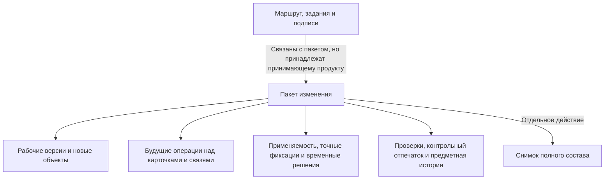

# Что такое пакет изменения и где его границы

## Пользовательская потребность

Инженерное изменение редко ограничивается одним полем одной карточки. Замена подшипника может потребовать новой версии вала, крышки, сборочного чертежа и спецификации; изменения количества и точных версий нескольких позиций; нового диапазона применяемости; повторной проверки технологии и заказов.

Пользователь должен подготовить такой результат, не разрушая выпущенное состояние и не раскрывая незавершённую работу всем потребителям. После согласования весь связанный набор должен стать официальным одновременно.

## Как эта потребность узнаётся в IPS

В IPS используются рабочие копии и итерации, контекст редактирования, связанные контексты, извещения и журнальные изменения, операции актуализации, уровни продвижения и конкретизации. Эти механизмы дают богатое поведение, но их границы могут пересекаться: состояние окна влияет на чтение, промежуточное сохранение смешивается с версией, а полный смысл групповой фиксации распределяется между несколькими понятиями.

Interlink сохраняет результат, но собирает его иначе:

| Потребность IPS | Механизм Interlink |
|---|---|
| Рабочая копия | Рабочая версия только для изменяемого между версиями содержания; остальные будущие действия — отдельные операции пакета |
| Контекст редактирования | Явно выбранный пакет в условиях каждого чтения |
| Итерация | Именованная точка возврата рабочего состояния |
| Связанные контексты | Один многообъектный пакет либо упорядоченный комплект пакетов |
| Мягкая конкретизация | Временное предпочтение версии внутри пакета |
| Жёсткая конкретизация | Точная фиксация версии в конкретной позиции |
| Извещение | Формальный вид пакета плюс процесс принимающего продукта |
| Журнальное изменение | Облегчённый вид пакета, если политика это разрешает |
| Актуализация | Полная атомарная фиксация пакета |

## Что пакет хранит по предметному смыслу

Пользовательская карточка пакета должна показывать:

- понятный номер, вид, цель и основание;
- автора и происхождение действия — человек, агент или система;
- ответственного и участников со стороны принимающего продукта;
- рабочие версии существующих объектов;
- предварительные новые объекты, ещё не опубликованные впервые;
- будущие изменения карточек, связей, списков и состава;
- временные предпочтения версий;
- плановую применяемость;
- будущую степень инженерной готовности новых версий, заданную процессом или политикой предприятия;
- управляемые действия над уже зафиксированными версиями;
- затронутые объекты и удерживаемую занятость;
- точки возврата;
- результаты предпросмотра, проверки и согласования;
- итог: зафиксирован или отменён; разрешённое вытеснение зависшей работы является причиной отмены, а не третьим конечным состоянием.

Рабочая версия хранит только то содержание, которое меняется между поколениями одного объекта. Устойчивая идентичность объекта, изменение постоянной карточки, связи, списки, применяемость, точные фиксации и действия над уже выпущенными версиями не «прячутся» внутрь рабочей версии. Пакет хранит каждое такое будущее действие отдельно и в предметной форме: какое поле карточки изменить, какую связь создать или удалить, какую позицию состава заменить, какой диапазон применяемости назначить или какое состояние выпущенной версии установить. Благодаря этому пользователь видит, что именно будет изменено и по какому правилу.

Будущую степень инженерной готовности задаёт не сам Interlink, а корпоративный процесс или политика предприятия: например, согласующий указывает, что новая версия корпуса после проведения должна получить состояние «Разрешено для опытного образца». Interlink проверяет, что такое состояние допустимо для данного вида объекта и что обязательные условия перехода выполнены. Только после успешной общей фиксации он записывает выбранную степень в официальную версию и сохраняет основание решения в истории.

Смысловой набор затронутых объектов важнее простого перечня рабочих версий. Пакет может изменить постоянный признак объекта, связь между объектами или состояние уже выпущенной версии без создания нового поколения. Такая операция всё равно должна участвовать в общей проверке, истории и фиксации.

## Что не является частью пакета

### Маршрут и задания

Кто согласует, в каком порядке идут задания, когда отправляется уведомление и кто может вернуть работу — ответственность Alvatune или другого принимающего продукта. Interlink предоставляет проверяемое содержание и границу фиксации, но не встраивает одну корпоративную схему процесса в ядро.

### Определения предметной модели

Добавление нового типа изделия или поля не является обычной правкой пакета. Модель меняется отдельным управляемым выпуском и миграцией. Иначе один пользователь мог бы одновременно изменить правила и данные, которые этими правилами проверяются.

### Файловое хранилище и САПР

Файл чертежа, модель САПР, подпись и архивный комплект управляются принимающим продуктом и специализированными службами. Interlink формирует обязательный **контрольный отпечаток** — устойчивое контрольное значение, рассчитанное из точного согласуемого содержания. В него входят рабочие версии; все полностью описанные, но ещё не ставшие официальными изменения карточек, связей, позиций состава, применяемости и состояний; точная редакция предметной модели, уже официально выпущенная до проверки пакета; применимые настройки и фактически использованные правила.

Например, подготовленными предметными действиями являются не общие намерения «поправить спецификацию», а точные будущие изменения: удалить подшипник из позиции 30, добавить другой подшипник в позицию 40, изменить количество крепёжных деталей и назначить применяемость с серии 145. Если после согласования изменится хотя бы одно из этих действий, рабочая версия или использованное правило, контрольный отпечаток станет другим и прежнее решение больше не подойдёт. Контрольные суммы файлов, результаты расчётов, отчёты и подписи принимающий продукт добавляет в собственную доказательную оболочку, связанную с этим отпечатком. В дальнейшем в отпечаток Interlink планируется включать контрольные суммы файлов версий, но сейчас Interlink не является файловым хранилищем.

### Неизменяемый снимок полного состава

Проведение пакета создаёт официальные версии и применяет операции. Полный точный многоуровневый состав для выпуска или заказа публикуется отдельным действием. Эти решения могут входить в одну общую операцию окончательной фиксации принимающего продукта, но до её подтверждения ни версии, ни снимок не считаются официальными. Подтверждённая фиксация публикует оба запрошенных результата, подтверждённый откат — ни одного, а при неизвестном исходе повтор блокируется до обязательной сверки.

## Виды пакетов

### Обычное изменение

Используется для большинства многообъектных работ: модернизации узла, корректировки технологии, изменения набора документов.

### Формальное извещение

Имеет усиленную процессную обвязку. Политика предприятия может требовать его для любого изменения выпущенного содержания, применения новой литеры или изменения применяемости.

### Импортное и системное изменение

Предметный импорт объектов, версий и значений, а также автоматизированная системная работа используют тот же путь пакета. Это сохраняет происхождение и не создаёт «служебный обход» проверок. Выпуск самой модели, изменение структуры базы и миграция схемы выполняются отдельным контуром модели и не являются пакетом предметного изменения.

### Быстрое одиночное действие

В целевом рабочем месте пользователь сможет видеть одну команду — например, назначить основную версию. Принимающий продукт сначала проверит полномочия и корпоративную матрицу, затем вызовет действие, а будущий механизм Interlink выполнит его через автоматически созданный маленький пакет. Матрица учитывает роль, вид и состояние объекта, изменяемое поле или связь и ожидаемое влияние. Выпущенный объект или изменение состава сами по себе не означают запрета: если матрица требует формального извещения, быстрый путь откажет и предложит правильный процесс. Автоматическое создание такой оболочки ещё предстоит реализовать и проверить.

### Комплект изменений

Комплект нужен, когда несколько ответственных должны **параллельно подготовить** разные части одного большого изменения, но предприятие хочет принять по ним одно общее окончательное решение. Координатор создаёт комплект и все его дочерние части вместе. Каждую часть можно разрабатывать и проверять отдельно, однако её нельзя провести или отменить самостоятельно, перенести в другой комплект либо повторно использовать: у всех частей одна общая конечная судьба. Проверяется и фиксируется совокупный итог всего комплекта. Содержание неудавшейся части можно взять за основу новой работы, но сама дочерняя часть не переносится как готовая самостоятельная единица.

Комплект **не предназначен для поэтапного выпуска**, при котором один результат должен стать официальным сегодня, а следующий — после него. Для такого пути создают несколько самостоятельных пакетов, явно указывают их последовательность и перед каждым выпуском заново проверяют актуальное официальное состояние. Иначе обещание одной общей судьбы комплекта было бы нарушено.

Точная фиксация версии принадлежит позиции в конкретной версии родительского состава и хранится вместе с ней бессрочно. В новой версии родителя она может быть явно унаследована и продолжает действовать, пока её не изменят или не удалят. Готовый снимок имеет ещё более сильную границу: при его чтении фиксации и живые правила вообще не выполняются заново.

## Пример 1. Локальная правка материала

Технолог уточняет материал прокладки гидроцилиндра до начала выпуска. Если политика разрешает облегчённое действие, рабочее место предлагает «Исправить материал». Внутри создаётся небольшой пакет и формируется рабочая версия. Корпоративный процесс задаёт требуемую степень готовности, Interlink проверяет допустимость такого перехода, после чего результат фиксируется.

Пользователь не обязан вручную вести карточку извещения, но история остаётся такой же доказуемой, как у большого изменения. Нужен ли формальный путь для выпущенной прокладки, определяет корпоративная матрица по роли, состоянию, изменяемому полю и влиянию; сам факт выпуска не является автоматическим запретом.

## Пример 2. Модернизация редуктора

Пакет «Повышение ресурса РЦ-250» объединяет рабочие версии корпуса, вала и спецификации; замену двух подшипников; новую применяемость с серии 145; изменение связанного чертежа. Согласование относится ко всему набору.

Попытка провести только вал, потому что проверка корпуса ещё не завершена, запрещена. Если требуется поэтапный выпуск, работу заранее делят на несколько самостоятельных пакетов с явной последовательностью. Комплект здесь не подходит: он разрешает параллельную подготовку частей, но требует одной общей окончательной судьбы для них всех.

## Пример 3. Массовый перенос справочника

При миграции материалов из IPS создаются систематизированные изменения с происхождением «импорт». Ошибка в одной обязательной связи не должна оставлять половину справочника в состоянии, которое выглядит завершённым. Размер порций, повтор и эксплуатационная очередь принадлежат миграционному процессу, но каждая опубликованная порция проходит единый командный путь и оставляет проверяемое основание.

## Что увидит пользователь

Минимально понятное рабочее место должно иметь пять областей:

1. **Паспорт изменения:** цель, вид, основание, состояние, ответственные.
2. **Затронутые данные:** объекты, версии, состав, документы и плановая применяемость.
3. **Будущий результат:** сравнение до и после и влияние на верхние изделия.
4. **Проверки и решения:** ошибки, предупреждения и согласованный контрольный отпечаток — подтверждение того, что решение относится именно к показанному содержанию.
5. **История:** кто и когда создал, изменил, согласовал, провёл, отменил или вытеснил пакет.

## Состояние реализации

Правила целевого пакета уже описаны: какие будущие правки он объединяет, что должно проверяться вместе и почему результат фиксируется целиком. Однако сквозной механизм, который в одной рабочей области собирает все виды правок, показывает их объединённый будущий результат, поддерживает комплекты и принимает одноразовое разрешение принимающего продукта, ещё должен пройти опытное подтверждение. Текущая разработка создаёт предметные действия записи и проверки с заранее определённым смыслом; позднее они будут объединены в полный пользовательский путь пакета.

Связанные документы: [[жизненный цикл пользователя|Change-package-lifecycle]], [[видимость и параллельность|Change-package-visibility]], [[виды и комплекты|Change-package-variants]].
