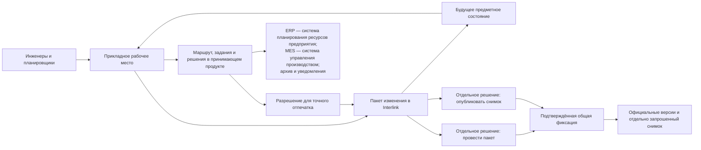

# Сквозные машиностроительные примеры

## Как читать примеры

Каждый пример проходит один и тот же полный путь: повод, исходные данные, рабочее состояние, видимость, предпросмотр, согласование, проведение, публикация и возможные ошибки. Это позволяет проверить не только отдельную функцию, но и то, как будет работать человек.

Примеры описывают целевое поведение. Они являются основой будущих демонстрационных и приёмочных сценариев, а не утверждением о готовом интерфейсе.

**Общая операция окончательной фиксации** — одно подтверждаемое действие принимающего продукта, в котором весь заранее подготовленный предметный результат становится официальным только целиком. В зависимости от сценария это может быть только проведение пакета либо проведение вместе с отдельно запрошенной публикацией снимка. Решения остаются различимыми, даже если выполняются одной операцией.

Во всех примерах, где принимающий продукт запускает такую операцию, возможны только три явно различимых исхода:

1. **Подтверждённый успех** — весь предусмотренный предметный результат стал официальным; только после этого разрешены внешняя передача и последующие действия.
2. **Подтверждённый откат** — ни одна из подготовленных версий, операций или отдельно запрошенных снимков не стала официальной; после устранения причины можно начинать новую попытку.
3. **Неизвестный исход** — связь прервалась до получения достоверного ответа. Повторять операцию вслепую нельзя: сначала принимающий продукт сверяет официальное состояние по устойчивому номеру попытки и только затем либо использует уже созданный результат, либо начинает новую попытку.

**Контрольный отпечаток** в примерах — вычисленная по значимому содержанию метка. Она показывает, что согласовывается и фиксируется именно проверенный набор версий, связей, правил и условий, а не незаметно изменившийся вариант.

## Сценарий 1. Повышение ресурса подшипникового узла редуктора РЦ-250

### Производственная ситуация

Сервисная статистика показывает преждевременный износ подшипника выходного вала. Требуется усилить узел начиная с серийного номера 145, не меняя уже изготовленные редукторы и ремонтные комплекты предыдущих серий.

### Участники

- ведущий конструктор отвечает за техническое решение;
- технолог проверяет изготовление крышки и сборочную операцию;
- снабжение оценивает остатки старых подшипников;
- качество определяет дополнительный контроль;
- руководитель проекта координирует внедрение;
- служба технической документации или корпоративный архив формирует выпускной комплект.

### Исходные данные

Официально существуют выпущенные версии редуктора, вала, крышки, спецификации и чертежей. Старый подшипник применяется без ограничения по серии. На складе есть остаток, а часть редукторов уже находится в незавершённом производстве.

### Работа пользователя

1. Ведущий конструктор создаёт формальный пакет «РЦ-250. Повышение ресурса выходного узла» и указывает основание — статистику отказов.
2. Он берёт в работу вал, крышку, сборку и связанные документы. Остальные пользователи продолжают видеть выпущенное состояние.
3. Внутри пакета создаются рабочие версии. Конструктор меняет посадочные размеры и заменяет подшипник.
4. Технолог, имеющий доступ к пакету, видит будущую геометрию и добавляет изменение операции расточки крышки.
5. Для проверки временно выбирается версия нового подшипника. До проведения этот выбор не считается постоянной конкретизацией.
6. Предпросмотр собирает весь редуктор. Он обнаруживает, что существующая манжета несовместима с новой крышкой.
7. Конструктор добавляет другую манжету и фиксирует точные версии критических позиций.
8. Применяемость делается непересекающейся: прежний узел действует для серийных номеров 1–144, новый — начиная с номера 145.
9. Влияние показывает три открытых заказа и складской остаток. Снабжение подтверждает использование остатка для ремонта; производство определяет переход для незавершённого задела.
10. После предметных проверок принимающий продукт проводит согласование точного будущего состава.
11. Любая последующая правка размера меняет отпечаток и возвращает нужные решения на повтор.
12. Решение провести пакет отделено от решения опубликовать снимок. Если выполняется только проведение и оно подтверждённо успешно, одновременно появляются новые версии всех затронутых объектов и применяемость. Частичного выпуска быть не может.
13. Отдельным решением для одной точной конфигурации выпуска — например, редуктор серии 145 на дату решения — публикуется базовый снимок, а служба технической документации или корпоративный архив формирует самодостаточный комплект документов. Принимающий продукт может объединить проведение и публикацию в одной общей операции окончательной фиксации, но решения остаются различимыми. При подтверждённом успехе официальными становятся и версии, и снимок; при подтверждённом откате — ни один результат; при неизвестном исходе повтор запрещён до сверки. Другой серийный номер или дата являются отдельным набором условий и при необходимости получают свой снимок.

### Что видят разные пользователи

До проведения обычный пользователь серии 140 видит старый официальный узел. Участник пакета видит будущий усиленный узел. После проведения пользователь серии 140 по-прежнему получает старые версии, а для серии 145 — новые. Базовый снимок прежнего выпуска не изменяется.

### Возможная ошибка

Если для новой крышки не выпущена подходящая технологическая оснастка, предпросмотр показывает влияние. Политика предприятия определяет, является ли это запретом проведения или обязательным последующим заданием. Решение и основание видны в истории.

## Сценарий 2. Быстрое исправление материала невыпущенной прокладки

### Производственная ситуация

При подготовке гидроцилиндра технолог замечает, что в рабочем справочнике прокладке назначена резина неправильной марки. Изделие ещё не выпущено, состав не меняется, а требуемый материал уже разрешён стандартом предприятия.

### Работа пользователя

1. Технолог открывает карточку прокладки и выбирает «Исправить материал».
2. Принимающий продукт устанавливает личность технолога и проверяет корпоративные правила по роли, объекту, его состоянию, изменяемому полю и влиянию. Правила разрешают облегчённое изменение.
3. Interlink отдельно проверяет предметную допустимость и автоматически создаёт облегчённый пакет с полным учётом действий, а внутри него — рабочую версию.
4. Пользователь видит старую и новую марку, применимый стандарт и перечень использований.
5. Проверка подтверждает единицу измерения, плотность и совместимость со средой.
6. При подтверждённом успехе общей операции окончательной фиксации появляется следующее официальное поколение, а история сохраняет основание. При подтверждённом откате карточка остаётся прежней; при неизвестном исходе рабочее место запрещает повтор и сначала сверяет, появилась ли новая официальная версия.

### Почему это не «прямая правка»

Если бы поле менялось на месте, было бы невозможно доказать, какие расчёты и составы читали прежнее значение. Пакет сохраняет простоту пользовательского действия, но не жертвует историей.

### Отрицательный вариант

Если прокладка уже входит в выпущенный гидроцилиндр, это ещё не автоматический запрет. Если корпоративная матрица по совокупности состояния, поля и влияния требует формального пути, интерфейс объясняет решение и предлагает открыть извещение, перенося в него введённую причину и предполагаемое значение.

## Сценарий 3. Срочное исправление управляющей программы станка

### Производственная ситуация

Инженер автоматизации готовит плановую оптимизацию программы фрезерного станка. В этот момент обнаруживается опасная ошибка останова шпинделя, требующая немедленного исправления той же программы.

### Исходное состояние

Плановый пакет удерживает программу, таблицу параметров и инструкцию оператора. В нём есть незавершённые изменения, ещё не прошедшие стендовое испытание.

### Работа при конфликте

1. Автор срочного изменения пытается взять программу в работу и получает не безликую ошибку, а сведения о владельце, цели и возрасте занятого пакета.
2. Руководитель оценивает, можно ли объединить изменения. Из-за непроверенной оптимизации совместный выпуск признан рискованным.
3. Уполномоченный пользователь выбирает вытеснение и видит, что будет потеряно: все рабочие версии и операции планового пакета.
4. Плановый пакет целиком отменяется с причиной «критическая безопасность». Официальная версия программы не меняется.
5. Срочный пакет начинается от актуальной вершины линейной истории, выбранной как основа редактирования, а не от незавершённого варианта оптимизации.
6. Предпросмотр показывает программу, параметры и инструкцию; испытание и согласование относятся к точному отпечатку.
7. При подтверждённом успехе общей операции окончательной фиксации новая безопасная версия становится официальной. При подтверждённом откате официальной остаётся прежняя программа; при неизвестном исходе повтор запрещён до сверки. Фактическую установку новой версии на станки принимающий продукт контролирует отдельно.
8. Плановую оптимизацию при необходимости создают заново от безопасной версии. Полезные идеи из отменённого пакета переносятся осознанно, а не наследуются скрытно.

### Важная граница

Проведение версии программы в Interlink не доказывает, что она установлена на каждом станке. Alvatune или интеграционный контур ведёт задания развёртывания, подтверждения контроллеров и сверку фактического состояния.

## Сценарий 4. Совместный выпуск механики, электрики и управления станка

### Производственная ситуация

Заказчику требуется увеличить диапазон оборотов обрабатывающего центра. Меняются шпиндель, преобразователь, защита, охлаждение и управляющая программа. Дисциплины работают по разным маршрутам, но несовместимый частичный выпуск недопустим.

### Организация работы

Координатор одной операцией создаёт комплект и три его дочерние части:

1. механическое изменение шпиндельного узла;
2. электрическое изменение шкафа и привода;
3. изменение управляющей программы и параметров.

Каждая команда ведёт собственную именованную часть, перечень объектов и решения. Часть нельзя отдельно провести или отменить, перенести в другой комплект либо повторно использовать: все части имеют общую конечную судьбу. Порядок частей зафиксирован: сначала меняется механический интерфейс, затем электрическая часть использует его характеристики, после этого программа задаёт допустимый диапазон.

### Совокупный предпросмотр

Interlink накладывает части по порядку и строит общий будущий станок. Нормативная проверка оценивает совокупное конечное состояние; промежуточная ступень не обязана быть самостоятельно допустимым выпуском. Проверка обнаруживает, что при максимальных оборотах существующего расхода охлаждения недостаточно. Механики добавляют насос, электрики — пускатель и кабель, программисты — контроль расхода.

Отпечаток относится ко всему комплекту и его порядку. Изменение одной части аннулирует итоговое разрешение и те дисциплинарные решения, которые политика считает затронутыми.

### Проведение

Все части повторно проверяются и передаются в одну общую операцию окончательной фиксации. При подтверждённом успехе официальными становятся все части; при подтверждённом откате — ни одна; при неизвестном исходе повтор запрещён до сверки общего результата. Если программа не прошла испытание ещё до запуска операции, механическая часть не становится отдельно выпущенной под видом завершённой модернизации.

После успеха отдельным решением публикуется базовый снимок полного получившегося графа станка: от точной корневой версии до всех листовых позиций. Это не архив дочерних частей комплекта. Отдельный процесс развёртывания отслеживает конкретные станки и фактические установленные версии.

## Сценарий 5. Перепланирование производственного заказа насосной станции

### Производственная ситуация

Заказчик согласовал насосную станцию с двигателем поставщика А. После первой передачи в производство поставщик переносит срок на два месяца. Требуется заменить двигатель на допустимый вариант Б, не стирая факт прежнего задания.

### Первая публикация

1. Живой заказ содержит требования по расходу, напору, климату и напряжению.
2. Подбор формирует точную конфигурацию станции.
3. Планировщик проверяет состав, маршрут и обеспеченность.
4. После согласования принимающий продукт начинает общую операцию окончательной фиксации: Interlink подготавливает официальную версию инженерного содержания и отдельно запрошенный снимок №1.
5. До подтверждённого завершения общей операции номер снимка имеет состояние «подготовлен, ожидает фиксации».
6. После подтверждённой фиксации версия и снимок становятся официальными. Если операция подтверждённо откатилась, не публикуется ни один результат; при неизвестном исходе принимающий продукт блокирует повтор и сначала выполняет сверку.
7. MES (система оперативного управления производством) получает именно этот неизменяемый снимок.

### Перепланирование

1. Срыв поставки становится основанием нового пакета изменения живого заказа.
2. В рабочем контексте двигатель Б временно выбирается для оценки.
3. Будущий состав показывает необходимость другого фланца, кабеля и настройки защиты.
4. После расчёта для нужных позиций отдельно создаются точные фиксации, затем исходное временное предпочтение обязательно удаляется; состав проверяется до листьев.
5. Согласование учитывает цену, срок, электрическую часть и влияние на уже начатые работы.
6. В общей операции подготавливаются новая версия живого заказа и снимок №2; опубликованными они становятся только после окончательной фиксации принимающего продукта.
7. MES получает явное задание перейти на №2. Снимок №1 остаётся в истории и не пересчитывается.

### Возможный сбой

Если связь прерывается **до подтверждения общей фиксации**, неизвестно, стали ли версия и снимок официальными. Принимающий продукт показывает «исход неизвестен», запрещает слепой повтор проведения и публикации и выполняет обязательную сверку. При подтверждённом откате новая попытка допустима; при подтверждённом успехе используются уже созданные версия и снимок.

Если фиксация уже подтверждена, но отправка №2 в MES не завершилась, предметный результат остаётся официальным. Принимающий продукт сначала сверяет внешний результат. Если договор с MES прямо гарантирует распознавание повторного сообщения по устойчивому номеру, принимающий продукт повторяет только то же сообщение со ссылкой на снимок №2. Если такой гарантии нет, автоматический повтор запрещён: после сверки пользователь выполняет согласованное с MES действие восстановления. Проведение и создание нового снимка в обоих случаях не повторяются.

## Сценарий 6. Отмена ошибочной модернизации корпуса насоса

### Производственная ситуация

Конструктор начинает облегчение корпуса насоса и создаёт рабочие версии корпуса, крышки и чертежа. Расчёт прочности показывает, что выигрыш массы не оправдывает снижение ресурса.

### Отмена до проведения

Пользователь открывает последствия отмены. Система показывает три рабочие версии, временную замену материала и удерживаемые объекты. После подтверждения пакет отменяется целиком, объекты освобождаются, а официальная версия корпуса остаётся прежней. История сохраняет причину отказа и ссылку на расчёт.

### Если ошибка уже проведена

Если облегчённая версия была выпущена, удалить её как незавершённую нельзя. Создаётся корректирующий пакет, который возвращает геометрию в следующем поколении, оценивает затронутые заказы и проходит новый маршрут. При подтверждённом успехе общей операции исправляющая версия становится официальной, и обе версии остаются в прослеживаемой истории. При подтверждённом откате официальной остаётся только облегчённая версия; при неизвестном исходе повтор запрещён до сверки.

## Общая схема ролей и данных

## Что проверять на демонстрации

Для каждого сценария недостаточно показать только удачное проведение. Приёмочная демонстрация должна подтвердить:

- различие официального и рабочего состояния;
- видимость разным участникам;
- объяснимый конфликт занятости;
- возврат к сохранённой точке;
- точный предпросмотр состава;
- изменение отпечатка после правки;
- отказ без частичных официальных данных;
- подтверждённый успех, подтверждённый откат и неизвестный исход общей фиксации;
- запрет слепого повтора и обязательную сверку неизвестного исхода;
- неизменность прежнего снимка;
- понятную границу с внешней системой.

## Состояние реализации

Сценарии фиксируют целевую продуктовую и приёмочную модель. Базовые типы и модель Interlink развиваются сейчас; полный пакет, собранный будущий вид всех его правок, применяемость, комплекты, деловые снимки и рабочие места принимающего продукта вводятся поэтапно после соответствующих опытных подтверждений.

Связанные документы: [[жизненный цикл|Change-package-lifecycle]], [[виды и комплекты|Change-package-variants]], [[состояние и приёмка|Change-package-status]].
