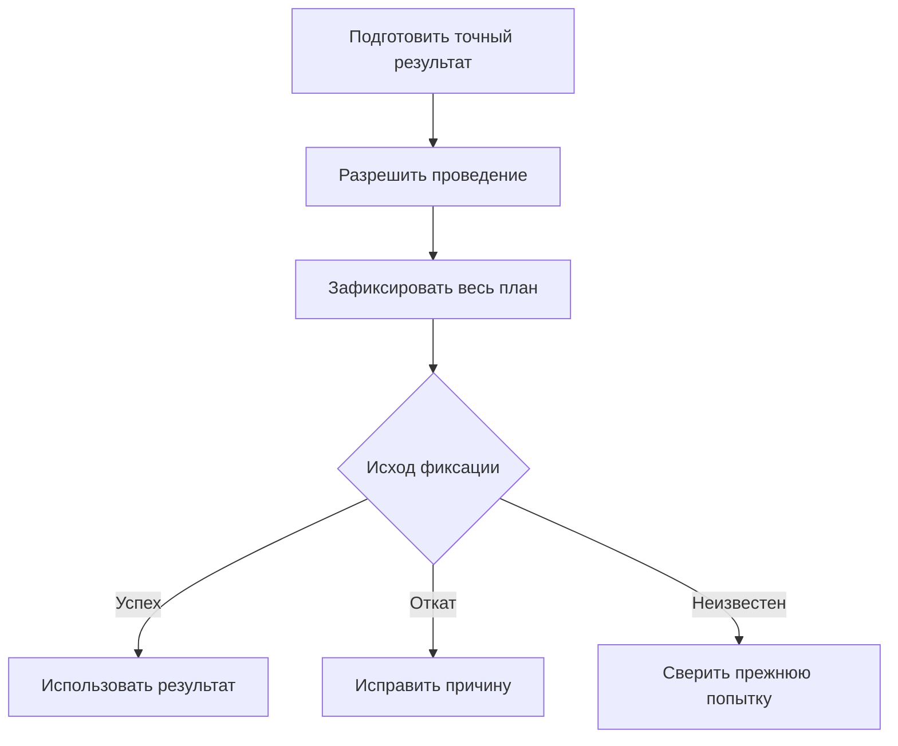
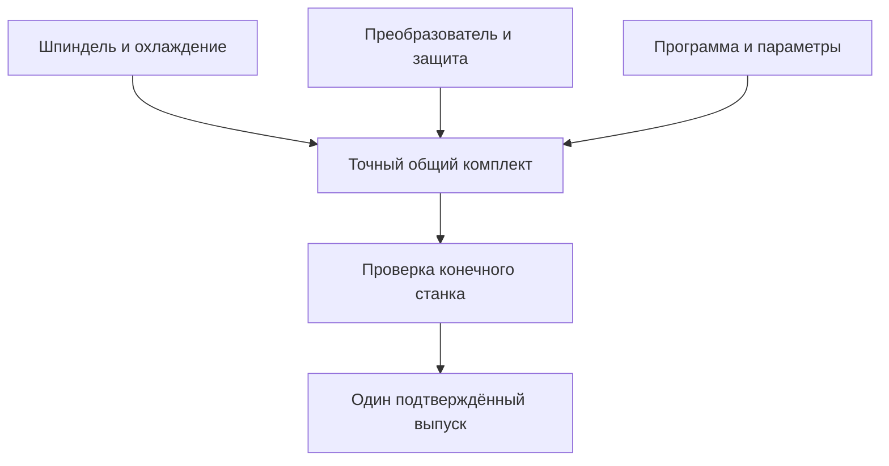

# Сквозные машиностроительные примеры изменений

## Как читать примеры

Каждый пример показывает деловую причину, исходные данные, действия пользователя, момент публикации и поведение при ошибке. Описывается целевая модель Interlink, которую ещё необходимо подтвердить реализацией и сквозными испытаниями.

Во всех сценариях различаются рабочая область, контекст подбора и пакет изменения. Рабочая область может пережить много публикаций. Контекст определяет используемые версии и содержание, включая детали без рабочих копий. Пакет выбирает конкретный набор правок для совместного проведения.

Также различаются инженерная версия и её опубликованное состояние. Исправление содержания версии «Б» может создать новое состояние «Б» без новой версии «В». Старые точные состояния и необходимые файлы продолжают воспроизводиться в пределах объявленной политики сохранности.

## Общее правило подтверждения

При успехе весь согласованный локальный результат сохранён. При подтверждённом откате ни одна часть не стала официальной. При потерянном ответе нельзя обходить неизвестность новым номером операции: система сначала устанавливает, что случилось с прежним намерением. Это правило ниже не повторяется в каждом шаге, но действует во всех примерах.

## Сценарий 1. Повышение ресурса подшипникового узла РЦ-250

### Производственная ситуация

Сервисная статистика показывает износ подшипника выходного вала. Требуется усилить узел с серийного номера 145, сохранив старое исполнение для уже изготовленных редукторов и ремонтных комплектов. На складе есть прежние подшипники; несколько заказов ещё находятся в производстве.

### Работа участников

1. Ведущий конструктор открывает извещение «РЦ-250. Повышение ресурса выходного узла», указывает статистику отказов и создаёт рабочую область.
2. Для узла явно создаётся новая инженерная версия, поскольку предприятие рассматривает усиление как отдельное решение. Рабочие копии вала, крышки, состава и документов связываются с выбранными версиями.
3. Контекст подбора включает эти копии и опубликованные состояния остальных компонентов. Назначения из строк извещения сохраняют происхождение; ручной выбор специалиста не превращается в безымянную автоматическую запись.
4. Технолог проверяет расточку крышки, снабжение — остатки, качество — дополнительный контроль. Их задания не дают им неограниченного доступа ко всей рабочей области.
5. Предпросмотр обнаруживает, что новая крышка требует другой манжеты. Конструктор включает манжету в решение и проверяет не только её обозначение, но и конкретные выбранные характеристики.
6. Применяемость разделяет прежнее и новое исполнения: серии 1–144 и начиная с 145. Для критических позиций отдельно определяется, достаточно ли закрепить инженерную версию или нужно точное неизменяемое состояние.
7. В пакет включается готовый узел, документы и действия применяемости. Обсуждаемое изменение упаковки остаётся в работе.
8. Проверка готовит точный состав и основания согласования. Службы согласуют переход, задел и использование складского остатка.
9. Проведение публикует весь выбранный набор. Отдельное решение создаёт точный выпускной комплект для конкретной конфигурации, например редуктора №145.
10. Производство получает этот комплект. Само извещение может оставаться открытым до выполнения последующих действий по внедрению.

### Результат и ошибка

Пользователь серии 140 продолжает получать прежнее решение, а серии 145 — новое по действующим условиям. Старый опубликованный комплект не пересчитывается.

Если требуемая оснастка ещё не готова, результат проверки явно показывает зависимость. Настроенное правило определяет, блокируется ли выпуск или требуется отдельное допустимое решение по внедрению. Нельзя скрыть обязательную проблему статусом «предупреждение» только ради проведения.

## Сценарий 2. Исправление материала невыпущенной прокладки

### Производственная ситуация

Технолог замечает, что рабочей прокладке гидроцилиндра назначена неподходящая резина. Требуемая марка уже разрешена стандартом, но прокладка ещё не выпущена.

### Действия

Технолог открывает именно рабочую копию прокладки, выбирает правильный материал и сохраняет. Проверяются единицы, допустимый тип материала и известные ограничения по рабочей среде. Сохранение позволяет продолжить работу после выхода из приложения; оно не создаёт официального состояния.

Если требуется завершить исправление, принимающий продукт применяет правила быстрого либо формального пути. В простом разрешённом случае подготовка и публикация могут выглядеть как одно подтверждение. Результатом будет опубликованное состояние выбранной инженерной версии, а не обязательная новая версия только из-за исправления поля.

### Пограничный случай

Если меняется не состав прокладки, а оперативная запись справочника поставки, способ записи определяется её моделью. Не нужно создавать искусственную инженерную версию ради каждого уточнения срока. Однако автор, причина, прежние значения и конфликт с чужой правкой должны оставаться контролируемыми.

Если материал уже использован в точном комплекте заказа, старый комплект не должен незаметно получить исправленную марку. Для этого его необходимые данные должны быть заранее сохранены в точной форме, а не ссылаться только на сегодняшнюю изменяемую карточку.

## Сценарий 3. Срочная ошибка программы и плановая оптимизация

### Исходная ситуация

Команда автоматизации оптимизирует программу станка. Сервис обнаруживает опасную ошибку останова шпинделя. Обе работы относятся к одной действующей инженерной версии программы, но смешивать непроверенную оптимизацию со срочным исправлением нельзя.

### Параллельный режим

У двух команд разные рабочие области и рабочие копии от одного опубликованного состояния. Сервис сохраняет исправление, проводит стендовое испытание и публикует выбранный пакет: программу, параметры и изменённую инструкцию.

Плановая команда продолжает работу. При попытке публикации она получает конфликт основы: программа уже изменилась. Её оптимизация и файлы не удаляются. Инженер сравнивает исходник, своё предложение и безопасное опубликованное состояние, затем осознанно переносит оптимизацию либо создаёт отдельную инженерную версию.

### Исключительный режим

Если предприятие разрешает только одного редактора версии, сервис сначала получает конфликт занятости. Руководитель может согласовать передачу права или иной разрешённый порядок. Передача должна запретить прежнему исполнителю продолжать запись по старому разрешению, но не означает автоматического уничтожения всех его черновиков.

Отказ от плановой работы и её удаление требуют отдельного решения с учётом итераций, зависимостей и правил хранения. Прежняя формула «срочность отменяет весь чужой пакет и стирает все копии» не является общим правилом Interlink.

### Физическое внедрение

После публикации программа доступна как инженерный результат. Отдельный процесс передаёт её на станки и получает подтверждения контроллеров. Станок, на котором обновление не подтверждено, не считается модернизированным по одному факту выпуска программы.

## Сценарий 4. Совместный выпуск механики, электрики и управления

### Задача

Заказчику нужен расширенный диапазон оборотов обрабатывающего центра. Меняются шпиндель, преобразователь, охлаждение, защита и программа. Независимый выпуск любого фрагмента может создать опасное сочетание.

### Организация

Команды готовят свои пакеты в рабочих областях и сохраняют отдельные результаты. Координатор выбирает точные подготовленные пакеты для общего комплекта проведения. Общий контекст помогает просматривать станок, но не заменяет решение о совместном выпуске.

Проверяется именно конечное сочетание, а не только сумма индивидуальных зелёных проверок. Если при максимальных оборотах не хватает охлаждения, механики добавляют насос, электрики — пускатель, программа — контроль расхода. Изменившийся общий план требует соответствующего нового одобрения.

### Два важных отказа

Если две команды включили несовместимые рабочие копии одной инженерной версии, порядок пакетов не решает конфликт. До проведения нужно подготовить один согласованный результат.

Если программа не прошла обязательное испытание, механика не становится отдельно официальной под видом завершённой общей модернизации. Изменить границу выпуска можно только новым осознанным планом с проверкой зависимостей.

После успеха отдельно выпускается точный комплект станка с нужными документами. Развёртывание на каждом экземпляре остаётся отдельным процессом.

## Сценарий 5. Замена привода в производственном заказе

### Исходная ситуация

Насосная станция уже передана в производство с двигателем поставщика А. Срок поставки сдвинулся на два месяца. Есть два допустимых предложения: другой двигатель с переходным фланцем либо готовый приводной модуль. Прежнее задание нужно сохранить в истории.

### Выбор и проверка

1. Планировщик открывает живой заказ и его первую опубликованную конфигурацию. Создаётся работа по перепланированию, а не изменение старого снимка.
2. Устанавливается точное исходное содержание двигателя, для которого проверяется допуск. Если аналоги заданы у его инженерной версии, читается именно её декларация; нельзя взять список заменителей другой версии по совпавшему обозначению.
3. Пользователь сравнивает предложения и явно выбирает вариант. Библиотека допустимых альтернатив при этом не превращается в один глобальный выбор для всех заказов.
4. Для приводного модуля план показывает полный результат: старые двигатель и муфта снимаются; модуль, адаптер и датчик добавляются; определённый контроллер обязан сохраниться.
5. Обычный механизм подбирает версии и состояния новых компонентов. Затем проверяется конечное сочетание: механика, ток, климат, охлаждение, программа, применимость к маршруту и площадке.
6. Если другое выбранное изменение удаляет обязательный контроллер, система обнаруживает конфликт. Если два решения лишь требуют его наличия, это не двойное потребление.
7. Согласующий оценивает точный результат, цену, срок и уже начатые работы. Публикуется новая конфигурация заказа со снимком №2 и основанием перехода.

### Что остаётся отдельным

Снимок №1 сохраняется. Передача №2 производству, его принятие и фактическая установка привода — разные события. Разрешение использовать новый модуль не доказывает, что прежний двигатель уже снят.

Если проверка обнаружила несовместимость, система не перебирает скрытно другие версии и не выдаёт полученный состав за согласованный вариант. Пользователь видит проблему и готовит новое решение.

При потере связи с производством после локальной публикации повторяется только доставка того же результата по договору получателя. Если внешний исход неизвестен и безопасное распознавание повторов не гарантировано, сначала требуется сверка.

## Сценарий 6. Возврат после неудачной модернизации корпуса

### Ситуация

Конструктор сохранил итерацию «До облегчения корпуса», затем уменьшил толщину стенки и добавил исправление материала. Расчёт прочности показывает, что уменьшение стенки неприемлемо, а новый материал полезен. Источником прежней геометрии служит именно сохранённая итерация до эксперимента.

### Возврат только нужного содержания

Инженер выбирает прежнюю геометрию и видит план восстановления в сегодняшнюю рабочую копию. Материал оставляет текущим. До переноса сохраняется необходимая страховочная итерация, если этого требует политика. Если после подготовки плана коллега изменил ту же копию, восстановление отказывает, а не стирает новую работу.

Успешный перенос меняет только рабочие данные. Инженер повторяет расчёт и нормоконтроль. Лишь отдельная публикация создаёт следующее состояние нужной инженерной версии. Все уже опубликованные промежуточные состояния остаются доступны согласно назначению и правилам хранения.

### Отмена новой детали

В ходе эксперимента создан новый адаптер. Пока это единственная начальная работа без зависимостей, его можно отменить предусмотренным простым действием. Но если другая команда уже начала его вторую версию или адаптер вошёл в сохраняемую итерацию, такое удаление отказывает.

Пользователь должен выбрать отдельный проверенный план прекращения зависимых работ. Само отсутствие официального выпуска не позволяет удалить чужие данные или уничтожить доказательство расчёта.

## Сценарий 7. Изменение инженерного справочника режимов

### Ситуация

Технологическая служба вводит режимы резания для новой группы сталей. Таблица должна быстро находить запись по материалу, инструменту и диапазону диаметра. Это данные для индексируемого чтения, а не только файл Excel в архиве.

### Работа

Технолог готовит новую рабочую редакцию набора. Система проверяет единицы и допустимые значения осей. Если объявлена полная сетка, все обязательные сочетания должны иметь корректную запись. Для разреженной карты отсутствие ячейки означает отсутствие соответствия, пока специальное правило не определило иной смысл.

После сохранения набор остаётся рабочим. Публикация разрешает использовать проверенную точную редакцию в выбранной области. Расчёт оснастки, выполненный до изменения, сохраняет ссылку на прежние точные режимы и необходимые основания, а не пересчитывается по сегодняшнему справочнику.

### Ошибка совместимости

Новый инструмент разрешён для стали, но сочетание инструмента, станка, охлаждения и режима недопустимо. Попарные разрешения не доказывают допустимость всей комбинации. Проверка должна учитывать совместное ограничение.

Если данных для вывода не хватает, пользователь получает «недостаточно данных», а не «разрешено». Такое различие предотвращает ложную готовность технологического процесса.

Различие полного набора и разреженной карты подробнее разобрано в [[обзоре табличных данных|Tabular-data]], [[многомерных таблицах|Multidimensional-tables]] и [[координатных картах|Coordinate-maps]].

## Сценарий 8. Агент готовит предложение по замене поставщика

### Ситуация

Агент анализирует риск поставки преобразователя для партии станков. Ему разрешено читать ограниченный набор заказов, справочник допусков и сроки поставки, а также подготовить предложение. Право выпускать изменение не выдано.

### Действия и прослеживаемость

Агент действует под собственной установленной идентичностью. Для конкретного запуска сохраняется отдельная запись с инициатором, поручением и пределами полномочий. Сохраняются точные разрешённые входы: конфигурации заказов, состояния компонентов, редакции допусков и использованные файлы. Если рабочие данные позднее изменятся, должно быть понятно, на каком основании агент предложил замену.

Агент создаёт предложение в рабочей области и указывает, какие изменения потребуются в шкафе, защите и программе. Человек проверяет основания и выбирает конкретный план. Текущее разрешение на проведение и обязательные предметные проверки выполняются заново; историческое право чтения агента не становится вечным правом выпуска.

Если работа агента прервалась после отправки команды, продолжение проверяет её сохранённый итог. Оно не создаёт второй заказ или вторую замену под новым номером. Фактическая поставка и установка всё равно подтверждаются отдельными событиями.

## Что обязательно показать на демонстрации

| Проверка | Наблюдаемый результат |
|---|---|
| Сохранение и публикация | Сохранённая копия ещё не стала опубликованным состоянием |
| Выбранный поднабор | Неготовые работы остаются в области, но не попадают в выпуск |
| Параллельная публикация | Проигравшая работа сохранена и получает объяснимый конфликт |
| Одинаковая версия, разное содержание | Общий контекст не скрывает расхождение состояний или копий |
| Точное одобрение | Согласованный компонент не подменяется сегодняшним основным |
| Обязательная актуальность | Изменение объявленного живого основания вызывает новую подготовку |
| Групповая замена | Применяется весь выбранный набор, сохраняются его предпосылки |
| Совместимость | Проверяется конечное сочетание, неопределённость не выдаётся за разрешение |
| Восстановление | Меняются выбранные рабочие данные, публикация выполняется отдельно |
| Неизвестный исход | Сверяется прежнее намерение, результат не создаётся повторно |
| Внешнее исполнение | Публикация, доставка, приём и установка различаются |
| Исторические основания | Старые точные данные и нужные файлы доступны по объявленной гарантии |

## Состояние реализации

Примеры фиксируют целевой продуктовый результат и основу приёмки. Они включают сохранение обязательных потребностей IPS и развитие Interlink: независимые рабочие области, более общие замены, индексируемые наборы и агентские действия. Отсутствие конкретного расширения в исследованном корпусе IPS не означает, что его нет во всех установках.

Полная реализация механизмов, испытания конкурентности, файловой сохранности и внешних интеграций ещё необходимы. Концептуальная схема или название команды сами по себе не доказывают готовность сценария.

Связанные документы: [[жизненный цикл|Change-package-lifecycle]], [[виды изменений|Change-package-variants]], [[рабочие данные|Change-package-visibility]], [[допустимые замены|Allowed-replacements]], [[матрицы совместимости|Compatibility-matrices]], [[агенты и прослеживаемость|Agents-and-traceability]], [[приёмка|Change-package-status]].
