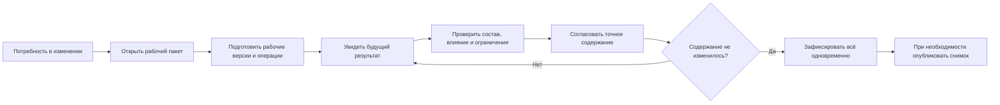

# Пакет изменения в Interlink

## Что это такое в одном абзаце

Пакет изменения — это явная рабочая область, в которой несколько будущих правок инженерных данных подготавливаются, проверяются, согласуются и фиксируются как единый результат. В нём могут одновременно находиться новые версии деталей и документов, изменения состава, применяемость, точные фиксации, справочные связи и управляемые изменения состояния уже выпущенных версий.

Пока пакет открыт, его участники видят будущий результат, а остальные пользователи продолжают видеть официальное состояние, выбранное для их задачи. Это не обязательно самая новая версия: основанием может быть назначенная основная версия, точный номер версии, применяемость или ранее опубликованный снимок. После успешной проверки и согласования пакет либо проводится целиком, либо не изменяет официальные данные вообще.

Это не просто папка, маршрут согласования или номер извещения. В целевой модели Interlink пакет является единственной штатной формой, через которую предметные правки объединяются и становятся официальными. Для быстрого одиночного действия предусмотрен тот же путь: принимающий продукт сначала проверяет пользователя и корпоративную матрицу допустимых действий, затем передаёт предметное действие, а будущий механизм Interlink автоматически создаёт и завершает небольшой пакет без отдельного ручного оформления большой карточки изменения. Сам по себе статус «выпущено» или факт изменения состава не запрещает быстрый путь: решение принимает матрица с учётом роли, вида объекта, состояния, изменяемого поля или связи и ожидаемого влияния. Такой автоматически созданный небольшой пакет относится к целевой модели и пока не является готовой функцией.

## Зачем подготовлен отдельный комплект

В IPS потребность распределена между рабочей копией, итерациями, контекстом редактирования, связанными контекстами, мягкой конкретизацией, извещением, журналом изменений и актуализацией. Interlink не копирует эту конструкцию буквально. Он собирает неизменяемый пользовательский результат из меньшего числа явно разделённых механизмов.

Комплект позволяет понять:

- что именно входит в пакет и что остаётся за его пределами;
- как конструктор или технолог начинает и сохраняет работу;
- почему незавершённые данные не видны посторонним;
- как предотвращаются параллельные несовместимые изменения;
- что показывает предпросмотр;
- к какому точному содержанию относится согласование;
- как происходит полная фиксация;
- чем отмена отличается от новой версии;
- когда после изменения нужен неизменяемый снимок;
- что реализовано сейчас, а что является целевой моделью после опытного подтверждения архитектуры.

## Путь чтения

1. [[Что такое пакет изменения и где его границы|Change-package-concept]]
2. [[Как пользователь проходит жизненный цикл изменения|Change-package-lifecycle]]
3. [[Рабочие данные, видимость и параллельность|Change-package-visibility]]
4. [[Предпросмотр, проверка и согласование|Change-package-preview]]
5. [[Фиксация, отмена и восстановление после ошибок|Change-package-commit]]
6. [[Быстрые, формальные и составные изменения|Change-package-variants]]
7. [[Снимки, доказательства и история пользователя|Change-package-snapshots]]
8. [[Сквозные машиностроительные примеры|Change-package-examples]]
9. [[Состояние, открытые вопросы и приёмка|Change-package-status]]

## Главная схема

## Важная граница готовности

Полный механизм пакета изменения — объединённый будущий вид всех правок, точки возврата, комплекты и проведение по разрешению принимающего продукта — является принятым целевым контрактом, который ещё должен пройти опытное подтверждение. Сейчас Interlink развивает необходимый фундамент: предметную модель, согласованные прикладные представления и проверяемые действия записи и чтения.

Практическая граница готовности проходит по отсутствующим сегодня пользовательским действиям. Конструктор или технолог ещё не может в готовом рабочем месте открыть пакет, взять в него реальные детали и документы, совместно изменить карточки, связи и состав, сохранить общую точку возврата и увидеть достоверное сравнение всего результата «до» и «после». Согласующий ещё не может получить на маршруте контрольный отпечаток точного содержания и выдать одноразовое решение именно для него. Наконец, пользователь ещё не может одной промышленно подтверждённой операцией либо выпустить весь многообъектный результат, либо гарантированно оставить официальные данные без изменений, а затем при необходимости опубликовать отдельный неизменяемый снимок состава. Пока эти действия не реализованы и не испытаны вместе, описание пакета следует читать как подробное требование к целевой системе, а не как инструкцию к уже готовой функции.

Целевые рабочие места, маршруты, задания, согласования, подписи и уведомления создаются в Alvatune или другом принимающем продукте. Их описание в комплекте нужно для проверки будущего пользовательского результата, но не означает наличие готового интерфейса.

## Связанные материалы

- [[Версии, изменения и снимки|Changes-and-evidence]]
- [[Как Interlink будет работать для пользователя|How-system-works]]
- [[Подбор версий|Version-selection-guide]]
- [[Заказы и производство|Orders-guide]]
- [[Открытые вопросы об объектах и изменениях|Questions-versions-and-changes]]
