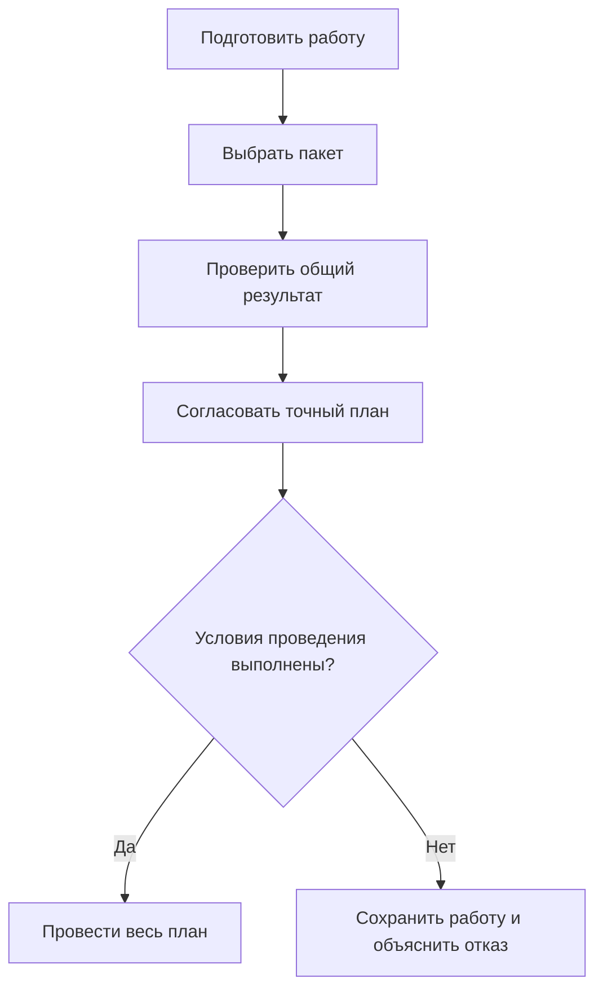

# Пакет изменения в Interlink

## Что это такое

Пакет изменения — выбранный набор правок, который необходимо проверить и принять как одно целое. В него могут входить подготовленное содержание деталей и документов, изменения состава, применяемость, переходы жизненного цикла, решения о заменах и редакции справочных данных.

Пакет отвечает на вопрос **«что провести вместе сейчас?»**. Он не равен всей рабочей области конструктора и не определяет сам по себе, какие версии видны в составе. Для незавершённой работы служит рабочая область; для долговечных назначений версий при просмотре — контекст подбора. Эти механизмы связаны, но имеют разный срок жизни.

Например, команда модернизирует редуктор несколько недель. Сегодня можно выпустить уже проверенные корпус и крышку, оставив датчик температуры в работе, если он не является обязательной зависимостью выпуска. Выбранный пакет проводится полностью либо не проводится. «Выпустить согласованную часть всей работы» допустимо; «пропустить неудавшиеся строки уже согласованного пакета» — нет.

## Что изменилось в новой архитектуре

Ранее пакет описывался как единственный контейнер работы, подбора и фиксации. Такое объединение оказалось слишком жёстким для полного воспроизведения IPS и дальнейшего развития. Актуальный план предусматривает независимые рабочие области, контексты, инженерные версии и точные опубликованные состояния.

Пользователь сможет многократно сохранять рабочую копию без публикации. Разрешённое завершение редактирования создаст новое неизменяемое состояние той же инженерной версии; новый номер версии появится только по отдельному предметному решению. Восстановление итерации в работу также не будет автоматически выпускать восстановленное содержание.

Параллельные работы не запрещаются для всего объекта разом. Предприятие сможет выбрать исключительное взятие версии на изменение либо независимую подготовку с обнаружением конфликта при проведении. Неудавшееся проведение должно сохранить правки и объяснить расхождение.

## Как читать этот комплект

Для первого знакомства достаточно общей картины и двух страниц о подготовке результата:

1. [[Что такое пакет изменения и где его границы|Change-package-concept]] — зачем разделены работа, чтение и проведение.
2. [[Рабочие области и параллельная работа|Workspaces-and-parallel-work]] — как долго живут правки, что видят другие участники, откуда берутся конфликты.
3. [[Жизненный цикл изменения|Change-package-lifecycle]] — путь от потребности до официального результата.

Дальнейшие страницы раскрывают конкретные решения:

- [[Рабочие данные, видимость и параллельность|Change-package-visibility]] — опубликованное, рабочее и точное историческое чтение.
- [[Предпросмотр, проверка и согласование|Change-package-preview]] — что именно согласуется и что проверяется повторно.
- [[Проведение, отмена и восстановление после ошибок|Change-package-commit]] — граница «всё или ничего», конфликты и потеря ответа.
- [[Быстрые, формальные и совместные изменения|Change-package-variants]] — упрощённые действия, извещения, несколько самостоятельных пакетов и общий комплект.
- [[Снимки, доказательства и история|Change-package-snapshots]] — точный состав, файлы, итерации и основания решений.
- [[Сквозные машиностроительные примеры|Change-package-examples]] — разбор целых пользовательских задач.
- [[Состояние, открытые вопросы и приёмка|Change-package-status]] — что должно быть реализовано и какими примерами это доказать.

## Основной путь пользователя

Сначала пользователь готовит рабочие копии и действия. Затем выбирает, что войдёт в ближайшее проведение. Система показывает совокупный будущий результат, проверяет зависимости и сохраняет точный план для согласования. Упрощённый разрешённый путь может не требовать отдельного ручного согласования, но не пропускает обязательные проверки.

Окончательная операция сверяет план, его исходные основания, действующие полномочия и обязательные запреты. При успехе применяется весь выбранный результат и записывается обязательная история. При конфликте рабочие копии остаются доступны для сравнения и доработки. Проведение не закрывает остальную рабочую область автоматически.

## Согласование не означает «всегда брать самое новое»

Для выпуска важно заранее понимать предмет решения. Можно согласовать только правки, а можно — точную конфигурацию со всеми существенными зависимостями: двигателем, прошивкой, нормами, файлами и выбранными заменами. Это разные по силе утверждения.

Также различаются два способа последующего проведения:

- выпустить именно согласованный точный результат;
- выпустить его только при условии, что перечисленные живые основания всё ещё актуальны.

В первом случае новая основная версия покупного двигателя не заменяет согласованный двигатель и сама по себе не отменяет старое решение. Во втором изменение явно контролируемого назначения вызовет конфликт. В обоих случаях сохраняются нынешние запреты и полномочия: историческое согласование не разрешает сегодня использовать отозванный материал.

## Три прикладных маршрута

### Небольшое исправление чертежа

Конструктор меняет примечание в рабочей копии чертежа «Корпус, версия Б». Несколько сохранений не создают новых официальных состояний. После проверки он завершает редактирование разрешённым способом; новое состояние Б становится доступно обычному опубликованному чтению. Старый производственный комплект продолжает читать прежнее точное содержание.

Для этого маршрута полезны [[жизненный цикл|Change-package-lifecycle]] и [[видимость|Change-package-visibility]]. Ключевой вопрос продуктового специалиста: какие изменения на данной стадии допускаются без нового номера версии и когда обязательно извещение?

### Взаимозависимые конструкторские и технологические правки

Корпус получает новые установочные базы, а приспособление — соответствующие опоры. Отделы готовят разные пакеты, но применить только один опасно. Создаётся общий комплект, проверяется совокупный результат и получается решение именно для него.

Если после согласования технолог изменил опору, прежнее согласование общего содержания не подходит. Остальная экспериментальная работа отделов не включается автоматически. Этот маршрут разобран в [[видах и комплектах изменений|Change-package-variants]].

### Замена привода в серийном заказе

Для насосной станции разрешён другой привод, но только с подходящим контроллером и нормой испытания. Инженер выбирает замену в конкретном заказе, подбирает версии и проверяет их фактическое содержание. Согласование связывается с этой комплектацией и точной нормой, а не с одним наименованием альтернативы.

Если два решения одновременно удаляют необходимую позицию либо одно снимает предпосылку другого, общий план получает отказ. Положительная проверка и разрешение изменения не доказывают физическую установку: факт монтажа регистрируется отдельно. Связанные страницы — [[допустимые замены|Allowed-replacements]], [[совместимость|Compatibility-matrices]] и [[заказы|Orders-guide]].

## Как сюда входят новые возможности

Новые предметные пакеты используют общую механику изменения, не создавая обходных путей.

Табличные нормы подготавливаются как проверяемое содержание. Полная сетка должна действительно покрывать объявленные комбинации осей; неизвестное измерение нельзя выдавать за известное. Изменение таблицы и инженерного объекта может требовать совместного проведения. См. [[табличные данные|Tabular-data]], [[справочные таблицы|Reference-tables]] и [[многомерные таблицы|Multidimensional-tables]].

Мягкая конкретизация остаётся самостоятельным позиционным намерением, с историей активности. Закрытие пакета не стирает её и не превращает в жёсткую фиксацию. См. [[мягкую конкретизацию|Selection-soft-concretion]].

Долговечные итерации позволяют вернуться к точному прежнему рабочему результату, в том числе выборочно. Возвращение в работу и последующий выпуск разделены. См. [[итерации и восстановление|Selection-iterations]].

Агентские действия используют те же проверки, но дополнительно сохраняют фактического исполнителя, пределы его полномочий и контекст решения. См. [[агентов и прослеживаемость|Agents-and-traceability]].

## Граница готовности

Комплект описывает **целевое поведение по архитектуре на 6 сентября 2026 года**. Это не инструкция к уже работающему промышленному месту конструктора. Interlink развивает необходимые модель, хранение и проверяемые команды; сквозные рабочие области, публикация, согласования, восстановление и прикладные экраны ещё должны быть реализованы и испытаны вместе.

Alvatune или другой принимающий продукт будет задавать роли, маршруты, задания, формы и внешние передачи. Наличие этих замыслов не означает, что соответствующий интерфейс уже создан. Проверка готовности должна пройти на реальных сценариях IPS и отрицательных примерах — с конкурирующими правками, неподходящими версиями, потерей ответа и частичным отказом внешнего получателя.

Связанные материалы: [[изменения и доказуемая история|Changes-and-evidence]], [[как система будет работать|How-system-works]], [[подбор версий|Version-selection-guide]], [[вопросы об объектах и изменениях|Questions-versions-and-changes]].
