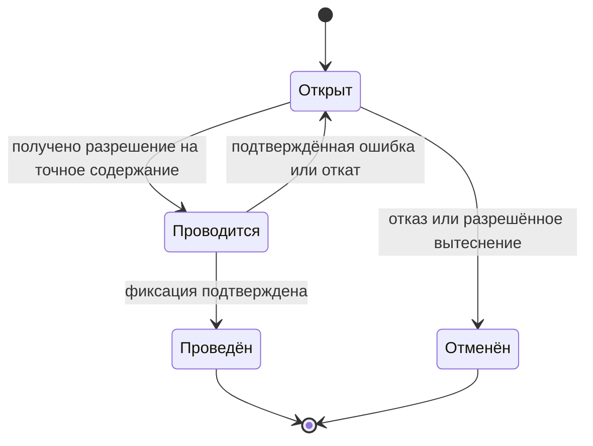
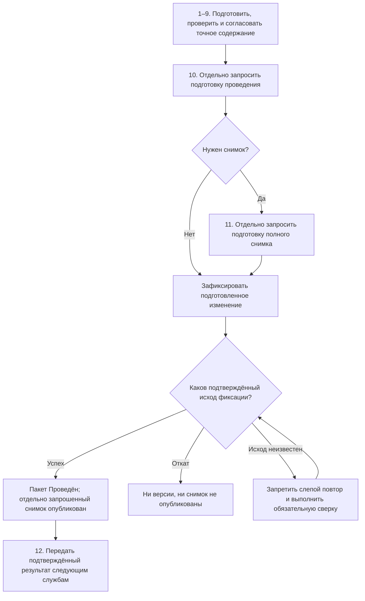

# Как пользователь проходит жизненный цикл изменения

## Участники

Один пакет может объединять работу нескольких ролей:

- инициатор формулирует причину и ожидаемый результат;
- конструктор или технолог готовит предметные правки;
- специалист по конфигурации проверяет состав, применяемость и точные фиксации;
- нормоконтролёр и согласующие оценивают точное будущее содержание;
- ответственный за выпуск принимает процессное решение по точному содержанию;
- администратор может разрешённо вытеснить зависший пакет;
- агент анализирует влияние или готовит предложение, но не получает скрытого права фиксации;
- принимающий продукт аутентифицирует пользователя, ведёт роли, задания, уведомления и подписи;
- принимающий продукт проверяет личность, роли, полномочие, подпись, срок действия и однократность использования разрешения, привязывает его к точному контрольному отпечатку содержания и передаёт Interlink;
- Interlink проверяет привязку разрешения к текущему отпечатку, модели и правилам, а также инварианты данных, но не принимает решение о человеческих полномочиях. Наличие закрытого задания процесса само по себе не даёт права изменить любой объект.

Конкретные названия ролей и маршрутов различаются между предприятиями. Неизменным остаётся то, что процесс работает с точным содержанием пакета, а не с абстрактным номером задания.

## Три независимые линии состояний

Пользователю одновременно показываются три разные линии: состояние самого предметного пакета в Interlink, состояние согласования в принимающем продукте и состояние передачи подтверждённого результата во внешнюю систему. Они связаны последовательностью работы, но не подменяют друг друга. Например, пакет может быть уже проведён, а передача производству — ещё ожидать подтверждения.

У самого пакета Interlink только короткий предметный жизненный цикл:

| Состояние пакета | Что означает |
|---|---|
| Открыт | Можно добавлять рабочие версии и подготовленные операции |
| Проводится | Система повторно проверяет точное содержание; новые правки временно запрещены |
| Проведён | Все подготовленные данные стали официальными и пакет закрыт |
| Отменён | Рабочий набор удалён целиком; официальные данные не изменились |

«На согласовании», «возвращён на доработку», «ожидает нормоконтроль» и «отклонён руководителем» — состояния второй линии, то есть процесса принимающего приложения. Один открытый предметный пакет может несколько раз проходить проверку и возврат, не меняя своё состояние на выдуманную официальную версию.

Третья линия — состояние внешней передачи. Система планирования ресурсов предприятия (ERP, система планирования закупок, запасов и ресурсов) или система управления производством (MES, система диспетчеризации и учёта исполнения в цехе) может ещё не подтвердить получение уже проведённого результата. Пользователь видит все три линии, а не один неточный статус «готово».

## Полный путь пользователя

## Шаг 1. Начало из предметной задачи

Пользователь может начать с карточки изделия, задания процесса, замечания производства, требования заказчика или результата агента. Рабочее место заранее подставляет известные данные: корневое изделие, запрос на изменение, проект и предложенный вид пакета.

Например, конструктор открывает редуктор РЦ-250 и выбирает «Начать изменение». Система показывает текущую зафиксированную версию и предупреждает, если объект уже занят.

## Шаг 2. Открытие пакета

Пользователь указывает понятное основание: прекращение поставки, замечание испытаний, снижение массы, заказное исполнение. Для формального извещения может потребоваться номер по корпоративному правилу. Происхождение пользователя или агента берётся из доверенной сессии, а не вводится вручную.

На этом шаге официальные данные ещё не меняются. Создаётся контейнер будущей работы и связь с процессом принимающего продукта.

## Шаг 3. Взятие объектов в работу

При первой правке Interlink резервирует объект за этим пакетом. Рабочая версия создаётся только тогда, когда меняется содержание, которое действительно живёт по поколениям объекта. Постоянная карточка и идентичность объекта, самостоятельные связи, метки, применяемость, назначение основной версии и состояние уже выпущенной версии могут оформляться отдельными операциями того же пакета без создания нового поколения самого изменяемого объекта.

Для точной фиксации версии вложенного компонента действует другое правило. Она принадлежит не компоненту вообще, а конкретной позиции состава в конкретной версии родительского узла. Поэтому, чтобы закрепить на позиции точную версию двигателя, подшипника или преобразователя, пакет должен взять в работу родительский узел и создать его рабочую версию. В ней меняется позиция состава, после чего новая версия родителя проходит обычную проверку и проведение. Точная фиксация не может появиться как независимая правка «сбоку» от версии родительского состава.

Если нужно взять за образец старое исполнение, его версионное содержимое копируется в новую рабочую версию, но новая история всё равно продолжается от актуальной вершины и не создаёт параллельную ветвь.

Пользователь видит:

- от какой официальной версии начата работа;
- кто занял объект и в каком пакете;
- является ли объект новым или уже опубликованным;
- какие действия разрешены принимающим продуктом и предметной политикой Interlink.

## Шаг 4. Предметное редактирование

Конструктор меняет не «универсальную запись», а конкретную карточку и состав. При добавлении двигателя система знает допустимый тип цели, единицу количества, обязательность обозначения, правила точной фиксации и ограничения цикла. Эти знания происходят из выпущенной предметной модели.

Каждая операция сначала попадает в рабочий набор. Изменение версионного содержания обновляет рабочую версию. Точная фиксация вложенного компонента меняет позицию состава внутри рабочей версии родителя. Изменение постоянной идентичности, самостоятельной связи, применяемости или состояния оформляется отдельной операцией пакета. В обычном чтении базы эти действия не выглядят официальными правками. Все экраны участника используют один и тот же явный контекст пакета, поэтому карточка, дерево и проверка не расходятся из-за скрытого переключателя.

## Шаг 5. Сохранение промежуточной точки

Сохранение формы и создание официальной версии разделены. Пользователь может назвать точку «До замены двигателя» или «Вариант с муфтой МУВП-4» и позднее вернуться к ней.

Точка охватывает весь рабочий набор, а не только текущую карточку. Возврат отменяет также поздние изменения состава, временные предпочтения и плановую применяемость. Официальные данные не затрагиваются.

## Шаг 6. Предпросмотр будущего результата

Рабочее место строит результат так, как он будет выглядеть после проведения. Пользователь сравнивает:

- версии и значения до и после;
- структуру состава;
- выбранные версии вложенных компонентов;
- верхние изделия и заказы, которые могут быть затронуты;
- будущую применяемость;
- предупреждения и блокирующие ошибки.

Предпросмотр предназначен для понимания и исправления работы. Он может быть рассчитан раньше, устареть после чужого изменения и не является доказательством готовности. На согласование передаётся результат отдельной нормативной проверки, выполненной по совокупному конечному состоянию.

## Шаг 7. Проверка

Нормативная проверка заново строит совокупное конечное состояние всего пакета и сверяет официальную основу. Проверяются правила типа и связей, обязательные значения, циклы, непересекающиеся интервалы применяемости, незакрытые временные предпочтения, допустимость будущей степени готовности и корпоративная матрица вида изменения.

Ошибки делятся по последствиям:

- блокирующая — проведение невозможно;
- требующая решения — процесс должен получить явное разрешение ответственного;
- предупреждение — пользователь может продолжить по установленной политике;
- информационная — объясняет влияние или отличие.

Точная классификация относится к продукту и настройке предприятия. Interlink не должен молча понижать блокирующую проблему до предупреждения.

## Шаг 8. Согласование точного содержания

После нормативной проверки система формирует контрольный отпечаток точного будущего содержания. Согласующий получает сравнение, влияние и этот идентификатор. Он подтверждает не «пакет с номером ИИ-25», который ещё можно изменить, а конкретное проверенное состояние этого пакета.

Если после решения меняется хотя бы одна значимая правка или применяемое правило, прежнее разрешение больше не подходит. Рабочее место показывает различия и возвращает пакет на предусмотренный этап.

## Шаг 9. Возврат на доработку

Возврат процесса не понижает уже выпущенную версию до рабочей. Пакет остаётся открыт, его рабочие версии продолжают принадлежать ему, а инженер исправляет тот же будущий набор.

Предприятие определяет, какие решения сохраняются после несущественной правки и какие должны быть получены повторно. Interlink предоставляет новый отпечаток и точное сравнение; принимающий продукт применяет процессную политику.

## Шаг 10. Проведение

Перед фиксацией Interlink повторно проверяет, что все подготовленные операции, точная уже выпущенная редакция предметной модели, применимые настройки и фактически использованные правила совпадают с согласованным отпечатком, а глобальные ограничения всё ещё выполняются. Затем все новые версии и операции подготавливаются к единой фиксации.

Если Interlink выполняет операцию самостоятельно, результат становится официальным только после подтверждённой фиксации его собственной операции «всё либо ничего». Если Interlink включён в общую операцию окончательной фиксации принимающего продукта, подготовленный результат ещё не является долговечным. Он становится официальным только после единого подтверждения всей общей операции. Единый откат этой операции не публикует ни версии, ни подготовленный снимок.

После подтверждённого успеха рабочие версии становятся зафиксированными, получают место в линейной истории и предусмотренную степень готовности. Выбор новой версии как основной или предпочтительной происходит только отдельной явной операцией, если это разрешает настраиваемая политика предприятия; само проведение не обязано автоматически продвигать её. Пакет закрывается, блокировки освобождаются, история и происхождение сохраняются.

Подтверждённая ошибка проверки или откат оставляет официальное состояние без частичных правок: пользователь исправляет данные и начинает новую попытку. Конфликт параллельных изменений также имеет подтверждённый отказ: нужно перечитать данные и повторить предпросмотр. Если исход общей фиксации неизвестен, рабочее место обязано показать в карточке пакета статус попытки «Ожидает сверки: исход фиксации неизвестен», не выдавая предположение за предметное состояние пакета. Пока результат не установлен, новые попытки блокируются, ответственному пользователю назначается сверка фактического результата, а слепой повтор проведения запрещён.

## Шаг 11. Публикация точного результата

Если требуется выпустить полный комплект, передать заказ или создать архивное свидетельство, отдельным решением публикуется неизменяемый снимок одного точного контекста. Для обычной работы в актуальном составе этот шаг необязателен.

Если принимающий продукт должен зафиксировать проведение и снимок одной общей операцией, подготовка выполняется в два явно различимых действия. Сначала Interlink проверяет пакет и подготавливает предметное проведение, но ещё не делает новые версии официальными. Затем, только при наличии отдельного разрешения на публикацию, Interlink строит и проверяет полный снимок будущего результата, но ещё не показывает его как опубликованный. Принимающий продукт получает ссылки на оба подготовленных результата и завершает их одной операцией окончательной фиксации с единым подтверждением или единым откатом.

До подтверждения общей операции пользователь видит для пакета и отдельно запрошенного снимка состояние «подготовлено, ожидает фиксации». При подтверждённом успехе пакет становится проведённым, а снимок — опубликованным. При подтверждённом откате ни один результат не становится официальным. Если подтверждение потеряно, оба результата получают видимый статус ожидания обязательной сверки; повторная подготовка запрещена, пока фактический исход не установлен.

Снимок использует точные версии и сохраняет происхождение подбора. Новый выпуск компонента не меняет уже опубликованный снимок.

## Шаг 12. Продолжение процесса

Только после подтверждённой фиксации принимающий продукт отправляет уведомления, создаёт задания для технологии, архива или производства, формирует внешнюю передачу и связывает её с точным результатом. Если предметный результат уже подтверждён, а сообщение не доставлено, повторяется лишь доставка того же сообщения со ссылкой на тот же результат или снимок — проведение и публикация снимка заново не запускаются. Interlink не объявляет внешнюю отправку успешной только потому, что предметные версии зафиксированы.

## Как выглядит отказ от работы

Пользователь выбирает «Отменить пакет» и видит последствия: какие рабочие версии, новые объекты и операции будут удалены, какие объекты освободятся. После подтверждения незавершённый набор исчезает, но сама запись о пакете, причине и авторе отказа остаётся для аудита.

Отмена пакета не является удалением опубликованных версий. Если ошибочный результат уже проведён, исправление оформляется новым пакетом.

## Пример. Изменение электрошкафа станка

Электрик-конструктор меняет частотный преобразователь в шкафу станка СТ-500. Он открывает формальное изменение, берёт в работу электрошкаф, схему и перечень элементов. Внутри пакета новая версия преобразователя временно предпочитается для проработки. До согласования инженер либо создаёт нужные точные фиксации в конкретных позициях состава, либо отдельно подготавливает постоянное правило применяемости; после этого исходное временное предпочтение обязательно удаляется.

Расчётный модуль принимающего продукта определяет новую тепловую нагрузку, а предпросмотр Interlink показывает будущий состав и необходимость заменить автомат защиты по предметным данным. Результат теплового расчёта входит в доказательную оболочку принимающего продукта, а не автоматически в отпечаток Interlink. После исправления нормативная проверка подтверждает полный предметный результат. Согласующий принимает именно его. Затем инженер меняет длину кабеля; контрольный отпечаток становится другим, и решение требуется повторить. Подтверждённое проведение одновременно выпускает шкаф, схему и перечень. Для передачи в производство отдельным решением публикуется базовый снимок этого выпуска электрошкафа: неизменяемое дерево точных версий, соответствующее выпущенному инженерному решению. Заказ в этом примере не вводится, поэтому снимок заказа здесь не требуется.

## Состояние реализации

Жизненный цикл является целевой моделью полного пакета после опытного подтверждения основного фундамента. Описанное рабочее место и сквозной процесс принимающего продукта пока не реализованы. Документ задаёт продуктовый результат, который нужно подтвердить сквозным испытанием.

Связанные документы: [[предпросмотр и согласование|Change-package-preview]], [[фиксация и восстановление|Change-package-commit]], [[сквозные примеры|Change-package-examples]].
