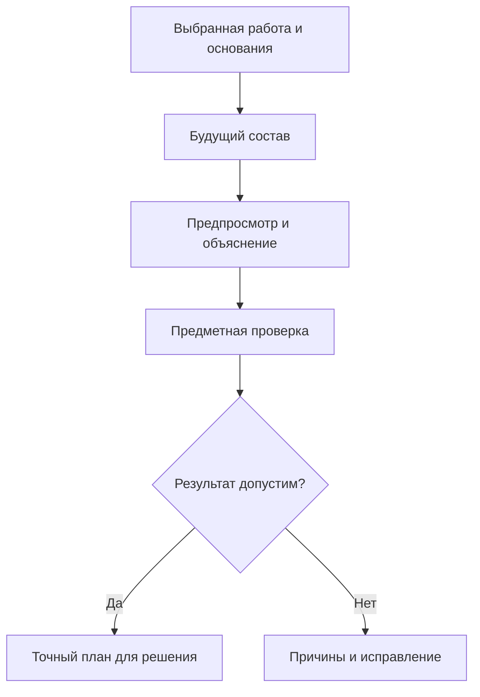
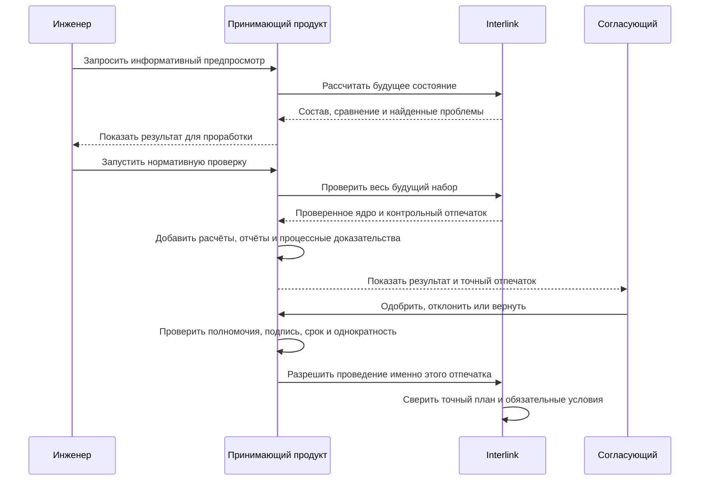

# Предпросмотр, проверка и согласование

## Зачем выделять этот этап

Пользователю недостаточно знать, что в пакет изменения добавлены пять объектов и двенадцать операций. До согласования он должен получить ответ на более практический вопрос: **каким станет изделие, если всё подготовленное сейчас провести**.

Для этого целевая модель Interlink предусматривает предпросмотр будущего состояния. Он соединяет опубликованную основу, выбранные черновики и подготовленные операции так, как они выглядели бы после успешного проведения. Это не отдельная копия базы и не предварительная публикация. Предпросмотр служит пониманию и может устареть. Перед согласованием выполняется нормативная проверка: она создаёт точный проверенный план. При проведении сверяются этот план, его обязательные условия и нынешний допуск, а не запускается скрытая подмена согласованного результата новым живым подбором.

**Пакет не обязан охватывать всю рабочую область.** В предпросмотре должны быть видны и выбранная часть выпуска, и оставшиеся черновики. Контекст подбора определяет рассматриваемые версии, но сам не является ни местом хранения правок, ни пакетом проведения. Например, конструктор может рассматривать будущий редуктор с опытным приводом, а в ближайший выпуск включить только согласованное исправление крышки — при условии, что выпуск целостен на своих опубликованных основаниях.

## Три разных уровня

### Обзор открытого пакета

Обычный обзор показывает:

- цель, вид и состояние изменения;
- перечень затронутых объектов;
- ответственных, рабочие области и ограничения редактирования, если они включены предприятием;
- наличие рабочих версий, предупреждений и решений;
- дату последней активности.

Такой обзор полезен руководителю и смежникам, но он не раскрывает каждое ещё не согласованное значение.

### Точный предпросмотр

Предпросмотр показывает именно будущий результат:

- карточки объектов после применения рабочих значений;
- будущий многоуровневый состав;
- добавленные, удалённые и заменённые позиции;
- версии, которые будут выбраны на каждой позиции;
- будущую степень готовности и применяемость;
- влияние на верхние изделия, документы, маршруты и заказы;
- найденные на момент расчёта ошибки и предупреждения;
- причины каждого выбора версии.

Разделение важно для конфиденциальности и удобства. Не каждому человеку, который видит факт открытого изменения, требуется доступ к его незавершённому содержанию.

### Нормативная проверка

Проверка не доверяет ранее показанному предпросмотру. Она читает необходимую основу, соединяет все выбранные части и их зависимости, применяет обязательные правила и закрепляет точный план вместе с контрольным отпечатком. В нём нельзя незаметно заменить файл, черновик или операцию. Если нужно согласовать не только правки, но и весь используемый комплект, дополнительно сохраняется его точный состав и существенные входные данные.

## Как строится будущий результат

Система не просто накладывает изменённые поля. Сначала определяется, какие позиции нужны, какой вариант замены явно выбран и к каким местам состава он относится. Если допуск аналога принадлежит конкретной версии исходной детали, сначала нужно установить эту исходную версию или её точное состояние: нельзя взять разрешение у случайной версии. Затем общий механизм подбора выбирает инженерные версии нужных объектов и содержание каждой версии — опубликованное состояние либо допустимый для проработки черновик.

После этого проверяется совместимость уже конкретного результата. Мягкая конкретизация позиции, контекстные назначения и правила подбора имеют разные роли; их приоритет задаётся выбранным профилем, а не порядком открытия окон. Готовый снимок читается напрямую: его нельзя пересчитать по сегодняшним предпочтениям. Согласованный точный план также не подменяется новым подбором во время проведения.

Например, новый двигатель допустим сам по себе, но после его установки в привод может потребоваться другой переходной фланец, кабель и автомат защиты. Будущий состав должен показать весь такой каскад.

## Что именно проверяется

### Полнота предметных данных

Проверяется наличие обязательных обозначений, единиц измерения, количества, материалов, владельцев, состояний и других данных, предусмотренных моделью предприятия.

### Целостность состава

Система проверяет, что связи ведут к существующим объектам, не создают запрещённый цикл и соответствуют допустимым типам. Если вал нельзя включать непосредственно в электрический шкаф, это должно быть остановлено правилами модели, а не замечено позже в отчёте.

### Однозначность выбора версий

В живом подборе результат «подходящая версия не найдена» помогает понять, что ещё нужно подготовить. Но опубликованный базовый или заказной снимок обязан быть полным в своей явно выбранной области: пропуск обязательной позиции блокирует всю публикацию. Техническая проекция — отдельное ускоряющее представление, не третий вид выпуска. Проведение самого пакета требует полного разрешённого состава лишь там, где это объявлено обязательным условием данного выпуска: например, отдельная правка может выпускать недостающую деталь, не публикуя в тот же момент всю машину.

Сохраняемая мягкая конкретизация не считается «забытым временным выбором» и не удаляется автоматически. Проверяются её смысл, владелец позиции и допустимость по процессу. Если публикация завершает черновик, на который указывает рабочий контекст, план должен явно определить продолжение этой ссылки, а не оставлять её без адресата.

Для применяемости проверяется не только формат диапазона, но и согласованность пересечений по объявленным правилам. Граничные значения «до», «с» и «после» должны иметь точный смысл. Если профиль не умеет однозначно разрешить пересечение, система сообщает конфликт, а не выбирает случайную строку.

### Совместимость полного выбранного результата

Совместимость не сводится к вопросу «можно ли заменить деталь А деталью Б». Например, два старых насоса могут заменяться одним новым насосом вместе с переходником и новой защитой. В план входят все снимаемые и добавляемые позиции, количества и необходимые сохраняемые элементы. Нельзя применить только удобную половину такой замены.

Проверяются все обязательные ограничения совместно, включая свойства конкретных состояний, материал, режим эксплуатации и применимые нормы. Разрешение отдельных пар ещё не доказывает допустимость сочетания двигателя, кабеля и автомата защиты втроём. Пустая ячейка справочника или неизвестный параметр также не означают разрешение. Результаты «несовместимо», «данных недостаточно» и «проверка этого вида ещё не поддержана» должны быть различимы. Отрицательная проверка не запускает скрытый поиск более удобной версии.

### Согласованность истории

Черновик хранит точную основу редактирования конкретной инженерной версии. Если другая рабочая область уже опубликовала новое её состояние, система не должна молча применить подготовленную правку поверх него. История происхождения допускает разные инженерные ветви, а не только одну линейную цепочку. Назначенная основная версия для обычного просмотра — ещё одно отдельное решение: её смена не равнозначна изменению вашего адресата записи.

### Процессные ограничения предприятия

Политика может требовать формального извещения для выпущенного изделия, запрещать быстрое исправление определённых атрибутов, требовать конкретную степень готовности или отдельное решение службы качества. Прикладная система определяет корпоративные роли, маршрут и допустимость подписи. Interlink не назначает эти роли, но на границе записи выполняет подключённые проверки текущего допуска, его отзыва и обязательных запретов. Одного прежнего положительного разрешения недостаточно.

Кроме того, Interlink проверяет точный предмет разрешения и предметные ограничения. Закрытое задание процесса не заменяет проверку данных, а совпавший контрольный отпечаток не заменяет нынешнее право выполнить действие.

### Внешние последствия

Проверка влияния может показать затронутые заказы, производственные ведомости, технологические процессы, оснастку и уже опубликованные снимки. Наличие влияния не всегда означает запрет. Оно означает, что человек должен видеть последствия и выполнить предусмотренные действия.

### Справочные таблицы как часть основания

Если режим резания выбран из справочной таблицы, согласование должно фиксировать нужную редакцию данных, материал, инструмент, диапазон условий и единицы измерения. Изменение сегодняшней таблицы не должно задним числом менять исходные параметры расчёта. Для многомерной таблицы важны ещё форма и допустимые значения осей; наличие строки с похожим названием не доказывает полноты набора. Подробнее — [[табличные данные|Tabular-data]] и [[справочные таблицы|Reference-tables]].

## Ошибка, предупреждение и замечание

Для пользователя важно различать три результата:

| Уровень | Что означает | Что может сделать пользователь |
|---|---|---|
| Ошибка | Будущее состояние противоречит обязательному правилу, проведение невозможно | Исправить данные, изменить состав или отказаться от пакета |
| Предупреждение | Результат допустим, но имеет существенное последствие | Подтвердить осознанное решение, приложить обоснование либо изменить результат |
| Замечание | Полезная подсказка без влияния на допустимость | Учесть по необходимости |

Право «игнорировать предупреждение» не должно превращаться в общий обход правил. Для каждого разрешённого исключения фиксируются основание, полномочие и точное содержание, к которому решение относилось.

Отдельно возможна невозможность выполнить проверку: недоступен обязательный файл, не хватает прав либо не реализован нужный вид вычисления. Это не доказательство несовместимости и не положительное заключение. Рабочее место должно сообщить причину неопределённости; обязательный непроверенный результат нельзя превратить в разрешение одним подтверждением предупреждения.

## Отпечаток содержания

После нормативной проверки Interlink вычисляет **контрольный отпечаток предметного ядра**. Это метка, связывающая значимое содержание проверенного плана:

- выбранных черновиков в их точном состоянии и подготовленных операций, включая явно назначенные переходы, применяемость, связи и конкретизацию;
- точного выпуска предметной модели;
- всех применимых настроек;
- всех правил, которые фактически участвовали в проверке и подборе.

Отпечаток нужен не пользователю для ручного сравнения символов. Он нужен системе, чтобы доказать: согласовали именно тот предметный набор, который затем проводится.

Прикладная система добавляет процессное оформление: участников, маршрут, подписи, срок разрешения и необходимые отчёты. Но значимые файлы и расчётные основания нельзя оставить просто «необязательным приложением», если именно их согласуют. Для такого решения точный комплект обязан включать соответствующие состояния, содержимое файлов, используемые методики, нормы и справочные значения. Ссылка на имя файла или на сегодняшнюю карточку материала не доказывает, какие данные были проверены. Хранить все байты в той же базе не обязательно; обязательны точная адресация, доступность на нужный срок и проверяемый смысл ссылки.

## Два разных предмета согласования

**Согласование правки** отвечает: «разрешены ли эти изменения и перечисленные действия?» Исправление надписи на чертеже может требовать именно такого решения. Открытая рядом карточка закупной шайбы не становится подписанным участником лишь потому, что согласующий её посмотрел.

**Согласование конфигурации** отвечает: «разрешён ли этот точный комплект для указанной цели?» Для герметичности насосного агрегата значимы корпус, крышка, уплотнение, рабочая жидкость и методика испытания. Нужно удержать их точные основания. Одобрение только разницы в чертеже корпуса не доказывает, что весь агрегат прошёл требуемую проверку.

В обоих случаях область решения явна. Не требуется сохранять все возможные зависимости предприятия, но нельзя молча исключить сведения, от которых действительно зависело разрешение. Сохранённый аналитический вариант черновика не становится выпущенным документом только из-за включения в доказательный комплект.

## Как проходит согласование

Маршрут, задания, сроки, замещение согласующего и юридически значимая подпись принадлежат принимающему продукту — например, Alvatune. Interlink отвечает за то, что показанное будущее состояние вычислено однозначно, а разрешение нельзя применить к другому содержанию.

Если добавленный расчёт или отчёт становится значимым основанием решения, он включается в точный предмет до согласования. При изменении такого основания нужна новая подготовка. Добавление процессного оформления не разрешает незаметно расширять уже проверенный или подписанный комплект.

## Что происходит после любой правки

Если после согласования изменены длина кабеля, количество крепежа, применяемость или другой участник согласованного плана, прежнее разрешение нельзя применить к новому содержанию. Оно сохраняется как свидетельство прежнего решения, но не расширяется на новую правку.

Пользователь должен увидеть:

1. что пакет изменён после последнего решения;
2. какие именно различия появились;
3. какие проверки выполнены заново;
4. какое решение требуется повторить;
5. можно ли сохранить часть прежних решений по политике предприятия.

Interlink не решает, должен ли повторно согласовывать весь совет или только технолог. Он даёт принимающему продукту точный факт изменения предмета. Процессная политика определяет маршрут. Новая редакция неиспользованного правила или изменение постороннего объекта не должны создавать искусственного повторного согласования.

## «Тот же комплект» и «всё ещё актуальный комплект»

Перед согласованием фиксируется и условие дальнейшего проведения. Если задача — выпустить именно испытанный комплект, позднее назначение другого двигателя основным не подменяет прежний. Если задача — выпускать только при сохранении перечисленных текущих оснований, их изменение требует нового разбора. Например, решение могло зависеть от текущего назначения двигателя или отсутствия блокирующего замечания качества.

| Изменение после решения | Выпустить согласованный точный комплект | Выпустить при сохранении актуальности |
|---|---|---|
| Другой двигатель назначен основным | Само по себе не заменяет испытанный двигатель | Конфликт, если назначение входит в обязательные основания |
| Изменён публикуемый черновик | Прежний план не подходит | Прежний план не подходит |
| Другая команда опубликовала состояние той же изменяемой версии | Требуется разрешить конфликт записи | Требуется разрешить конфликт записи |
| Появился обязательный запрет качества | Проведение блокируется по действующему запрету | Такой же запрет |
| Добавлено неиспользованное справочное правило | Историческое основание не переписывается | Проверка только при явно заявленной зависимости |

Таким образом, точность не является бессрочным разрешением на использование, а актуальность не означает тайную замену одобренного комплекта. Текущие полномочия, обязательные запреты и все явно заданные условия проверяются в обоих случаях.

## Как выглядит рабочее место

Целевое рабочее место предпросмотра состоит из шести связанных областей:

1. **Итог:** можно ли проводить пакет и почему.
2. **Сравнение:** что добавлено, удалено и изменено.
3. **Будущий состав:** дерево изделия с выбранными версиями и причинами выбора.
4. **Влияние:** где используются изменяемые объекты и какие передачи затронуты.
5. **Проверки:** ошибки, предупреждения и подтверждённые исключения.
6. **Решения:** кто, когда и какое точное содержание согласовал.

Переход от ошибки к месту исправления должен быть прямым. Сообщение «состав недопустим» без указания позиции, правила и возможного действия недостаточно.

## Пример 1. Замена подшипника в редукторе

Конструктор заменяет подшипник 36210 на усиленный аналог в редукторе РЦ-250. В карточке подшипника всё выглядит корректно. Предпросмотр будущего состава показывает, что наружный диаметр изменился и существующая крышка не подходит. Одновременно система находит три исполнения редуктора, где используется та же крышка.

Пользователь добавляет черновик нужной инженерной версии крышки и новое уплотнение. Объявленная проверка размеров либо подключённый инженерный расчёт подтверждает выбранные посадки. Анализ снабжения показывает предупреждение: остаток старого подшипника не нужен для новой серии 145. Служба снабжения принимает отдельное решение использовать его на ремонте. Разрешение конфигурации относится к точному новому комплекту, а не только к строке подшипника; запись об остатке не изображается автоматическим физическим перемещением товара.

## Пример 2. Изменение маршрута изготовления вала

Технолог переносит термообработку вала после предварительного шлифования. Предпросмотр показывает будущую последовательность операций, новые нормы времени, требуемую оснастку и влияние на производственную ведомость. Проверка обнаруживает, что контроль твёрдости остался привязан к прежней позиции маршрута.

Технолог переставляет контрольную операцию. После этого предупреждение сообщает о росте длительности цикла на четыре часа. Руководитель производства подтверждает допустимость, а служба качества согласует контроль. При проведении нельзя использовать старое решение, если порядок операций снова изменился.

## Пример 3. Предложение инженерного агента

В будущем агент Alvatune может подготовить предложение по замене материала корпуса насоса. Он действует под собственной подтверждённой идентичностью; история отдельно связывает его с инициировавшим инженером либо разрешённым автономным заданием. Агент создаёт рабочее предложение и пакет, прикладывает точные расчётные основания и останавливается перед требуемым согласованием. Человек видит тот же предметный предпросмотр, что и для ручной правки: будущую карточку, состав, влияние, проверки и происхождение.

Агент не получает право провести изменение только потому, что проверки пройдены. Принимающий продукт проверяет полномочия и получает человеческое либо предусмотренное политикой машинное решение для точного предмета. Если завтра справочник изменит допустимую температуру материала, история должна показывать исходную использованную характеристику, а сегодняшний выпуск — дополнительно проверить нынешние обязательные запреты. Перезапуск агента не превращает старое решение в разрешение на другой материал.

## Состояние реализации

Различие предпросмотра и проверки, точный план, два предмета согласования и два условия его дальнейшего проведения входят в целевой контракт. Полное исполнение подбора, проверок, публикации и процессных маршрутов ещё требует реализации; готового сквозного рабочего места пока нет. Для приёмки нужно показать, что правка согласованного участника обнаруживается, посторонняя новая редакция не обесценивает историю, а действующий обязательный запрет действительно блокирует выпуск.

Связанные документы: [[жизненный цикл|Change-package-lifecycle]], [[проведение и восстановление|Change-package-commit]], [[снимки и доказательства|Change-package-snapshots]], [[допустимые замены|Allowed-replacements]], [[матрицы совместимости|Compatibility-matrices]], [[агенты и прослеживаемость|Agents-and-traceability]].
