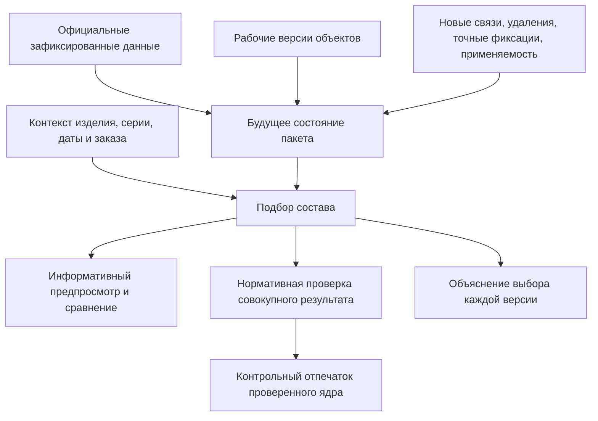
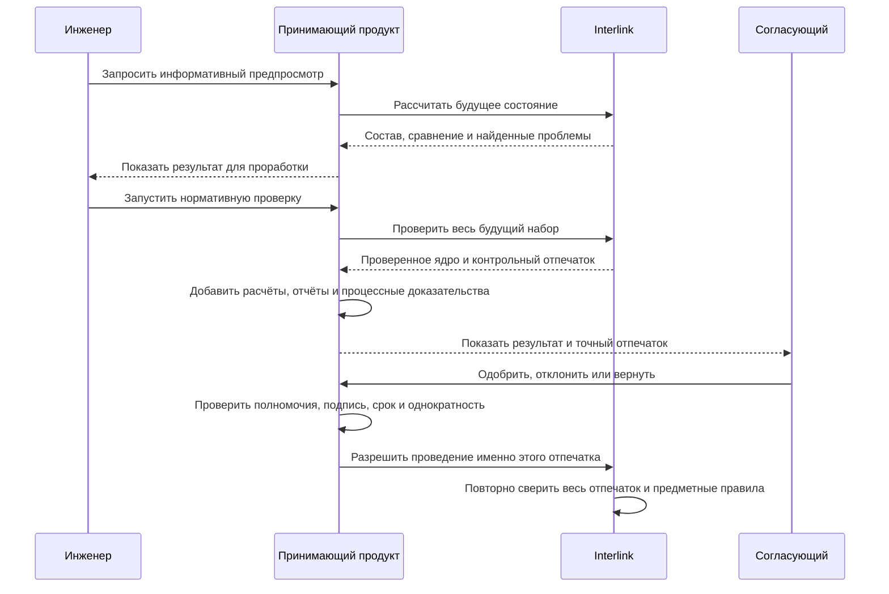

# Предпросмотр, проверка и согласование

## Зачем выделять этот этап

Пользователю недостаточно знать, что в пакет изменения добавлены пять объектов и двенадцать операций. До согласования он должен получить ответ на более практический вопрос: **каким станет изделие, если всё подготовленное сейчас провести**.

Для этого Interlink формирует предпросмотр будущего состояния. Он собирает официальные данные, рабочие версии и ещё не проведённые операции пакета так, как они выглядели бы после успешного проведения. Это не отдельная копия базы и не предварительная публикация. Предпросмотр служит пониманию и может устареть. Перед согласованием и проведением выполняется другая операция — нормативная проверка, которая заново строит совокупный конечный результат и доказывает его допустимость на текущей основе.

## Три разных уровня

### Обзор открытого пакета

Обычный обзор показывает:

- цель, вид и состояние изменения;
- перечень затронутых объектов;
- ответственных и удерживаемые объекты;
- наличие рабочих версий, предупреждений и решений;
- дату последней активности.

Такой обзор полезен руководителю и смежникам, но он не раскрывает каждое ещё не согласованное значение.

### Точный предпросмотр

Предпросмотр показывает именно будущий результат:

- карточки объектов после применения рабочих значений;
- будущий многоуровневый состав;
- добавленные, удалённые и заменённые позиции;
- версии, которые будут выбраны на каждой позиции;
- будущую степень готовности и применяемость;
- влияние на верхние изделия, документы, маршруты и заказы;
- найденные на момент расчёта ошибки и предупреждения;
- причины каждого выбора версии.

Разделение важно для конфиденциальности и удобства. Не каждому человеку, который видит факт открытого изменения, требуется доступ к его незавершённому содержанию.

### Нормативная проверка

Проверка не доверяет ранее показанному предпросмотру. Она заново читает официальную основу, накладывает все части пакета, строит конечное состояние, применяет обязательные правила и выдаёт контрольный отпечаток проверенного предметного ядра. Только такой результат можно передать на согласование и затем повторно сверить перед проведением.

## Как строится будущий результат

Система не просто накладывает изменённые поля. Для живого будущего состава она проходит дерево в нужном явном контексте: учитывает включение позиций, замены, строгие точные фиксации, рабочие версии пакета, временные предпочтения, применяемость и правила подбора. Готовый снимок является отдельным режимом и читается напрямую — его позиции нельзя пересчитать этими механизмами. Нормативная проверка повторяет весь расчёт, даже если предпросмотр уже выглядел успешным.

Например, новый двигатель допустим сам по себе, но после его установки в привод может потребоваться другой переходной фланец, кабель и автомат защиты. Будущий состав должен показать весь такой каскад.

## Что именно проверяется

### Полнота предметных данных

Проверяется наличие обязательных обозначений, единиц измерения, количества, материалов, владельцев, состояний и других данных, предусмотренных моделью предприятия.

### Целостность состава

Система проверяет, что связи ведут к существующим объектам, не создают запрещённый цикл и соответствуют допустимым типам. Если вал нельзя включать непосредственно в электрический шкаф, это должно быть остановлено правилами модели, а не замечено позже в отчёте.

### Однозначность выбора версий

В живом подборе отсутствие подходящей версии (`NoMatch`, то есть «подходящая версия не найдена») является допустимой диагностикой: оно помогает понять, что нужно исправить. Но любой публикуемый снимок — базовый, заказной или проекционный — обязан содержать полный однозначный результат и потому запрещён при `NoMatch` на любой обязательной позиции. Проведение самого пакета блокируется этой проблемой лишь тогда, когда так требует корпоративная политика для данного контрольного контекста: пакет может, например, выпускать недостающую версию, не публикуя снимок в той же операции. Несколько взаимоисключающих замен или забытое временное предпочтение превращаются в понятную ошибку.

Для применяемости проверяется не только формат диапазона, но и отсутствие недопустимого пересечения интервалов одного объекта. Граничные значения «до», «с» и «после» должны давать однозначный результат.

### Согласованность истории

Рабочая версия существующего объекта должна продолжать именно ожидаемую основу редактирования, от которой пакет был начат. Если за время работы вершина линейной истории законно изменилась, система не должна молча применить подготовленную правку к другому содержанию. Назначенная основная версия для обычного просмотра при этом может быть другой или отсутствовать.

### Процессные ограничения предприятия

Политика может требовать формального извещения для выпущенного изделия, запрещать быстрое исправление определённых атрибутов, требовать конкретную степень готовности или отдельное решение службы качества. Принимающий продукт аутентифицирует человека, определяет маршрут и роли, проверяет полномочия, подпись, срок и однократность разрешения. Interlink отдельно проверяет привязку разрешения к точному отпечатку, модели, настройкам и правилам, а также предметные ограничения данных. Interlink не принимает решение о человеческих полномочиях, а закрытое задание процесса не заменяет предметную проверку.

### Внешние последствия

Проверка влияния может показать затронутые заказы, производственные ведомости, технологические процессы, оснастку и уже опубликованные снимки. Наличие влияния не всегда означает запрет. Оно означает, что человек должен видеть последствия и выполнить предусмотренные действия.

## Ошибка, предупреждение и замечание

Для пользователя важно различать три результата:

| Уровень | Что означает | Что может сделать пользователь |
|---|---|---|
| Ошибка | Будущее состояние противоречит обязательному правилу, проведение невозможно | Исправить данные, изменить состав или отказаться от пакета |
| Предупреждение | Результат допустим, но имеет существенное последствие | Подтвердить осознанное решение, приложить обоснование либо изменить результат |
| Замечание | Полезная подсказка без влияния на допустимость | Учесть по необходимости |

Право «игнорировать предупреждение» не должно превращаться в общий обход правил. Для каждого разрешённого исключения фиксируются основание, полномочие и точное содержание, к которому решение относилось.

## Отпечаток содержания

После нормативной проверки Interlink вычисляет **контрольный отпечаток предметного ядра**. Это короткое однозначное представление всего того, что Interlink собирается провести и по каким основаниям рассчитал результат:

- всех рабочих версий и всех подготовленных операций пакета, включая будущую готовность, применяемость, связи и точные фиксации;
- точного выпуска предметной модели;
- всех применимых настроек;
- всех правил, которые фактически участвовали в проверке и подборе.

Отпечаток нужен не пользователю для ручного сравнения символов. Он нужен системе, чтобы доказать: согласовали именно тот предметный набор, который затем проводится.

Принимающий продукт может сформировать расширенную **оболочку решения**: добавить контрольные суммы файлов, результаты расчётов, отчёты, влияние на ERP или заказ, визуальные представления, подписи, участников, срок и вид маршрута. Эти сведения не входят в отпечаток Interlink автоматически: оболочка обязана ссылаться на отпечаток ядра, но не меняет его. В дальнейшем в обязательный отпечаток Interlink планируется включать контрольные суммы файлов версий; сейчас Interlink не обещает хранить файлы САПР или юридические подписи внутри предметного пакета.

## Как проходит согласование

Маршрут, задания, сроки, замещение согласующего и юридически значимая подпись принадлежат принимающему продукту — например, Alvatune. Interlink отвечает за то, что показанное будущее состояние вычислено однозначно, а разрешение нельзя применить к другому содержанию.

## Что происходит после любой правки

Если после согласования инженер меняет длину кабеля, количество крепежа, применяемость или даже значимое правило подбора, отпечаток меняется. Старое разрешение больше не подходит.

Пользователь должен увидеть:

1. что пакет изменён после последнего решения;
2. какие именно различия появились;
3. какие проверки выполнены заново;
4. какое решение требуется повторить;
5. можно ли сохранить часть прежних решений по политике предприятия.

Interlink не решает, должен ли повторно согласовывать весь совет или только технолог. Он даёт принимающему продукту точный факт изменения содержания. Процессная политика принимает решение о маршруте.

## Как выглядит рабочее место

Целевое рабочее место предпросмотра состоит из шести связанных областей:

1. **Итог:** можно ли проводить пакет и почему.
2. **Сравнение:** что добавлено, удалено и изменено.
3. **Будущий состав:** дерево изделия с выбранными версиями и причинами выбора.
4. **Влияние:** где используются изменяемые объекты и какие передачи затронуты.
5. **Проверки:** ошибки, предупреждения и подтверждённые исключения.
6. **Решения:** кто, когда и какое точное содержание согласовал.

Переход от ошибки к месту исправления должен быть прямым. Сообщение «состав недопустим» без указания позиции, правила и возможного действия недостаточно.

## Пример 1. Замена подшипника в редукторе

Конструктор заменяет подшипник 36210 на усиленный аналог в редукторе РЦ-250. В карточке подшипника всё выглядит корректно. Предпросмотр будущего состава показывает, что наружный диаметр изменился и существующая крышка не подходит. Одновременно система находит три исполнения редуктора, где используется та же крышка.

Пользователь добавляет рабочую версию крышки и новое уплотнение. Повторная проверка подтверждает геометрию и показывает предупреждение: складской остаток старого подшипника останется невостребованным после серии 145. Служба снабжения фиксирует решение использовать остаток на ремонте. Согласование относится ко всему будущему комплекту, а не только к строке подшипника.

## Пример 2. Изменение маршрута изготовления вала

Технолог переносит термообработку вала после предварительного шлифования. Предпросмотр показывает будущую последовательность операций, новые нормы времени, требуемую оснастку и влияние на производственную ведомость. Проверка обнаруживает, что контроль твёрдости остался привязан к прежней позиции маршрута.

Технолог переставляет контрольную операцию. После этого предупреждение сообщает о росте длительности цикла на четыре часа. Руководитель производства подтверждает допустимость, а служба качества согласует контроль. При проведении нельзя использовать старое решение, если порядок операций снова изменился.

## Пример 3. Предложение инженерного агента

В будущем агент Alvatune может подготовить предложение по замене материала корпуса насоса. Он создаёт пакет от имени ответственного инженера, прикладывает расчётное основание и останавливается перед согласованием. Человек видит не «ответ агента», а тот же предметный предпросмотр, что и для ручного изменения: будущую карточку, состав, влияние, проверки и происхождение.

Агент не получает право провести изменение только потому, что проверки пройдены. Принимающий продукт проверяет полномочия и получает человеческое либо предусмотренное политикой машинное решение для точного отпечатка.

## Состояние реализации

Различие информативного предпросмотра и нормативной проверки, контрольный отпечаток ядра и повторная сверка перед проведением входят в целевой контракт. Полная поверхность предпросмотра пакета, устойчивое разрешение принимающего продукта и маршруты согласования относятся к последующим этапам после базового опытного подтверждения. Готового сквозного рабочего места и процесса согласования пока нет.

Связанные документы: [[жизненный цикл|Change-package-lifecycle]], [[проведение и восстановление|Change-package-commit]], [[снимки и доказательства|Change-package-snapshots]].
