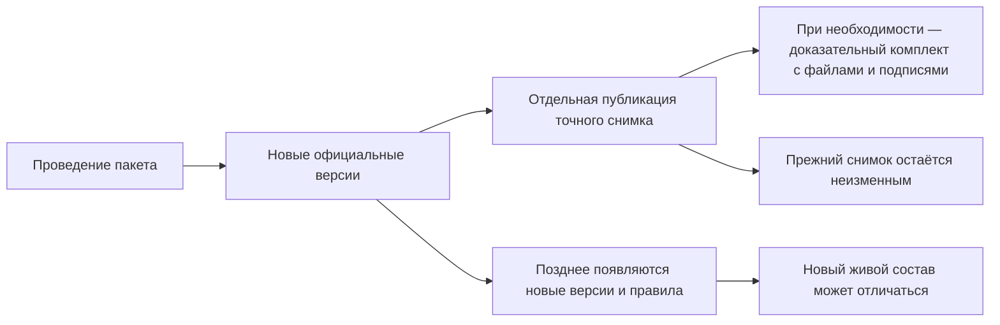
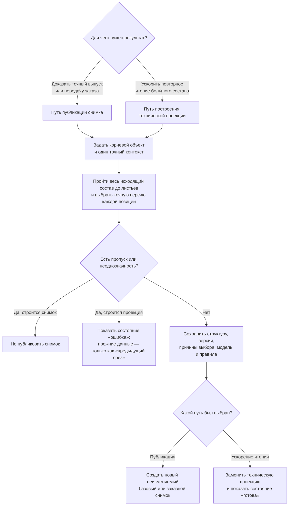

# Снимки, доказательства и история пользователя

## Три результата, которые нельзя называть одним словом

После изменения предприятие может получить три разных результата:

1. **Новые официальные версии** — зафиксированные состояния отдельных объектов и связей.
2. **Снимок состава** — неизменяемое дерево всех включённых позиций и точных версий для одного конкретного контекста выпуска или передачи.
3. **Самодостаточный доказательный комплект** — подготовленный принимающим продуктом архив значимых данных, файлов, подписей и правил, который можно проверять независимо от дальнейшей жизни рабочей базы.

Проведение пакета не обязано автоматически создавать снимок. Снимок не обязан копировать все файлы и атрибуты. Поэтому юридически или архивно автономный комплект не возникает сам собой.

## Проведение и снимок отвечают на разные вопросы

Проведение отвечает: **какие новые версии и состояния стали официальными?**

Базовый снимок или снимок заказа отвечает: **какой точный полный состав был опубликован для конкретного выпуска или передачи?** Техническое ускоряющее представление отвечает на другой вопрос и не является доказательством публикации.

Например, после изменения подшипника появились новые версии вала и крышки. Обычный текущий просмотр может позже выбрать ещё более новые версии. Базовый снимок выпуска продолжит показывать именно тот состав, который был опубликован тогда.

## Виды снимков Interlink

### Базовый снимок

Базовый снимок фиксирует конфигурацию для выпуска, обмена, отчёта или аудита. Он неизменяем и дополняет историю новыми публикациями, не переписывая прежние.

В пользовательском языке это может быть «состав выпуска редуктора РЦ-250 от 12 мая» или «комплект для сертификационных испытаний».

### Снимок заказа

Снимок заказа фиксирует точную комплектацию конкретной передачи в производство. Сам заказ остаётся живым версионируемым объектом: его можно перепланировать и выпустить следующую ревизию. Каждая официальная передача получает новый снимок.

Производство читает снимок без повторного подбора по текущим правилам. Поэтому выпущенная завтра версия двигателя не меняет вчерашний заказ.

### Техническая проекция состава — не снимок выпуска

Техническая проекция состава — заранее построенная ускоряющая копия полного дерева от точного корня до листьев. Это не третий вид опубликованного снимка, а служебное представление для быстрого чтения больших составов. Его можно перестроить, заменить или удалить; базовый снимок и снимок заказа обычной операцией изменить или удалить нельзя.

Пользователь обычно не создаёт её вручную. Прикладная система, использующая Interlink, например Alvatune, явно заказывает построение или перестроение и должна показывать понятное состояние готовности:

- **«готова»** — проекция целостна для записанных в ней корня и условий и может ускорять просмотр; это не означает, что в ней собраны самые новые версии;
- **«требует перестроения»** — изменились модель, правила или применимые настройки, поэтому прежнее ускоряющее представление нельзя выдавать за результат новых условий;
- **«перестраивается»** — создаётся новое представление; прикладная система показывает ход работы и не подменяет новый запрос старым результатом без явного предупреждения;
- **«ошибка»** — построить полное дерево не удалось; пользователь видит причину, а прикладная система либо предлагает живой расчёт, либо блокирует просмотр до исправления — этот выбор должен быть закреплён политикой конкретного продукта.

Эти четыре состояния принадлежат именованному месту проекции для определённых корня и условий. Если нужен новый срез, это место получает состояние «требует перестроения», а затем «перестраивается». Данные прежнего среза могут временно сохраняться, но показываются только с явной отметкой «предыдущий срез»; это предупреждение, а не пятое состояние готовности и не ответ на новый запрос. После успеха прежние данные заменяются новой готовой проекцией. После ошибки место получает состояние «ошибка», а прикладная система действует по заранее выбранной политике: выполняет живой расчёт или блокирует просмотр. Она не должна молча выдавать прежний срез за новый.

Появление новых предметных версий или связей само по себе не повреждает сохранённые данные проекции. Однако, когда прикладной системе нужен срез с учётом новых версий, она явно помечает место как требующее перестроения и заказывает новую проекцию. Проекцию нельзя использовать вместо базового или заказного снимка для выпуска, заказа или проверки истории.

> **Состояние реализации.** Различие между неизменяемыми снимками и заменяемой технической проекцией, а также перечисленные правила готовности приняты как целевая модель. Полные пользовательские действия публикации снимка, управление перестроением проекции и её эксплуатационные экраны пока не являются готовым сквозным механизмом Interlink. Описание ниже показывает требуемую будущую работу.

## Как публикуется снимок и строится проекция

До начала перестроения именованное место технической проекции получает состояние «требует перестроения», во время работы — «перестраивается», после успешного завершения — «готова», а после ошибки — «ошибка». Состояние относится только к пригодности ускоряющего представления для чтения. Оно не означает, что изделие выпущено или заказ передан.

Для пользователя публикация снимка выглядит так:

1. Он выбирает корневое изделие и назначение результата: конкретный выпуск либо передачу заказа.
2. Задаёт один точный набор условий: дату, площадку, серию, заказ и применимые правила.
3. Система предварительно показывает полный состав и объясняет выбор каждой версии.
4. При пропуске или неоднозначности пользователь исправляет исходные данные или правила; частичный снимок опубликовать нельзя.
5. Уполномоченный участник подтверждает публикацию точного результата.
6. Готовый снимок открывается из истории выпуска или заказа. Исправление выполняется новой публикацией, а не заменой прежнего снимка.

Для любого базового или заказного снимка, а также для технической проекции нельзя скрытно ограничить глубину, пропустить недоступную ветвь, применить произвольный пользовательский фильтр или скрыть отдельные позиции из-за прав читающего. Результат всегда строится полным обходом исходящего состава от точного корня до листьев. Права проверяются ко всему результату по принципу «доступ целиком либо отказ».

**Контрольный отпечаток** — вычисленная по значимому содержанию метка. Она позволяет обнаружить, что состав, версии, правила или контекст изменились после проверки; это не подпись пользователя и не замена согласованию.

Живой подбор может завершиться понятным результатом «подходящая версия не найдена». Но если хотя бы для одной обязательной позиции нет допустимой версии, публикация не создаёт частичный базовый или заказной снимок, а построение проекции завершается состоянием «ошибка». Один снимок относится к одному точному набору условий: нельзя в одном результате незаметно соединить разные даты, площадки, правила или диапазоны передач.

## Что сохраняет снимок

Снимок содержит достаточно данных, чтобы восстановить точный граф и объяснить выбор:

- корень и назначение публикации;
- точные версии каждой позиции;
- структуру и направление связей;
- номера позиций, количество и единицы измерения;
- параметры исполнения и применяемости позиции;
- причину выбора версии;
- контекст головного изделия, серии, даты и заказа;
- точную версию модели данных, правил и настроек;
- автора, время и происхождение публикации;
- обязательный контрольный отпечаток этого предметного ядра.

Одинаковая деталь в двух местах сохраняется как две позиции с собственным путём и смыслом, даже если выбрана одна версия детали.

## Что снимок намеренно не обещает

Снимок состава не обязан копировать внутрь:

- каждый атрибут карточки каждой версии;
- все исходные и производные файлы;
- изображения отчётов;
- сертификаты подписи;
- внешние ответы ERP (системы планирования ресурсов предприятия), MES (системы оперативного управления производством) или архива;
- файлы, подписи и программные средства принимающего продукта.

Эти данные могут потребоваться для юридически самодостаточной поставки. Тогда принимающий продукт формирует отдельный доказательный комплект.

## Доказательный комплект принимающего продукта

Для автономного архива или передачи Alvatune либо другой продукт может собрать:

- сам снимок состава;
- требуемые карточки и файлы точных версий;
- сформированные документы;
- версию шаблона и правил формирования;
- входные параметры;
- решения и подписи;
- отпечатки всех значимых материалов;
- подтверждения внешней передачи;
- средство или описание способа чтения формата.

По целевому контракту Interlink должен хранить неизменяемое предметное ядро снимка и его обязательный контрольный отпечаток. Нормативное будущее требование состоит в том, чтобы старые базовые и заказные снимки оставались читаемыми неограниченно долго вместе с архивной моделью, правилами, настройками и совместимыми средствами чтения. Этот архивный контур ещё не реализован полностью. Принимающий продукт отдельно определяет расширенный юридически значимый комплект: какие файлы, подписи и подтверждения включить, как долго их хранить, кому выдавать и в каком формате.

## Как пользователь читает историю

Целевой просмотр истории должен позволять двигаться от делового события к точным данным:

1. Открыть заказ, выпуск или извещение.
2. Увидеть связанные проведённые пакеты.
3. Открыть итог каждого пакета и решения.
4. Перейти к новым официальным версиям.
5. Открыть опубликованный снимок.
6. Для любой позиции увидеть точную версию и причину выбора.
7. При наличии доступа открыть доказательный комплект и внешние подтверждения.

История не должна быть только длинным техническим журналом. Пользователь сначала видит деловые события, затем раскрывает предметные подробности и, при необходимости, технические доказательства.

## Сравнение «тогда» и «сейчас»

Пользователь может сравнить:

- два официальных поколения одного объекта;
- официальный состав до и после пакета;
- два базовых снимка разных выпусков;
- две передачи одного заказа;
- старый снимок с текущим живым подбором.

Последнее сравнение особенно важно. Оно показывает, что изменилось в правилах и версиях после публикации, но не переписывает старый результат.

## Почему одного контекста подбора недостаточно

Контекст с датой, серийным номером и политикой точно описывает входные данные живого подбора. Но через год при тех же входах могут существовать новые версии, а правила — получить новую редакцию. Поэтому контекст сам по себе не является межвременным доказательством.

Для воспроизводимости нужен точный неизменяемый граф и сохранённое происхождение. Для юридической автономности может дополнительно понадобиться доказательный комплект.

## Пример 1. Выпуск редуктора

После проведения извещения предприятие публикует базовый снимок РЦ-250 для одной утверждённой конфигурации: например, для серии 145, площадки Пермь и даты выпуска 12 мая. Он фиксирует точные версии корпуса, валов, подшипников и крышек, а также причины выбора. Другой серийный номер или дата являются другим контекстом и при необходимости получают отдельный снимок. Через месяц появляется улучшенная версия манжеты. Текущий просмотр будущей серии может выбрать её, но прежний базовый снимок остаётся тем же.

Если службе технической документации или корпоративному архиву требуется автономный комплект, принимающий продукт добавляет подписанные чертежи, спецификацию, извещение и отпечатки файлов.

## Пример 2. Перепланирование насосной станции

Заказ на насосную станцию сначала передан с двигателем поставщика А. Снимок заказа №1 поступил в производство. Из-за срыва поставки планировщик создаёт новую версию живого заказа, выбирает допустимый двигатель Б, пересчитывает фланец и кабель, затем публикует снимок №2.

Первый снимок не меняется и сохраняет факт прежней передачи. Производство явно переводит исполнение на №2; история показывает причину и разницу. Нельзя просто «обновить ссылку» внутри первого снимка.

## Пример 3. Сервис старого пресса

Сервисный инженер открывает базовый снимок пресса, изготовленного восемь лет назад. Он видит установленную тогда версию гидрораспределителя. Текущий справочник предлагает современный аналог, но система не подменяет им исторический состав. Инженер создаёт отдельный ремонтный пакет и документирует новую замену.

## Доступ и неизменность

Право на любой снимок применяется к нему целиком. Нельзя выдать пользователю «полный точный состав», скрыв отдельные позиции или ветви из-за прав доступа. При недостаточном праве система отказывает в доступе ко всему снимку. Отдельное ограниченное живое представление может быть создано для иной задачи, но оно не является этим снимком и не выдаётся за источник точного состава.

По целевой модели базовый снимок и снимок заказа будут храниться в Interlink как неизменяемые долговечные результаты публикации. Их нельзя будет изменить или удалить обычной операцией; исправление означает новую публикацию, а отмена — отдельный статус без уничтожения прежнего содержания. Политика предприятия регулирует доступ и дополнительный юридически значимый комплект с файлами и подписями, но не превращает ядро снимка в обычный удаляемый документ. Техническая проекция, напротив, заменяема и удаляема.

## Состояние реализации

Разделение живого заказа, неизменяемых базового и заказного снимков и заменяемой технической проекции принято нормативно. Полноценные снимки выпуска и заказа следуют после реализации необходимого подбора, применяемости и полного пакета изменений. **Техническая проекция, её четыре состояния готовности и управляемое перестроение пока являются целевым механизмом, а не готовой возможностью Interlink и не готовым эксплуатационным рабочим местом.** Неограниченное хранение архивных моделей, правил, настроек и совместимых читателей старых снимков является будущим требованием Interlink. Доказательный комплект, подписи, дополнительный юридический архив и пользовательский просмотр истории принадлежат принимающему продукту и пока являются целевой возможностью.

Связанные документы: [[проведение и восстановление|Change-package-commit]], [[точный состав заказа|Selection-order-snapshot]], [[публикация заказа|Order-exact-publication]].
