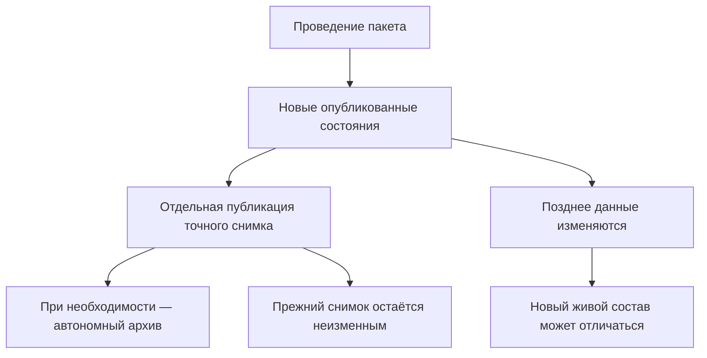
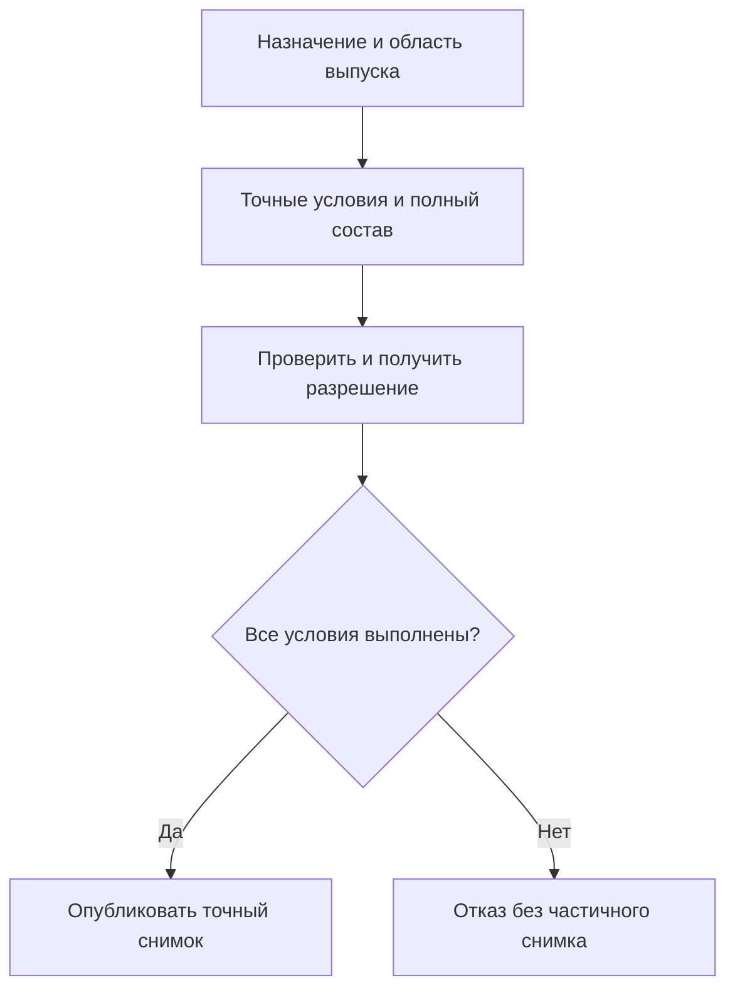

# Снимки, доказательства и история пользователя

## Точное основание включает части и смысл использованных определений

[Адрес элемента](Elements-and-concepts) сам по себе ещё не сохраняет прошлое. Для перехода маршрута нужны точное содержание владельца и необходимая цепочка вложенности. Для оперативно изменяемых данных требуется согласованное сохранённое состояние. Для определения типа — использованная модель и существенные редакции настроек и расширений, а не только её нынешнее название.

Если решение зависело от [понятия и его связей](Domain-concepts), сохраняется именно использованный смысл. Новая инструкция или словарная редакция не переписывает прежнее выполнение. Общая ссылка также не сохраняет автоматически всё содержимое связанных живых карточек: состав точного основания задаётся явно. Недоступные материалы обозначаются как пробел, а не заменяются текущими.

## Три результата, которые нельзя называть одним словом

После изменения предприятие может получить три разных результата:

1. **Новые опубликованные состояния** — точное неизменяемое содержание инженерных версий. Разрешённое исправление версии 03 может создать её новое состояние, не создавая версию 04.
2. **Снимок состава** — неизменяемый полный результат для конкретного выпуска или передачи: включённые позиции, их инженерные версии и точные состояния в явно заданной области.
3. **Доказательный комплект** — точные значимые данные, файлы, нормы и основания конкретного решения. Если нужен независимо читаемый внешний архив, прикладная система дополнительно готовит самодостаточную поставку с необходимыми материалами и средствами чтения.

Проведение пакета не обязано автоматически создавать снимок. Снимок не обязан копировать все файлы и атрибуты, но обязательные для его назначения данные должны быть точно доступны и сохранены на нужный срок. Поэтому ни точная ссылка, ни один контрольный отпечаток сами по себе не создают автономный юридический архив.

Далее описана целевая модель сентября 2026 года. Пользовательские экраны, архивные процедуры и сквозное исполнение ещё требуют реализации.

## Проведение и снимок отвечают на разные вопросы

Проведение отвечает: **какое подготовленное содержание и какие объявленные действия стали официальными?**

Базовый снимок или снимок заказа отвечает: **какой точный полный состав был опубликован для конкретного выпуска или передачи?** Техническое ускоряющее представление отвечает на другой вопрос и не является доказательством публикации.

Например, после изменения подшипникового узла появились новые состояния выбранных версий вала и крышки. Обычный текущий просмотр может позже выбрать другое содержание. Снимок выпуска продолжит показывать именно опубликованный тогда комплект. Даже жёсткая фиксация инженерной версии не заменяет такой снимок: она запрещает переход к другой версии, но сама по себе не замораживает каждое последующее состояние прежней версии.

## Виды снимков Interlink

### Базовый снимок

Базовый снимок фиксирует конфигурацию для выпуска, обмена, отчёта или аудита. Он неизменяем и дополняет историю новыми публикациями, не переписывая прежние.

В пользовательском языке это может быть «состав выпуска редуктора РЦ-250 от 12 мая» или «комплект для сертификационных испытаний».

### Снимок заказа

Снимок заказа фиксирует точную комплектацию конкретного выпуска для производства. Сам заказ продолжает жить: план можно изменить и отдельно выпустить новый точный результат. Повтор доставки прежнего выпуска использует тот же снимок, а не создаёт новый. Новый снимок нужен для новой предметной публикации, а не для каждой сетевой попытки передачи.

Производство читает снимок без повторного подбора по текущим правилам. Поэтому выпущенная завтра версия двигателя не меняет вчерашний заказ.

### Техническая проекция состава — не снимок выпуска

Техническая проекция состава — заранее построенная ускоряющая копия полного дерева от точного корня до листьев. Это не третий вид опубликованного снимка, а служебное представление для быстрого чтения больших составов. Его можно перестроить, заменить или удалить; базовый снимок и снимок заказа обычной операцией изменить или удалить нельзя.

Пользователь обычно не создаёт её вручную. Прикладная система, использующая Interlink, например Alvatune, заказывает построение или перестроение и должна показывать понятное состояние готовности:

- **«готова»** — проекция целостна для записанных в ней корня и условий и может ускорять просмотр; это не означает, что в ней собраны самые новые версии;
- **«требует перестроения»** — изменились значимые зависимости запрошенного живого среза, поэтому прежнее представление нельзя выдавать за результат новых условий;
- **«перестраивается»** — создаётся новое представление; прикладная система показывает ход работы и не подменяет новый запрос старым результатом без явного предупреждения;
- **«ошибка»** — построить полное дерево не удалось; пользователь видит причину, а прикладная система либо предлагает живой расчёт, либо блокирует просмотр до исправления — этот выбор должен быть закреплён политикой конкретного продукта.

Эти четыре состояния принадлежат именованному месту проекции для определённых корня и условий. Если нужен новый срез, это место получает состояние «требует перестроения», а затем «перестраивается». Данные прежнего среза могут временно сохраняться, но показываются только с явной отметкой «предыдущий срез»; это предупреждение, а не пятое состояние готовности и не ответ на новый запрос. После успеха прежние данные заменяются новой готовой проекцией. После ошибки место получает состояние «ошибка», а прикладная система действует по заранее выбранной политике: выполняет живой расчёт или блокирует просмотр. Она не должна молча выдавать прежний срез за новый.

Появление новых версий или правил не повреждает байты прежнего среза. Но если запрос должен учитывать изменившиеся зависимости, этот срез уже нельзя считать актуальным ответом. Система должна обнаружить такое устаревание и перестроить представление либо показать, что результат устарел, и назвать изменившиеся зависимости. Новая неиспользованная редакция правила не делает прежний точный результат ложным. Проекцию нельзя использовать вместо базового или заказного снимка как свидетельство официального выпуска.

> **Состояние реализации.** Различие между неизменяемыми снимками и заменяемой технической проекцией, а также перечисленные правила готовности приняты как целевая модель. Полные пользовательские действия публикации снимка, управление перестроением проекции и её эксплуатационные экраны пока не являются готовым сквозным механизмом Interlink. Описание ниже показывает требуемую будущую работу.

## Как публикуется снимок

Схема показывает только публикацию: заранее объявляются назначение и область, полный результат проверяется и разрешается, а затем публикуется целиком. При отказе частичный снимок не появляется. Перестроение технической проекции имеет иной смысл и описанный выше цикл готовности; оно не означает, что изделие выпущено или заказ передан.

Для пользователя публикация снимка выглядит так:

1. Он выбирает корневое изделие и назначение результата: конкретный выпуск либо передачу заказа.
2. Задаёт один точный набор условий: дату, площадку, серию, заказ и применимые правила.
3. Система показывает полный состав, точное содержание каждой версии, выбранные замены, обязательные проверки и основания решения.
4. При пропуске, неоднозначности или неустранённой обязательной несовместимости пользователь исправляет исходные данные либо план; неполный результат нельзя выдать за полный снимок.
5. Уполномоченный участник подтверждает публикацию точного результата.
6. Готовый снимок открывается из истории выпуска или заказа. Исправление выполняется новой публикацией, а не заменой прежнего снимка.

Для полного базового или заказного снимка, а также полного ускоряющего представления нельзя скрытно ограничить глубину, пропустить недоступную ветвь или отрезать позиции экранным фильтром. Результат строится до листьев **в явно объявленной предметной области**. Например, можно отдельно выпускать гидростанцию станка как самостоятельную часть поставки с собственным корнем и назначением. Нельзя просто скрыть электрошкаф в дереве всего станка и назвать оставшееся полным снимком станка. Права проверяются ко всему запрашиваемому результату; недоступная ветвь не исчезает из него молча.

**Контрольный отпечаток** — вычисленная по значимому содержанию метка. Она позволяет обнаружить, что состав, версии, правила или контекст изменились после проверки; это не подпись пользователя и не замена согласованию.

Живой подбор может завершиться понятным результатом «подходящая версия не найдена». Для полного снимка такой пропуск недопустим. Также нельзя заменить доказательство совместимости отсутствием сведений в матрице: обязательная проверка должна иметь достоверный результат. Один выпуск имеет явные условия и состав корней; разные области нельзя незаметно соединить под одной неясной меткой «последний состав».

Если снимок согласован до проведения, последняя операция публикует именно этот точный план. Она повторно проверяет необходимые условия и допуск, но не выбирает более новый двигатель ради успешного результата. При изменении обязательных оснований нужен явный конфликт и, при необходимости, новая подготовка.

## Что сохраняет снимок

Снимок содержит достаточно данных, чтобы восстановить точный граф и объяснить выбор:

- корень и назначение публикации;
- инженерные версии и точные неизменяемые состояния каждой позиции;
- структуру и направление связей;
- номера позиций, количество и единицы измерения;
- параметры исполнения и применяемости позиции;
- причину выбора версии;
- контекст головного изделия, серии, даты и заказа;
- точную версию модели данных, правил и настроек;
- автора, время, происхождение публикации и решения о применённых заменах;
- обязательный контрольный отпечаток этого предметного ядра.

Одинаковая деталь в двух местах сохраняется как две позиции с собственным путём и смыслом, даже если выбрана одна версия. Для нескольких корней различается и принадлежность корню: подшипник левого привода не должен смешиваться с таким же подшипником правого привода. Разрешённая замена хранится отдельно от фактической установки на физическом экземпляре.

## Что снимок намеренно не обещает

Снимок состава не обязан копировать внутрь:

- каждый атрибут карточки каждой версии;
- все исходные и производные файлы;
- изображения отчётов;
- сертификаты подписи;
- внешние ответы ERP (системы планирования ресурсов предприятия), MES (системы оперативного управления производством) или архива;
- файлы, подписи и программные средства принимающего продукта.

Эти данные могут потребоваться для юридически самодостаточной поставки. Тогда принимающий продукт формирует отдельный доказательный комплект.

## Доказательный комплект принимающего продукта

Для автономного архива или передачи Alvatune либо другой продукт может собрать:

- сам снимок состава;
- требуемые карточки и файлы точных версий;
- сформированные документы;
- версию шаблона и правил формирования;
- входные параметры;
- решения и подписи;
- отпечатки всех значимых материалов;
- подтверждения внешней передачи;
- средство или описание способа чтения формата.

В целевой модели сохраняется не только перечень ссылок, но и возможность прочитать обязательное содержание в течение установленного срока. Для каждого назначения задаются состав удерживаемых данных, срок, основания запрета удаления и средства чтения. Для долговечного оборудования это могут быть десятилетия; для временного расчёта — иной срок. Неизменяемость не означает бессрочного хранения всего подряд.

Миграция не должна удалять последний способ прочитать действующее свидетельство. Можно сохранять прежний формат или доказанно переносить его без потери смысла; хранить и исполнять любую старую программу бесконечно не требуется. После удаления по установленным правилам история должна показывать, какие данные больше недоступны и почему. Нельзя одновременно удалить обязательный файл и продолжать обещать полную воспроизводимость комплекта. Юридические сроки, квалификация подписей и процедуры внешнего архива определяются прикладным и эксплуатационным профилем, а не одним названием Interlink.

## Именованная итерация — не выпуск

Итерация сохраняет точный выбранный вариант работы, в том числе ещё незавершённое содержимое нескольких объектов. Она может понадобиться для возврата, сравнения вариантов или воспроизведения того, что видел согласующий либо агент. Продолжение редактирования не меняет сохранённую итерацию. Повтор сохранения под тем же именем создаёт новую её редакцию, сохраняя прежнее содержание.

Однако точность не повышает инженерную готовность: снимок опытного черновика не становится выпущенным документом. При восстановлении пользователь явно выбирает адресатов и объём переноса. Восстановление только в рабочие копии не меняет опубликованные состояния. Если нужен официальный выпуск, он проходит отдельную обычную подготовку и проверку. Подробнее — [[итерации и восстановление|Selection-iterations]].

## Что видел агент в момент решения

Для разбора рекомендации агента недостаточно записать «использован чертёж корпуса». Нужно сохранить точное содержание чертежа, необходимые файлы и справочные значения, входные условия, наблюдавшиеся ответы внешних источников и связь с конкретным запуском. У разных внешних наблюдений могут быть разные времена; их нельзя назвать единым мгновенным состоянием мира без соответствующего подтверждения источников.

Например, агент предлагает новый режим обработки по таблице свойств сплава. Через месяц таблица исправлена. История должна показать использованное тогда значение и единицу измерения, а не сегодняшнюю исправленную строку. При этом прежнее право агента на чтение не даёт любому проверяющему постоянного доступа к этим данным: новое раскрытие проверяется по текущим полномочиям.

## Как пользователь читает историю

Целевой просмотр истории должен позволять двигаться от делового события к точным данным:

1. Открыть заказ, выпуск или извещение.
2. Увидеть связанные проведённые пакеты.
3. Открыть итог каждого пакета и решения.
4. Перейти к опубликованным состояниям и другим результатам проведения.
5. Открыть опубликованный снимок.
6. Для любой позиции увидеть точную версию и причину выбора.
7. При наличии доступа открыть доказательный комплект и внешние подтверждения.

История не должна быть только длинным техническим журналом. Пользователь сначала видит деловые события, затем раскрывает предметные подробности и, при необходимости, технические доказательства.

## Сравнение «тогда» и «сейчас»

Пользователь может сравнить:

- два опубликованных состояния одной инженерной версии либо разные инженерные версии объекта;
- официальный состав до и после пакета;
- два базовых снимка разных выпусков;
- две передачи одного заказа;
- старый снимок с текущим живым подбором.

Последнее сравнение особенно важно. Оно показывает, что изменилось в правилах и версиях после публикации, но не переписывает старый результат.

## Почему одного контекста подбора недостаточно

Условия запроса могут включать дату, серийный номер, правила и долговечный контекст назначенных версий. Но через год при похожих условиях существуют новые состояния, назначения и справочные данные. Сам рабочий контекст не является точным историческим доказательством. Даже назначение той же инженерной версии требует уточнения, какое именно её содержание использовано.

Для воспроизводимости нужен точный неизменяемый граф и сохранённое происхождение. Для юридической автономности может дополнительно понадобиться доказательный комплект.

## Пример 1. Выпуск редуктора

После проведения извещения предприятие публикует базовый снимок РЦ-250 для утверждённой конфигурации серии 145, площадки Пермь и даты выпуска 12 мая. Он фиксирует инженерные версии и точные состояния корпуса, валов, подшипников и крышек. Другие условия требуют собственного явного основания публикации. Через месяц появляется улучшенное состояние той же версии манжеты. Текущий просмотр может выбрать его, но прежний снимок сохраняет исходную манжету даже без изменения её инженерного обозначения.

Если службе технической документации или корпоративному архиву требуется автономный комплект, принимающий продукт добавляет подписанные чертежи, спецификацию, извещение и отпечатки файлов.

## Пример 2. Перепланирование насосной станции

Заказ на насосную станцию сначала передан с двигателем поставщика А. Из-за срыва поставки планировщик готовит правку живого заказа и явно выбирает двигатель Б вместе с нужными фланцем и кабелем. Проверяется полный набор и совместимость конкретных состояний. Простое сохранение этой работы не заменяет переданный состав. Только после отдельного разрешения публикуется второй снимок.

Первый снимок не меняется. Отдельные подтверждения показывают, был ли он доставлен и принят, а затем согласован ли переход производства на второй. Повтор отправки второго снимка не создаёт третью публикацию. Нельзя просто «обновить ссылку» внутри первого результата или считать разрешённый двигатель Б уже физически установленным.

## Пример 3. Сервис старого пресса

Сервисный инженер открывает снимок выпуска пресса восьмилетней давности и видит предусмотренный тогда гидрораспределитель. Отдельно он проверяет историю фактических установок: при сборке или ремонте мог быть разрешён другой экземпляр. Снимок проекта сам по себе не доказывает, что на прессе стоит именно эта деталь.

Текущий справочник предлагает современный аналог, но система не подменяет им прошлую конфигурацию. Инженер готовит ремонтное изменение, проверяет совместимость с фактическим оснащением и оформляет новый разрешённый комплект. После ремонта регистрируются снятие и установка. Если обязательный старый файл утрачен, система прямо сообщает об ограничении доказательства, а не открывает вместо него современный файл с похожим именем.

## Доступ и неизменность

Право на любой снимок применяется к нему целиком. Нельзя выдать пользователю «полный точный состав», скрыв отдельные позиции или ветви из-за прав доступа. При недостаточном праве система отказывает в доступе ко всему снимку. Отдельное ограниченное живое представление может быть создано для иной задачи, но оно не является этим снимком и не выдаётся за источник точного состава.

По целевой модели базовый и заказной снимки являются неизменяемыми долговечными результатами публикации. Исправление создаёт новую публикацию, отмена фиксируется отдельным событием. Обычное редактирование не переписывает их. Разрешённое выбытие удерживаемого содержания — отдельная контролируемая процедура с проверкой сроков, зависимостей и запретов удаления; прежний перечень и свидетельство выбытия не подменяются новым содержанием. Техническая проекция, напротив, заменяема и не имеет доказательной роли выпуска.

## Состояние реализации

Разделение опубликованных состояний, точных снимков, именованных итераций, доказательных комплектов и заменяемой проекции принято как целевая модель. Полные механизмы захвата, публикации, удержания ресурсов и восстановления ещё требуют реализации. Маршруты подписания и автономный юридический архив дополняются прикладной системой.

Для приёмки нужно проверить три границы: новое состояние не меняет старый снимок; аналитическая итерация не выдаётся за выпуск; разрешение и передача не выдаются за фактическую установку. Отдельные испытания должны доказать сохранность обязательных данных при миграции и сбоях и диагностику с перечнем недоступных материалов и указанием причин.

Связанные документы: [[проведение и восстановление|Change-package-commit]], [[точный состав заказа|Selection-order-snapshot]], [[публикация заказа|Order-exact-publication]], [[итерации и восстановление|Selection-iterations]], [[агенты и прослеживаемость|Agents-and-traceability]].
