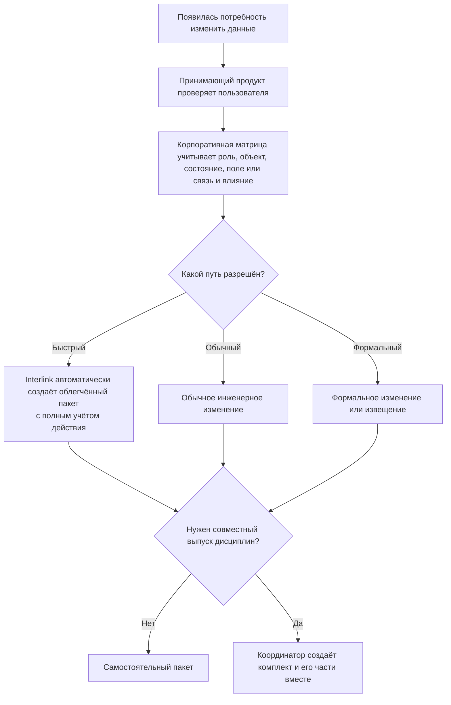
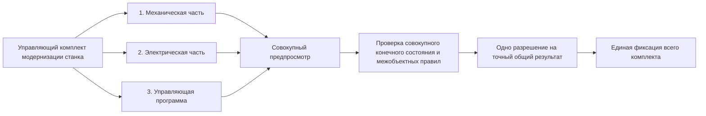

# Быстрые, формальные и составные изменения

## Одна предметная модель, разные пользовательские процессы

На предприятии не каждое изменение оформляется одинаково. Исправление опечатки, извещение об изменении выпущенного изделия, загрузка справочника и согласованный выпуск нескольких дисциплин требуют разного числа участников и документов.

Interlink не заставляет показывать пользователю один тяжёлый экран во всех случаях. Но внутри все эти действия проходят общий путь: открывается пакет, собирается будущее состояние, выполняются проверки, фиксируется точное решение и результат проводится целиком.

Это устраняет опасный разрыв, когда «быстрая кнопка» меняет данные по другим правилам, чем формальный процесс.

## Два независимых признака

У пакета есть **вид работы** и **роль в совместном выпуске**.

Вид объясняет, зачем создан пакет:

- быстрое изменение;
- обычное инженерное изменение;
- формальное извещение;
- импорт;
- системное обслуживание.

Роль объясняет, проводится ли пакет один или его работа входит в упорядоченный комплект:

- самостоятельный пакет;
- управляющий комплект;
- именованная дочерняя часть, которая после включения не является самостоятельно завершаемым пакетом.

Эти признаки нельзя смешивать. Например, дочерней частью общего выпуска может быть и формальное извещение механиков, и системно подготовленная корректировка справочника.

## Как выбрать пользовательский путь

Окончательное решение определяется политикой предприятия: типом объекта, степенью готовности, характером поля, влиянием, проектом и полномочиями автора.

**Корпоративная матрица** в схеме — это настроенный набор понятных правил предприятия: кто, какой объект, в каком состоянии и при каком влиянии может менять быстрым, обычным или формальным путём. Это не отдельная таблица, которую обязательно должен заполнять пользователь.

## Общий финал для всех видов изменения

Быстрый, обычный, формальный, импортный и системный пути отличаются подготовкой и согласованием, но официальный результат получают одинаково. Принимающий продукт запускает **общую операцию окончательной фиксации** — одно подтверждаемое действие, в котором весь подготовленный предметный результат становится официальным только целиком.

У этой операции всегда различаются три исхода:

1. **Подтверждённый успех** — все предусмотренные версии и операции стали официальными, после чего можно начинать внешнюю передачу и последующие работы.
2. **Подтверждённый откат** — ни одна часть подготовленного результата не стала официальной; после устранения причины разрешена новая попытка.
3. **Неизвестный исход** — достоверный ответ не получен. Система запрещает слепой повтор, сверяет официальное состояние по устойчивому номеру попытки и только затем либо использует уже созданный результат, либо разрешает новую попытку.

Эти правила применяются и к примерам ниже. Отказ проверки до запуска окончательной фиксации — это ещё не откат: официальное состояние в таком случае заведомо не менялось.

## Быстрое изменение

### Для чего нужно

Быстрый путь предназначен для понятного одиночного действия, которое не требует отдельной карточки большого процесса. Пользователь может выбрать «исправить массу», «назначить основную версию» или «уточнить складскую единицу».

### Что происходит внутри

В целевой модели принимающий продукт сначала устанавливает личность и полномочия пользователя, применяет корпоративную матрицу, а затем инициирует разрешённое предметное действие. После этого Interlink автоматически создаёт облегчённый пакет с полным учётом действия, включает нужный объект, формирует рабочее состояние, выполняет проверки и проводит результат. Даже если интерфейс показывает одно подтверждение, история должна содержать автора, основание, старое и новое значение, правила и итог. Полный исполняемый быстрый путь ещё не реализован.

### Когда путь запрещён

Быстрый путь запрещён не самим фактом выпуска или изменения состава, а решением корпоративной матрицы. Она может потребовать обычный или формальный процесс с учётом роли, вида и состояния объекта, изменяемого поля или связи и ожидаемого влияния. Пользователь получает объяснение и предложение открыть подходящий процесс с уже заполненным основанием.

### Пример

Нормировщик замечает, что для покупной шайбы указана масса 0,12 кг вместо 0,012 кг. Изделие ещё находится в рабочей степени готовности, масса не влияет на геометрию и состав. Политика разрешает быстрое изменение. Пользователь видит сравнение, подтверждает, и новая версия карточки фиксируется через автоматический пакет.

Та же правка в утверждённой спецификации двигателя может потребовать формального изменения, если корпоративная матрица относит влияние на сводную массу выпущенного изделия к контролируемым изменениям.

Если бы связь прервалась во время окончательной фиксации быстрой правки, пользователь не нажимал бы кнопку повторно: рабочее место сначала показало бы подтверждённый успех, подтверждённый откат либо неизвестный исход и выполнило бы обязательную сверку для последнего случая.

## Обычное инженерное изменение

### Для чего нужно

Это основной путь для разработки ещё не выпущенного изделия, технологического процесса или справочника, когда затрагиваются несколько связанных данных и требуется совместная проверка.

### Как работает пользователь

Инженер создаёт пакет с целью, берёт объекты в работу, готовит версии, использует точки возврата, приглашает участников, проверяет будущий состав и передаёт результат по выбранному маршруту. Формальная форма извещения может отсутствовать, но предметная фиксация и история остаются полными.

### Пример

При проектировании насосной станции конструктор увеличивает толщину рамы, меняет четыре крепёжные позиции и массу сборки. Технолог параллельно уточняет операцию сварки в том же пакете. До первого выпуска это обычное инженерное изменение с согласованием конструктора и технолога.

После согласования пакет проходит общую операцию окончательной фиксации. При подтверждённом успехе все изменения становятся официальными вместе, при подтверждённом откате не становится официальным ни одно, а при неизвестном исходе повтор блокируется до сверки.

## Формальное извещение

### Для чего нужно

Формальный путь применяется, когда меняется уже выпущенная документация или изделие, а предприятие требует номер извещения, причины, сроки внедрения, перечень затронутых документов и решения служб.

### Что добавляет принимающий продукт

Interlink хранит точные рабочие версии, операции, применяемость и предметный результат. Alvatune или другой продукт добавляет:

- карточку извещения и корпоративную нумерацию;
- маршрут согласования;
- задания и сроки;
- подписи и полномочия;
- уведомления и рассылку;
- контроль выполнения последующих действий.

Извещение не становится вторым способом менять данные. Оно управляет тем же пакетом и разрешает проведение его точного содержания.

### Пример

После серии 144 в редукторе РЦ-250 меняется подшипниковый узел. Извещение включает новые версии вала, крышки, спецификации и чертежей, а также применяемость «с серийного номера 145». Снабжение оценивает остатки, производство — незавершённые заделы, качество — контроль. После согласования весь предметный набор проводится одновременно.

Подтверждённый успех делает официальным весь набор, подтверждённый откат не выпускает ни один его объект, а неизвестный исход блокирует повтор до сверки. Номер извещения и решения служб при этом не используются как доказательство успеха самой фиксации: требуется её достоверный итог.

## Импорт

### Для чего нужен отдельный вид

При миграции из IPS или загрузке внешнего справочника автором выступает управляемый процесс, а объём может быть большим. Нужно сохранять источник, идентификатор записи, порцию, преобразование и диагностику.

### Что остаётся общим

Импорт не получает право писать напрямую в обход модели. Каждая публикуемая порция проходит проверки по правилам модели данных и сохраняет сведения об источнике и преобразовании. Порции выбираются так, чтобы ошибка не создавала ложное частичное завершение связанного предметного набора.

### Пример

При переносе справочника материалов одна марка стали ссылается на отсутствующий стандарт. Порция, в которую входит зависимый набор, не проводится; остальные независимые порции могут завершиться. Оператор видит точный остаток и повторяет только исправленную часть.

Каждая независимая порция получает собственный достоверный итог окончательной фиксации. При подтверждённом успехе она отмечается завершённой, при подтверждённом откате остаётся готовой к исправленной попытке, а при неизвестном исходе не повторяется до сверки. Поэтому оператор не загружает второй раз уже официально созданные записи.

## Системное обслуживание

Система может выполнять предусмотренные предметные операции без ручного редактирования: пересчитать производное состояние или установить начальные предметные данные. Такие пакеты имеют явно указанного системного автора, основание, версию инструмента и такой же полный журнал происхождения и действий. Выпуск модели, изменение таблиц и миграция структуры базы выполняются отдельным контуром модели, а не системным пакетом предметного изменения.

Системный вид не означает неограниченные полномочия. Политика определяет, какие действия допустимы автоматически и где требуется человеческое решение.

## Зачем нужен комплект пакетов

Иногда один огромный пакет неудобен: механическая, электрическая и программная части имеют разных владельцев, маршруты и сроки. Но провести их независимо нельзя, потому что только совместный набор образует допустимое изделие.

Координатор создаёт упорядоченный комплект и все его именованные дочерние части вместе. Части могут независимо подготавливаться разными командами, но не существуют как переносимые самостоятельные пакеты: часть нельзя отдельно провести, отменить, перенести в другой комплект или повторно использовать. Все части имеют общую конечную судьбу.

## Как работает комплект

1. Координатор одной операцией создаёт общий выпуск и все его дочерние части, определяет их порядок.
2. Каждая команда ведёт свою именованную часть и отвечает за её содержание.
3. Участники видят локальный результат и согласованную совокупную картину.
4. Interlink накапливает части в установленном порядке и нормативно проверяет совокупное конечное состояние, включая правила между объектами и дисциплинами. Каждая промежуточная ступень не обязана сама быть допустимым выпуском.
5. Принимающий продукт получает решения ответственных дисциплин и итоговое разрешение.
6. Перед проведением повторно проверяются все части, общий контрольный отпечаток — вычисленная метка точного совместного содержания — и официальная основа.
7. Комплект проводится целиком. Ошибка любой обязательной части не оставляет остальные официально выпущенными.

Порядок является частью содержания. Если электрическая часть предполагает уже изменённый механический интерфейс, перестановка частей способна изменить результат и требует нового предпросмотра.

## Почему не делать один огромный пакет

Один пакет удобен, когда объектная граница и команда действительно общие. Комплект полезен, когда нужно сохранить:

- самостоятельные цели и ответственность дисциплин;
- отдельные перечни затронутых данных;
- собственные согласования;
- понятную историю вклада каждой дисциплины без самостоятельного проведения или повторного использования части;
- общий запрет на несовместимый частичный результат.

Комплекты не должны вкладываться друг в друга без ограничения: глубокая иерархия делает порядок и ответственность непрозрачными. Целевая модель предусматривает один управляющий уровень и упорядоченные дочерние части. Если комплект отменён, предметное содержание части может послужить образцом для нового пакета, но сама дочерняя часть не переносится и не оживает повторно.

## Пример. Модернизация обрабатывающего центра

Механики меняют шпиндель и крепление датчика. Электрики устанавливают другой преобразователь и автомат. Разработчики управляющей программы добавляют новый диапазон оборотов.

Если выпустить только механику, старый преобразователь может повредить шпиндель. Если выпустить только программу, станок получит недопустимую команду. Команды ведут три части, а координатор видит совместный состав, интерфейсы и проверки. Общий выпуск проводится только после подтверждения всех дисциплин.

Общая операция окончательной фиксации охватывает все три части. При подтверждённом успехе они становятся официальными вместе, при подтверждённом откате не выпускается ни одна, а при неизвестном исходе весь комплект остаётся заблокированным для повтора до сверки общего результата.

## Что увидит пользователь

При создании изменения интерфейс спрашивает не внутренний технический вид, а понятную цель. Политика предлагает подходящий путь и объясняет ограничения.

В карточке самостоятельного пакета пользователь видит его вид и причину. В карточке комплекта дополнительно видны:

- все части и их владельцы;
- порядок;
- готовность каждой части к общей проверке, но не отдельный окончательный статус;
- междисциплинарные ошибки;
- общий будущий результат;
- решения по частям и итоговое решение;
- единый статус проведения.

## Состояние реализации

Единый предметный путь для быстрых и формальных действий является принятым направлением. Полные виды пакета, автоматически создаваемый облегчённый пакет для быстрого действия и упорядоченный комплект относятся к целевой модели после базового опытного подтверждения. Процессные формы, маршруты и рабочие места должен реализовать принимающий продукт.

Связанные документы: [[границы пакета|Change-package-concept]], [[жизненный цикл|Change-package-lifecycle]], [[сквозные примеры|Change-package-examples]].
