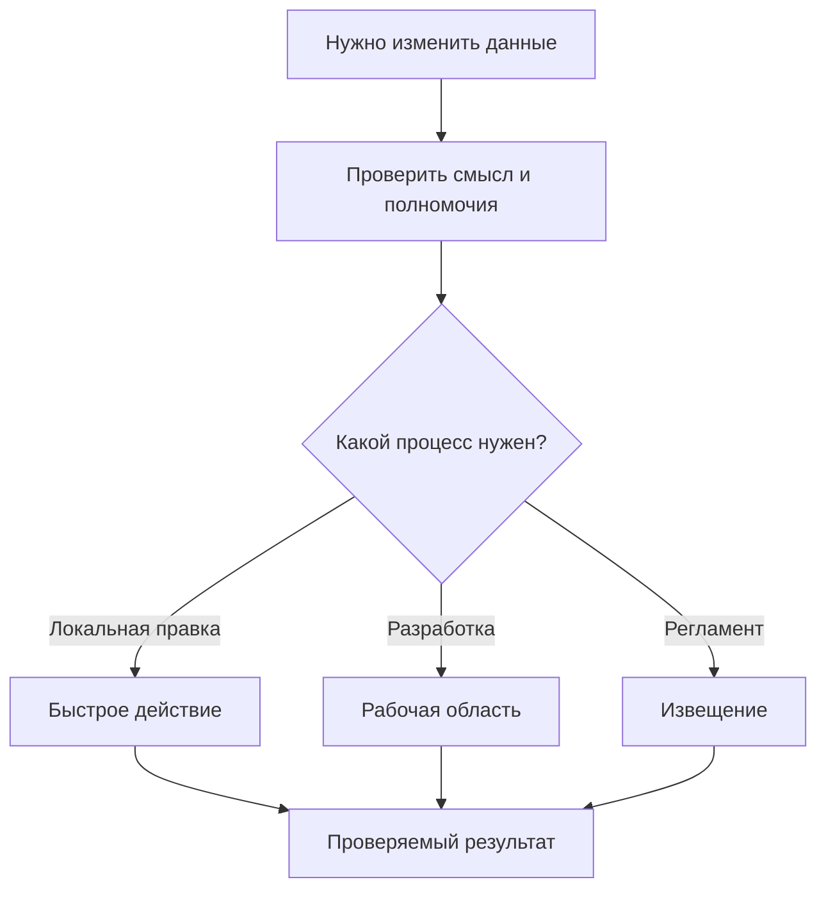
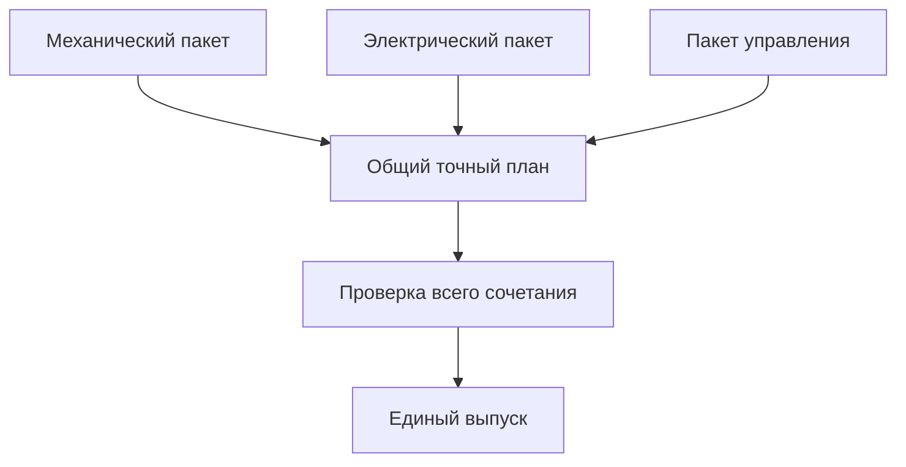

# Быстрые, формальные и совместные изменения

## Общие гарантии не означают одинаковую форму работы

Исправление реквизита, инженерная модернизация, извещение об изменении и запись результата измерения требуют разных действий. Interlink не должен заставлять пользователя открывать извещение на каждый факт и не должен лишать быстрые действия истории.

Общими остаются правила: понятное намерение, действующие полномочия, проверка допустимости, защита от потери чужой правки, подтверждённый результат и прослеживаемое происхождение. Но способ хранения зависит от смысла данных. Инженерное содержание имеет рабочую копию и опубликованные состояния; оперативная карточка может изменяться с контролем её предыдущего состояния; подтверждённый факт дополняется новым фактом, а не переписывается как чертёж.

Поэтому формула «всякая запись создаёт пакет и новую инженерную версию» больше не является общей моделью. **Пакет изменения нужен там, где выбранный набор действий должен быть подготовлен и проведён совместно.** Принимающий продукт может скрыть подготовку маленького пакета за одной понятной кнопкой, но не должен создавать фиктивные версии у неверсионных данных.

## Какие решения принимает предприятие

Нужно отдельно определить характер процесса и границу выпуска. Быстрое действие, обычная работа, формальное извещение, импорт или системное обслуживание объясняют, почему происходит изменение. Самостоятельный пакет или общий комплект объясняют, какие результаты обязаны стать официальными вместе.

Например, электрик может вести формальное извещение по шкафу, а конструктор — обычную доработку опытного шпинделя. Если только совместное сочетание безопасно, выбранные результаты входят в общий комплект независимо от разных маршрутов согласования.

Схема различает пользовательские процессы, а не три обходных способа записи. Для каждого пути действуют правила предметного типа и выбранного результата. Корпоративная матрица — это настроенные правила предприятия о роли, состоянии объекта, поле или связи и влиянии; она не обязана выглядеть для пользователя отдельной таблицей.

## Быстрое действие

Быстрый путь подходит для небольшого понятного изменения с ограниченным влиянием. Рабочее место показывает старое и новое значение, причину и последствия. Если политика требует извещения, интерфейс объясняет причину и переносит введённое предложение в формальный процесс.

### Пример: масса покупной шайбы

Нормировщик обнаруживает ошибку: 0,12 кг вместо 0,012 кг. Сначала важно понять, где хранится масса. Если это управляемое инженерное содержание версии шайбы, создаётся или используется рабочая копия и публикуется новое состояние той же инженерной версии. Если модель определила соответствующую запись как оперативную справочную карточку, применяется её разрешённый способ изменения с историей и проверкой конкурирующей правки.

Одинаковая кнопка не должна скрывать это различие. Пользователь должен понимать, изменится ли результат будущего живого расчёта и почему старый точный комплект продолжит воспроизводиться по прежним сохранённым данным.

### Пример: основная версия и результат контроля

Назначение основной версии двигателя — самостоятельное управляемое решение. Оно не требует искусственно создавать новую геометрию двигателя. Система проверяет допустимость назначения в нужной области и сохраняет, кто изменил обычный выбор.

Запись измеренного диаметра после обработки — другой случай. Подтверждённое измерение не исправляется бесследно. Ошибка прибора оформляется новым связанным сообщением или разрешённой коррекцией с происхождением. Инженерная версия корпуса от каждой записи измерения не появляется.

## Обычная инженерная работа

Инженер создаёт рабочую область, начинает нужные инженерные версии, сохраняет копии и именованные итерации. Контекст подбора позволяет посмотреть будущий состав совместно с технологами. Формального извещения может не быть, но история, предметные проверки и управление доступом сохраняются.

Когда часть решения готова, пользователь собирает пакет именно для неё. Остальные копии продолжают жить. Это важно для больших проектов: выпуск готовой рамы не должен принудительно завершать ещё обсуждаемую компоновку кабельной трассы.

**Пример — насосная станция.** Конструктор увеличивает толщину рамы и меняет крепёж, технолог уточняет сварку. Для испытания требуется совместно выпустить раму и маршрут сварки. Рекомендация по окраске ещё обсуждается и в пакет не входит. На проверке виден точный выбранный результат; сохранение последующей идеи окраски не становится скрытой частью уже согласованного выпуска.

## Формальное извещение

Формальный путь добавляет номер, причины, строки извещения, сроки внедрения, решения служб и контроль последующих действий. Interlink хранит предметные данные и проверяемый результат; принимающий продукт организует карточку, маршрут, подписи, задания и рассылку.

Извещение не равно пакету и не обязано совпадать с одной публикацией. Оно может иметь несколько этапов внедрения. Его строки могут автоматически формировать назначения версий в контексте подбора. Такое назначение сохраняет источник: конкретную строку извещения. Ручное назначение той же версии является независимым основанием и не исчезает только из-за удаления строки.

**Пример — редуктор РЦ-250.** Извещение предусматривает усиленный подшипниковый узел с серийного номера 145. Конструкторы готовят корпус, крышку и документы, снабжение рассматривает остатки, производство — задел. В первый выпуск входит законченный узел с применяемостью; последующий выпуск может оформлять отдельно согласованную технологическую часть, если правила позволяют независимое внедрение. Если частичное внедрение опасно, соответствующие части заранее объединяются в один атомарный комплект.

Перенос строк извещения из IPS должен сохранять предметный смысл и происхождение назначений. Неясные правила конкретной установки проверяются по её примерам; автоматическое удаление всех «похожих» назначений недопустимо.

## Импорт и большие справочники

Импорт использует управляемый источник, сохраняет соответствия исходных и новых данных и показывает диагностику. Он не получает право обходить ограничения модели. Независимые порции могут обрабатываться раздельно, но связанный набор нельзя объявить завершённым после загрузки только удобной половины.

Для индексируемых справочников и многомерных таблиц важно отдельно проверять единицы, области значений, принадлежность ключей и полноту там, где она обязательна. Добавление одного возможного размера в справочник не означает, что все сочетания с этим размером автоматически допустимы или что новая таблица уже опубликована.

**Пример — таблица режимов резания.** Предприятие переносит режимы для сочетаний материала, инструмента и диапазона диаметра. Несколько записей имеют неподтверждённую единицу подачи. Оператор видит конкретные ошибки. Если набор объявлен полной сеткой для расчёта, выпуск неполного набора блокируется. Если это разреженный справочник, отсутствие строки остаётся отсутствием данных, а не автоматически разрешённым режимом.

При потере ответа проверяется, была ли конкретная порция уже применена. Повтор того же намерения не должен создавать новые дубли материалов или режимов.

Подробнее: [[справочные таблицы|Reference-tables]], [[полные многомерные таблицы|Multidimensional-tables]] и [[разреженные координатные карты|Coordinate-maps]].

## Системное обслуживание и агентская работа

Автоматическое действие имеет установленного исполнителя, основание, ограниченную область и историю. Агент может предложить замену поставщика или обновление справочника, но не получает универсального права публикации. Долговременная работа агента использует рабочую область и точные сохранённые входы; пакет выбирает разрешённый результат этой работы.

Нужно отличать предметные изменения от обслуживания структуры системы. Установка новой модели и перенос схемы базы относятся к отдельному контуру. Перестроение ускоряющей поисковой проекции не является новым инженерным выпуском. Новое измерение или подтверждение поставщика использует договор факта или записи, а не искусственную копию изделия.

## Когда нужен общий комплект проведения

Комплект требуется, если несколько пакетов должны стать официальными одним результатом. Каждый пакет сохраняет понятный вклад и ответственного; комплект фиксирует точный состав, порядок значимых зависимостей и общее разрешение.

Главное в схеме — проверка сочетания. Три по отдельности допустимых пакета могут вместе создать ошибку. Одобрения дисциплин не заменяют решение по общему предмету.

Пакет, чей план зависит от совместного выпуска, нельзя провести отдельно под тем же разрешением. Если граница меняется, необходимо заново подготовить состав и проверить зависимости. Из этого не следует прежнее ограничение, будто все будущие пакеты обязаны создаваться одновременно с одним пожизненным управляющим контейнером. Конкретные формы редактирования комплекта ещё предстоит детализировать; произвольная вложенность не считается автоматически поддержанной.

Гарантия «всё либо ничего» относится к совместимой локальной области данных. Две независимые внешние PLM не становятся одной атомарной системой от общей карточки проекта. Для них отдельно планируются передача, подтверждение, восстановление и возможная компенсация.

## Что проверяется в общем результате

- Нет двух несовместимых публикаций одной инженерной версии. Порядок пакетов не выбирает победителя.
- Ссылки между публикуемыми состояниями ведут к действительно включённому результату.
- Сохраняются обязательные предпосылки всех выбранных действий.
- Полностью учитываются изменения количества и групповые замены.
- Совместимы конечные состояния компонентов, а не только их наименования.
- Изменение состава или порядка после согласования требует нового точного плана.

Пустая ячейка матрицы не является разрешением сама по себе. Для вывода по отсутствию нужен явно определённый полный и авторитетный набор правил. Если необходимых данных нет, система показывает неопределённость или неподдержанный расчёт, а не выдумывает допустимость.

## Пример: модернизация станка и групповая замена

Механики заменяют старый привод и муфту на прямой привод с адаптером. Электрики меняют силовую часть. Программа получает новые ограничения. Два старых элемента заменяются несколькими новыми, поэтому проверка только пары «старый двигатель — новый двигатель» недостаточна.

В плане отдельно указано, какие позиции снимаются, какие добавляются и какой датчик должен остаться. Электрическая и программная части могут обе требовать сохранённый контроллер — это не двойное расходование контроллера. Но другая выбранная замена, удаляющая этот контроллер, делает общий результат ошибочным.

После выбора окончательных состояний проверяются механический интерфейс, ток, охлаждение и версия программы. При несовместимости комплект отклоняется. Система не выбирает незаметно другой преобразователь, чтобы получить зелёный статус. После разрешённого выпуска фактическая установка на станок всё равно подтверждается отдельной работой.

## Подтверждение результата и сбои

Любой путь должен различать подтверждённый успех, подтверждённый откат и неизвестный исход. Успех позволяет использовать сохранённый результат. Откат не оставляет частичных официальных правок. Потерянный ответ требует сверки уже выполненного намерения, а не повторного запуска под новым номером.

Если предметные данные уже зафиксированы, а доставка производству не удалась, повторяется предусмотренная договором доставка того же результата. Повторно публиковать инженерное содержание ради отправки сообщения нельзя.

## Что увидит пользователь и как принять механизм

В простом действии видны причина, сравнение и результат. В пакете — выбранные участники, оставшиеся вне выпуска работы, ошибки и предмет согласования. В общем комплекте дополнительно видны вклад дисциплин, зависимости, общий план и один подтверждённый исход.

На демонстрации нужно проверить три разных случая: быструю правку без фиктивной версии, выпуск готового поднабора большой работы и отказ несовместимому общему комплекту. Отдельно проверяются происхождение назначений извещения, конфликт двух копий одной версии и неизвестный исход без дублей.

## Состояние реализации

Разделение инженерных версий, изменяемых записей и неизменяемых фактов, а также выбранного пакета и длительной работы — принятый целевой фундамент. Полные пользовательские процессы, формы комплектов, автоматизация и интеграции развиваются поэтапно. Примеры являются требованиями к будущему поведению, не заявлением о готовом продукте.

Связанные документы: [[границы пакета|Change-package-concept]], [[путь пользователя|Change-package-lifecycle]], [[рабочие области|Workspaces-and-parallel-work]], [[допустимые замены|Allowed-replacements]], [[матрицы совместимости|Compatibility-matrices]], [[сквозные примеры|Change-package-examples]].
